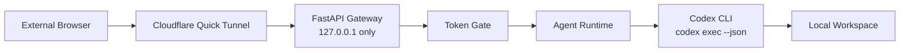

# Personal Agent Gateway

브라우저에서 내 로컬 Mac의 Codex CLI 에이전트를 호출하는 개인용 웹 게이트웨이입니다.

이 프로젝트의 목표는 단순합니다. 외부에 있는 브라우저에서 메시지를 보내면, 내 Mac에서 실행 중인 로컬 gateway가 그 요청을 받아 `codex exec --json`으로 전달하고, Codex가 로컬 workspace를 기준으로 작업한 결과를 다시 웹 화면에 보여줍니다.

기본 경로는 OpenAI API 직접 호출이 아닙니다. 이미 로컬 Mac에 로그인되어 있는 Codex CLI를 사용하므로, 기본 설정에서는 앱에 `OPENAI_API_KEY`를 넣지 않습니다.

## 왜 만들었나

Codex CLI는 로컬 개발 환경과 잘 붙어 있습니다. 하지만 밖에서 휴대폰이나 다른 노트북으로 내 Mac의 로컬 에이전트에게 작업을 맡기려면 안전한 진입점이 필요합니다.

`Personal Agent Gateway`는 그 진입점을 작게 만듭니다.

- 내 Mac에서만 agent engine을 실행합니다.
- 브라우저는 직접 파일시스템이나 Codex에 접근하지 않습니다.
- 외부 접속은 Cloudflare Quick Tunnel을 통해 임시 HTTPS URL로 받습니다.
- 모든 웹 페이지와 API는 개인 token으로 보호합니다.
- 대화 기록은 로컬 디스크에 저장되어 gateway를 재시작해도 이어집니다.

## 한 줄 요약

```text
외부 브라우저 -> Cloudflare Tunnel -> 내 Mac의 FastAPI gateway -> Codex CLI -> 로컬 workspace
```

## 주요 사용 사례

- 밖에서 내 Mac의 로컬 Codex에게 간단한 작업을 요청하고 싶을 때
- 개인용 agent gateway를 직접 이해하고 확장해보고 싶을 때
- Discord bot 같은 외부 메신저 경유 없이 웹 페이지로만 로컬 agent를 호출하고 싶을 때
- 도메인 구매 없이 임시 public URL로 개인 테스트를 하고 싶을 때

## 현재 범위

이 프로젝트는 개인 단일 사용자용 Version A입니다.

할 수 있는 것:

- token으로 보호된 웹 UI 접속
- 로컬 Codex CLI 호출
- Cloudflare Quick Tunnel을 통한 외부 접속
- 재시작 후 active session 복원
- 로컬 transcript 저장
- reset으로 새 session 시작

하지 않는 것:

- 공개 멀티유저 서비스
- 사용자 계정/권한 관리
- production-grade uptime 보장
- 원격 쉘 제공 서비스
- custom domain 기반 정식 배포
- Cloudflare Zero Trust login 연동

## 작동 방식



중요한 점은 gateway 서버가 외부 network interface에 직접 bind하지 않는다는 것입니다. 앱은 `127.0.0.1` 또는 `localhost`에서만 실행되고, Cloudflare Tunnel이 외부 HTTPS 요청을 로컬 loopback 주소로 전달합니다.

## 보안 모델

이 프로젝트의 보안은 세 가지 전제를 기준으로 합니다.

1. gateway는 loopback 주소에만 bind합니다.
2. 모든 page, static asset, API 요청은 `AGENT_WEB_TOKEN`을 요구합니다.
3. agent가 접근할 수 있는 작업 위치는 `AGENT_WORKSPACE_ROOT`로 제한합니다.

다음 값은 공개하면 안 됩니다.

- `AGENT_WEB_TOKEN`
- 현재 Cloudflare Quick Tunnel URL
- 로컬 Codex 로그인 상태
- 로컬 Mac 접근 권한
- `AGENT_WORKSPACE_ROOT` 아래의 민감한 파일

Quick Tunnel URL은 임시 주소이지만, 주소 자체도 개인적으로 관리하는 편이 안전합니다. 실제 접근 제어는 `AGENT_WEB_TOKEN`이 담당합니다.

## 빠른 시작

### 1. 설치

```bash
python -m venv .venv
source .venv/bin/activate
python -m pip install -e ".[dev]"
cp .env.example .env
```

### 2. web token 생성

```bash
python -c "import secrets; print(secrets.token_urlsafe(32))"
```

생성된 값을 `.env`의 `AGENT_WEB_TOKEN`에 넣습니다.

### 3. 환경 변수 설정

```bash
AGENT_WEB_HOST=127.0.0.1
AGENT_WEB_PORT=8787
AGENT_WEB_TOKEN=replace-with-strong-random-token
AGENT_WORKSPACE_ROOT=/absolute/path/to/workspace
AGENT_MODEL_PROVIDER=codex
AGENT_MODEL=default
AGENT_SESSION_DIR=./data/sessions
AGENT_CODEX_BIN=codex
AGENT_CODEX_SANDBOX=workspace-write
AGENT_CODEX_APPROVAL_POLICY=never
AGENT_CODEX_TIMEOUT_SECONDS=600
```

`AGENT_WORKSPACE_ROOT`는 Codex가 작업할 로컬 디렉터리입니다.

### 4. 로컬 실행

```bash
scripts/run_local.sh
```

브라우저에서 접속합니다.

```text
http://127.0.0.1:8787/?token=<AGENT_WEB_TOKEN>
```

### 5. 외부 접속용 tunnel 실행

다른 터미널에서 실행합니다.

```bash
scripts/run_tunnel.sh
```

Cloudflare가 다음 형태의 임시 URL을 출력합니다.

```text
https://<random>.trycloudflare.com
```

외부 브라우저에서는 token을 붙여 접속합니다.

```text
https://<random>.trycloudflare.com/?token=<AGENT_WEB_TOKEN>
```

도메인 구매는 필요 없습니다. tunnel을 재시작하면 URL은 바뀝니다.

## Codex CLI를 사용하는 이유

이 gateway의 기본 provider는 `codex exec --json`입니다.

브라우저 요청을 받은 gateway가 Codex CLI를 subprocess로 실행합니다. 이 방식은 로컬에 이미 설정된 Codex 로그인, sandbox, approval policy를 그대로 활용합니다.

따라서 기본 사용 흐름에서는 다음이 필요 없습니다.

- 앱 전용 OpenAI API key
- 외부 서버에 source code 업로드
- Discord bot token
- 별도 hosted agent runtime

## Session 유지 방식

대화 기록은 `AGENT_SESSION_DIR` 아래에 JSONL 파일로 저장됩니다.

현재 활성 session은 다음 파일이 가리킵니다.

```text
<AGENT_SESSION_DIR>/active.json
```

gateway를 재시작하면 `active.json`을 읽어 마지막 active session을 복원합니다. UI의 `Reset` 버튼은 active session을 새로 시작합니다.

## 설정값

| 이름 | 설명 |
| --- | --- |
| `AGENT_WEB_HOST` | gateway bind host. `127.0.0.1` 또는 `localhost`만 허용 |
| `AGENT_WEB_PORT` | gateway port |
| `AGENT_WEB_TOKEN` | 웹 UI/API 접근 token |
| `AGENT_WORKSPACE_ROOT` | agent가 작업할 로컬 workspace |
| `AGENT_MODEL_PROVIDER` | 기본값 `codex`. 선택적으로 `openai` 사용 가능 |
| `AGENT_MODEL` | provider에 전달할 model 값 |
| `AGENT_SESSION_DIR` | transcript 저장 위치 |
| `AGENT_CODEX_BIN` | 실행할 Codex CLI binary |
| `AGENT_CODEX_SANDBOX` | Codex CLI sandbox 정책 |
| `AGENT_CODEX_APPROVAL_POLICY` | Codex CLI approval 정책 |
| `AGENT_CODEX_TIMEOUT_SECONDS` | Codex subprocess timeout |

## Project Structure

```text
.
├── scripts/
│   ├── run_local.sh
│   └── run_tunnel.sh
├── src/personal_agent_gateway/
│   ├── app.py
│   ├── auth.py
│   ├── config.py
│   ├── model_client.py
│   ├── runtime.py
│   ├── tools.py
│   └── transcript.py
└── tests/
```

핵심 파일:

- `app.py`: FastAPI app, route, static UI
- `auth.py`: query token, bearer token, cookie 인증
- `runtime.py`: session runtime, provider 호출, transcript 저장
- `model_client.py`: Codex/OpenAI provider client
- `transcript.py`: JSONL transcript와 active session pointer 관리
- `scripts/run_local.sh`: 로컬 gateway 실행
- `scripts/run_tunnel.sh`: Cloudflare Quick Tunnel 실행

## OpenAI provider

기본 사용자는 이 경로를 사용할 필요가 없습니다.

`AGENT_MODEL_PROVIDER=openai`로 설정하면 OpenAI API provider 경로를 사용할 수 있습니다. 이 경우에는 OpenAI API key와 별도 tool approval flow가 필요합니다.

일반적인 개인 로컬 agent gateway 목적이라면 `AGENT_MODEL_PROVIDER=codex`가 기본 권장값입니다.

## 제한 사항

- Quick Tunnel URL은 재시작할 때마다 바뀝니다.
- Quick Tunnel은 production endpoint가 아니라 개인 테스트용 임시 ingress에 가깝습니다.
- 현재 Codex provider는 요청마다 `codex exec` subprocess를 실행합니다.
- 웹 transcript는 이어지지만 Codex CLI의 기존 thread ID를 `codex exec resume`으로 이어가지는 않습니다.
- 현재 UI는 최종 assistant 응답 중심이며 Codex JSONL 중간 이벤트 streaming UI는 없습니다.
- 인증은 단일 shared token 방식입니다.

## 테스트

```bash
.venv/bin/python -m pytest
.venv/bin/python -m ruff check .
```

## Troubleshooting

- `401 Unauthorized`: URL에 `?token=<AGENT_WEB_TOKEN>`을 붙여 다시 접속합니다.
- cookie 문제: 브라우저의 `agent_web_token` cookie를 삭제하고 다시 접속합니다.
- port 충돌: `AGENT_WEB_PORT=8788 scripts/run_local.sh`처럼 다른 port를 지정합니다.
- tunnel 접속 실패: `scripts/run_tunnel.sh`를 재시작하고 새 URL을 사용합니다.
- agent가 파일을 못 봄: 파일이 `AGENT_WORKSPACE_ROOT` 아래에 있는지 확인합니다.
- Codex 실행 실패: 로컬 터미널에서 `codex exec --json "hello"`가 동작하는지 먼저 확인합니다.
