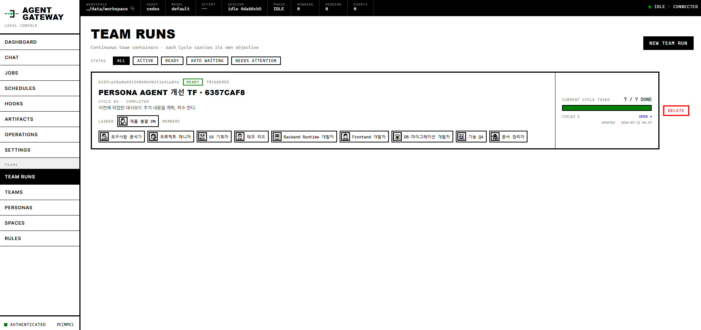
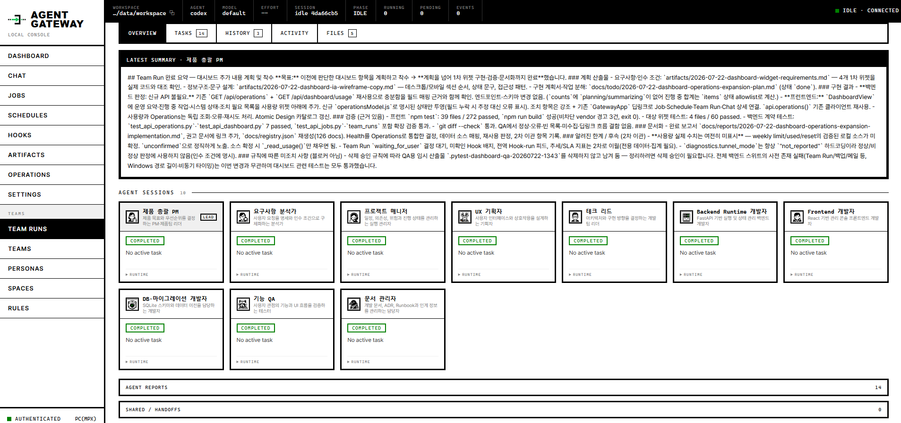
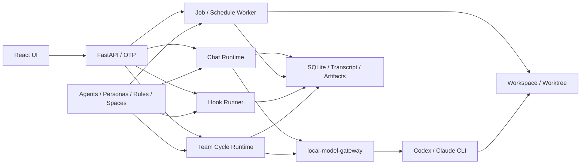

# Personal Agent Gateway

브라우저에서 내 로컬 머신의 Codex CLI 또는 Claude Code를 호출하고, 반복 자동화와 여러 역할의 협업까지 관리하는 개인용 웹 게이트웨이입니다.

모델 API key를 별도 서버에 저장하지 않고 **이미 로컬에 로그인된 agent CLI**와 workspace를 사용합니다. 대화, 실행 상태와 결과는 사용자 PC에 보존됩니다.

```text
Browser -> Cloudflare Tunnel -> Local FastAPI -> local-model-gateway (LMG) -> Codex CLI / Claude Code -> Local Workspace
```

> 로컬 CLI 실행·탐지는 별도 데몬 **[local-model-gateway](https://github.com/LeeLeeLeeee/local-model-gateway)(LMG)** 로 분리되어 있습니다. Gateway는 `LMG_BASE_URL`(기본 `http://127.0.0.1:8788`)로 LMG에 위임합니다.

## 화면 미리보기

Team Runs 목록에서는 실행 상태, 현재 Cycle, 역할별 Persona와 Task 진행률을 확인합니다.



상세 화면에서는 최신 요약, Persona별 session, 보고서, 사용자 결정과 repository 반영 상태를 확인합니다.



## 무엇을 할 수 있나

- **개인 실행**: Agent 또는 Persona 기반 Chat, session 기록과 실시간 event 확인
- **로컬 자동화**: 승인 가능한 Jobs, cron Schedules, IMAP·POP3 메일 Hooks와 Artifacts 관리
- **팀 협업**: Leader·Member Teams, AUTO·TRIGGERED Cycle, 역할별 Task, Human in the loop
- **안전한 작업 반영**: Spaces 접근 정책, Git worktree 격리와 Repository Delivery
- **운영 통제**: Dashboard 사용량, Operations health·emergency stop·backup, Settings와 audit

화면별 동작과 기능 연결은 [전체 기능 가이드](docs/knowledge/gateway-feature-guide.md)에서 확인할 수 있습니다.

## 구조 요약



Chat, Job, Hook, Team Run은 각자의 실행 lifecycle을 소유해 중복 실행을 막습니다. 인증, agent catalog, 정책, 저장소와 Event Bus는 공통으로 재사용합니다.

상세한 책임 경계, background 복구와 저장 구조는 [아키텍처 가이드](docs/knowledge/gateway-architecture-guide.md)를 참고하세요.

## 문서

| 문서 | 내용 |
| --- | --- |
| [전체 기능 가이드](docs/knowledge/gateway-feature-guide.md) | 화면별 기능, Chat·Job·Hook·Team Run 연결 흐름 |
| [아키텍처 가이드](docs/knowledge/gateway-architecture-guide.md) | 실행 소유권, Frontend·Backend 구성, 저장 책임과 효율성 원칙 |
| [설치·운영 가이드](docs/knowledge/gateway-setup-guide.md) | 설치, OTP, `.env`, build, Cloudflare Tunnel, 테스트와 문제 해결 |
| [Persona & Team Run 가이드](docs/knowledge/persona-team-usage-guide.md) | Persona와 Team 구성 및 실행 예시 |
| [Operations 진단 가이드](docs/knowledge/2026-07-15-operations-diagnostics-guide.md) | health, emergency stop, backup과 장애 복구 |

## 빠른 시작

준비물:

- Python 3.11 이상
- Node.js 20 이상과 npm
- 로그인된 Codex CLI 또는 Claude Code

가상환경을 만들고 OS에 맞는 Python으로 Backend를 설치합니다.

```bash
python -m venv .venv
```

```powershell
# Windows
.\.venv\Scripts\python.exe -m pip install -e ".[dev]"
```

```bash
# macOS
./.venv/bin/python -m pip install -e ".[dev]"
```

Frontend dependency를 설치합니다.

```bash
npm --prefix frontend install
```

`.env.example`을 `.env`로 복사한 뒤 최소 항목을 설정합니다.

```bash
AGENT_WEB_HOST=127.0.0.1
AGENT_WEB_PORT=8787
AGENT_WORKSPACE_ROOT=/absolute/path/to/workspace
AGENT_MODEL_PROVIDER=codex
AGENT_MODEL=default
```

React UI를 build합니다.

```bash
npm --prefix frontend run build
```

Gateway를 실행합니다.

```powershell
# Windows
.\scripts\run_local.ps1
```

```bash
# macOS
scripts/run_local.sh
```

`http://127.0.0.1:8787`에서 최초 TOTP setup을 진행합니다. 외부 접속과 named tunnel 설정은 [설치·운영 가이드](docs/knowledge/gateway-setup-guide.md#외부-접속)를 따르세요.

## 보안 요약

- Gateway는 기본적으로 `127.0.0.1`에 bind합니다.
- 모든 데이터 API는 OTP session으로 보호합니다.
- 외부 접속은 HTTPS Tunnel과 secure cookie를 사용합니다.
- Tunnel hostname 자체를 인증 수단으로 사용하지 않습니다.
- Agent의 읽기·쓰기 경로는 Spaces 정책으로 제한합니다.
- token, CLI credential, TOTP 데이터와 비공개 Tunnel hostname은 commit하지 않습니다.

자세한 설정값과 점검 절차는 [설치·운영 가이드의 보안 기준](docs/knowledge/gateway-setup-guide.md#보안-기준)을 참고하세요.

## 개발과 테스트

```bash
pytest
ruff check .
npm --prefix frontend test -- --run
npm --prefix frontend run build
```

CLI model과 option 탐지는 LMG가 담당합니다. 탐지 결과는 실행 중인 LMG에서 확인합니다.

```bash
curl http://127.0.0.1:8788/v1/models
```

개발 서버 분리 실행과 Troubleshooting은 [설치·운영 가이드](docs/knowledge/gateway-setup-guide.md#개발-모드)를 참고하세요.

## 최근 변경 (2026-07)

- **로컬 실행 분리**: 로컬 CLI 실행/탐지/세션 관리를 [local-model-gateway](https://github.com/LeeLeeLeeee/local-model-gateway)(LMG)로 분리. Gateway는 HTTP+SSE로 위임(`LMG_BASE_URL`).
- **정규화 이벤트 이행**: 프런트가 LMG의 정규화 이벤트(`message.delta`/`reasoning.delta`/`tool.activity`/…)를 직접 소비 → Codex뿐 아니라 **Claude도 라이브 스트리밍 UI**를 표시. Codex의 턴당 여러 메시지는 각각 별도 버블로 렌더.
- **대시보드 로컬 세션 패널**: LMG가 관리하는 업스트림 세션 현황을 읽기 전용으로 표시.
- **Chat 진입 UX**: 앱 로드 시 빈 세션 대신 **가장 최근 대화 세션**을 엽니다(대화가 없을 때만 새 세션).
