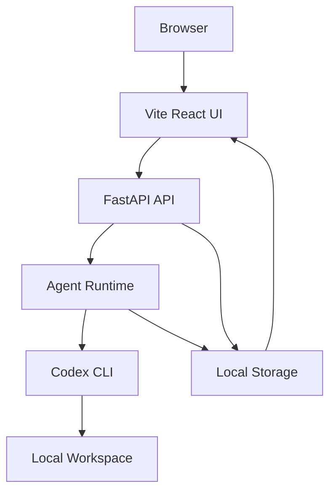
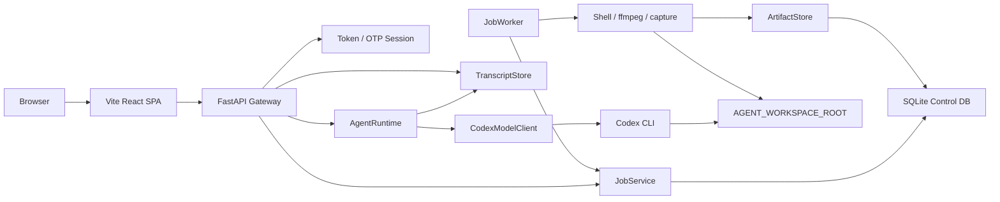

# Personal Agent Gateway

브라우저에서 내 로컬 머신의 Codex CLI 에이전트를 호출하는 개인용 웹 게이트웨이입니다.

외부 브라우저에서 메시지를 보내면, 로컬에서 실행 중인 FastAPI gateway가 요청을 받고, Codex CLI를 `codex exec --json`으로 실행한 뒤 결과를 웹 화면에 보여줍니다. 기본 사용 방식은 OpenAI API 직접 호출이 아니라 **이미 로컬에 로그인된 Codex CLI**를 사용하는 것입니다.

```text
Browser -> Cloudflare Quick Tunnel -> Local FastAPI -> Codex CLI -> Local Workspace
```

## 왜 필요한가

Codex CLI는 로컬 개발 환경과 잘 붙어 있지만, 밖에서 휴대폰이나 다른 노트북으로 내 로컬 Codex에게 작업을 맡기려면 안전한 진입점이 필요합니다.

이 프로젝트는 그 진입점을 작게 만듭니다.

- gateway는 내 로컬 머신에서만 실행합니다.
- 브라우저는 파일시스템이나 Codex CLI에 직접 접근하지 않습니다.
- 외부 접속은 Cloudflare Quick Tunnel이 로컬 gateway로 전달합니다.
- 웹 UI와 API는 token + OTP session으로 보호합니다.
- 대화 기록과 작업 metadata는 로컬에 저장합니다.

## 초보자를 위한 구조

처음에는 네 덩어리만 이해하면 됩니다.

```text
1. React UI
   사용자가 보는 웹 화면입니다.

2. FastAPI Gateway
   브라우저 요청을 받고 인증을 확인한 뒤 backend 기능으로 연결합니다.

3. Agent Runtime
   사용자 메시지를 Codex CLI에 전달하고 transcript를 저장합니다.

4. Local Control Plane
   job, capability, schedule, artifact 같은 로컬 자동화 기능을 관리합니다.
```

사용자가 채팅을 보내면 흐름은 이렇습니다.

```text
React 화면에서 메시지 전송
  -> FastAPI가 OTP session 확인
  -> AgentRuntime이 Codex CLI 실행
  -> Codex가 AGENT_WORKSPACE_ROOT 안에서 작업
  -> 결과를 transcript에 저장
  -> React가 history/SSE로 결과 표시
```



## 고급 아키텍처

이 프로젝트는 chat runtime과 local control plane을 분리합니다.

- **Chat runtime**: 자연어 메시지를 agent provider에 전달하고 transcript를 저장합니다.
- **Control plane**: capability, job, schedule, artifact를 구조화해서 UI와 agent가 같은 방식으로 로컬 기능을 실행하게 합니다.



### Frontend

Frontend는 `frontend/`의 Vite React 앱입니다.

```text
frontend/
├── index.html
├── package.json
├── vite.config.js
└── src/
    ├── api/          # /api/* fetch client
    ├── lib/          # time, timeline 변환 로직
    ├── components/
    │   ├── atoms/
    │   ├── molecules/
    │   ├── organisms/
    │   ├── templates/
    │   └── containers/
    └── main.jsx
```

컴포넌트는 Atomic Design 기준으로 나눕니다.

- `atoms`: Button, Field, StatusBadge 같은 단일 UI 단위
- `molecules`: Composer, AuthCard 같은 작은 조합
- `organisms`: Sidebar, ChatView, Timeline 같은 큰 화면 블록
- `templates`: AppShell, AuthTemplate 같은 레이아웃 골격
- `containers`: GatewayApp처럼 API/SSE/전역 상태를 묶는 레이어

React 앱은 `/api/*`를 상대 경로로 호출합니다. 개발 중에는 Vite proxy가 FastAPI로 넘기고, 빌드 후에는 FastAPI가 정적 파일과 API를 같은 origin에서 제공합니다.

### Backend

Backend는 `src/personal_agent_gateway/` 아래에 있습니다.

| 파일 | 역할 |
| --- | --- |
| `app.py` | FastAPI app, route, 정적 파일 서빙 |
| `runtime.py` | chat message 처리와 provider 호출 |
| `model_client.py` | Codex CLI/OpenAI provider adapter |
| `transcript.py` | session JSONL 저장/검색/전환 |
| `auth.py`, `auth_store.py` | token, OTP, recovery code |
| `db.py` | SQLite schema와 connection |
| `capabilities.py` | 실행 가능한 local capability 정의 |
| `jobs.py`, `job_worker.py` | job 상태 전이와 실행 queue |
| `runners/` | shell, ffmpeg, capture 실행기 |
| `api/` | auth, jobs, schedules, artifacts API router |

### 정적 파일 서빙

FastAPI는 다음 순서로 UI entry를 선택합니다.

1. `src/personal_agent_gateway/frontend_dist/index.html`이 있으면 Vite build 결과를 사용합니다.
2. 없으면 `src/personal_agent_gateway/static/index.html`을 fallback으로 사용합니다.

Vite build asset은 `/assets/*`로 서빙됩니다. 기존 vendor asset은 `/static/vendor/*` 경로를 유지합니다.

## 실행 방법

### 0. 준비물

- Python 3.11 이상
- Node.js 20 이상 권장
- npm
- Codex CLI 로그인 상태
- 외부 접속을 쓸 경우 Cloudflare tunnel binary

### 1. Backend 설치

Windows PowerShell:

```powershell
python -m venv .venv
.\.venv\Scripts\Activate.ps1
python -m pip install -e ".[dev]"
Copy-Item .env.example .env
```

macOS:

```bash
python -m venv .venv
source .venv/bin/activate
python -m pip install -e ".[dev]"
cp .env.example .env
```

### 2. Frontend 설치

```bash
cd frontend
npm install
cd ..
```

### 3. Token 생성

```bash
python -c "import secrets; print(secrets.token_urlsafe(32))"
```

생성된 값을 `.env`의 `AGENT_WEB_TOKEN`에 넣습니다.

### 4. `.env` 설정

최소 설정:

```bash
AGENT_WEB_HOST=127.0.0.1
AGENT_WEB_PORT=8787
AGENT_WEB_TOKEN=replace-with-strong-random-token
AGENT_WORKSPACE_ROOT=/absolute/path/to/workspace
AGENT_MODEL_PROVIDER=codex
AGENT_MODEL=default
```

전체 설정은 [.env.example](.env.example)을 기준으로 채웁니다.

중요한 값:

| 이름 | 설명 |
| --- | --- |
| `AGENT_WEB_HOST` | gateway bind host. 기본 `127.0.0.1` |
| `AGENT_WEB_PORT` | gateway port. 기본 `8787` |
| `AGENT_WEB_TOKEN` | 웹 접근 token |
| `AGENT_WORKSPACE_ROOT` | Codex가 작업할 로컬 workspace |
| `AGENT_MODEL_PROVIDER` | 기본 `codex` |
| `AGENT_SESSION_DIR` | transcript 저장 위치 |
| `AGENT_APP_DB_PATH` | SQLite DB 경로 |
| `AGENT_ARTIFACT_ROOT` | artifact 저장 위치 |
| `AGENT_AUTH_DIR` | TOTP 인증 정보 저장 위치 |

### 5. React UI 빌드

FastAPI가 React UI를 서빙하려면 먼저 build합니다.

```bash
cd frontend
npm run build
cd ..
```

빌드 결과는 `src/personal_agent_gateway/frontend_dist/`에 생성됩니다. 이 디렉터리는 생성물이므로 git에 올리지 않습니다.

### 6. Local gateway 실행

Windows PowerShell:

```powershell
.\scripts\run_local.ps1
```

macOS:

```bash
scripts/run_local.sh
```

브라우저에서 접속합니다.

```text
http://127.0.0.1:8787/?token=<AGENT_WEB_TOKEN>
```

처음 접속하면 OTP setup 화면에서 Google Authenticator 호환 TOTP를 등록합니다.

### 7. 외부 접속

다른 터미널에서 tunnel을 실행합니다.

Windows PowerShell:

```powershell
.\scripts\run_tunnel.ps1
```

macOS:

```bash
scripts/run_tunnel.sh
```

출력된 URL에 token을 붙여 접속합니다.

```text
https://<random>.trycloudflare.com/?token=<AGENT_WEB_TOKEN>
```

Quick Tunnel URL은 재시작할 때마다 바뀝니다.

## 개발 방법

Backend와 frontend를 따로 띄워 개발할 수 있습니다.

터미널 1:

```bash
scripts/run_local.sh
```

Windows는 다음을 사용합니다.

```powershell
.\scripts\run_local.ps1
```

터미널 2:

```bash
cd frontend
npm run dev
```

Vite dev server는 `/api`와 `/static/vendor` 요청을 `http://127.0.0.1:8787`로 proxy합니다.

FastAPI에 붙인 실제 형태를 확인하려면 다시 build합니다.

```bash
cd frontend
npm run build
cd ..
scripts/run_local.sh
```

## 테스트

Backend:

```bash
pytest -q
```

Frontend:

```bash
cd frontend
npm test
```

Frontend build:

```bash
cd frontend
npm run build
```

Lint:

```bash
ruff check .
```

## 보안 기준

공개하면 안 되는 값:

- `AGENT_WEB_TOKEN`
- Cloudflare Quick Tunnel URL
- 로컬 Codex 로그인 상태
- `AGENT_WORKSPACE_ROOT` 아래의 민감한 파일
- `AGENT_AUTH_DIR`에 저장된 OTP 인증 데이터

운영 기준:

- gateway는 기본적으로 `127.0.0.1`에 bind합니다.
- 외부 접속은 Quick Tunnel로만 열고 URL을 공유하지 않습니다.
- HTTPS tunnel만 쓸 때는 `AGENT_COOKIE_SECURE=true`를 켭니다.
- `AGENT_WORKSPACE_ROOT`는 agent에게 맡겨도 되는 디렉터리로 제한합니다.
- shell capability는 승인 기반으로만 실행합니다.

## 자주 보는 파일

| 파일 | 볼 때 |
| --- | --- |
| `frontend/src/components/containers/GatewayApp/index.jsx` | React app 상태/API/SSE 흐름 |
| `frontend/src/api/client.js` | frontend API 호출 계약 |
| `frontend/src/lib/timeline.js` | transcript/SSE -> UI timeline 변환 |
| `src/personal_agent_gateway/app.py` | FastAPI route와 정적 파일 서빙 |
| `src/personal_agent_gateway/runtime.py` | chat request 처리 |
| `src/personal_agent_gateway/model_client.py` | Codex CLI 호출 |
| `src/personal_agent_gateway/jobs.py` | job 상태 전이 |
| `src/personal_agent_gateway/job_worker.py` | queued job 실행 |
| `src/personal_agent_gateway/runners/` | shell/ffmpeg/capture 실행 |

## Troubleshooting

| 증상 | 확인할 것 |
| --- | --- |
| `401 Unauthorized` | URL에 `?token=<AGENT_WEB_TOKEN>`을 붙여 다시 접속 |
| `OTP login required` | OTP login panel에서 6자리 TOTP 입력 |
| cookie가 저장되지 않음 | HTTPS tunnel 전용이면 `AGENT_COOKIE_SECURE=true` |
| port 충돌 | `AGENT_WEB_PORT=8788` 등 다른 port 사용 |
| agent가 파일을 못 봄 | 파일이 `AGENT_WORKSPACE_ROOT` 아래에 있는지 확인 |
| Codex 실행 실패 | 로컬 터미널에서 `codex exec --json "hello"` 확인 |
| frontend 변경이 안 보임 | `cd frontend && npm run build` 후 gateway 재시작 |
| Vite dev server에서 API 실패 | FastAPI가 `127.0.0.1:8787`에서 실행 중인지 확인 |
