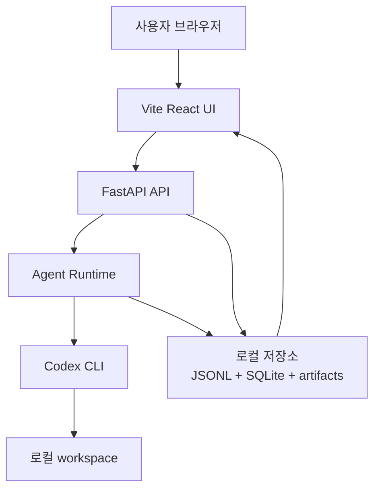
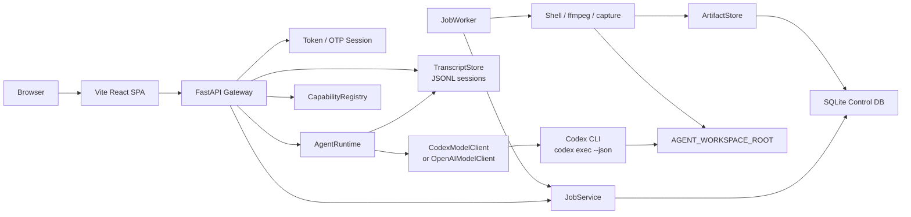

# Personal Agent Gateway

브라우저에서 내 로컬 Windows/macOS 머신의 Codex CLI 에이전트를 호출하는 개인용 웹 게이트웨이입니다.

외부 브라우저에서 메시지를 보내면, 로컬 머신에서 실행 중인 FastAPI gateway가 요청을 받고, Codex CLI를 `codex exec --json`으로 실행한 뒤 결과를 다시 웹 화면에 보여줍니다. 기본 경로는 OpenAI API 직접 호출이 아니라 **이미 로컬에 로그인된 Codex CLI**를 사용하는 방식입니다.


## 한 줄 요약

```text
외부 브라우저
  -> Cloudflare Quick Tunnel
  -> 내 로컬 FastAPI gateway
  -> Codex CLI
  -> 로컬 workspace
```

## 이 프로젝트가 해결하는 문제

Codex CLI는 로컬 개발 환경과 잘 붙어 있습니다. 하지만 밖에서 휴대폰이나 다른 노트북으로 내 로컬 Codex에게 작업을 맡기려면 안전한 진입점이 필요합니다.

`Personal Agent Gateway`는 그 진입점을 작게 만듭니다.

- 내 Windows/macOS 머신에서만 agent engine을 실행합니다.
- 브라우저는 직접 파일시스템이나 Codex에 접근하지 않습니다.
- 외부 접속은 Cloudflare Quick Tunnel을 통해 임시 HTTPS URL로 받습니다.
- 웹 UI와 API는 개인 token과 OTP session으로 보호합니다.
- 대화 기록, job, artifact, schedule metadata는 로컬 디스크/SQLite에 저장합니다.
- React UI는 FastAPI의 `/api/*`를 호출하는 정적 SPA로 동작합니다.

## 현재 할 수 있는 것

- OTP 기반 웹 로그인과 TOTP 최초 설정
- 로컬 Codex CLI 호출
- 채팅 session 목록, 검색, 전환, 삭제, 이름 변경
- active session transcript 복원
- SSE 기반 live activity stream
- assistant message의 markdown, code block, table, mermaid block 렌더링
- capability catalog 조회 API
- job 생성, 승인, 거절, 상태 조회 API
- ffmpeg, capture, shell runner 기반 local job 실행 구조
- schedule이 due job을 생성하는 local scheduler 기반
- artifact metadata 저장과 조회 API
- Vite React frontend build 산출물을 FastAPI에서 정적 서빙

아직 하지 않는 것:

- 공개 멀티유저 서비스
- 사용자 계정/권한 관리
- production-grade uptime 보장
- 원격 쉘 제공 서비스
- custom domain 기반 정식 배포
- Cloudflare Zero Trust login 연동
- Jobs/Schedules/Capabilities/Artifacts/Settings의 완성된 dashboard 화면
- Playwright 기반 browser capture
- 대량 media batch workflow

## 초보자를 위한 아키텍처

이 프로젝트는 크게 네 덩어리로 보면 됩니다.

```text
1. Browser UI
   사용자가 보는 React 화면입니다.

2. FastAPI Gateway
   브라우저 요청을 받고 인증을 확인한 뒤 backend 기능으로 연결합니다.

3. Agent Runtime
   사용자 메시지를 Codex CLI 또는 OpenAI provider에 전달하고 transcript를 저장합니다.

4. Local Control Plane
   job, capability, schedule, artifact 같은 로컬 자동화 기능을 관리합니다.
```

처음 이해할 때는 이렇게 생각하면 됩니다.

```text
React 화면에서 "작업해줘" 클릭
  -> FastAPI가 로그인 여부 확인
  -> AgentRuntime이 Codex CLI 실행
  -> Codex가 AGENT_WORKSPACE_ROOT 안에서 작업
  -> 결과를 transcript에 저장
  -> React 화면이 history/SSE를 통해 결과 표시
```

### 초보자용 흐름도



### 파일 기준으로 보면

| 영역 | 위치 | 역할 |
| --- | --- | --- |
| React UI | `frontend/` | Vite React 앱. 개발/테스트/build 담당 |
| 빌드 산출물 | `src/personal_agent_gateway/frontend_dist/` | `npm run build` 결과. git에는 올리지 않음 |
| 기존 fallback UI | `src/personal_agent_gateway/static/` | dist가 없을 때 fallback. vendor asset도 여기 있음 |
| FastAPI app | `src/personal_agent_gateway/app.py` | API route, 정적 파일 서빙, service wiring |
| API router | `src/personal_agent_gateway/api/` | auth, jobs, schedules, artifacts 등 REST API |
| Agent runtime | `src/personal_agent_gateway/runtime.py` | message 처리, transcript 저장, provider 호출 |
| Model client | `src/personal_agent_gateway/model_client.py` | Codex CLI/OpenAI provider 호출 |
| Transcript | `src/personal_agent_gateway/transcript.py` | session JSONL 저장/검색/전환 |
| Control DB | `src/personal_agent_gateway/db.py` | SQLite schema와 connection helper |
| Job system | `jobs.py`, `job_worker.py`, `runners/` | capability 기반 local job 실행 |
| Tests | `tests/`, `frontend/src/**/*.test.*` | Python backend + React frontend 회귀 검증 |

## 고급 아키텍처

### 런타임/컨트롤 플레인 분리

이 프로젝트는 단순 chat gateway와 local control plane을 분리합니다.

- **Chat runtime**: 사용자의 자연어 메시지를 agent provider에 전달하고 transcript를 저장합니다.
- **Control plane**: capabilities, jobs, schedules, artifacts를 구조화해서 UI와 agent가 같은 경계로 로컬 기능을 발견하고 실행하게 합니다.



### Frontend 구조

Frontend는 `frontend/`에 있는 Vite React 앱입니다. FastAPI는 frontend server를 띄우지 않습니다. 대신 `npm run build`로 생성된 정적 파일을 `src/personal_agent_gateway/frontend_dist/`에서 직접 서빙합니다.

```text
frontend/
├── index.html
├── package.json
├── vite.config.js
└── src/
    ├── api/
    │   └── client.js
    ├── lib/
    │   ├── time.js
    │   └── timeline.js
    ├── components/
    │   ├── atoms/
    │   ├── molecules/
    │   ├── organisms/
    │   ├── templates/
    │   ├── containers/
    │   └── references/
    ├── test/
    │   └── setup.js
    └── main.jsx
```

Atomic Design 기준:

- `atoms`: 버튼, 입력, 상태 배지처럼 단일 UI 단위
- `molecules`: Composer, AuthCard처럼 atom 조합 + 작은 로컬 상태
- `organisms`: Sidebar, ChatView, Timeline처럼 화면의 큰 블록
- `templates`: AppShell, AuthTemplate처럼 레이아웃 골격
- `containers`: GatewayApp처럼 API, SSE, 전역 상태를 묶는 화면 조립 레이어

React 앱은 `/api/*`를 상대 경로로 호출합니다. 그래서 로컬 개발에서는 Vite proxy가 FastAPI로 요청을 넘기고, production build에서는 같은 origin의 FastAPI가 직접 API와 정적 파일을 모두 담당합니다.

### FastAPI 정적 파일 서빙 전략

`app.py`는 다음 순서로 frontend entry를 선택합니다.

1. `src/personal_agent_gateway/frontend_dist/index.html`이 있으면 Vite build 결과를 사용합니다.
2. 없으면 `src/personal_agent_gateway/static/index.html`을 fallback으로 사용합니다.

기존 호환 경로는 유지됩니다.

- `/static/app.js`
- `/static/styles.css`
- `/static/vendor/*`

Vite build asset은 dist가 있을 때 `/assets/*`로 서빙됩니다.

### 데이터 저장

| 데이터 | 저장 위치 | 설명 |
| --- | --- | --- |
| Chat transcript | `AGENT_SESSION_DIR` | session별 JSONL 파일 |
| Active session pointer | `AGENT_SESSION_DIR/active.json` | 마지막 active session |
| Jobs/schedules/artifacts metadata | `AGENT_APP_DB_PATH` | SQLite DB |
| Artifact files | `AGENT_ARTIFACT_ROOT` | capture, ffmpeg 결과물 등 |
| Temporary files | `AGENT_TEMP_DIR` | runner 임시 출력 |
| OTP secret/recovery hash | `AGENT_AUTH_DIR` | TOTP 인증 정보 |

### 인증 모델

현재 인증은 두 층입니다.

1. **Token gate**
   - `AGENT_WEB_TOKEN`으로 웹 UI 접근을 보호합니다.
   - 외부 tunnel URL에 `?token=...`을 붙여 최초 접속합니다.

2. **OTP session**
   - `/api/auth/login`이 6자리 TOTP를 검증하고 `agent_session` cookie를 발급합니다.
   - TOTP 설정 후 chat/control API는 OTP session을 요구합니다.

중요한 전제:

- gateway는 `127.0.0.1` 또는 `localhost`에 bind하는 것이 기본입니다.
- 외부 공개는 Cloudflare Quick Tunnel이 loopback으로 전달합니다.
- `AGENT_WORKSPACE_ROOT` 밖의 작업은 runner와 tool boundary에서 제한해야 합니다.

## 실행 방법

### 0. 필요한 도구

- Python 3.11 이상
- Node.js 20 이상 권장
- npm
- Codex CLI 로그인 상태
- 외부 접속을 쓸 경우 Cloudflare tunnel binary
- ffmpeg/capture 기능을 쓸 경우 OS별 binary 또는 권한

### 1. Python backend 설치

Windows PowerShell:

```powershell
python -m venv .venv
.\.venv\Scripts\Activate.ps1
python -m pip install -e ".[dev]"
Copy-Item .env.example .env
```

macOS:

```bash
python -m venv .venv
source .venv/bin/activate
python -m pip install -e ".[dev]"
cp .env.example .env
```

### 2. Frontend 의존성 설치

```bash
cd frontend
npm install
cd ..
```

### 3. Web token 생성

```bash
python -c "import secrets; print(secrets.token_urlsafe(32))"
```

생성된 값을 `.env`의 `AGENT_WEB_TOKEN`에 넣습니다.

### 4. `.env` 설정

최소 설정:

```bash
AGENT_WEB_HOST=127.0.0.1
AGENT_WEB_PORT=8787
AGENT_WEB_TOKEN=replace-with-strong-random-token
AGENT_WORKSPACE_ROOT=/absolute/path/to/workspace
AGENT_MODEL_PROVIDER=codex
AGENT_MODEL=default
```

전체 예시는 [.env.example](.env.example)를 참고합니다.

중요한 값:

| 이름 | 설명 |
| --- | --- |
| `AGENT_WEB_HOST` | gateway bind host. 기본 `127.0.0.1` |
| `AGENT_WEB_PORT` | gateway port. 기본 `8787` |
| `AGENT_WEB_TOKEN` | 웹 UI/API 접근 token |
| `AGENT_WORKSPACE_ROOT` | Codex가 작업할 로컬 workspace |
| `AGENT_MODEL_PROVIDER` | 기본 `codex`. 선택적으로 `openai` |
| `AGENT_SESSION_DIR` | transcript 저장 위치 |
| `AGENT_APP_DB_PATH` | SQLite DB 경로 |
| `AGENT_ARTIFACT_ROOT` | artifact 저장 위치 |
| `AGENT_AUTH_DIR` | TOTP secret/recovery code 저장 위치 |
| `AGENT_COOKIE_SECURE` | HTTPS tunnel 전용 cookie 보안 옵션 |
| `AGENT_CODEX_BIN` | Codex CLI binary. 비워두면 OS 기본값 |

OS별 경로 예시:

| 항목 | Windows | macOS |
| --- | --- | --- |
| workspace | `C:\Users\you\works` | `/Users/you/works` |
| Codex 기본 binary | `codex.cmd` | `codex` |
| capture 기본 binary | `powershell` | `screencapture` |
| local script | `scripts\run_local.ps1` | `scripts/run_local.sh` |
| tunnel script | `scripts\run_tunnel.ps1` | `scripts/run_tunnel.sh` |

### 5. React frontend build

FastAPI가 React UI를 서빙하게 하려면 build 산출물이 필요합니다.

```bash
cd frontend
npm run build
cd ..
```

빌드 결과는 다음 위치에 생성됩니다.

```text
src/personal_agent_gateway/frontend_dist/
```

이 디렉터리는 생성물이라 git에 올리지 않습니다.

### 6. 로컬 gateway 실행

Windows PowerShell:

```powershell
.\scripts\run_local.ps1
```

macOS:

```bash
scripts/run_local.sh
```

또는:

```bash
make dev
```

브라우저에서 접속합니다.

```text
http://127.0.0.1:8787/?token=<AGENT_WEB_TOKEN>
```

처음 접속하면 OTP setup 화면에서 Google Authenticator 호환 TOTP를 등록합니다.

### 7. 외부 접속용 tunnel 실행

다른 터미널에서 실행합니다.

Windows PowerShell:

```powershell
.\scripts\run_tunnel.ps1
```

macOS:

```bash
scripts/run_tunnel.sh
```

또는:

```bash
make tunnel
```

Cloudflare가 임시 URL을 출력합니다.

```text
https://<random>.trycloudflare.com
```

외부 브라우저에서는 token을 붙여 접속합니다.

```text
https://<random>.trycloudflare.com/?token=<AGENT_WEB_TOKEN>
```

Quick Tunnel URL은 재시작할 때마다 바뀝니다.

## 개발 방법

### Backend만 개발

```bash
.\scripts\run_local.ps1
```

또는:

```bash
scripts/run_local.sh
```

### Frontend 개발 서버 사용

터미널 1:

```bash
.\scripts\run_local.ps1
```

터미널 2:

```bash
cd frontend
npm run dev
```

Vite dev server는 `/api`와 `/static/vendor` 요청을 `http://127.0.0.1:8787`로 proxy합니다.

### Frontend를 FastAPI에 붙여 확인

```bash
cd frontend
npm run build
cd ..
.\scripts\run_local.ps1
```

이 방식이 실제 배포 형태에 가장 가깝습니다.

## 테스트

Backend:

```bash
pytest -q
```

Frontend:

```bash
cd frontend
npm test
```

Frontend build:

```bash
cd frontend
npm run build
```

Lint:

```bash
ruff check .
```

전체 backend check:

```bash
make check
```

현재 마이그레이션 검증 기준:

- React API client가 기존 `/api/*` endpoint 계약을 유지하는지
- transcript history와 Codex SSE event가 기존 timeline model로 변환되는지
- OTP login 후 chat shell이 로드되는지
- chat message 전송과 non-streamed fallback response가 렌더링되는지
- session search/activate가 동작하는지
- markdown heading/list/code/table/link 렌더링이 유지되는지
- FastAPI가 `frontend_dist`를 우선 서빙하고 없으면 legacy static UI로 fallback하는지

## API 요약

### Auth API

| Method | Path | 설명 |
| --- | --- | --- |
| `GET` | `/api/auth/status` | session 인증 여부와 TOTP 설정 여부 |
| `POST` | `/api/auth/setup/start` | TOTP QR SVG, secret, otpauth URI 생성 |
| `POST` | `/api/auth/setup/verify` | setup code 검증 후 TOTP 활성화 |
| `POST` | `/api/auth/login` | 6자리 OTP로 로그인하고 `agent_session` cookie 발급 |
| `POST` | `/api/auth/logout` | `agent_session` cookie 제거 |

### Chat/session API

| Method | Path | 설명 |
| --- | --- | --- |
| `GET` | `/api/status` | provider, model, workspace, session 상태 |
| `GET` | `/api/history` | active session transcript |
| `POST` | `/api/chat` | 사용자 메시지를 agent runtime으로 전달 |
| `GET` | `/api/events` | live event SSE stream |
| `GET` | `/api/sessions` | session 목록 |
| `GET` | `/api/sessions/search?q=...` | session 검색 |
| `POST` | `/api/sessions/{id}/activate` | active session 전환 |
| `POST` | `/api/sessions/{id}/title` | session title 변경 |
| `DELETE` | `/api/sessions/{id}` | session 삭제 |
| `POST` | `/api/reset` | 새 active session 시작 |
| `POST` | `/api/approvals/{id}/approve` | shell 요청 승인 |
| `POST` | `/api/approvals/{id}/deny` | shell 요청 거절 |

### Local control API

| Method | Path | 설명 |
| --- | --- | --- |
| `GET` | `/api/capabilities` | local capability 목록 |
| `GET` | `/api/capabilities/{id}` | capability 상세 |
| `GET` | `/api/jobs` | job 목록 |
| `POST` | `/api/jobs` | manual job 생성 |
| `GET` | `/api/jobs/{id}` | job 상세 |
| `POST` | `/api/jobs/{id}/approve` | approval 대기 job 승인 |
| `POST` | `/api/jobs/{id}/deny` | approval 대기 job 거절 |
| `GET` | `/api/artifacts` | artifact metadata 목록 |
| `GET` | `/api/artifacts/{id}` | artifact metadata 상세 |
| `GET` | `/api/schedules` | schedule 목록 |
| `POST` | `/api/schedules` | schedule 생성 |
| `GET` | `/api/schedules/{id}` | schedule 상세 |
| `POST` | `/api/schedules/{id}/pause` | schedule 일시정지 |
| `POST` | `/api/schedules/{id}/resume` | schedule 재개 |
| `DELETE` | `/api/schedules/{id}` | schedule 삭제 |

## Capability 모델

현재 등록된 capability:

| ID | 설명 | 승인 |
| --- | --- | --- |
| `shell.run` | workspace에서 승인된 shell command 실행 | 필요 |
| `ffmpeg.inspect` | ffprobe로 media metadata 읽기 | 불필요 |
| `ffmpeg.extract-audio` | local media에서 audio artifact 추출 | 필요 |
| `ffmpeg.thumbnail` | local video thumbnail 생성 | 필요 |
| `capture.screen` | local screen capture artifact 생성 | 필요 |

핵심 개념:

- `Engine`: 실제 실행 엔진. 예: Codex CLI, ffmpeg, capture, scheduler
- `Capability`: 사용자와 agent에게 노출되는 기능 단위
- `Job`: capability가 실제로 한 번 실행되는 작업
- `Schedule`: 반복 실행되는 job 템플릿
- `Artifact`: capture 이미지, ffmpeg 결과물, 로그, 리포트 같은 결과물

## 보안 운영 기준

공개하면 안 되는 값:

- `AGENT_WEB_TOKEN`
- 현재 Cloudflare Quick Tunnel URL
- 로컬 Codex 로그인 상태
- 로컬 머신 접근 권한
- `AGENT_WORKSPACE_ROOT` 아래의 민감한 파일
- `AGENT_AUTH_DIR`에 저장된 인증 데이터

권장 운영:

- gateway는 `127.0.0.1`에 bind합니다.
- 외부 접속은 Quick Tunnel로만 열고 URL을 공유하지 않습니다.
- HTTPS tunnel만 쓸 때는 `AGENT_COOKIE_SECURE=true`를 켭니다.
- `AGENT_WORKSPACE_ROOT`는 agent에게 맡길 수 있는 작업 디렉터리로 제한합니다.
- shell capability는 승인 기반으로만 실행합니다.
- token이 붙은 URL을 메신저, 로그, 화면 공유에 노출하지 않습니다.

## Troubleshooting

| 증상 | 확인할 것 |
| --- | --- |
| `401 Unauthorized` | URL에 `?token=<AGENT_WEB_TOKEN>`을 붙여 다시 접속 |
| `OTP login required` | OTP login panel에서 Google Authenticator 6자리 코드 입력 |
| cookie가 저장되지 않음 | HTTPS tunnel 전용이면 `AGENT_COOKIE_SECURE=true` |
| port 충돌 | `AGENT_WEB_PORT=8788` 등 다른 port 사용 |
| tunnel 접속 실패 | tunnel script 재시작 후 새 URL 사용 |
| agent가 파일을 못 봄 | 파일이 `AGENT_WORKSPACE_ROOT` 아래에 있는지 확인 |
| Codex 실행 실패 | 로컬 터미널에서 `codex exec --json "hello"` 확인 |
| Windows에서 Codex binary not found | `AGENT_CODEX_BIN`을 비우거나 `codex.cmd`로 설정 |
| frontend 변경이 안 보임 | `cd frontend && npm run build` 후 gateway 재시작 |
| Vite dev server에서 API 실패 | FastAPI가 `127.0.0.1:8787`에서 실행 중인지 확인 |
| ffmpeg job 실패 | `AGENT_FFMPEG_BIN`, `AGENT_FFPROBE_BIN` 경로 확인 |
| capture job 실패 | Windows PowerShell/macOS screencapture 권한 확인 |

## 개발자가 자주 보는 파일

| 파일 | 볼 때 |
| --- | --- |
| `frontend/src/components/containers/GatewayApp/index.jsx` | React app 상태/API/SSE 흐름 확인 |
| `frontend/src/api/client.js` | frontend가 호출하는 API 계약 확인 |
| `frontend/src/lib/timeline.js` | transcript/SSE -> UI timeline 변환 확인 |
| `src/personal_agent_gateway/app.py` | FastAPI route와 정적 파일 서빙 확인 |
| `src/personal_agent_gateway/runtime.py` | chat request 처리 흐름 확인 |
| `src/personal_agent_gateway/model_client.py` | Codex CLI/OpenAI provider 호출 확인 |
| `src/personal_agent_gateway/jobs.py` | job 상태 전이 확인 |
| `src/personal_agent_gateway/job_worker.py` | queued job 실행 확인 |
| `src/personal_agent_gateway/runners/` | 실제 local command/ffmpeg/capture 실행 확인 |
| `tests/test_app.py` | backend app/API smoke 검증 확인 |
| `frontend/src/**/*.test.*` | React 마이그레이션 회귀 테스트 확인 |

## 더 알아보기

AI에게 다음 질문을 던지면 이 프로젝트를 더 깊게 점검할 수 있습니다.

- `Personal Agent Gateway의 FastAPI + Vite React + Codex CLI 구조에서 인증 경계와 파일시스템 접근 경계를 리뷰해줘.`
- `Personal Agent Gateway의 Local Control Plane에서 capability, job, schedule, artifact 모델을 확장할 때 어떤 테스트를 먼저 추가해야 하는지 제안해줘.`
- `FastAPI가 Vite build 산출물을 서빙하는 구조와 별도 frontend server를 운영하는 구조의 장단점을 비교해줘.`
- `개인용 Codex CLI gateway를 외부 tunnel로 열 때 발생할 수 있는 보안 리스크와 완화책을 체크리스트로 정리해줘.`
