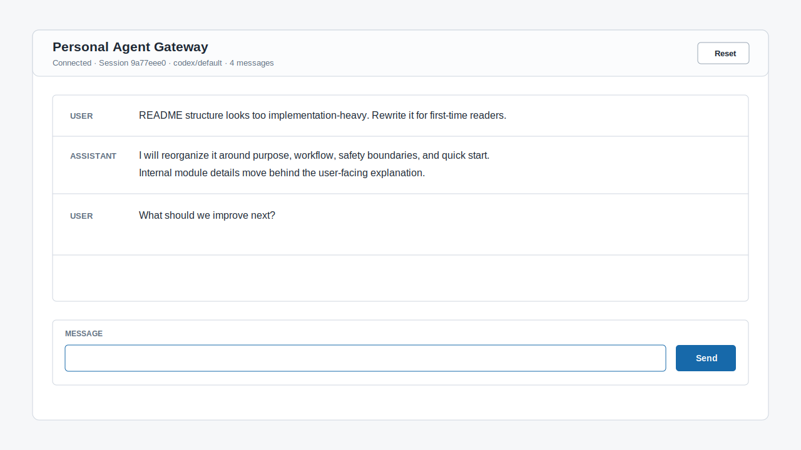
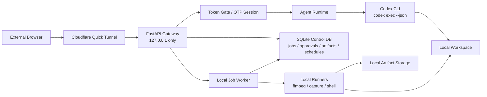

# Personal Agent Gateway

브라우저에서 내 로컬 Mac의 Codex CLI 에이전트를 호출하는 개인용 웹 게이트웨이입니다.

이 프로젝트의 목표는 단순합니다. 외부에 있는 브라우저에서 메시지를 보내면, 내 Mac에서 실행 중인 로컬 gateway가 그 요청을 받아 `codex exec --json`으로 전달하고, Codex가 로컬 workspace를 기준으로 작업한 결과를 다시 웹 화면에 보여줍니다.

기본 경로는 OpenAI API 직접 호출이 아닙니다. 이미 로컬 Mac에 로그인되어 있는 Codex CLI를 사용하므로, 기본 설정에서는 앱에 `OPENAI_API_KEY`를 넣지 않습니다.



## 왜 만들었나

Codex CLI는 로컬 개발 환경과 잘 붙어 있습니다. 하지만 밖에서 휴대폰이나 다른 노트북으로 내 Mac의 로컬 에이전트에게 작업을 맡기려면 안전한 진입점이 필요합니다.

`Personal Agent Gateway`는 그 진입점을 작게 만듭니다.

- 내 Mac에서만 agent engine을 실행합니다.
- 브라우저는 직접 파일시스템이나 Codex에 접근하지 않습니다.
- 외부 접속은 Cloudflare Quick Tunnel을 통해 임시 HTTPS URL로 받습니다.
- 현재 Version A의 모든 웹 페이지와 API는 개인 token으로 보호합니다.
- 대화 기록은 로컬 디스크에 저장되어 gateway를 재시작해도 이어집니다.
- 현재 session 상태와 provider 정보를 웹 UI에서 확인할 수 있습니다.

## 한 줄 요약

```text
외부 브라우저 -> Cloudflare Tunnel -> 내 Mac의 FastAPI gateway -> Codex CLI -> 로컬 workspace
```

## 주요 사용 사례

- 밖에서 내 Mac의 로컬 Codex에게 간단한 작업을 요청하고 싶을 때
- 개인용 agent gateway를 직접 이해하고 확장해보고 싶을 때
- Discord bot 같은 외부 메신저 경유 없이 웹 페이지로만 로컬 agent를 호출하고 싶을 때
- 도메인 구매 없이 임시 public URL로 개인 테스트를 하고 싶을 때

## 현재 범위

이 프로젝트는 개인 단일 사용자용 Version A입니다.

할 수 있는 것:

- token으로 보호된 웹 UI 접속
- 로컬 Codex CLI 호출
- Cloudflare Quick Tunnel을 통한 외부 접속
- 재시작 후 active session 복원
- 로컬 transcript 저장
- reset으로 새 session 시작
- session 목록, 전환, 삭제, 검색
- session id, message count, provider, 실행 상태 표시
- `?token=...` 인증 성공 후 브라우저 주소에서 token 제거
- 선택적 secure cookie 설정
- OTP 기반 브라우저 session cookie 로그인 API
- TOTP 설정 후 OTP session 없이 chat 전송 차단
- SQLite 기반 local control DB
- capability catalog 조회 API
- job 생성, 승인, 거절, 상태 조회 API
- ffmpeg, capture, shell capability 실행 구조
- schedule이 due job을 생성하는 local scheduler 기반
- artifact metadata 저장과 조회 API
- chat에서 발생한 shell 요청을 job으로 기록

하지 않는 것:

- 공개 멀티유저 서비스
- 사용자 계정/권한 관리
- production-grade uptime 보장
- 원격 쉘 제공 서비스
- custom domain 기반 정식 배포
- Cloudflare Zero Trust login 연동
- 완성된 React dashboard UI
- Playwright 기반 browser capture
- 대량 media batch workflow

## Local Control Plane

현재 backend는 단순 chat gateway 위에 개인용 local agent control plane을 추가한 상태입니다. 페이지는 아직 Version A의 static UI가 중심이지만, backend에는 UI/agent가 같은 방식으로 기능을 발견하고 실행할 수 있는 API 경계가 들어가 있습니다.

핵심 개념:

- `Engine`: 로컬에서 실제로 실행되는 엔진입니다. 예: Codex CLI, ffmpeg, capture, scheduler.
- `Capability`: 사용자와 agent에게 노출되는 기능 단위입니다. 예: `ffmpeg.extract-audio`, `capture.screen`, `schedule.create`.
- `Job`: capability가 실제로 한 번 실행되는 작업입니다. 상태, 로그, 승인, 결과물을 가집니다.
- `Schedule`: 반복 실행되는 job 템플릿입니다.
- `Artifact`: capture 이미지, ffmpeg 결과물, 로그, 리포트 같은 로컬 결과물입니다.

현재 등록된 capability:

| ID | 설명 | 승인 |
| --- | --- | --- |
| `shell.run` | workspace에서 승인된 shell command 실행 | 필요 |
| `ffmpeg.inspect` | ffprobe로 media metadata 읽기 | 불필요 |
| `ffmpeg.extract-audio` | local media에서 audio artifact 추출 | 필요 |
| `ffmpeg.thumbnail` | local video thumbnail 생성 | 필요 |
| `capture.screen` | local screen capture artifact 생성 | 필요 |

UI는 이 capability들을 보여주는 리모컨에 가깝습니다. 사용자는 페이지에서 기능의 제목, 설명, 입력값, 위험도, 승인 필요 여부를 볼 수 있고, agent도 같은 capability manifest를 참고해 실행 가능한 작업을 제안할 수 있습니다.

인증은 OTP-first 방향으로 backend가 추가되었습니다. 기본 브라우저 로그인 API는 Google Authenticator 호환 TOTP code를 받아 `agent_session` cookie를 발급합니다.

- 기본 로그인: 6자리 OTP
- 최초 설정: token 인증 후 브라우저의 OTP setup 패널에서 QR 등록
- 복구: hashed recovery code 로직 구현
- 고보안 옵션: token + OTP 조합을 추후 설정으로 제공
- API 직접 호출: optional bearer token 유지 가능
- 아직 미구현: recovery code 입력 API

이 설계 문서는 다음 파일에 정리되어 있습니다.

- 기술 spec: `docs/specs/2026-07-06-personal-agent-gateway-capabilities-technical-spec.md`
- BE 구현 계획: `docs/superpowers/plans/2026-07-06-local-backend-architecture-plan.md`
- UI/UX brief: `docs/design/2026-07-06-personal-agent-gateway-uiux-brief.md`

## 작동 방식



중요한 점은 gateway 서버가 외부 network interface에 직접 bind하지 않는다는 것입니다. 앱은 `127.0.0.1` 또는 `localhost`에서만 실행되고, Cloudflare Tunnel이 외부 HTTPS 요청을 로컬 loopback 주소로 전달합니다.

## 보안 모델

현재 Version A의 보안은 세 가지 전제를 기준으로 합니다.

1. gateway는 loopback 주소에만 bind합니다.
2. 모든 page, static asset, API 요청은 `AGENT_WEB_TOKEN`을 요구합니다.
3. agent가 접근할 수 있는 작업 위치는 `AGENT_WORKSPACE_ROOT`로 제한합니다.

다음 값은 공개하면 안 됩니다.

- `AGENT_WEB_TOKEN`
- 현재 Cloudflare Quick Tunnel URL
- 로컬 Codex 로그인 상태
- 로컬 Mac 접근 권한
- `AGENT_WORKSPACE_ROOT` 아래의 민감한 파일

Quick Tunnel URL은 임시 주소이지만, 주소 자체도 개인적으로 관리하는 편이 안전합니다. 현재 구현의 실제 접근 제어는 `AGENT_WEB_TOKEN`이 담당합니다.

인증 성공 후 UI는 `history.replaceState`로 URL의 `?token=...` query를 제거합니다. 다만 브라우저 기록, reverse proxy log, screen sharing 등에 token이 노출될 수 있으므로 token이 붙은 URL은 공유하지 않는 것이 원칙입니다.

local control API는 브라우저 session cookie를 사용합니다. `/api/auth/login`은 configured TOTP code가 맞을 때 `agent_session` cookie를 발급합니다. 기존 token gate도 유지되며, 현재 static UI와 Version A chat API는 `AGENT_WEB_TOKEN` 기반 접근을 계속 지원합니다.

TOTP가 설정된 뒤에는 `/api/chat`도 `agent_session` cookie가 있어야 처리됩니다. 화면에서도 OTP login 전에는 message input과 Send 버튼이 비활성화됩니다.

HTTPS tunnel만 사용할 때는 `.env`에서 다음 값을 켤 수 있습니다.

```bash
AGENT_COOKIE_SECURE=true
```

로컬 `http://127.0.0.1` 접속까지 같이 써야 한다면 기본값인 `false`를 유지합니다.

## 빠른 시작

### 1. 설치

```bash
python -m venv .venv
source .venv/bin/activate
python -m pip install -e ".[dev]"
cp .env.example .env
```

### 2. web token 생성

현재 static UI와 기존 chat API는 token gate를 사용합니다. OTP 등록 화면도 token 인증된 브라우저에서만 열리므로 token은 계속 설정해두는 편이 안전합니다.

```bash
python -c "import secrets; print(secrets.token_urlsafe(32))"
```

생성된 값을 `.env`의 `AGENT_WEB_TOKEN`에 넣습니다.

### 3. 환경 변수 설정

```bash
AGENT_WEB_HOST=127.0.0.1
AGENT_WEB_PORT=8787
AGENT_WEB_TOKEN=replace-with-strong-random-token
AGENT_WORKSPACE_ROOT=/absolute/path/to/workspace
AGENT_MODEL_PROVIDER=codex
AGENT_MODEL=default
AGENT_SESSION_DIR=./data/sessions
AGENT_APP_DB_PATH=./data/app.sqlite
AGENT_ARTIFACT_ROOT=./data/artifacts
AGENT_TEMP_DIR=./data/temp
AGENT_AUTH_DIR=./data/auth
AGENT_AUTH_SETUP_TOKEN=
AGENT_AUTH_REQUIRE_TOKEN_AND_OTP=false
AGENT_COOKIE_SECURE=false
AGENT_CODEX_BIN=codex.cmd
AGENT_CODEX_SANDBOX=workspace-write
AGENT_CODEX_APPROVAL_POLICY=never
AGENT_CODEX_TIMEOUT_SECONDS=600
AGENT_FFMPEG_BIN=ffmpeg
AGENT_FFPROBE_BIN=ffprobe
AGENT_CAPTURE_BIN=screencapture
AGENT_JOB_WORKER_CONCURRENCY=1
```

`AGENT_WORKSPACE_ROOT`는 Codex가 작업할 로컬 디렉터리입니다.
`AGENT_APP_DB_PATH`, `AGENT_ARTIFACT_ROOT`, `AGENT_TEMP_DIR`, `AGENT_AUTH_DIR`는 local control plane이 사용하는 metadata, 결과물, 임시 파일, 인증 정보를 저장하는 경로입니다.

`scripts/run_local.sh`와 `scripts/run_tunnel.sh`는 repo root의 `.env`를 자동으로 읽습니다.

### 4. 로컬 실행

```bash
scripts/run_local.sh
```

또는:

```bash
make dev
```

브라우저에서 접속합니다.

```text
http://127.0.0.1:8787/?token=<AGENT_WEB_TOKEN>
```

### 5. 외부 접속용 tunnel 실행

다른 터미널에서 실행합니다.

```bash
scripts/run_tunnel.sh
```

또는:

```bash
make tunnel
```

Cloudflare가 다음 형태의 임시 URL을 출력합니다.

```text
https://<random>.trycloudflare.com
```

외부 브라우저에서는 token을 붙여 접속합니다.

```text
https://<random>.trycloudflare.com/?token=<AGENT_WEB_TOKEN>
```

도메인 구매는 필요 없습니다. tunnel을 재시작하면 URL은 바뀝니다.

## Codex CLI를 사용하는 이유

이 gateway의 기본 provider는 `codex exec --json`입니다.

브라우저 요청을 받은 gateway가 Codex CLI를 subprocess로 실행합니다. 이 방식은 로컬에 이미 설정된 Codex 로그인, sandbox, approval policy를 그대로 활용합니다.

따라서 기본 사용 흐름에서는 다음이 필요 없습니다.

- 앱 전용 OpenAI API key
- 외부 서버에 source code 업로드
- Discord bot token
- 별도 hosted agent runtime

## Session 유지 방식

대화 기록은 `AGENT_SESSION_DIR` 아래에 JSONL 파일로 저장됩니다.

현재 활성 session은 다음 파일이 가리킵니다.

```text
<AGENT_SESSION_DIR>/active.json
```

각 session은 `<session-id>.jsonl` 파일 하나로 저장됩니다. UI는 이 파일들을 읽어 session 목록을 보여주고, 첫 사용자 메시지를 session title로 사용합니다.

gateway를 재시작하면 `active.json`을 읽어 마지막 active session을 복원합니다. UI의 `Reset` 버튼은 active session을 새로 시작합니다.

session 상태는 transcript에서 계산합니다.

| 상태 | 의미 |
| --- | --- |
| `idle` | 대기 중 |
| `running` | 현재 요청 처리 중 |
| `waiting_approval` | shell approval 대기 중 |
| `failed` | 마지막 이벤트가 runtime error |

세션 검색은 별도 index 없이 JSONL payload 문자열을 직접 검색합니다. 개인용 gateway 규모에서는 단순 파일 검색이 운영 부담이 적고 충분합니다.

## 설정값

| 이름 | 설명 |
| --- | --- |
| `AGENT_WEB_HOST` | gateway bind host. `127.0.0.1` 또는 `localhost`만 허용 |
| `AGENT_WEB_PORT` | gateway port |
| `AGENT_WEB_TOKEN` | 웹 UI/API 접근 token |
| `AGENT_WORKSPACE_ROOT` | agent가 작업할 로컬 workspace |
| `AGENT_MODEL_PROVIDER` | 기본값 `codex`. 선택적으로 `openai` 사용 가능 |
| `AGENT_MODEL` | provider에 전달할 model 값 |
| `AGENT_SESSION_DIR` | transcript 저장 위치 |
| `AGENT_APP_DB_PATH` | jobs, approvals, artifacts, schedules metadata를 저장하는 SQLite DB |
| `AGENT_ARTIFACT_ROOT` | capture, ffmpeg 결과물, log artifact 저장 위치 |
| `AGENT_TEMP_DIR` | local runner 임시 출력 위치 |
| `AGENT_AUTH_DIR` | TOTP secret, recovery code hash 저장 위치 |
| `AGENT_AUTH_SETUP_TOKEN` | 추후 setup/recovery 보호용 optional token |
| `AGENT_AUTH_REQUIRE_TOKEN_AND_OTP` | 추후 고보안 모드용 token+OTP 옵션 |
| `AGENT_COOKIE_SECURE` | `agent_web_token` cookie에 `Secure` 속성 적용 여부 |
| `AGENT_CODEX_BIN` | 실행할 Codex CLI binary |
| `AGENT_CODEX_SANDBOX` | Codex CLI sandbox 정책 |
| `AGENT_CODEX_APPROVAL_POLICY` | Codex CLI approval 정책 |
| `AGENT_CODEX_TIMEOUT_SECONDS` | Codex subprocess timeout |
| `AGENT_FFMPEG_BIN` | 실행할 ffmpeg binary |
| `AGENT_FFPROBE_BIN` | 실행할 ffprobe binary |
| `AGENT_CAPTURE_BIN` | 실행할 capture binary. 현재 macOS `screencapture` 기준 |
| `AGENT_JOB_WORKER_CONCURRENCY` | local job worker concurrency. 현재 기본값 `1` |

## Project Structure

```text
.
├── scripts/
│   ├── run_local.sh
│   └── run_tunnel.sh
├── docs/assets/
│   └── ui-preview.svg
├── src/personal_agent_gateway/
│   ├── api/
│   │   ├── artifacts.py
│   │   ├── auth.py
│   │   ├── capabilities.py
│   │   └── jobs.py
│   ├── runners/
│   │   ├── base.py
│   │   ├── capture.py
│   │   ├── ffmpeg.py
│   │   └── shell.py
│   ├── app.py
│   ├── auth.py
│   ├── auth_store.py
│   ├── artifacts.py
│   ├── capabilities.py
│   ├── config.py
│   ├── db.py
│   ├── job_worker.py
│   ├── jobs.py
│   ├── model_client.py
│   ├── runtime.py
│   ├── scheduler_loop.py
│   ├── schedules.py
│   ├── tools.py
│   └── transcript.py
└── tests/
```

핵심 파일:

- `app.py`: FastAPI app, route, static UI
- `auth.py`: query token, bearer token, cookie 인증
- `auth_store.py`: Google Authenticator 호환 TOTP secret과 recovery code 저장
- `db.py`: SQLite schema와 connection helper
- `capabilities.py`: local capability registry와 input validation
- `jobs.py`: job 생성, 승인, 상태 전이, recovery
- `job_worker.py`: in-process queue와 runner dispatch
- `artifacts.py`: artifact 파일 경계와 metadata 저장
- `schedules.py`: cron 기반 schedule next-run 계산과 due job 생성
- `scheduler_loop.py`: due schedule polling loop
- `runtime.py`: session runtime, provider 호출, transcript 저장
- `model_client.py`: Codex/OpenAI provider client
- `transcript.py`: JSONL transcript와 active session pointer 관리
- `api/*.py`: auth, capability, job, artifact API router
- `runners/*.py`: ffmpeg, capture, shell runner
- `scripts/run_local.sh`: 로컬 gateway 실행
- `scripts/run_tunnel.sh`: Cloudflare Quick Tunnel 실행

## API

기존 chat/session API는 `AGENT_WEB_TOKEN` 인증을 사용합니다. 새 local control API 중 job/artifact API는 `/api/auth/login`으로 발급된 `agent_session` cookie를 요구합니다.

### Token-protected chat/session API

| Method | Path | 설명 |
| --- | --- | --- |
| `GET` | `/api/status` | provider, model, workspace, session id, message count, session status 확인 |
| `GET` | `/api/sessions` | session 목록 조회 |
| `GET` | `/api/sessions/search?q=...` | transcript payload 기준 session 검색 |
| `POST` | `/api/sessions/{id}/activate` | active session 전환 |
| `DELETE` | `/api/sessions/{id}` | session transcript 삭제 |
| `GET` | `/api/history` | active session transcript 조회 |
| `POST` | `/api/chat` | 사용자 메시지를 local agent로 전달 |
| `POST` | `/api/reset` | 새 active session 시작 |
| `POST` | `/api/approvals/{id}/approve` | OpenAI provider shell 요청 승인 |
| `POST` | `/api/approvals/{id}/deny` | OpenAI provider shell 요청 거절 |

### OTP session/local control API

| Method | Path | 설명 |
| --- | --- | --- |
| `GET` | `/api/auth/status` | session 인증 여부와 TOTP 설정 여부 확인 |
| `POST` | `/api/auth/setup/start` | token cookie 확인 후 TOTP QR SVG, secret, otpauth URI 생성 |
| `POST` | `/api/auth/setup/verify` | setup code 검증 후 TOTP 활성화와 recovery codes 발급 |
| `POST` | `/api/auth/login` | `{ "otp": "123456" }`로 로그인하고 `agent_session` cookie 발급 |
| `POST` | `/api/auth/logout` | `agent_session` cookie 제거 |
| `GET` | `/api/capabilities` | 노출 가능한 local capability 목록 조회 |
| `GET` | `/api/capabilities/{id}` | capability 상세 조회 |
| `GET` | `/api/jobs` | job 목록 조회. session cookie 필요 |
| `POST` | `/api/jobs` | manual job 생성. queued job은 worker에 enqueue |
| `GET` | `/api/jobs/{id}` | job 상세 조회 |
| `POST` | `/api/jobs/{id}/approve` | approval 대기 job을 queued 상태로 전환하고 enqueue |
| `POST` | `/api/jobs/{id}/deny` | approval 대기 job을 canceled 상태로 전환 |
| `GET` | `/api/artifacts` | artifact metadata 목록 조회 |
| `GET` | `/api/artifacts/{id}` | artifact metadata 상세 조회 |

현재 schedule은 backend service와 polling loop가 구현되어 있지만, schedule CRUD API router는 아직 노출하지 않았습니다.

## OpenAI provider

기본 사용자는 이 경로를 사용할 필요가 없습니다.

`AGENT_MODEL_PROVIDER=openai`로 설정하면 OpenAI API provider 경로를 사용할 수 있습니다. 이 경우에는 OpenAI API key와 별도 tool approval flow가 필요합니다.

일반적인 개인 로컬 agent gateway 목적이라면 `AGENT_MODEL_PROVIDER=codex`가 기본 권장값입니다.

## 제한 사항

- Quick Tunnel URL은 재시작할 때마다 바뀝니다.
- Quick Tunnel은 production endpoint가 아니라 개인 테스트용 임시 ingress에 가깝습니다.
- 현재 Codex provider는 요청마다 `codex exec` subprocess를 실행합니다.
- 웹 transcript는 이어지지만 Codex CLI의 기존 thread ID를 `codex exec resume`으로 이어가지는 않습니다.
- 현재 UI는 최종 assistant 응답 중심이며 Codex JSONL 중간 이벤트 streaming UI는 없습니다.
- session 검색은 파일 기반 substring 검색이며 대량 transcript용 full-text index는 없습니다.
- 기존 static UI/chat API 인증은 shared token 방식입니다.
- OTP login API와 TOTP 최초 등록용 browser UI/API가 있습니다.
- capability catalog, job, schedule, artifact, ffmpeg, capture는 backend foundation 중심으로 구현되어 있습니다.
- job dashboard, artifact viewer, schedule editor 같은 React UI는 아직 없습니다.
- schedule service와 scheduler loop는 있지만 schedule CRUD API는 아직 없습니다.
- capture runner는 현재 macOS `screencapture` 기준입니다. Windows/Linux capture는 별도 runner 확장이 필요합니다.
- Playwright browser capture와 ffmpeg batch workflow는 아직 없습니다.

## 테스트

```bash
.venv/bin/python -m pytest
.venv/bin/python -m ruff check .
```

또는:

```bash
make check
```

## Troubleshooting

- `401 Unauthorized`: URL에 `?token=<AGENT_WEB_TOKEN>`을 붙여 다시 접속합니다.
- `OTP login required`: OTP login panel에 Google Authenticator의 현재 6자리 코드를 입력합니다.
- cookie 문제: 브라우저의 `agent_web_token` cookie를 삭제하고 다시 접속합니다.
- HTTPS tunnel에서 cookie가 저장되지 않음: `AGENT_COOKIE_SECURE=true` 설정 후 gateway를 재시작합니다.
- port 충돌: `AGENT_WEB_PORT=8788 scripts/run_local.sh`처럼 다른 port를 지정합니다.
- tunnel 접속 실패: `scripts/run_tunnel.sh`를 재시작하고 새 URL을 사용합니다.
- agent가 파일을 못 봄: 파일이 `AGENT_WORKSPACE_ROOT` 아래에 있는지 확인합니다.
- Codex 실행 실패: 로컬 터미널에서 `codex exec --json "hello"`가 동작하는지 먼저 확인합니다.
- Windows에서 `Codex binary not found: codex`: `.env`에 `AGENT_CODEX_BIN=codex.cmd`를 설정하거나 `where codex.cmd`로 실제 경로를 확인해 그 값을 넣습니다.
- local control API가 `401 Unauthorized`를 반환함: 먼저 `/api/auth/login`으로 OTP 로그인을 완료해 `agent_session` cookie를 받아야 합니다.
- `/api/auth/login`이 계속 실패함: token으로 UI에 접속한 뒤 OTP setup 패널에서 TOTP를 먼저 등록합니다.
- ffmpeg job 실패: `AGENT_FFMPEG_BIN`, `AGENT_FFPROBE_BIN`이 실제 binary를 가리키는지 확인합니다.
- capture job 실패: 현재 기본 capture runner는 macOS `screencapture` 기준입니다.
