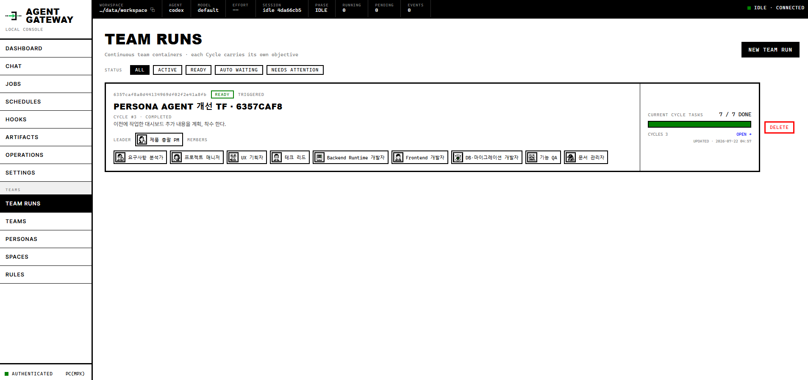
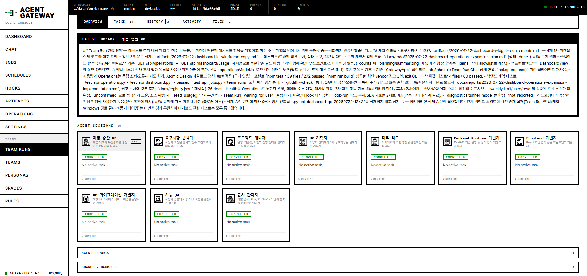
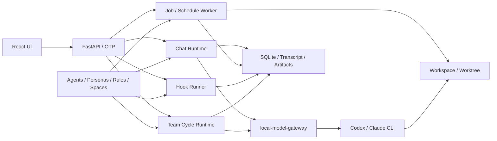

# Personal Agent Gateway

브라우저에서 내 로컬 머신의 Codex CLI 또는 Claude Code를 호출하고, 반복 자동화와 여러 역할의 협업까지 관리하는 개인용 웹 게이트웨이입니다.

모델 API key를 별도 서버에 저장하지 않고 **이미 로컬에 로그인된 agent CLI**와 workspace를 사용합니다. 대화, 실행 상태와 결과는 사용자 PC에 보존됩니다.

```text
Browser -> Cloudflare Tunnel -> Local FastAPI -> local-model-gateway (LMG) -> Codex CLI / Claude Code -> Local Workspace
```

> 로컬 CLI 실행·탐지는 별도 데몬 **[local-model-gateway](https://github.com/LeeLeeLeeee/local-model-gateway)(LMG)** 로 분리되어 있습니다. Gateway는 `LMG_BASE_URL`(기본 `http://127.0.0.1:8788`)로 LMG에 위임합니다.

## 화면 미리보기

Team Runs 목록에서는 실행 상태, 현재 Cycle, 역할별 Persona와 Task 진행률을 확인합니다.



상세 화면에서는 최신 요약, Persona별 session, 보고서, 사용자 결정과 repository 반영 상태를 확인합니다.



## 무엇을 할 수 있나

- **개인 실행**: Agent 또는 Persona 기반 Chat, session 기록과 실시간 event 확인
- **로컬 자동화**: 승인 가능한 Jobs, cron Schedules, IMAP·POP3 메일 Hooks와 Artifacts 관리
- **팀 협업**: Leader·Member Teams, AUTO·TRIGGERED Cycle, 역할별 Task, Agent Session 실시간 응답, Human in the loop
- **안전한 작업 반영**: Spaces 접근 정책, Git worktree 격리와 Repository Delivery. Worker는 Git HEAD를 바꿀 수 없고 commit은 모든 Worker가 끝난 뒤 Leader synthesis만 수행
- **운영 통제**: Dashboard 사용량, Operations health·emergency stop·backup, Settings와 audit

화면별 동작과 기능 연결은 [전체 기능 가이드](docs/knowledge/gateway-feature-guide.md)에서 확인할 수 있습니다.

## 구조 요약


```mermaid
flowchart LR
    UI[React UI] --> API[FastAPI / OTP]
    API --> Chat[Chat Runtime]
    API --> Jobs[Job / Schedule Worker]
    API --> Hooks[Hook Runner]
    API --> Team[Team Cycle Runtime]
    Policy[Agents / Personas / Rules / Spaces] --> Chat
    Policy --> Jobs
    Policy --> Hooks
    Policy --> Team
    Chat --> LMG[local-model-gateway]
    Team --> LMG
    LMG --> CLI[Codex / Claude CLI]
    Jobs --> WS[Workspace / Worktree]
    CLI --> WS
    Chat --> State[SQLite / Transcript / Artifacts]
    Jobs --> State
    Hooks --> State
    Team --> State
```

Chat, Job, Hook, Team Run은 각자의 실행 lifecycle을 소유해 중복 실행을 막습니다. 인증, agent catalog, 정책, 저장소와 Event Bus는 공통으로 재사용합니다.

상세한 책임 경계, background 복구와 저장 구조는 [아키텍처 가이드](docs/knowledge/gateway-architecture-guide.md)를 참고하세요.

## 문서

| 문서 | 내용 |
| --- | --- |
| [전체 기능 가이드](docs/knowledge/gateway-feature-guide.md) | 화면별 기능, Chat·Job·Hook·Team Run 연결 흐름 |
| [아키텍처 가이드](docs/knowledge/gateway-architecture-guide.md) | 실행 소유권, Frontend·Backend 구성, 저장 책임과 효율성 원칙 |
| [설치·운영 가이드](docs/knowledge/gateway-setup-guide.md) | 설치, OTP, `.env`, build, Cloudflare Tunnel, 테스트와 문제 해결 |
| [Persona & Team Run 가이드](docs/knowledge/persona-team-usage-guide.md) | Persona와 Team 구성 및 실행 예시 |
| [Operations 진단 가이드](docs/knowledge/2026-07-15-operations-diagnostics-guide.md) | health, emergency stop, backup과 장애 복구 |

## 빠른 시작

준비물:

- Python 3.11 이상
- Node.js 20 이상과 npm
- 로그인된 Codex CLI 또는 Claude Code

가상환경을 만들고 OS에 맞는 Python으로 Backend를 설치합니다.

```bash
python -m venv .venv
```

```powershell
# Windows
.\.venv\Scripts\python.exe -m pip install -e ".[dev]"
```

```bash
# macOS
./.venv/bin/python -m pip install -e ".[dev]"
```

Frontend dependency를 설치합니다.

```bash
npm --prefix frontend install
```

`.env.example`을 `.env`로 복사한 뒤 최소 항목을 설정합니다.

```bash
AGENT_WEB_HOST=127.0.0.1
AGENT_WEB_PORT=8787
AGENT_WORKSPACE_ROOT=/absolute/path/to/workspace
AGENT_MODEL_PROVIDER=codex
AGENT_MODEL=default
LMG_LOCAL_TOKEN=replace-with-a-long-random-value
```

LMG에도 동일한 `LMG_LOCAL_TOKEN`을 설정해야 합니다. macOS 런처는
`LMG_LOCAL_TOKEN`이 비어 있고 `PAG_LOCAL_TOKEN`이 있으면 그 값을 공유 토큰으로
사용합니다. Windows PowerShell 런처는 기존처럼 `LMG_LOCAL_TOKEN`을 사용합니다.
LMG에서 실행 경로를 제한하려면 OS path-list separator(macOS/Linux `:`, Windows `;`)로 `LMG_ALLOWED_ROOTS`를 지정합니다.

```bash
LMG_ALLOWED_ROOTS=/absolute/path/to/workspace:/another/allowed/root
```

LMG는 loopback(`127.0.0.1` 또는 `::1`)에서만 수신하고 `/livez`만 무인증으로 제공합니다. 공유 토큰은 브라우저와 우발적인 로컬 호출을 막지만 같은 사용자 권한의 악성 로컬 프로세스를 격리하지 않습니다. PAG가 보내는 `consumer`, `consumer_session_id`, `consumer_run_id`, `consumer_context_fingerprint`는 추적 정보이며 권한 판단에 사용되지 않습니다.

React UI를 build합니다.

```bash
npm --prefix frontend run build
```

Gateway를 실행합니다.

```powershell
# Frontend production build 후 PAG와 LMG 시작
npm start

# Frontend build 없이 PAG와 LMG 시작
npm run start:no-build

# Frontend production build만 실행
npm run build:frontend

# 런처가 기록한 두 프로세스만 안전하게 종료
npm stop

# PowerShell 스크립트를 직접 실행해도 동일합니다.
.\scripts\start_local_runtime.ps1
.\scripts\stop_local_runtime.ps1
```

루트 npm 명령은 Windows와 macOS에서 사용할 수 있습니다. Windows에서는 일반
PowerShell 또는 cmd에서 실행하세요.
`npm start`에서 Frontend build가 실패하면 PAG와 LMG는 시작되지 않습니다.

```bash
# macOS
npm start

# Frontend build 없이 PAG와 LMG 시작
npm run start:no-build

# 런처가 시작한 PAG와 LMG 종료
npm stop
```

> **Windows에서 Codex로 실행할 때**
>
> Codex가 시작한 장기 실행 프로세스는 Windows Job 수명주기를 상속해 명령이나
> 사용자 턴 종료와 함께 내려갈 수 있습니다. PAG와 LMG runtime은 Codex에서
> 시작하지 말고 일반 PowerShell에서 위 시작 스크립트를 직접 실행하세요.
>
> AI에게 시작을 요청한 경우 AI는 직접 실행하는 대신 현재 checkout에서 확인한
> `start_local_runtime.ps1`의 절대 경로와 복사 가능한 PowerShell 명령을
> 안내해야 합니다. 현재 checkout의 명령은 다음과 같습니다.
>
> ```powershell
> powershell.exe -NoProfile -ExecutionPolicy Bypass -File "C:\Users\Administrator\playground\personal-agent-gateway\scripts\start_local_runtime.ps1"
> ```

`http://127.0.0.1:8787`에서 최초 TOTP setup을 진행합니다. 외부 접속과 named tunnel 설정은 [설치·운영 가이드](docs/knowledge/gateway-setup-guide.md#외부-접속)를 따르세요.

## 보안 요약

- Gateway는 기본적으로 `127.0.0.1`에 bind합니다.
- 모든 데이터 API는 OTP session으로 보호합니다.
- 외부 접속은 HTTPS Tunnel과 secure cookie를 사용합니다.
- Tunnel hostname 자체를 인증 수단으로 사용하지 않습니다.
- Agent의 읽기·쓰기 경로는 Spaces 정책으로 제한합니다.
- token, CLI credential, TOTP 데이터와 비공개 Tunnel hostname은 commit하지 않습니다.

자세한 설정값과 점검 절차는 [설치·운영 가이드의 보안 기준](docs/knowledge/gateway-setup-guide.md#보안-기준)을 참고하세요.

## 개발과 테스트

```bash
pytest
ruff check .
npm --prefix frontend test -- --run
npm --prefix frontend run build
```

CLI model과 option 탐지는 LMG가 담당합니다. 탐지 결과는 실행 중인 LMG에서 확인합니다.

```bash
curl -H "Authorization: Bearer $LMG_LOCAL_TOKEN" http://127.0.0.1:8788/v1/models
```

### LMG run 종료 계약

PAG는 첫 유효 terminal을 권위 있는 종료로 받아들이고 즉시 response를 닫습니다.

| terminal | Chat `termination` | 허용되는 `error_code` |
| --- | --- | --- |
| `run.completed` | `completed` | 없음 |
| `run.failed` | `failed` | `provider_unavailable`, `provider_process_failed`, `provider_protocol_error` |
| `run.aborted` + `run_cancelled` | `cancelled` | `run_cancelled` |
| `run.aborted` + `run_timeout` | `timed_out` | `run_timeout` |

terminal 이전 EOF는 `upstream_stream_incomplete`로 처리합니다. terminal 이후 wire data는 소비하지 않으며, LMG가 terminal 뒤 이벤트를 보내지 않는 계약을 소유합니다. terminal 이전의 잘못된 JSON·shape·`run_id`는 `provider_protocol_error`입니다. 실패·중단의 `partial_content`는 transcript와 activity에 진단 정보로만 보존하며 정상 assistant 메시지나 성공 산출물로 노출하지 않습니다.

### Chat과 LMG 세션 수명주기

PAG는 실제 provider/model, Space 실행 정책, provider 옵션, Persona snapshot, rules가 합성된 system prompt를 canonical JSON으로 직렬화한 SHA-256 context fingerprint를 사용합니다. 같은 Chat이라도 이 컨텍스트가 달라지면 기존 upstream 세션을 resume하지 않습니다. 이전 `options_fingerprint` 형식의 link는 삭제 대상에는 포함하지만 안전한 컨텍스트 일치를 증명할 수 없어 resume에는 사용하지 않습니다.

`session.updated`를 받으면 terminal 결과보다 먼저 Chat transcript에 upstream link를 기록합니다. 따라서 그 뒤 `run.failed` 또는 `run.aborted`가 발생해도 다음 요청은 확인된 upstream ID를 이어갈 수 있습니다. Chat 삭제는 연결된 upstream 세션을 모두 순차적으로 삭제한 후 진행하며, 하나라도 실패하면 실패 ID를 포함한 502를 반환하고 Chat transcript와 activity를 보존합니다. 이미 없는 LMG 세션의 삭제는 성공으로 처리됩니다.

인증된 `GET /api/audit/session-consistency`는 PAG에 저장된 link와 LMG의 세션·전송 상관관계 메타데이터를 읽기 전용으로 비교해 `missing_in_lmg`, `unlinked_in_pag`, `context_mismatch`를 반환합니다. `context_mismatch`는 동일한 provider/upstream 세션에 저장된 PAG 세션 소유권 또는 fingerprint가 서로 다른 경우를 뜻하며, 현재 Chat 설정을 다시 계산해 비교하는 항목은 아닙니다. LMG가 응답하지 않거나 응답을 신뢰할 수 없으면 빈 차이 목록으로 바꾸지 않고 503을 반환합니다.

개발 서버 분리 실행과 Troubleshooting은 [설치·운영 가이드](docs/knowledge/gateway-setup-guide.md#개발-모드)를 참고하세요.

## 최근 변경 (2026-07)

- **로컬 실행 분리**: 로컬 CLI 실행/탐지/세션 관리를 [local-model-gateway](https://github.com/LeeLeeLeeee/local-model-gateway)(LMG)로 분리. Gateway는 HTTP+SSE로 위임(`LMG_BASE_URL`).
- **정규화 이벤트 이행**: 프런트가 LMG의 정규화 이벤트(`message.delta`/`reasoning.delta`/`tool.activity`/…)를 직접 소비 → Codex뿐 아니라 **Claude도 라이브 스트리밍 UI**를 표시. Codex의 턴당 여러 메시지는 각각 별도 버블로 렌더.
- **대시보드 로컬 세션 패널**: LMG가 관리하는 업스트림 세션 현황을 읽기 전용으로 표시.
- **Chat 진입 UX**: 앱 로드 시 빈 세션 대신 **가장 최근 대화 세션**을 엽니다(대화가 없을 때만 새 세션).
