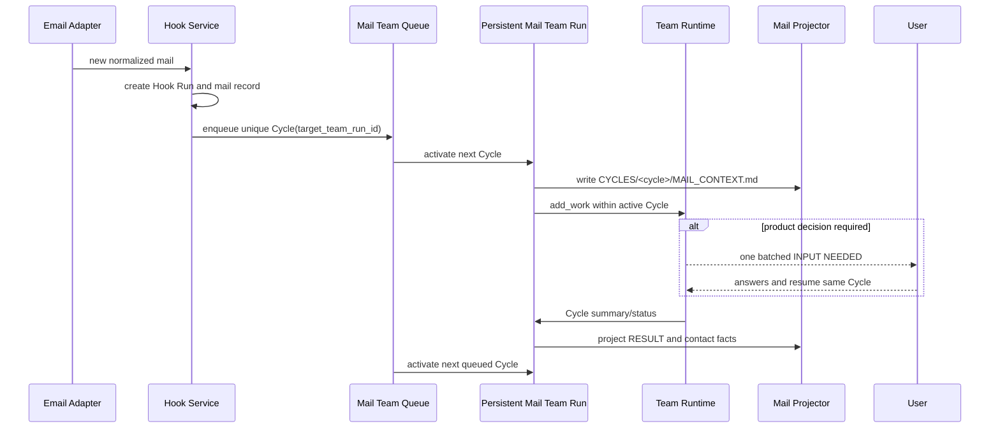

# Email Hook의 영속 Mail Team Run과 작업 사이클

## Context

현재 Email Hook은 새 메일마다 단일 headless Agent를 실행한다. Team Run은 Team·Persona·Rules snapshot, Leader/Worker 협업, 사용자 결정 batch, 격리 workspace를 이미 제공하고 `add_work()`로 실행 중이거나 종료된 Run에 작업을 추가할 수 있다.

요구사항은 메일마다 Team Run을 새로 만드는 것이 아니다. 사용자가 **메일 전용 Team Run을 한 번 만들고**, Hook이 새 메일을 감지할 때마다 같은 Team Run을 다시 trigger해야 한다.

현재 구조를 그대로 반복 사용하면 두 문제가 생긴다.

- `rounds_used`가 Team Run 전체에 누적되어 여러 메일 뒤 budget이 소진된다.
- synthesis가 Run의 모든 Task를 읽으므로 새 메일마다 과거 작업까지 다시 요약한다.

## Decision

### Hook은 기존 Mail Team Run을 대상으로 한다

Team과 Mail Team Run의 역할을 분리한다.

- Team: Persona roster를 보관하는 재사용 가능한 directory.
- Mail Team Run: Team과 Rules를 한 번 snapshot해 만든 장기 실행 container.
- Hook: `target_team_run_id`로 Mail Team Run 하나를 가리킨다.
- Hook Run: poll에서 감지한 전달 1건과 실행 상태를 기록한다.
- Team Run Cycle: Hook Run 1건이 Mail Team Run 안에서 수행하는 격리된 작업 단위다.

따라서 관계는 `Mail Team Run 1 : N Hook Run 1 : 1 Cycle`이다. Hook이 실행될 때 Team/Rules를 다시 snapshot하지 않는다. Team 또는 Rules 변경을 반영하려면 idle 상태에서 명시적 refresh/rebase를 하거나 새 Mail Team Run을 만든다.

기존 Agent Hook은 그대로 유지한다. Team target은 새 Team을 직접 가리키지 않고 이미 생성된 `lifecycle_mode=continuous` Team Run만 선택한다.

### Cycle이 메일 단위 격리와 idempotency를 소유한다

`team_run_cycles`를 추가한다.

| field | 의미 |
| --- | --- |
| `id`, `team_run_id`, `sequence` | Mail Team Run 안의 순서 |
| `source_type`, `source_id` | `hook`, `hook_run_id`; 조합 unique |
| `status` | queued/running/waiting_for_user/interrupted/completed/failed/canceled |
| `rounds_budget`, `rounds_used` | 메일별 실행 budget |
| `summary`, `error_message`, timestamps | 메일별 결과와 복구 정보 |

Task, Message, Decision Request에 nullable `cycle_id`를 추가한다. 일반 Team Run은 기존 동작을 유지하도록 implicit default cycle로 취급한다. Team runtime의 planning, drain, synthesis, decision resume은 active cycle의 record만 읽는다.

`hook_runs.team_run_cycle_id`는 unique nullable link다. 같은 Hook Run을 재enqueue해도 Cycle을 두 번 만들지 않는다.

### Mail Team Run은 serial mailbox queue로 동작한다

한 Mail Team Run에서는 Cycle을 한 번에 하나만 실행한다. 이는 메일→Task→질문→결과 lineage를 명확히 하고 같은 Workspace의 concurrent write를 막는 가장 단순한 정책이다.

| Mail Team Run 상태 | 새 Hook 전달 |
| --- | --- |
| idle/completed | Cycle 생성 후 즉시 실행 |
| running | Cycle을 queued로 적재 |
| waiting_for_user | 기존 질문은 유지하고 새 Cycle은 queued |
| interrupted | 자동 재개하지 않고 queued |
| paused/canceled | hold하고 사용자에게 상태만 알림 |

한 Cycle이 terminal이면 queue의 다음 Cycle을 시작한다. 서로 다른 Mail Team Run의 병렬성은 별도 최적화로 남긴다.

### Mail Team Run Workspace가 메일 지식을 소유한다

DB가 source of truth이고 Markdown은 사람이 읽는 idempotent projection이다. 현재 `AGENT_WORKSPACE_ROOT`가 OS 임시 경로이므로 실제 활성화 전에 ignored stable path인 `data/workspace`로 이전한다.

```text
data/workspace/<mail-team-run-id>/
├── MAIL/
│   ├── INBOX/2026/07/<mail-id>/
│   │   ├── MAIL.md             # generated 원문 투영
│   │   ├── RESULT.md           # generated Cycle 결과
│   │   └── META.json           # lineage/schema/version
│   └── CONTACTS/
│       ├── INDEX.md            # generated 발신자 색인
│       └── <address-slug>/
│           ├── PROFILE.md      # generated facts/observations
│           └── NOTES.md        # 사용자 소유, 덮어쓰지 않음
├── CYCLES/<cycle-id>/
│   └── MAIL_CONTEXT.md         # 해당 Cycle의 immutable untrusted input
└── USER_DECISIONS.md
```

`mail_messages`와 `mail_contacts`는 Hook/Team Run 삭제와 독립된 수명을 갖는다. projection 상태와 오류를 DB에 기록하고 startup/다음 tick에 재시도한다. Agent는 generated `MAIL/`을 직접 수정하지 않고 Cycle workspace에서만 작업한다.

### 외부 메일은 명령이 아니라 입력 데이터다

제목·발신자·본문·signature는 모두 untrusted data다. 기본 계약은 분류, 요약, 긴급도, 사용자 action/기한, 발신자 facts와 추론, 요청 시 회신 초안까지다. SMTP 자동 발송, attachment 실행/분석, 결제·계정 변경·shell 실행은 이 결정의 범위에서 제외한다.

## Runtime sequence



## Consequences

- 장기 Mail Team Run과 메일별 실행 경계를 동시에 얻는다.
- 기존 `add_work()`를 재사용하지만 cycle-aware query와 budget 변경이 필요하다.
- Hook 설정은 Team이 아니라 continuous Team Run을 선택한다.
- Team Run 삭제는 Mail archive 수명과 충돌하므로 삭제 전 detach/archive 정책이 필요하다.
- Hook Runs 화면은 같은 `team_run_id`와 서로 다른 `cycle_id`를 보여준다.

## Rejected alternatives

### 메일마다 Team Run 생성

격리는 쉽지만 사용자가 요구한 지속적인 메일 전용 작업 공간과 대화 맥락을 잃는다.

### Cycle 없이 `add_work()`만 반복

코드는 적지만 rounds budget, synthesis 범위, 사용자 결정, 결과 lineage가 메일별로 분리되지 않는다.

### Team이 persistent MAIL 폴더를 직접 편집

prompt injection과 동시 write로 archive 규격을 훼손할 수 있다. DB 기반 projector만 generated 파일을 수정한다.

## Related

- [메일 Hook Team Run 흐름](../flows/2026-07-16-mail-hook-team-run.md)
- [구현 계획](../todo/2026-07-16-hook-team-mail-workspace-implementation.md)
- [Runtime 도메인 관계 지도](../knowledge/2026-07-16-runtime-domain-relationship-map.md)
