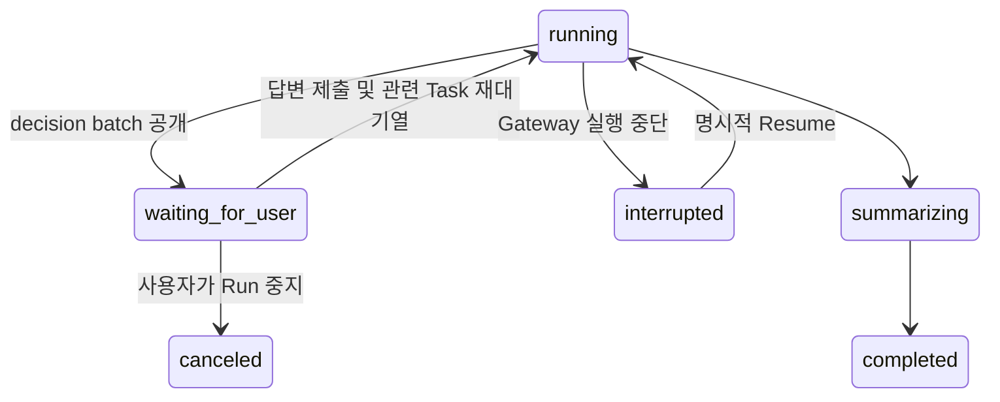
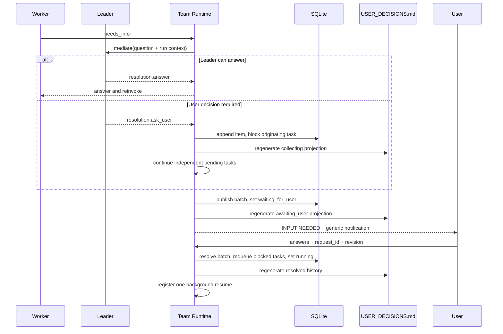

# Team Run Leader의 배치형 사용자 결정 요청

## Context

현재 Team Run의 `needs_info`는 Worker가 Leader에게 질문하고 Leader가 답하는 내부 협업 계약이다. Leader가 답할 수 없는 질문을 사용자에게 전달하는 상태, 저장소, API는 없다. `interrupted`는 Gateway 프로세스 중단 뒤 명시적으로 재개하는 복구 상태이므로 사용자 답변 대기에 재사용할 수 없다.

사용자는 Worker의 질문을 하나씩 받기보다 Leader가 미해결 질문을 모으고, 독립적으로 진행할 수 있는 작업을 계속한 다음 실제 결정이 필요한 시점에 한 번에 답하기를 원한다.

이 결정은 명령 실행 권한이나 보안 승인과 별개다. 제품 요구사항, 선택지, 누락 입력을 사용자가 결정하는 흐름만 다룬다.

## Assumptions and success criteria

- 사용자는 workspace 파일을 직접 편집하지 않고 Team Run 화면에서 답한다.
- `USER_DECISIONS.md`는 사용자와 Agent가 함께 읽는 기록이며, 상태 전이의 source of truth는 SQLite다.
- 한 질문이 일부 Task만 막으면 다른 pending Task는 계속 실행한다.
- 더 실행할 Task가 없거나 Leader가 Run 전체를 막는 결정이라고 명시한 경우에만 사용자에게 묶음 요청을 공개한다.
- 유효한 답변 한 번으로 관련 Task가 재대기열에 들어가고 Run이 정확히 한 번 재개된다.
- 프로세스를 재시작해도 사용자 대기 상태와 질문이 보존되며 자동 실행되지 않는다.

## Decision

### 1. 내부 질문과 사용자 결정을 분리한다

Worker의 기존 `needs_info` 출력은 유지한다. Leader mediation 결과만 다음 두 종류의 구조화 응답으로 확장한다.

```json
{
  "resolution": {
    "kind": "answer",
    "answer": "Leader가 제공하는 작업 지시"
  }
}
```

```json
{
  "resolution": {
    "kind": "ask_user",
    "topic": "배포 대상",
    "question": "staging과 production 중 어디에 반영할까요?",
    "why_needed": "대상에 따라 설정과 검증 절차가 달라집니다.",
    "options": [
      {"id": "staging", "label": "Staging", "impact": "안전하게 먼저 검증합니다."},
      {"id": "production", "label": "Production", "impact": "즉시 실제 사용자에게 반영됩니다."}
    ],
    "recommended_option_id": "staging",
    "blocking_scope": "task"
  }
}
```

Leader는 goal, Team rules, 이전 사용자 답변, 완료된 Task 결과로 답할 수 있을 때 `answer`를 선택한다. 취향 차이이고 안전한 기본값이 있거나 결과 정확도에 영향이 없는 질문은 사용자에게 올리지 않는다.

### 2. 질문을 active batch에 누적한다

새 `team_decision_requests` 테이블이 batch lifecycle을 소유한다. 한 Run에는 최대 하나의 active request만 존재한다.

| 필드 | 의미 |
| --- | --- |
| `id`, `team_run_id` | request 식별자와 소속 Run |
| `status` | `collecting`, `awaiting_user`, `resolved`, `canceled` |
| `revision` | stale answer를 거부하기 위한 단조 증가 버전 |
| `items_json` | 안정적인 question ID, 질문, 선택지, 추천, 차단 Task ID 목록 |
| `answers_json` | 사용자가 제출한 답변 |
| `file_path` | Run workspace 기준 `USER_DECISIONS.md` |
| timestamps | 생성, 공개, 답변 시각 |

별도 question 테이블은 만들지 않는다. 질문을 독립 검색하거나 부분 승인하는 요구가 없으므로 batch 단위 JSON이 더 작고 현재 사용에 충분하다.

`ask_user`가 나오면 Runtime은 질문에 `Q-001` 같은 batch 내 ID를 부여하고 active request에 추가한다. 해당 Worker Task는 `blocked`로 바꾸고 Agent는 `waiting`으로 돌린 뒤 다음 pending Task를 실행한다. 동일 topic과 실질적으로 같은 질문은 Leader가 하나로 합치고 `blocking_task_ids`만 추가한다.

### 3. 명확한 gate에서만 사용자에게 요청한다

active request는 다음 중 하나일 때 `collecting`에서 `awaiting_user`로 전환한다.

1. pending 또는 in-progress Task가 없고 blocked Task만 남았다.
2. 최종 synthesis 전에 아직 open question이 있다.
3. Leader가 `blocking_scope: run`으로 분류했고, 답 없이 남은 Task를 수행하면 잘못된 외부 결과나 대규모 재작업이 발생한다.

단순한 질문 개수나 타이머만으로는 공개하지 않는다. 이 규칙은 질문을 충분히 묶으면서도 Run이 무기한 조용히 멈추는 것을 막는다.

### 4. `waiting_for_user`를 별도 Run 상태로 둔다

사용자 요청을 공개하면 Run은 `waiting_for_user`가 되고 현재 background runtime은 정상 종료한다. 이는 terminal도 process interruption도 아니다.



- startup normalization은 `waiting_for_user`를 `interrupted`로 바꾸지 않는다.
- 기존 `/resume`은 계속 `interrupted`에서만 허용한다.
- 사용자 답변 제출 자체가 재개 의사이므로 별도 Resume 버튼을 요구하지 않는다.
- `waiting_for_user`에서는 Cancel은 허용하고 Add work, Retry, 일반 Resume은 거부한다.

### 5. 파일은 사람이 읽는 투영본으로 생성한다

Leader-owned workspace 파일은 Run root의 `USER_DECISIONS.md` 하나만 사용한다. Worker는 이 파일을 직접 수정하지 않는다. 질문을 수집하거나 답변을 받을 때마다 DB transaction 이후 파일을 원자적으로 다시 생성한다.

```markdown
---
schema: gateway.team-decisions/v1
team_run_id: <run-id>
active_request_id: <request-id>
revision: 3
status: awaiting_user
generated_at: 2026-07-16T12:00:00Z
---

# User decisions

Team Run 화면의 INPUT NEEDED에서 답변하세요. 이 파일은 자동 생성됩니다.

## Q-001 — 배포 대상

- Status: open
- Blocks: task-3, task-5
- Why now: 대상에 따라 설정과 검증 절차가 달라집니다.
- Recommended: Staging

### Options

- `staging` — 안전하게 먼저 검증합니다.
- `production` — 즉시 실제 사용자에게 반영됩니다.

### Answer

Pending
```

파일을 source of truth로 삼지 않는 이유는 자유 형식 편집, 반쯤 저장된 답변, stale 제출, 재시작 시 상태 불일치를 Markdown만으로 안전하게 처리하기 어렵기 때문이다. 사용자가 파일을 직접 수정한 내용은 MVP에서 입력으로 해석하지 않는다.

### 6. 한 번의 제출로 답변하고 재개한다

Team Run detail은 active decision request를 함께 반환하고 `waiting_for_user`일 때 상단에 `INPUT NEEDED` panel을 표시한다. 각 질문은 이유, 영향, 선택지, Leader 추천, 자유 입력을 보여 준다. 모든 open question에 답해야 `ANSWER & RESUME`을 누를 수 있다.

API 계약은 다음과 같다.

- `GET /api/team-runs/{run_id}/decision-request`: 현재 active request 조회
- `POST /api/team-runs/{run_id}/decision-request/answer`: `request_id`, `revision`, question별 answers 제출

답변 endpoint는 한 DB transaction에서 다음 상태를 검증하고 반영한다.

1. Run이 `waiting_for_user`이고 request가 `awaiting_user`인지 확인한다.
2. `request_id`와 `revision`이 현재 값인지 확인한다. 다르면 `409`를 반환한다.
3. 모든 open question의 답변을 저장하고 request를 `resolved`로 바꾼다.
4. `blocking_task_ids`의 `blocked` Task만 `pending`으로 바꾼다.
5. `user_decision_answer` message를 남기고 Run을 `running`으로 바꾼다.

commit 뒤에는 `USER_DECISIONS.md`를 다시 생성하고 registry에 background resume을 정확히 한 번 등록한다. 파일 생성이 실패해도 DB의 답변과 실행 상태는 되돌리지 않고 `document_projection_error` message로 복구 가능하게 남긴다. registry 등록 전에 process가 종료되면 기존 startup interruption 계약이 `running` Run을 `interrupted`로 바꾸므로 작업이 유실되지 않는다.

부분 답변은 MVP에서 지원하지 않는다. 답을 모아 한 번 재개한다는 사용자 계약과 상태 전이를 단순하게 유지하기 위해서다.

### 7. 이벤트와 알림은 내용을 노출하지 않는다

request 공개 시 `team.run.input_requested`, 답변 후 `team.run.input_resolved` SSE를 발행한다. 기존 Browser Notification을 켠 열린 탭에서는 `Team run needs input. Open Gateway to respond.` 같은 generic 문구만 표시한다. 질문, 선택지, 답변, path, visible Run ID는 notification에 넣지 않는다.

## Runtime sequence



## Security and privacy boundaries

- 비밀번호, token, recovery code, private key는 질문이나 답변 파일에 기록하지 않는다.
- Leader가 secret을 요구해야 한다고 판단하면 secret 값 대신 기존 secure setting 위치와 필요한 설정 이름을 안내한다.
- question/answer 전문은 authenticated Team Run detail과 local workspace에만 존재한다.
- audit log에는 request ID, question count, revision, 상태 전이만 남기고 내용은 남기지 않는다.
- 이 기능은 shell/tool permission prompt를 대체하거나 우회하지 않는다.

## Alternatives

### Worker가 사용자에게 즉시 질문

구현은 작지만 질문 폭주와 맥락 분산을 만들고 Leader의 조정 책임을 우회한다.

### Markdown 파일만 source of truth로 사용

사용자가 직접 편집하기는 쉽지만 concurrent write, schema 오류, stale answer, 원자적 resume을 안전하게 다루기 어렵다.

### 기존 `interrupted` 상태 재사용

상태 수는 늘지 않지만 프로세스 장애 복구와 제품 입력 대기가 섞여 startup normalization과 Resume 의미가 깨진다.

### 질문마다 별도 DB row와 부분 답변 지원

검색과 세밀한 재개에는 유리하지만 현재 요구에는 lifecycle과 UI가 과도하게 복잡하다. batch JSON과 전체 제출로 시작한다.

## Consequences

- Run 상태, DB schema, runtime mediation parser, API, detail UI, SSE/notification 계약이 함께 변경돼야 한다.
- 질문이 있는 Task는 실패하지 않고 `blocked`로 보이며 사용자는 한 번에 답할 수 있다.
- 사용자가 답하지 않으면 Run은 자원을 점유하지 않은 채 `waiting_for_user`에 남는다.
- 직접 파일 편집은 지원하지 않지만 모든 요청과 답변 이력이 workspace 문서에 남는다.
- batch 내 모든 질문에 답해야 하므로 아주 긴 batch는 부담이 될 수 있다. 실제 사용에서 문제가 확인될 때만 partial submit을 검토한다.

## Verification contract

- Leader가 내부적으로 답할 수 있는 `needs_info`는 사용자 request를 만들지 않는다.
- 여러 Task에서 발생한 unresolved 질문은 하나의 active request에 누적된다.
- blocked Task가 있어도 독립 pending Task는 계속 실행된다.
- runnable Task가 소진되면 background runtime이 종료되고 Run은 `waiting_for_user`가 된다.
- DB request와 `USER_DECISIONS.md`의 ID, revision, status, 질문 수가 일치한다.
- stale 또는 중복 제출은 `409`이며 resume이 두 번 등록되지 않는다.
- 유효한 제출은 관련 blocked Task만 pending으로 바꾸고 Run을 재개한다.
- Gateway 재시작 뒤에도 waiting request가 유지되고 자동 재개되지 않는다.
- waiting 상태의 Cancel은 성공하고 Add work, Retry, Resume은 거부된다.
- notification에는 질문·답변·결과·경로·visible Run ID가 없다.

## Implementation boundaries

예상 변경 지점은 `teams.py`의 상태와 persistence, `team_runtime.py`의 mediation/drain loop, `api/team_runs.py`의 request endpoint와 payload, frontend API/controller, `TeamRunDetail`, browser notification handler 및 관련 backend/frontend test다. 다른 Run mode, security approval, 외부 webhook, 부분 답변, 직접 파일 편집은 이번 범위에 포함하지 않는다.

## Implementation evidence

- migration 5와 `team_decision_requests` persistence, `waiting_for_user` 상태가 추가됐다.
- Runtime은 Leader의 `answer | ask_user` resolution을 구분하고 task-scoped 질문을 drain 시점까지 batch로 누적한다.
- versioned answer API는 stale·중복 제출을 `409`로 막고 관련 blocked Task만 재대기열에 넣는다.
- `USER_DECISIONS.md`는 DB record에서 원자적으로 다시 생성된다.
- `TeamRunDetail`의 `INPUT NEEDED` panel은 모든 질문을 한 번에 제출하고 자동 재개한다.
- backend Team Run 회귀 73개와 frontend 222개, production build가 통과했다.
- 자세한 변경과 검증은 [Team Run 배치형 사용자 결정 구현 보고서](../reports/2026-07-16-team-run-user-decisions-implementation.md)에 기록했다.

## Related

- [Team Run 사용자 결정 요청 흐름](../flows/2026-07-16-team-run-user-decision-request.md)
- [Team collaboration and reliability design](../superpowers/specs/2026-07-10-team-collaboration-and-reliability-design.md)
- [Team Run interruption recovery design](../superpowers/specs/2026-07-14-team-run-interruption-recovery-design.md)
- [Browser Notification privacy 경계](2026-07-16-browser-notification-privacy.md)
