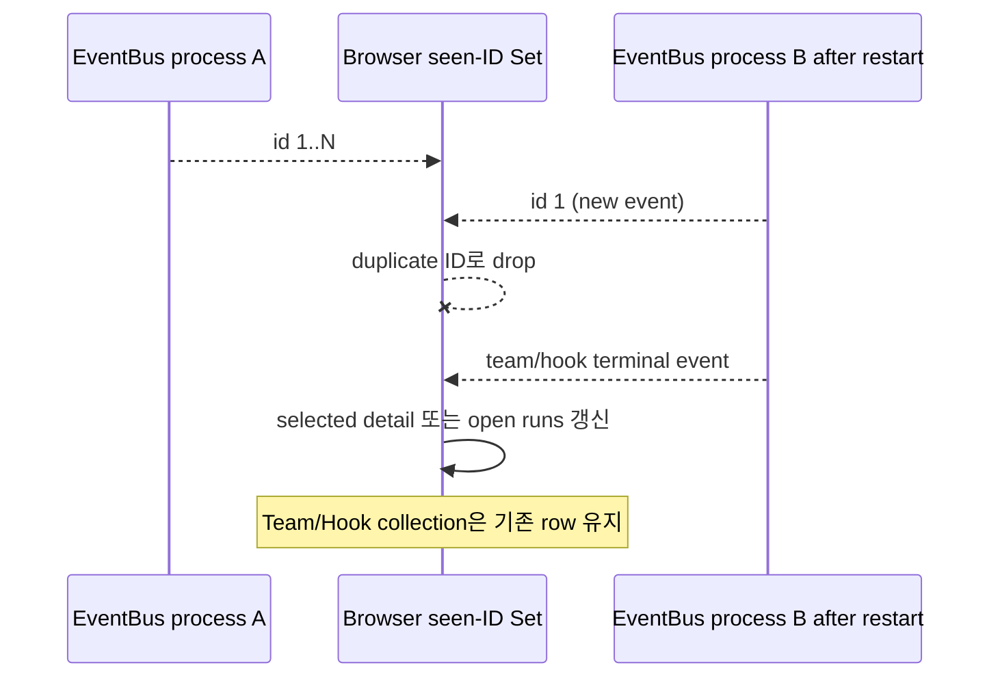

# API·SSE·UI 상태 정합성 구조 리뷰

## Decision question

현재 SSE delta + 선택 화면 재조회 방식을 유지하면서 event identity와 collection 갱신만
보완할지, 전역 client cache/state layer로 재설계할지 결정한다.

## Confirmed facts

- `src/personal_agent_gateway/events.py:7-13`은 process memory에서 event ID를 1부터
  증가시키며 restart 시 새 EventBus가 다시 1부터 시작한다.
- `src/personal_agent_gateway/api/chat_sessions.py:168-179,510-524`은 Last-Event-ID
  이후 최대 200개 memory history를 replay하고 SSE event에 ID를 붙인다.
- `frontend/src/hooks/useSessionController.js:94-118`은 한 EventSource lifetime을 넘어
  유지되는 `seenSseEventIdsRef` Set으로 숫자 ID만 dedup하며 Set을 비우거나 제한하지 않는다.
- `frontend/src/hooks/useTeamRunController.js:59-78`은 선택한 Team Run detail/documents를
  갱신하지만 `teamRuns` collection은 event에서 갱신하지 않는다.
- `frontend/src/components/containers/GatewayApp/index.jsx:161-176`은 Hook terminal
  event에서 toast/badge와 열린 run 목록만 갱신하고 Hook collection은 갱신하지 않는다.
- `GatewayApp.test.jsx:1093-1167`은 Team event 후 detail task는 보이지만 목록으로
  돌아갔을 때 새 Run이 보이지 않는 현재 behavior를 포함한다.

## Interpretation

- Event ID는 process-local인데 client가 global identity처럼 취급한다. 서버가 재시작해
  ID를 재사용하면 브라우저가 기존 Set에 있는 ID의 새 event를 drop할 수 있다.
- 선택된 detail은 terminal event에서 authoritative API를 다시 읽어 비교적 안전하지만,
  list/card/badge는 별도 state라 같은 domain의 최신 상태를 공유하지 않는다.
- 전체 전역 store보다 stream epoch와 domain별 collection reconciliation을 추가하는
  로컬 변경이 현재 state 구조에 적합하다.

## Unknowns

- 사용자가 브라우저 탭을 며칠 이상 유지하는지, 서버 restart 중 열린 탭이 얼마나
  흔한지 telemetry가 없다.
- Team/Hook collection 크기와 event 빈도가 없어 매 event refetch 비용을 측정하지 않았다.
- SSE를 다중 Gateway process에서 제공할 계획은 확인되지 않았다.

## Options

### F-01 · SSE event identity를 process restart에 안전하게 만들 것인가

**Decision question**

- client dedup 키를 숫자 ID만 사용할지 stream instance identity와 결합할지 결정한다.

**Confirmed facts**

- EventBus `_next_id`는 constructor에서 1이다.
- frontend `seenSseEventIdsRef`는 event ID 문자열만 저장하고 reset/prune하지 않는다.
- native EventSource는 reconnect 시 같은 React state와 ref를 유지한다.

**Interpretation**

- server restart 후 새 ID가 이전 ID와 겹치는 동안 Team, Hook, Chat event가 client에서
  조용히 무시될 수 있고 Set도 장기적으로 증가한다.

**Unknowns**

- reverse proxy가 SSE connection을 얼마나 자주 재연결하는지 알 수 없다.

**Options**

| Option | Benefit | Cost | Risk | Applicable when |
| --- | --- | --- | --- | --- |
| `O-01/A` client dedup 제거 | restart ID 충돌이 사라지고 코드가 단순해진다 | replay duplicate가 UI에 다시 적용될 수 있다 | 비멱등 toast/notification 중복 | 모든 handler가 멱등일 때 |
| `O-01/B` stream epoch + bounded ID window | restart를 구분하고 duplicate replay를 제한한다 | event payload와 client key, tests 변경 | epoch 누락 event 처리 규칙이 필요하다 | 단일 process memory bus를 유지할 때 |
| `O-01/C` 영속 global sequence | process 간 단조 ID를 보장한다 | DB write 또는 external broker가 필요하다 | event path가 persistence에 결합된다 | multi-process durable stream이 필요할 때 |

**Recommendation**

- `O-01/B`를 권고한다. process boot UUID를 `stream_id`로 포함하고 client는
  `(stream_id,id)`의 bounded window만 보관한다.
- 반론: dedup을 제거하면 가장 작다. 그러나 notification과 toast는 비멱등이므로
  replay duplicate가 사용자에게 반복 동작을 만들 수 있다.
- Reversal conditions: 모든 event consumer가 명시적으로 멱등이 되고 notification
  dedup을 domain key로 완전히 분리하면 `O-01/A`가 더 단순하다.

### F-02 · Detail과 collection 상태를 어떻게 동기화할 것인가

**Decision question**

- domain event가 선택 detail뿐 아니라 Team/Hook collection도 갱신하게 할지 결정한다.

**Confirmed facts**

- Team handler는 selected ID가 아니면 즉시 return한다.
- terminal/input event는 selected detail/documents만 refetch한다.
- Hook handler는 `hooks` state를 refetch하지 않는다.
- create/retry/resume 같은 사용자 action에서는 명시적으로 list를 refetch한다.

**Interpretation**

- background event로 바뀐 status, last_polled_at, last_error는 list/card에서 다음 수동
  load까지 stale일 수 있다.

**Unknowns**

- 목록 stale이 실제 의사결정 실패로 이어졌는지 사용자 관찰 근거는 없다.

**Options**

| Option | Benefit | Cost | Risk | Applicable when |
| --- | --- | --- | --- | --- |
| `O-02/A` 선택 detail만 유지 | 네트워크 호출과 state 변경이 작다 | stale 목록을 허용·설명해야 한다 | card/status가 실제 실행과 다르다 | 목록이 navigation 용도뿐일 때 |
| `O-02/B` domain별 collection reconciliation | terminal/status event에서 row delta 또는 throttled refetch로 목록을 맞춘다 | handler와 tests가 늘어난다 | event burst 시 과도한 fetch | 현재 local React state를 유지할 때 |
| `O-02/C` 전역 normalized cache | detail/list가 같은 entity state를 공유한다 | 도입·migration 범위가 크다 | 단순 앱에 cache framework가 과하다 | 여러 화면이 같은 entity를 자주 편집할 때 |

**Recommendation**

- `O-02/B`를 권고한다. Team terminal/input과 Hook updated에서 collection row를
  event delta로 갱신하거나 짧게 throttle한 refetch를 수행한다.
- Reversal conditions: entity consumer와 optimistic mutation이 더 늘어 local
  reconciliation이 세 곳 이상 반복되면 `O-02/C`를 검토한다.

## Recommendation

- EventBus와 단일 EventSource 구조는 유지한다.
- stream epoch + bounded dedup을 추가하고, Team/Hook collection을 domain event에서
  로컬 reconciliation한다.
- 전역 client cache와 durable broker는 현재 요구에서 보류한다.

## Reversal conditions

- Gateway가 multi-process가 되거나 event replay가 재시작을 넘어 보장되어야 한다.
- 같은 entity를 수정하는 독립 화면이 늘어 collection/detail reconciliation이 반복된다.
- 실제 event rate에서 refetch가 성능 문제로 측정된다.

## Scope and excluded boundaries

- 포함: EventBus/SSE endpoint, useSessionController, Team controller, Hook handler와 테스트.
- 제외: Browser Notification privacy 내용, runtime state transition 자체, API pagination.

## Feature behavior and code paths

- `B-01` SSE 연결: EventSource → `/api/events` → EventBus subscriber/history.
- `B-02` event dedup: parsed event ID → seen Set → domain dispatcher.
- `B-03` Team UI: event → selected detail delta/refetch → list/detail rendering.
- `B-04` Hook UI: event → toast/badge/open runs refresh.

Trace:

- `B-01`, `B-02` → `F-01` → `O-01/B` → `CR-01`
- `B-03`, `B-04` → `F-02` → `O-02/B` → `CR-02`

## Current diagrams

Decision question: 서버 재시작과 domain event 이후 어떤 client state가 stale/drop될 수 있는가?



## Evidence inventory

- `src/personal_agent_gateway/events.py`
- `src/personal_agent_gateway/api/chat_sessions.py`
- `frontend/src/hooks/useSessionController.js`
- `frontend/src/hooks/useTeamRunController.js`
- `frontend/src/components/containers/GatewayApp/index.jsx`
- `frontend/src/components/containers/GatewayApp/GatewayApp.test.jsx`
- `frontend/src/lib/browserNotification.js`

## Analysis limits and next questions

- 실제 SSE reconnect/event rate를 계측하지 않았다.
- browser background throttling과 proxy buffering 환경을 재현하지 않았다.
- multi-tab 간 notification dedup은 현재 page lifetime 계약이라 범위에서 제외했다.

## Review result

reviewer: self-review-fallback

```text
VERDICT: PASS

FINDINGS:
- [minor] self-review — multi-process durable stream은 요구가 없어 옵션으로만 유지함 — fix: none
```
