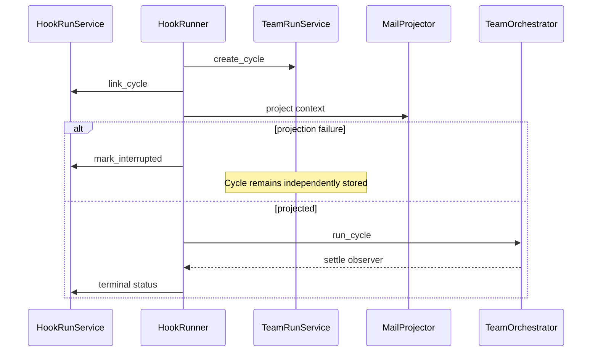

# 실행 lifecycle과 취소 구조 리뷰

## Decision question

현재 단일 queue/task 실행 모델을 유지하면서 노출 계약과 복구 정합성만 보완할지,
worker pool 또는 통합 실행 상태 머신으로 재설계할지 결정한다.

## Confirmed facts

- `src/personal_agent_gateway/config.py:71,211`은 `job_worker_concurrency`를
  설정으로 받고 Settings API가 이를 반환한다.
- `src/personal_agent_gateway/job_worker.py:20-35`은 Queue 하나와 background task
  하나만 만들며 concurrency 값을 입력받지 않는다.
- `src/personal_agent_gateway/app.py:361-378`은 JobWorker를 한 번 생성하고
  `job_worker_concurrency`를 전달하지 않는다.
- `src/personal_agent_gateway/hook_runner.py:105-158`은 Hook Run과 Team Run Cycle을
  순서대로 생성·연결한 뒤 projection과 Team Runtime을 실행한다.
- `src/personal_agent_gateway/hook_runner.py:226-233`은 Cycle link가 있는 중간 실패에서
  Hook Run만 `interrupted`로 바꾼다.
- `src/personal_agent_gateway/hook_runs.py:153-163`의 startup recovery도 Hook Run
  상태만 복구하며 Cycle 상태를 함께 조정하지 않는다.

## Interpretation

- JobWorker는 실제로 단일 consumer이며, 설정과 UI가 두 번째 concurrency variant가
  존재하는 것처럼 보이게 한다.
- Team Hook lifecycle은 HookRunService와 TeamRunService에 걸쳐 있으나 실패 전이를
  한 coordinator가 원자적으로 소유하지 않아 Cycle 생성 후 실행 전 실패 같은 경계에서
  상태 drift가 가능하다.
- 전체 실행기를 하나의 공통 상태 머신으로 합칠 필요는 없다. Job, Hook, Team은
  승인·dedup·사용자 결정 등 terminal 의미가 다르다.

## Unknowns

- 실제 Job queue 대기 시간이 worker pool을 정당화할 만큼 큰지 측정되지 않았다.
- 한 Workspace에 여러 Job이 동시에 쓰는 것이 안전한지 capability별 격리 계약이 없다.
- interrupted Hook/Cycle을 자동 재개할지 사용자 확인을 요구할지 운영 정책이 없다.

## Options

### F-01 · `job_worker_concurrency` 계약을 유지할 것인가

**Decision question**

- 설정을 실제 worker pool로 구현할지, 지원되는 값 1로 축소할지 결정한다.

**Confirmed facts**

- `tests/test_config_auth.py:122`은 환경값 2가 config에 저장되는 것을 검증한다.
- `src/personal_agent_gateway/job_worker.py:35`은 `asyncio.create_task`를 한 번만
  호출해 consumer 하나를 실행한다.
- `src/personal_agent_gateway/api/settings.py:96`은 config 값을 사용자에게 노출한다.

**Interpretation**

- 값 2는 실행 병렬성을 바꾸지 않으므로 설정 계약과 effective behavior가 다르다.

**Unknowns**

- 병렬 Job 요구와 capability별 write isolation이 확인되지 않았다.

**Options**

| Option | Benefit | Cost | Risk | Applicable when |
| --- | --- | --- | --- | --- |
| `O-01/A` 현재 유지 | 코드 변경이 없다 | 문서에서 effective=1을 설명해야 한다 | 사용자가 설정을 신뢰할 수 없다 | 설정이 내부 예약 필드인 경우 |
| `O-01/B` 값 1로 계약 축소 | 실제 동작과 config/UI가 일치한다 | 기존 2 설정을 validation/migration해야 한다 | 미래 pool 구현 시 다시 확장한다 | 병렬 요구와 격리가 없는 현재 |
| `O-01/C` worker pool 구현 | queue 처리량을 높인다 | N task, stop, artifact 충돌, 테스트가 늘어난다 | 동일 workspace 동시 write가 생긴다 | 측정된 대기와 격리 계약이 있을 때 |

**Recommendation**

- `O-01/B`를 권고한다. 현재 실제 variant는 하나이며 병렬 안전 근거가 없다.
- 반론: config가 이미 있으므로 pool 구현이 자연스럽다. 그러나 설정 존재 자체는
  capability write isolation과 취소 semantics를 증명하지 않는다.
- Reversal conditions: 독립 Job 대기 시간이 반복 측정되고 runner별 workspace/artifact
  격리 계약이 마련되면 `O-01/C`를 검토한다.

### F-02 · Hook Run과 Team Cycle 실패 전이를 어디서 소유할 것인가

**Decision question**

- 두 aggregate의 연동 전이를 HookRunner의 개별 호출로 유지할지 coordinator operation으로
  묶을지 결정한다.

**Confirmed facts**

- `src/personal_agent_gateway/hook_runner.py:112-129`은 Cycle link를 저장한 뒤 mail
  projection을 수행한다.
- projection 또는 instruction 생성이 실패하면 `_run_loop`가
  `hook_runner.py:226-233`에서 Hook Run만 interrupted 처리한다.
- queued Cycle은 `src/personal_agent_gateway/teams.py:233-286`에서 별도 상태로
  저장되며 HookRunService의 mark operation에 참여하지 않는다.
- 기존 `tests/test_hook_runner.py:116-176`은 정상 queue/wait/continue는 검증하지만
  Cycle link 후 projection 실패의 두 상태 정합성은 검증하지 않는다.

**Interpretation**

- 실패 지점에 따라 interrupted Hook Run과 queued Cycle이 남을 수 있고, startup은
  둘을 하나의 복구 단위로 해석하지 않는다.

**Unknowns**

- 현재 live DB에 이런 불일치 row가 존재하는지는 조사하지 않았다.

**Options**

| Option | Benefit | Cost | Risk | Applicable when |
| --- | --- | --- | --- | --- |
| `O-02/A` 현재 유지 | 정상 경로가 단순하다 | 운영자가 두 상태를 수동 진단한다 | queued Cycle이 stranded될 수 있다 | 중간 실패가 사실상 불가능한 경우 |
| `O-02/B` 로컬 transition coordinator | link 이후 실패·복구에서 두 상태를 함께 전이하고 startup reconcile을 제공한다 | service method와 migration-free 검사·테스트가 필요하다 | 자동 reconcile 정책이 잘못될 수 있다 | 현재 aggregate를 유지하는 경우 |
| `O-02/C` HookRun/Cycle 통합 aggregate | 상태 불일치를 구조적으로 줄인다 | schema/API/UI lineage 재설계가 크다 | Agent Hook과 일반 Team Run 모델이 오염될 수 있다 | 둘이 항상 1:1이고 독립 수명이 필요 없을 때 |

**Recommendation**

- `O-02/B`를 권고한다. 두 entity의 독립 조회·수명은 유지하고, link 이후의
  `interrupt/fail/settle/recover`만 coordinator operation으로 묶는다.
- Reversal conditions: 모든 Hook target이 Team Cycle로 바뀌고 독립 Hook Run 이력이
  필요 없어지면 `O-02/C`를 재검토한다.

## Recommendation

- 실행기별 현재 구조를 유지한다.
- Job concurrency 계약을 effective 1로 축소하고, Hook Run/Cycle 연동 전이에 로컬
  coordinator와 startup reconciliation을 추가한다.
- 범용 queue framework나 통합 상태 머신은 도입하지 않는다.

## Reversal conditions

- 측정된 queue 지연과 안전한 병렬 write isolation이 생긴다.
- multi-process executor가 필요해 in-memory Queue와 Registry를 공유할 수 없게 된다.
- HookRun과 Cycle의 독립 lifecycle이 제품에서 사라진다.

## Scope and excluded boundaries

- 포함: JobWorker/config, HookRunner, HookRunService, Team Cycle 연동, startup recovery.
- 제외: Emergency Stop 적용 여부(S-01), persistence backup(S-02), SSE/UI(S-04).

## Feature behavior and code paths

- `B-01` Job 실행: JobService queued row → JobWorker Queue → Runner → terminal state.
- `B-02` Team Hook: HookRun → Cycle link → projection → Orchestrator → settle observer.
- `B-03` restart recovery: Team active interrupt → Hook running recovery → queued enqueue.

Trace:

- `B-01` → `F-01` → `O-01/B` → `CR-01`
- `B-02`, `B-03` → `F-02` → `O-02/B` → `CR-02`

## Current diagrams

Decision question: Team Hook 중간 실패의 상태 owner는 누구인가?



## Evidence inventory

- `src/personal_agent_gateway/config.py`
- `src/personal_agent_gateway/api/settings.py`
- `src/personal_agent_gateway/job_worker.py`
- `src/personal_agent_gateway/app.py`
- `src/personal_agent_gateway/hook_runner.py`
- `src/personal_agent_gateway/hook_runs.py`
- `src/personal_agent_gateway/teams.py`
- `tests/test_config_auth.py`
- `tests/test_hook_runner.py`

## Analysis limits and next questions

- production queue latency와 current DB mismatch를 측정하지 않았다.
- runner별 파일 write set과 동시 실행 안전성을 검증하지 않았다.
- provider call cancellation latency는 범위 밖이다.

## Review result

reviewer: self-review-fallback

```text
VERDICT: PASS

FINDINGS:
- [minor] self-review — concurrency 확대는 실제 압력이 없어 옵션으로만 유지함 — fix: none
```
