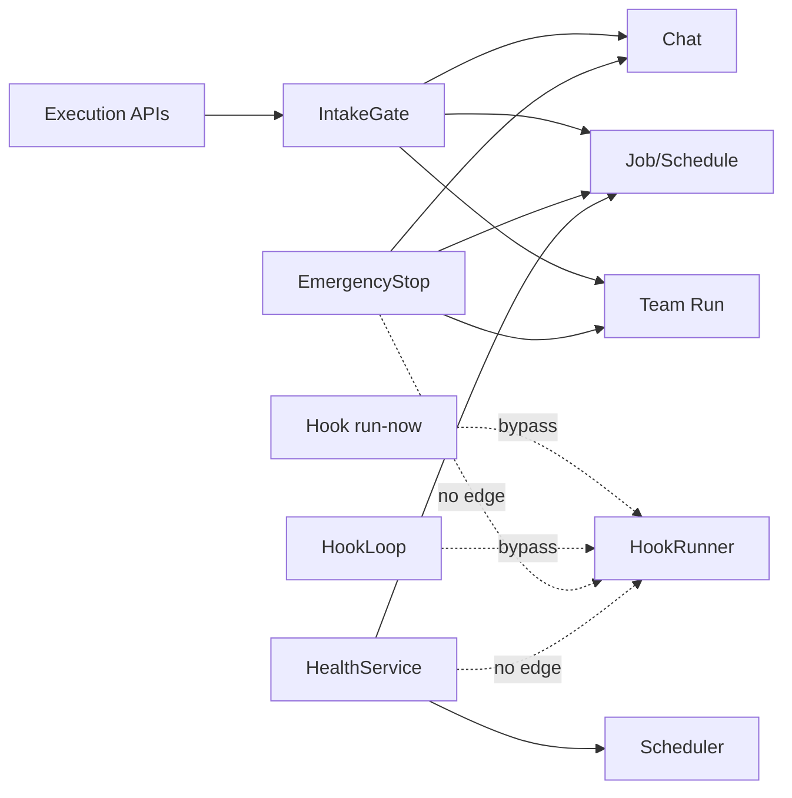

# 운영 정책 적용 범위 구조 리뷰

## Decision question

Chat, Job, Schedule, Team Run, Hook에 적용되는 Intake, Emergency Stop, Health,
Audit 정책을 현재처럼 각 API와 서비스가 개별 배선할지, 공통 실행 도메인 계약으로
확장할지 결정한다.

## Confirmed facts

- `src/personal_agent_gateway/app.py:91-121`은 JobWorker, SchedulerLoop,
  HookRunner, HookLoop와 Team Run shutdown을 하나의 lifespan에서 관리한다.
- `src/personal_agent_gateway/emergency_stop.py:45-68`은 Intake를 닫고 Session,
  Team Run, Job을 중단하지만 HookRunner와 HookLoop를 참조하지 않는다.
- `src/personal_agent_gateway/api/hooks.py:45-124`의 생성, 활성화, 삭제,
  `run-now`는 `require_intake_open`과 `record_domain_audit`를 호출하지 않는다.
- `src/personal_agent_gateway/health.py:34-55`의 readiness 구성요소는 DB, Worker,
  Scheduler, CLI, Intake이며 HookRunner와 HookLoop는 없다.
- `tests/test_emergency_stop.py:29-78`은 Job, Schedule, Chat intake 차단을
  검증하지만 Hook 실행 차단은 검증하지 않는다.
- `tests/test_health.py:41-46`은 readiness 구성요소 집합에 Hook이 없음을
  현재 계약으로 고정한다.

## Interpretation

- Background executor를 lifespan에서 함께 소유하면서 운영 정책에서는 개별 목록을
  반복하므로, Event Hook처럼 나중에 추가된 실행 도메인이 일부 정책에서 빠질 수 있다.
- 모든 설정 변경이 실행 intake는 아니다. 그러나 자동 polling과 `run-now`는 실제
  Agent 또는 Team Run을 시작하므로 Intake 계약에 포함되어야 기존 Emergency Stop
  의미와 일치한다.
- 범용 플러그인 프레임워크보다 Hook에 누락된 로컬 배선을 먼저 추가하는 편이 현재
  실행 도메인 수와 변경 압력에 비례한다.

## Unknowns

- Emergency Stop 중 이미 진행 중인 외부 메일 fetch를 즉시 취소해야 하는지, 현재
  fetch 완료 후 실행만 보류하면 되는지는 운영 요구에서 확인되지 않았다.
- Persona, Team, Rules 변경을 audit 필수 대상으로 볼지에 대한 보존 기간과 규제
  요구는 저장소에 없다.
- readiness에서 Hook 장애가 전체 503을 만들어야 하는지, 별도 degraded 상태로
  표시해야 하는지는 배포 환경의 헬스체크 정책 확인이 필요하다.

## Options

### F-01 · Hook 실행을 Intake와 Emergency Stop에 포함할 것인가

**Decision question**

- 자동 polling과 수동 Hook 실행을 기존 실행 중단 계약에 포함할지 결정한다.

**Confirmed facts**

- `src/personal_agent_gateway/hook_loop.py:42-48`은 Intake 확인 없이 due Hook을
  polling하고 HookRunner에 enqueue한다.
- `src/personal_agent_gateway/api/hooks.py:109-120`은 Intake 확인 없이 `run-now`를
  enqueue한다.
- `src/personal_agent_gateway/emergency_stop.py:45-68`은 Hook queue 또는 loop를
  중단하지 않는다.

**Interpretation**

- Emergency Stop 후에도 새 Hook Run이 생성·실행될 수 있어 “새 실행 intake를 먼저
  닫는다”는 운영 계약과 실제 동작이 다르다.

**Unknowns**

- Stop 중 새 이벤트를 cursor에 반영하지 않고 보류할지, Hook Run을 queued 상태로
  보존할지 제품 결정이 필요하다.

**Options**

| Option | Benefit | Cost | Risk | Applicable when |
| --- | --- | --- | --- | --- |
| `O-01/A` 현재 유지 | 변경이 없다 | Stop 예외를 문서화해야 한다 | 중단 후 자동 실행이 계속될 수 있다 | Hook을 kill switch 범위 밖으로 의도한 경우 |
| `O-01/B` Hook 로컬 배선 | 기존 IntakeGate를 HookLoop와 `run-now`에 적용하고 Stop 시 runner queue를 정리한다 | Hook 상태 전이와 테스트 추가가 필요하다 | cursor/queued 정책을 잘못 정하면 이벤트 재처리가 생긴다 | 현재 단일 프로세스 구조를 유지하는 경우 |
| `O-01/C` 실행 도메인 registry | 신규 executor가 stop/health/audit capability를 등록한다 | 공통 인터페이스와 composition 재설계가 필요하다 | 현재 규모에는 과도한 추상화가 될 수 있다 | 독립 executor가 계속 추가되는 경우 |

**Recommendation**

- `O-01/B`를 권고한다. 현재 확인된 누락은 Hook 한 도메인이며, 기존 IntakeGate와
  service lifecycle로 해결할 수 있다.
- 반론: registry는 다음 누락을 구조적으로 방지한다. 다만 실제 executor 변형은 현재
  네 종류이고 각 stop 의미가 달라 공통 인터페이스가 정책 차이를 숨길 가능성이 더 크다.
- Reversal conditions: 세 번째 신규 background executor가 추가되거나 같은 누락이
  다시 발생하면 `O-01/C`를 재검토한다.

### F-02 · Hook 상태를 readiness에 포함할 것인가

**Decision question**

- HookLoop/HookRunner 장애를 전체 readiness 또는 별도 degraded 상태로 노출할지
  결정한다.

**Confirmed facts**

- `src/personal_agent_gateway/app.py:102-106`은 Scheduler, HookRunner, HookLoop를
  모두 startup 필수 background component로 시작한다.
- `src/personal_agent_gateway/health.py:34-55`은 Worker와 Scheduler만 검사한다.
- HookLoop와 HookRunner는 각각 `alive`, `last_error` 속성을 제공한다.

**Interpretation**

- 자동화 기능 일부가 멈춰도 `/health/ready`는 200일 수 있어 운영자가 “ready”를
  전체 자동화 정상으로 해석하기 어렵다.

**Unknowns**

- 외부 메일 provider 장애와 내부 loop 사망을 같은 readiness 실패로 취급할지는
  운영 정책이 필요하다.

**Options**

| Option | Benefit | Cost | Risk | Applicable when |
| --- | --- | --- | --- | --- |
| `O-02/A` 현재 유지 | 핵심 Chat/Job readiness가 외부 Hook 장애에 영향받지 않는다 | Hook 전용 진단 경로가 별도로 필요하다 | Hook 내부 task 사망을 놓친다 | Hook이 비핵심 best-effort 기능인 경우 |
| `O-02/B` 내부 lifecycle만 추가 | Loop/Runner `alive`를 검사하고 provider 오류는 detail로 분리한다 | Health payload와 테스트 변경이 필요하다 | 503 기준을 과도하게 잡을 수 있다 | 내부 executor 생존은 필수이고 외부 provider는 선택적인 경우 |
| `O-02/C` health capability registry | component 추가가 자동화된다 | Health와 모든 component 계약을 재설계한다 | 단순 상태 객체가 framework로 커진다 | 동적 component 구성이 필요한 경우 |

**Recommendation**

- `O-02/B`를 권고한다. 내부 task 사망과 provider별 polling 실패를 분리하면 기존
  HealthService 구조를 유지하면서 관측 누락을 닫을 수 있다.
- Reversal conditions: 배포 환경이 `/health/ready` 503에 따라 프로세스를 재시작하고
  Hook이 선택 기능이라면 `ready` 대신 Operations의 degraded component로만 노출한다.

### F-03 · 변경 API의 audit 적용을 어디까지 맞출 것인가

**Decision question**

- 실행과 외부 연결을 바꾸는 Hook API 및 정의 변경 API에 audit을 일관되게
  적용할지 결정한다.

**Confirmed facts**

- `src/personal_agent_gateway/api/jobs.py:50-178`, `schedules.py:38-173`,
  `team_runs.py:68-419`은 주요 변경에서 `record_domain_audit`을 호출한다.
- `src/personal_agent_gateway/api/hooks.py:45-124`, `teams.py:31-68`,
  `personas.py:40-111`, `rules.py:30-57`은 변경 endpoint가 있으나 domain audit
  호출이 없다.
- `src/personal_agent_gateway/api/dependencies.py:49-88`은 민감 metadata를
  중앙 AuditService로 전달하는 공통 helper를 이미 제공한다.

**Interpretation**

- audit 채택 시점에 따라 도메인별 적용이 달라졌고, 외부 계정 연결·자동 실행 변경의
  책임 추적이 Job/Team Run보다 약하다.

**Unknowns**

- Persona/Rules의 모든 편집 이력까지 필요한지, 실행 결과에 사용된 snapshot만으로
  충분한지는 사용자 운영 요구가 없다.

**Options**

| Option | Benefit | Cost | Risk | Applicable when |
| --- | --- | --- | --- | --- |
| `O-03/A` 실행 API만 유지 | audit 양과 구현 비용이 작다 | Hook 예외를 문서화해야 한다 | 외부 연결 변경 추적이 없다 | audit이 실행 승인만 위한 경우 |
| `O-03/B` 위험 기반 로컬 확대 | Hook create/enable/delete/run-now와 Rules 변경 등 영향 큰 작업만 기록한다 | endpoint별 event 계약과 테스트가 필요하다 | 선택 기준이 문서화되지 않으면 다시 불균형해진다 | 현재 AuditService를 유지하는 경우 |
| `O-03/C` 모든 mutation 자동 audit | 누락 가능성이 낮다 | before/after, resource ID, redaction을 generic middleware가 알기 어렵다 | 의미 없는 로그와 민감 payload 수집 위험이 있다 | 규제상 모든 변경 이력이 필요한 경우 |

**Recommendation**

- `O-03/B`를 권고한다. Hook 연결 및 실행 제어를 우선 포함하고 Persona/Team/Rules는
  보존 요구를 확인한 뒤 확대한다.
- Reversal conditions: 모든 설정 변경의 법적 추적 의무가 확인되면 `O-03/C`가 아니라
  명시적 domain event 목록을 먼저 정의한다.

## Recommendation

- 현재 구조는 유지하되 Hook에 운영 정책을 로컬 배선한다.
- 우선순위는 `F-01` Intake/Emergency Stop, `F-02` readiness, `F-03` 위험 기반
  audit 순서다.
- 실행 도메인 registry나 mutation middleware 같은 광범위 재설계는 보류한다.

## Reversal conditions

- 신규 background executor가 추가되거나 운영 정책 누락이 다시 발생한다.
- multi-process worker로 전환해 in-memory IntakeGate와 registry가 더 이상 전체
  실행을 제어하지 못한다.
- 규제 또는 배포 플랫폼이 모든 mutation audit과 component-level health 표준을
  요구한다.

## Scope and excluded boundaries

- 포함: `app.py`, IntakeGate, EmergencyStopService, HealthService, Hook API/Loop/Runner,
  mutation audit 사용처와 관련 테스트.
- 제외: persistence/backup 내용, queue 내부 상태 전이, SSE UI 정합성, secret 저장
  상세. 이들은 S-02~S-05에서 별도로 검토한다.

## Feature behavior and code paths

- `B-01` Emergency Stop: Operations API → IntakeGate close → Session/Team/Job cancel.
- `B-02` 자동 Hook: HookLoop tick → HookService poll → HookRun → HookRunner.
- `B-03` readiness: `/health/ready` → HealthService components.
- `B-04` 변경 추적: mutation API → `record_domain_audit` → AuditService → SQLite.

Trace:

- `B-01`, `B-02` → `F-01` → `O-01/B` → `CR-01`
- `B-03` → `F-02` → `O-02/B` → `CR-02`
- `B-04` → `F-03` → `O-03/B` → `CR-03`

## Current diagrams

Decision question: 어떤 background 실행기가 현재 운영 정책 경계 밖에 있는가?



Dashed edges are explicitly evidenced bypasses or missing integration edges.

## Evidence inventory

- `src/personal_agent_gateway/app.py`
- `src/personal_agent_gateway/api/dependencies.py`
- `src/personal_agent_gateway/api/hooks.py`
- `src/personal_agent_gateway/emergency_stop.py`
- `src/personal_agent_gateway/health.py`
- `src/personal_agent_gateway/hook_loop.py`
- `src/personal_agent_gateway/hook_runner.py`
- `tests/test_emergency_stop.py`
- `tests/test_health.py`
- `tests/test_api_hooks.py`
- `docs/flows/2026-07-15-emergency-stop-and-resume.md`

## Analysis limits and next questions

- 실제 운영 중 Hook 중요도와 health 503 처리 방식은 코드만으로 알 수 없다.
- 외부 provider 호출의 취소 가능성은 IMAP/POP3 client timeout 설정과 운영 로그를
  별도로 측정해야 한다.
- audit 보존량과 조회 사용 패턴은 실제 DB 크기에서 확인하지 않았다.

## Review result

reviewer: self-review-fallback

```text
VERDICT: PASS

FINDINGS:
- [minor] self-review — 운영 요구 미확정 항목을 Unknowns와 reversal condition으로 제한함 — fix: none
```
