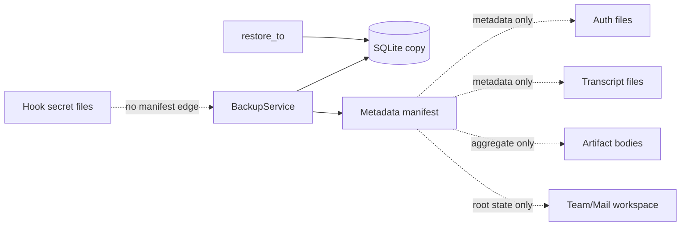

# 저장·복구 일관성 구조 리뷰

## Decision question

현재 `BackupService`를 SQLite 상태 백업으로 명확히 유지할지, Gateway의 DB와
파일 저장소를 함께 복구 가능한 bundle 경계로 확장할지 결정한다.

## Confirmed facts

- `src/personal_agent_gateway/config.py:39-47,105-111`은 Workspace, Session,
  Artifact, Auth, Hook secret을 서로 다른 경로로 구성한다.
- `src/personal_agent_gateway/backup.py:83-94`는 `file_bodies_included: false`를
  기록하고 DB copy, Auth/Session 파일 metadata, Artifact 집계, Workspace 상태만
  manifest에 넣는다.
- `src/personal_agent_gateway/backup.py:173-188`의 restore는 SQLite 파일만 별도
  target으로 복사하고 initialize/read probe를 수행한다.
- `docs/flows/2026-07-15-backup-restore.md:31-44`는 파일 본문이 R1 범위가 아니며
  live DB 교체 API가 없다고 명시한다.
- `src/personal_agent_gateway/hook_secrets.py:9-20`은 Hook credential을 DB 밖 JSON
  파일에 저장한다.
- BackupService 생성자는 `hooks_dir`를 받지 않으며 manifest에도 Hook secret
  inventory가 없다.

## Interpretation

- 현재 구현은 일관된 “SQLite online backup + 외부 파일 inventory 일부”이며,
  자체 계약 안에서는 DB restore를 과장하지 않는다.
- 다만 Gateway 실행 상태는 DB와 파일에 분산되어 있어, DB restore 성공은 Chat
  transcript, artifact body, workspace 결과, TOTP, Hook credential까지 복구됐다는
  뜻이 아니다.
- Hook credential은 inventory에도 없으므로 DB restore 뒤 enabled Hook이 secret을
  찾지 못하는 상태를 dry-run에서 발견할 수 없다.

## Unknowns

- 사용자가 Backup UI를 “Gateway 전체 재해 복구”로 기대하는지, DB metadata 보존으로
  이해하는지 사용성 근거가 없다.
- Transcript, Artifact, Workspace의 용량과 허용 가능한 backup 시간은 측정되지 않았다.
- Auth/Hook secret을 backup에 포함할 때 사용할 암호화 키와 오프라인 보관 정책이 없다.

## Options

### F-01 · Backup의 복구 단위를 DB로 유지할 것인가

**Decision question**

- API와 UI가 제공하는 Backup을 DB 전용으로 유지하거나 파일 bundle로 확장할지 결정한다.

**Confirmed facts**

- `src/personal_agent_gateway/backup.py:71-99`은 SQLite copy만 만들고 파일 본문을
  복사하지 않는다.
- `tests/test_backup.py:42-66`은 auth 파일 내용이 manifest에 들어가지 않고 DB row가
  별도 target에서 복원되는 것만 검증한다.
- `docs/flows/2026-07-15-backup-restore.md:41`은 파일 본문 미포함을 명시한다.

**Interpretation**

- 구현 버그보다 제품 용어와 복구 기대치의 경계 문제다. 전체 bundle을 바로 구현하면
  secret·대용량 파일·일관된 snapshot이라는 새 정책이 한꺼번에 필요하다.

**Unknowns**

- RPO/RTO, 최대 파일 용량, 복구 대상 우선순위가 없다.

**Options**

| Option | Benefit | Cost | Risk | Applicable when |
| --- | --- | --- | --- | --- |
| `O-01/A` DB backup 유지 | 작고 검증된 SQLite snapshot을 유지한다 | UI·문서에서 제한을 계속 명확히 해야 한다 | 사용자가 전체 복구로 오해할 수 있다 | DB metadata 복구가 목적일 때 |
| `O-01/B` 복구 profile 분리 | `database-only`와 향후 `full-bundle` 계약을 분리하고 dry-run이 누락 저장소를 표시한다 | manifest schema와 UI 변경이 필요하다 | 실제 full bundle 없이 profile만 늘 수 있다 | 단계적 재해 복구가 필요할 때 |
| `O-01/C` 즉시 full bundle | 한 작업으로 모든 상태를 보존한다 | consistent copy, 암호화, 용량, restore orchestration 구현이 크다 | secret 유출과 장시간 stop 위험이 있다 | 명확한 RPO/RTO와 보관 정책이 있을 때 |

**Recommendation**

- `O-01/B`를 권고한다. 현재 DB backup 동작은 유지하고 이름·manifest·dry-run에서
  복구 profile과 누락 저장소를 명시한 뒤 full bundle은 요구가 확인될 때 구현한다.
- 반론: `O-01/A`는 이미 문서상 정확하다. 그러나 외부 파일 저장소가 계속 추가됐고
  Hook credential은 inventory에도 없어 dry-run의 진단 가치가 낮아졌다.
- Reversal conditions: 사용자가 DB backup만 원하고 UI에서 제한을 명확히 이해한다는
  검증이 있으면 `O-01/A`를 유지한다.

### F-02 · Hook credential을 backup inventory에 포함할 것인가

**Decision question**

- secret 본문을 복사하지 않더라도 Hook credential 존재 여부와 복구 가능성을
  manifest/dry-run에서 검사할지 결정한다.

**Confirmed facts**

- `src/personal_agent_gateway/hooks.py:84-105`는 DB에 `connection_ref`를 저장하고
  secret 본문은 HookSecretStore에 저장한다.
- `src/personal_agent_gateway/hook_secrets.py:14-20`은 파일이 없으면 `None`을 반환한다.
- `src/personal_agent_gateway/backup.py:52-64`는 hooks root를 소유하지 않는다.

**Interpretation**

- 복원 DB가 정상이어도 Hook credential이 없으면 polling은 실패한다. 현재 dry-run은
  이 불일치를 검출할 근거가 없다.

**Unknowns**

- credential을 재입력하는 복구 UX가 허용되는지 확인되지 않았다.

**Options**

| Option | Benefit | Cost | Risk | Applicable when |
| --- | --- | --- | --- | --- |
| `O-02/A` 현재 유지 | secret 관련 metadata도 backup에 남기지 않는다 | 수동 점검이 필요하다 | 복원 후에야 누락을 발견한다 | Hook을 쉽게 재설정할 수 있을 때 |
| `O-02/B` 참조 무결성 inventory | ref별 secret 존재·size·mtime만 기록하고 dry-run에서 누락을 경고한다 | manifest와 검증 테스트가 늘어난다 | metadata가 연결 수를 노출한다 | 본문 미포함 정책을 유지할 때 |
| `O-02/C` 암호화 secret bundle | 자동 복구가 가능하다 | key lifecycle과 rotation이 필요하다 | backup 탈취 시 영향이 커진다 | 승인된 암호화·보관 정책이 있을 때 |

**Recommendation**

- `O-02/B`를 권고한다. secret 값은 포함하지 않고 DB `connection_ref`와 파일 존재의
  무결성만 검증한다.
- Reversal conditions: credential 재입력이 공식 복구 절차이고 Hook 수가 매우 적다는
  운영 근거가 있으면 `O-02/A`로 충분하다.

## Recommendation

- SQLite online backup 구현은 유지한다.
- manifest에 명시적 `database-only` profile과 저장소별 recoverability를 추가하고,
  Hook credential 참조 무결성을 dry-run에서 검사한다.
- full file/secret bundle은 RPO/RTO와 암호화 정책이 정해질 때까지 구현하지 않는다.

## Reversal conditions

- 전체 Gateway 복구가 공식 제품 요구가 되고 허용 중단 시간·용량·암호화 키 owner가
  정해진다.
- 반대로 운영자가 DB만 보존하고 모든 파일/credential을 재구성하는 절차를 승인한다.

## Scope and excluded boundaries

- 포함: Config 저장소 root, BackupService, restore dry-run, HookSecretStore와 관련 테스트.
- 제외: secret 파일 권한·원자성, runtime restart 상태, artifact content API. 각각
  S-05와 S-03 범위다.

## Feature behavior and code paths

- `B-01` backup 생성: Operations API → BackupService → SQLite online copy + manifest.
- `B-02` restore 검증: dry-run → checksum/schema/integrity → 별도 target copy.
- `B-03` Hook credential: HookService DB `connection_ref` ↔ HookSecretStore JSON.

Trace:

- `B-01`, `B-02` → `F-01` → `O-01/B` → `CR-01`
- `B-03` → `F-02` → `O-02/B` → `CR-02`

## Current diagrams

Decision question: DB backup 성공 시 어떤 실행 상태가 함께 복구되지 않는가?



## Evidence inventory

- `src/personal_agent_gateway/backup.py`
- `src/personal_agent_gateway/config.py`
- `src/personal_agent_gateway/hooks.py`
- `src/personal_agent_gateway/hook_secrets.py`
- `src/personal_agent_gateway/app.py`
- `tests/test_backup.py`
- `tests/test_hooks_service.py`
- `docs/flows/2026-07-15-backup-restore.md`

## Analysis limits and next questions

- 파일 저장소 실제 크기와 backup 소요 시간을 측정하지 않았다.
- OS snapshot/VSS나 외부 backup 도구 사용 여부를 알 수 없다.
- full bundle의 암호화 키 저장 위치와 restore 승인 절차가 없다.

## Review result

reviewer: self-review-fallback

```text
VERDICT: PASS

FINDINGS:
- [minor] self-review — full bundle 구현은 요구와 key policy가 없어 change request에서 제외함 — fix: none
```
