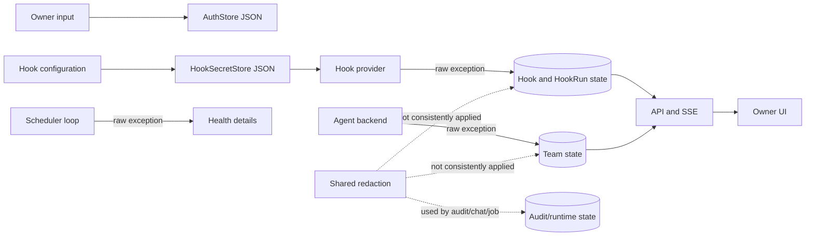

# 보안 경계 구조 리뷰

## Decision question

현재의 단일 사용자·로컬 파일 시스템 보안 모델을 유지하면서 비밀 파일의 내구성과
오류 redaction 경계를 보완할지, OS credential vault와 전역 오류 계층까지 확장할지 결정한다.

## Confirmed facts

- `src/personal_agent_gateway/auth_sessions.py`은 session token 원문 대신 SHA-256 hash를
  저장하고 TTL과 idle expiry를 검사한다.
- `src/personal_agent_gateway/api/auth.py:232-237`은 session cookie에 `HttpOnly`와
  `SameSite=Strict`를 설정하고 `Secure` 여부를 구성으로 받는다.
- `src/personal_agent_gateway/hook_secrets.py:9-12`은 Hook secret JSON을 별도 파일에
  직접 `write_text`한다.
- `src/personal_agent_gateway/auth_store.py:107-116`은 TOTP secret을 포함한 auth JSON을
  직접 `write_text`한다. recovery code는 hash로 저장한다.
- 두 secret-bearing store에는 임시 파일 교체, fsync, 파일 권한/ACL 설정이 없다.
- `src/personal_agent_gateway/redaction.py:23-28`과
  `src/personal_agent_gateway/audit.py:11,71-81`에는 공용 redaction 경계가 있다.
- `src/personal_agent_gateway/hooks.py:178-179`,
  `src/personal_agent_gateway/hook_runner.py:220-221`,
  `src/personal_agent_gateway/scheduler_loop.py:63-67`,
  `src/personal_agent_gateway/team_runtime.py:152-157,261,463-468`은 예외 문자열을
  공용 redaction 없이 상태, DB 또는 event에 기록한다.
- `src/personal_agent_gateway/api/hooks.py:84,154,167`은 provider 오류 또는 저장된
  `last_error`/`error_message`를 API 응답에 포함한다.

## Interpretation

- 현재 보안 모델은 session token hash, strict cookie, secret 전용 파일로 기본 경계를
  갖추지만 secret-bearing JSON의 쓰기 원자성과 접근 제한이 store별 암묵적 OS 기본값에
  의존한다.
- 오류 redaction은 기능별로 일관되지 않다. provider가 URL query, header, credential
  fragment를 예외에 포함하면 Hook/Team/Scheduler 경로를 통해 저장되거나 UI에 노출될 수 있다.
- 현재 구조에서는 공용 private atomic writer와 persistence/event 직전의 공용
  `redact_text` 적용이 가장 작은 변경이다.

## Unknowns

- 지원 대상 Windows 계정과 POSIX 배포에서 상위 디렉터리 ACL/umask를 운영자가 어떻게
  설정하는지 문서화되어 있지 않다.
- Hook provider와 agent backend가 예외 문자열에 credential을 포함하지 않는다는 계약이 없다.
- 외부 mail body와 Hook trigger payload의 보존 기간·삭제 정책 요구가 없다. 이 리뷰는
  의도된 기능 데이터 보존을 보안 결함으로 단정하지 않는다.

## Options

### F-01 · Secret-bearing JSON의 쓰기·접근 경계를 어디에 둘 것인가

**Decision question**

- 현재 OS 사용자 경계만 명시할지, store 공통의 private atomic file writer를 도입할지,
  OS credential vault로 이전할지 결정한다.

**Confirmed facts**

- Hook secret과 TOTP secret은 DB 밖 JSON에 분리되어 있다.
- 두 store 모두 최종 경로에 직접 덮어쓰며 권한을 명시하지 않는다.
- `tests/test_hook_secrets.py`와 `tests/test_auth_store.py`는 round-trip을 검증하지만
  partial write와 권한 실패를 검증하지 않는다.

**Interpretation**

- 프로세스 중단 시 JSON이 손상될 수 있고 새 파일의 접근 범위는 플랫폼·상위 디렉터리
  기본값에 따라 달라진다.

**Unknowns**

- Windows 서비스 계정과 로컬 interactive 계정 중 어느 실행 형태를 공식 지원하는지 모른다.

**Options**

| Option | Benefit | Cost | Risk | Applicable when |
| --- | --- | --- | --- | --- |
| `O-01/A` OS 기본 경계를 문서화 | 코드 변경이 없고 운영 책임이 명확하다 | 배포별 ACL 확인 절차가 필요하다 | partial write와 느슨한 상속 권한이 남는다 | 잠긴 단일 사용자 장비만 지원할 때 |
| `O-01/B` private atomic JSON writer | temp+flush+replace로 손상을 줄이고 private permission 정책을 한곳에 둔다 | Windows/POSIX 분기와 fault test가 필요하다 | Windows에서 실제 ACL보다 강한 보장을 암시할 수 있다 | 현재 파일 기반 store를 유지할 때 |
| `O-01/C` OS credential vault 사용 | secret 원문 파일을 제거할 수 있다 | 의존성, key lifecycle, service-account portability가 복잡해진다 | 복구·이식성이 낮아질 수 있다 | 다중 사용자 host와 명확한 threat model이 있을 때 |

**Recommendation**

- `O-01/B`를 권고한다. HookSecretStore와 AuthStore가 같은 최소 helper를 사용해 같은
  디렉터리에 임시 파일을 쓰고 flush한 뒤 replace하며, POSIX `0600` 또는 지원 플랫폼의
  private ACL 적용 결과를 검증하도록 한다.
- 반론: 단일 사용자 앱에서는 상위 디렉터리 ACL만으로 충분하다. 그러나 이 경우에도
  직접 덮어쓰기의 손상 가능성과 두 store의 정책 불일치는 남는다.
- Reversal conditions: 지원 배포가 credential vault를 필수 제공하고 backup/restore
  key lifecycle까지 정의하면 `O-01/C`를 선택한다.

### F-02 · Runtime/provider 오류를 어느 경계에서 redaction할 것인가

**Decision question**

- 각 provider가 안전한 오류만 낸다고 가정할지, DB·event·API에 전달하기 직전에 공용
  redaction을 적용할지, 전역 exception middleware로 통합할지 결정한다.

**Confirmed facts**

- Audit 경로는 `redact_text`와 `sanitize_metadata`를 사용한다.
- Hook, HookRunner, SchedulerLoop, TeamRuntime의 여러 실패 경로는 `str(exc)`를 그대로
  저장하거나 event에 넣는다.
- Hook API는 해당 오류 필드를 client에 반환한다.

**Interpretation**

- 비밀 노출 여부가 provider 예외 구현에 의존한다. 전역 HTTP middleware만 추가해도
  이미 DB와 SSE에 기록되는 domain error는 막지 못한다.

**Unknowns**

- 실제 provider 예외 샘플과 현재 로그/DB에 credential fragment가 존재하는지 조사하지 않았다.

**Options**

| Option | Benefit | Cost | Risk | Applicable when |
| --- | --- | --- | --- | --- |
| `O-02/A` provider-safe 오류 계약 유지 | 변경이 가장 작고 원문 진단이 쉽다 | 모든 provider 계약과 검증이 필요하다 | 새 adapter 하나가 secret을 노출할 수 있다 | 모든 backend가 통제되고 오류 스키마가 고정일 때 |
| `O-02/B` domain persistence/event 직전 공용 redaction | 저장·SSE·API를 함께 보호하고 기존 유틸을 재사용한다 | secret context 전달과 진단용 correlation이 필요하다 | 과도한 패턴이 유용한 오류를 가릴 수 있다 | 현재 domain runtime 구조를 유지할 때 |
| `O-02/C` 전역 exception middleware | HTTP 500 응답 정책은 단순해진다 | DB/SSE/background task에는 별도 처리가 여전히 필요하다 | 보호 범위를 과대평가하기 쉽다 | HTTP 예외 형식 통일이 별도 목표일 때 |

**Recommendation**

- `O-02/B`를 권고한다. Hook/Team/Scheduler의 오류를 DB나 event에 넘기기 전에
  `redact_text`로 정규화하고, Hook 경로는 현재 hook secret을 explicit secret context로
  전달한다. 원문 예외는 사용자 노출 저장소에 남기지 않고 correlation ID로 진단한다.
- 반론: provider adapter에서만 sanitize하면 domain 코드는 더 단순하다. 그러나 TeamRuntime은
  여러 backend를 받고 새 provider가 추가될 때 경계 누락이 다시 발생한다.
- Reversal conditions: 모든 runtime 결과가 typed safe-error object만 반환하도록 계약이
  바뀌고 raw exception이 domain layer에 도달하지 않으면 `O-02/A`에 가까운 구조로 단순화한다.

## Recommendation

- 파일 기반 secret store는 유지하되 공통 private atomic JSON writer로 쓰기와 접근 정책을
  한곳에 둔다.
- Hook, Team, Scheduler의 persistence/event 경계에 기존 공용 redaction을 적용한다.
- OS credential vault와 전역 exception middleware는 현재 threat model과 범위에서는 보류한다.

## Reversal conditions

- 다중 사용자 host, 원격 공유 volume, 규제 대상 secret 저장 요구가 생긴다.
- 공식 배포 플랫폼이 credential vault와 key 복구 수단을 일관되게 제공한다.
- runtime provider가 typed safe-error 계약으로 통합되어 raw exception이 경계에 도달하지 않는다.

## Scope and excluded boundaries

- 포함: AuthStore, HookSecretStore, 공용 redaction, Hook/Team/Scheduler 오류 저장·event·API 경계.
- 제외: 인증 UX, cryptographic algorithm 교체, mail body/trigger payload 보존정책 결정,
  네트워크 TLS termination과 OS 자체 침해 대응.

## Feature behavior and code paths

- `B-01` owner 인증: login/session token → hash 저장 → strict cookie → authenticated API.
- `B-02` secret 저장: TOTP/Hook secret → 별도 JSON 파일 → runtime/provider lookup.
- `B-03` Hook 오류: provider poll/run → raw exception → Hook/HookRun 상태 → Hook API/UI.
- `B-04` Team/Scheduler 오류: backend/background loop → raw exception → DB/event/health/UI.

Trace:

- `B-02` → `F-01` → `O-01/B` → `CR-01`
- `B-03`, `B-04` → `F-02` → `O-02/B` → `CR-02`

## Current diagrams

Decision question: 비밀 원문과 provider 오류가 현재 어떤 신뢰 경계를 통과하는가?



## Evidence inventory

- `src/personal_agent_gateway/auth_sessions.py`
- `src/personal_agent_gateway/api/auth.py`
- `src/personal_agent_gateway/api/dependencies.py`
- `src/personal_agent_gateway/auth_store.py`
- `src/personal_agent_gateway/hook_secrets.py`
- `src/personal_agent_gateway/redaction.py`
- `src/personal_agent_gateway/audit.py`
- `src/personal_agent_gateway/hooks.py`
- `src/personal_agent_gateway/hook_runner.py`
- `src/personal_agent_gateway/scheduler_loop.py`
- `src/personal_agent_gateway/team_runtime.py`
- `src/personal_agent_gateway/api/hooks.py`
- `tests/test_auth_store.py`
- `tests/test_hook_secrets.py`

## Analysis limits and next questions

- 파일 ACL과 partial-write failure를 실제 Windows/POSIX 환경에서 재현하지 않았다.
- 저장된 DB/log의 민감정보 forensic scan은 수행하지 않았다.
- 배포 threat model과 secret rotation/RPO 요구가 문서화되면 vault 옵션을 다시 평가해야 한다.

## Review result

reviewer: self-review-fallback

```text
VERDICT: PASS

FINDINGS:
- [minor] self-review — 외부 payload 보존정책은 요구 근거가 없어 별도 개선 요청으로 만들지 않음 — fix: none
```
