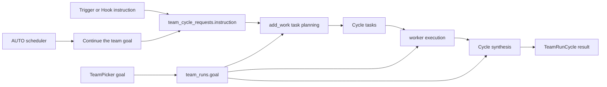

# Team Run 목표와 Cycle 중심 목록 구조 검토

## Decision question

- Continuous Team Run의 `goal`을 Run 생성 시 항상 받을지, 실행 정책에 따라 선택적으로 받을지 결정한다.
- Cycle이 누적되는 Team Run을 목록에서 어떤 상태와 작업 단위로 표현할지 결정한다.

## Confirmed facts

- `frontend/src/components/organisms/TeamPicker/index.jsx:16-45,84-92` — 현재 New Team Run은 AUTO/TRIGGERED 구분 없이 `goal`을 입력받아 생성 payload에 넣는다.
- `src/personal_agent_gateway/api/team_runs.py:36-53,103-138` — 생성 API는 `goal: str`을 항상 요구하지만 AUTO 설정만 정책별로 검증하며, AUTO는 생성 직후 첫 Cycle을 enqueue한다.
- `src/personal_agent_gateway/api/team_runs.py:57-68,156-196` — TRIGGERED Cycle은 별도의 필수 `instruction`을 받아 enqueue한다.
- `src/personal_agent_gateway/db.py:110-133,177-193` — Run의 `goal`은 NOT NULL이고 Cycle 요청의 `instruction`도 별도 NOT NULL로 저장된다.
- `src/personal_agent_gateway/team_cycles.py:217-229,586-597` — AUTO Cycle 요청은 실제 목적 대신 `Continue the team goal.`이라는 고정 instruction을 사용한다.
- `src/personal_agent_gateway/team_run_orchestrator.py:56-69` — Cycle 실행은 요청 instruction으로 Cycle Task를 추가한 뒤 해당 Cycle을 resume한다.
- `src/personal_agent_gateway/team_runtime.py:196-205,422-430,576-586` — 계획·작업자·종합 프롬프트의 공통 목표는 여전히 `run.goal`이다.
- `src/personal_agent_gateway/teams.py:561-654` — 목록 집계는 모든 Cycle의 Task를 Run 단위로 합산하며 최신 Cycle이나 정책 상태를 포함하지 않는다.
- `src/personal_agent_gateway/rule_sets.py:78-79,106-112,123-127`, `src/personal_agent_gateway/teams.py:330-342` — Team 기반 신규 Run은 빈 Team rule에도 snapshot dict를 만들고 `rules_snapshot.team.name`을 동결 저장한다.
- `frontend/src/components/molecules/TeamRunCard/index.jsx:42-81` — 목록 카드는 Run goal, Run status, 전체 Task 합계와 전체 elapsed만 표시한다.
- `frontend/src/components/organisms/TeamRunDetail/index.jsx:383-406,719-732` — 상세는 이미 최신 Cycle과 Cycle별 Task를 구분하고 Cycle 이력을 접어서 표시한다.

## Interpretation

- `goal`은 현재 세 가지 책임을 동시에 가진다: Run 식별용 제목, AUTO의 반복 기준, 모든 Agent 프롬프트의 공통 실행 목표.
- TRIGGERED에서는 사용자가 Cycle마다 `instruction`을 입력하므로 Run 생성 시 필수 goal은 실제 실행 입력과 중복된다.
- AUTO에서는 반복 기준이 없으면 다음 Cycle을 생성할 근거가 사라지므로 Run 수준의 기준 목표가 필요하다.
- 현재 Run status와 전체 Task 합계는 “지금 어느 Cycle이 무엇을 하는가”보다 누적 실행 결과를 나타낸다. Continuous container의 준비 상태와 최신 Cycle 상태를 구별하기 어렵다.

## Unknowns

- 하나의 Team에 AUTO Run과 TRIGGERED Run을 각각 몇 개까지 유지할지에 대한 제품 정책은 코드에 없다.
- 사용자가 Run에 별도 이름을 붙여야 하는지, Team 이름과 생성 시각으로 식별해도 되는지는 결정되지 않았다.
- 완료된 Continuous Run을 보관하는 `archive` 개념은 현재 상태 모델에 없다.

## Options

### F-01 · Run goal과 Cycle objective의 책임

**Decision question**

- AUTO와 TRIGGERED가 같은 Run-level goal 계약을 가져야 하는가?

**Confirmed facts**

- `src/personal_agent_gateway/api/team_runs.py:36-68,103-138,156-196` — 생성 API는 Run goal을 항상 요구하지만 TRIGGERED Cycle은 별도 instruction도 요구한다.
- `src/personal_agent_gateway/team_cycles.py:217-229,586-597` — AUTO Cycle은 고정 instruction으로 Run goal을 계속 참조한다.
- `src/personal_agent_gateway/team_runtime.py:422-430,524-540,576-586` — Runtime의 add-work, worker, synthesis prompt는 Run goal을 공통 문맥으로 사용한다.

**Interpretation**

- TRIGGERED의 실제 작업 목표는 Cycle instruction이고, AUTO의 장기 반복 기준은 Run goal이다. 같은 필드 의무를 적용하지만 실제 책임은 정책별로 다르다.

**Unknowns**

- TRIGGERED Run에도 여러 Cycle을 묶는 선택적 장기 context가 필요한지는 확정되지 않았다.

반론: 모든 Cycle이 하나의 장기 목표를 향한다면 현재처럼 Run goal을 항상 요구하는 구조도 일관된다. 그러나 TRIGGERED API가 이미 독립 instruction을 요구하고 AUTO만 goal 기반 고정 instruction을 생성하므로, 두 정책의 실제 입력 계약은 이미 다르다.

| Option | Benefit | Cost | Risk | Applicable when |
|---|---|---|---|---|
| `O-01/A` goal 항상 유지 | 스키마와 Runtime 변경이 거의 없다. | TRIGGERED 생성과 Trigger에서 비슷한 내용을 두 번 입력한다. | Run goal과 최신 Cycle 목표가 달라져 프롬프트와 UI가 혼동될 수 있다. | 모든 Cycle이 반드시 하나의 고정 goal의 하위 작업일 때 |
| `O-01/B` 정책별 base objective | AUTO는 `base_objective` 필수, TRIGGERED는 선택으로 두고 모든 Cycle은 `instruction`을 실제 objective로 사용한다. | nullable migration과 Runtime prompt 문맥 분리가 필요하다. | 기존 Run의 goal 호환 mapping을 놓치면 과거 실행 표시가 깨질 수 있다. | AUTO 반복과 수동·Hook Cycle을 같은 Continuous container에서 명확히 구분할 때 |
| `O-01/C` Run goal 완전 제거 | 모든 실행 입력이 Cycle 하나로 통일된다. | AUTO용 별도 prompt/template 모델과 Run 식별 필드를 새로 설계해야 한다. | 현재 planning/worker/synthesis 공통 문맥과 기존 데이터 의미를 크게 바꾼다. | AUTO도 Cycle별 외부 입력을 반드시 제공받는 구조로 바뀔 때 |

**Recommendation**

- `O-01/B`: AUTO는 base objective를 필수로 유지하고, TRIGGERED는 선택 context만 허용하며 모든 Cycle instruction을 현재 실행 objective로 사용한다.

**Reversal conditions**

- 모든 TRIGGERED Cycle이 반드시 하나의 고정 장기 목표 아래에 존재한다는 제품 규칙이 확정되면 `O-01/A`로 되돌린다.
- AUTO도 매회 외부 objective를 반드시 제공받도록 바뀌면 `O-01/C`를 다시 검토한다.

### F-02 · Cycle 누적 이후 Team Runs 목록

**Decision question**

- 목록의 기본 단위를 Run container로 유지할지, 개별 Cycle로 바꿀지 결정한다.

**Confirmed facts**

- `src/personal_agent_gateway/teams.py:561-654` — 현재 list read model은 모든 Cycle의 Task 수를 합산하고 최신 Cycle, queue, AUTO series 상태를 반환하지 않는다.
- `frontend/src/components/molecules/TeamRunCard/index.jsx:42-81`, `frontend/src/components/containers/GatewayApp/index.jsx:861-890` — 카드 headline과 필터는 Run goal/status를 사용한다.
- `frontend/src/components/organisms/TeamRunDetail/index.jsx:383-406,719-732` — 상세는 최신 Cycle과 Cycle별 Task를 기본으로 사용한다.
- `src/personal_agent_gateway/rule_sets.py:78-79,106-112,123-127`, `src/personal_agent_gateway/teams.py:330-342` — Team 기반 신규 Run은 `rules_snapshot.team.name`을 동결 저장한다.

**Interpretation**

- Run당 카드 하나는 설정과 실행 계보를 묶는 데 적합하지만, 카드의 핵심 수치는 전체 누적보다 최신 Cycle과 정책 상태여야 한다.

**Unknowns**

- 실제 운영에서 개별 Cycle 감사·검색이 목록의 주 사용 사례인지 데이터가 없다.

반론: 전체 Task 합계는 장기적인 작업량을 보여주는 유효한 지표다. 다만 상세 화면이 이미 최신 Cycle 기준 Task를 기본으로 삼고 있고, 목록에는 최신 Cycle·대기열·AUTO 진행 정보가 없어 다음 사용자 행동을 판단할 수 없다.

| Option | Benefit | Cost | Risk | Applicable when |
|---|---|---|---|---|
| `O-02/A` 현재 카드 유지 | 추가 query와 UI 변경이 없다. | Cycle이 늘수록 progress와 elapsed의 의미가 흐려진다. | `completed` Run이 다시 Trigger 가능한 Continuous container라는 사실을 숨긴다. | Team Run이 사실상 한 번만 실행될 때 |
| `O-02/B` Run 1개당 compact card + latest Cycle | 목록 밀도를 유지하면서 현재 작업, Cycle 수, AUTO 진행, 다음 행동을 보여준다. | list read model에 최신 request/Cycle/series 집계가 추가된다. | 한 카드에 보조 정보를 과하게 넣으면 다시 복잡해질 수 있다. | Continuous Run을 상위 container로 유지할 때 |
| `O-02/C` Cycle 1개당 목록 row | 각 실행 결과가 직접 보이고 필터링이 쉽다. | 동일 Team Run이 반복 노출되어 목록이 빠르게 늘어난다. | Run 설정과 Cycle 실행의 소유 관계가 UI에서 약해진다. | 사용자가 Run보다 개별 실행 로그를 주로 탐색할 때 |

**Recommendation**

- `O-02/B`: Run당 카드 하나를 유지하고 frozen Team 이름, latest Cycle과 policy 상태를 목록 read model에 추가한다. snapshot이 없는 legacy Run만 short Run ID로 fallback한다.

**Reversal conditions**

- 개별 Cycle 감사·검색이 목록의 주 사용 사례가 되면 `O-02/C`를 별도 Cycle History 화면으로 도입한다.

## Recommendation

- `F-01`은 `O-01/B`를 선택한다. UI 용어를 `Goal` 하나로 유지하지 말고 `Base objective`와 `Cycle objective`로 분리한다.
  - AUTO 생성: `Base objective` 필수. 첫 Cycle과 후속 Cycle의 instruction은 이 값을 사용하고 이전 Cycle summary를 이어 붙인다.
  - TRIGGERED 생성: objective 입력 없이 Run container만 만든다. 필요하면 선택적인 `Run context`만 허용한다.
  - 수동 Trigger/Hook: 매번 `Cycle objective`가 필수이며 현재 `team_cycle_requests.instruction`을 authoritative value로 유지한다.
  - Runtime prompt: `Run context`와 `Current cycle objective`를 별도 블록으로 전달한다.
- `F-02`는 `O-02/B`를 선택한다. Team Runs 목록은 Cycle별 row로 늘리지 않고 Run당 카드 하나를 유지한다.
  - 1행: Team 이름, `AUTO`/`TRIGGERED`, container 식별자.
  - 2행: 최신 Cycle 번호·상태·objective 한 줄 요약. Cycle이 없으면 `READY FOR TRIGGER`.
  - 3행: 최신 Cycle Task 진행률. 전체 누적 수치는 작은 보조 정보로만 표시한다.
  - 우측 meta: `CYCLES n`, AUTO면 `2/5 · NEXT 10:30`, TRIGGERED면 `LAST 12m AGO`.
  - 필터: raw Run status 대신 `ACTIVE`, `READY`, `NEEDS ATTENTION`, `AUTO WAITING`, `CANCELED` 같은 파생 상태를 사용한다.
- 기존 `rules_snapshot.team.name` + 짧은 Run ID를 안정적인 제목으로 사용하고 snapshot이 없는 legacy Run은 short Run ID로 fallback한다. 별도 사용자 입력 Run 이름은 추가하지 않는다.

## Reversal conditions

- 모든 Triggered Cycle이 반드시 하나의 장기 목표 아래에서만 실행된다는 제품 규칙이 확정되면 `O-01/A`가 더 단순하다.
- AUTO도 스케줄마다 Hook 등 외부 입력이 항상 제공되도록 바뀌면 `O-01/C`를 다시 검토한다.
- 운영자가 개별 Cycle 감사·검색을 목록의 주 사용 사례로 삼으면 `O-02/C`를 별도 Cycle History 화면으로 도입한다.

## Scope and excluded boundaries

- 범위: Team Run 생성 계약, Cycle objective 전달, Team Runs list read model과 카드 정보 계층.
- 제외: Cycle dispatcher 동시성, Persona/Rule/Space snapshot 정책, 상세 화면 전체 재설계, archive 기능 구현.

## Feature behavior and code paths

- `B-01` 사용자는 Team과 실행 정책을 골라 Continuous Team Run container를 만든다.
- `B-02` AUTO는 생성 시 기준 objective로 Cycle을 반복하고, TRIGGERED/Hook은 요청 시 Cycle objective를 전달한다.
- `B-03` 사용자는 Team Runs 목록에서 현재 실행 상태와 다음 행동을 판단한 뒤 상세로 이동한다.

## Current diagrams

결정 질문: 현재 goal과 instruction은 실제 실행에서 어떻게 합쳐지는가?

## Evidence inventory

- API contracts: `src/personal_agent_gateway/api/team_runs.py`
- persistence: `src/personal_agent_gateway/db.py`, `src/personal_agent_gateway/team_cycles.py`
- execution: `src/personal_agent_gateway/team_cycle_dispatcher.py`, `src/personal_agent_gateway/team_run_orchestrator.py`, `src/personal_agent_gateway/team_runtime.py`
- list read model: `src/personal_agent_gateway/teams.py`
- frontend: `TeamPicker`, `TeamRunCard`, `TeamRunDetail`, `GatewayApp`
- regression contracts: `tests/test_api_team_runs.py`, `frontend/src/components/organisms/TeamPicker/TeamPicker.test.jsx`, `frontend/src/components/molecules/TeamRunCard/TeamRunCard.test.jsx`

## Analysis limits and next questions

- 실제 데이터에서 Run당 Cycle 수와 사용자가 주로 찾는 정보의 빈도는 측정하지 않았다.
- 구현 전에 TRIGGERED Run에 선택적인 장기 context를 허용할지 한 번 결정해야 한다.

## Review result

- Independent reviewer: `review_team_run_cycle_structure`.
- 근거 추적, option 계약, diagram, Markdown/HTML parity를 재검토했으며 blocking inconsistency가 남지 않았다.
