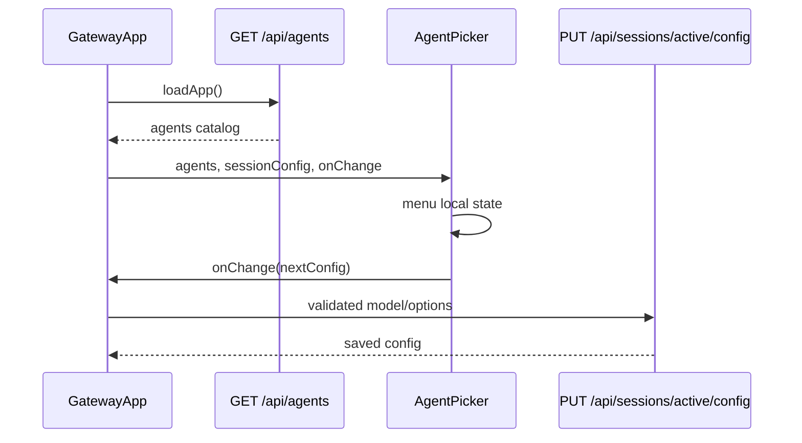

# AgentPicker Local CLI Capability Component Analysis

## 요약

- Root: `frontend/src/components/organisms/AgentPicker/index.jsx`
- Modes: `api-state`, `test`
- Verdict: 컴포넌트는 이미 `agents[].models`와 `options_schema`를 일반화해 렌더링한다. 로컬 CLI 탐지 결과를 `GET /api/agents`에 연결하면 UI 구조 변경 없이 model·effort·sandbox·permission 선택지가 동적으로 바뀐다.

## 범위

| Item | Path | Notes |
|---|---|---|
| Root | `frontend/src/components/organisms/AgentPicker/index.jsx` | agent/model/option 선택과 locked 요약 |
| Parent | `frontend/src/components/organisms/ChatView/index.jsx` | props 전달만 수행 |
| Owner | `frontend/src/components/containers/GatewayApp/index.jsx` | `api.agents`, config 저장과 오류 상태 소유 |
| API client | `frontend/src/api/client.js` | `GET /api/agents`, active config GET/PUT |
| Backend catalog | `src/personal_agent_gateway/agents.py` | 현재 정적 model/options와 validation 소유 |
| Tests | `frontend/src/components/organisms/AgentPicker/AgentPicker.test.jsx` | curated model, effort, unavailable, locked, retry 검증 |

## API / 상태 흐름

- `AgentPicker`의 유일한 local state는 열린 dropdown을 나타내는 `menu`다. model/options의 source of truth는 `config` prop이며 변경은 `onChange`로 부모에 위임한다.
- agent 전환 시 선택 agent의 `default_model`과 `defaults`를 한 번에 적용한다. model 전환은 model만 바꾸며 기존 options는 유지한다.
- `renderOption`은 `kind === "select"`만 노출한다. `profile`과 `agent` 같은 text option은 현재 의도적으로 숨긴다.
- effort는 `options_schema[].choices`를 segmented control로, 나머지 select option은 dropdown으로 렌더링하므로 backend catalog 동적화가 직접 UI에 반영된다.
- `GatewayApp.loadApp`은 status/sessions/history/agents/config를 `Promise.all`로 병렬 로드한다. 별도 capability 요청을 추가하기보다 기존 `GET /api/agents` payload를 동적화하는 것이 waterfall을 만들지 않는다.

## 테스트

기존 coverage:

- model menu가 free-text가 아니며 선택 결과를 `onChange`에 전달
- effort choice 전달
- unavailable CLI 비활성화와 오류 표시
- locked config read-only 표시
- config 저장 실패의 retry callback

추가 RED cases:

- backend가 반환한 새로운 model slug와 model별 effort choices가 그대로 표시되는지
- model 변경 시 현재 effort가 새 model에서 지원되지 않으면 default effort로 정규화되는지
- 탐지 fallback catalog에서도 현재 저장된 model이 목록에서 사라지지 않는지
- capability source/version metadata를 표시한다면 민감한 binary path가 노출되지 않는지 API 테스트로 검증

## 권장 후속 작업

1. Node 탐지 결과를 `AgentRegistry`에 주입해 기존 `GET /api/agents` 계약을 유지한다.
2. model별 effort가 다르므로 public model 항목을 문자열 배열에서 `{ id, label, efforts, default_effort }`로 확장하거나, 선택 model에 맞춰 option schema를 계산하는 명시적 계약을 추가한다.
3. `changeModel`에서 지원되지 않는 현재 effort를 새 model의 default로 교체한다.
4. API 실패 시에는 현재 정적 목록을 fallback으로 사용해 설정 화면이 사라지지 않게 한다.

## 스킬 핸드오프

- React 구현 시 `vercel-react-best-practices`: 기존 병렬 bootstrap을 유지하고 capability 때문에 추가 client waterfall을 만들지 않기 위해 적용한다.
- backend/Node 구현은 컴포넌트 경계 밖이며 별도 capability service와 테스트가 필요하다.

## 리뷰

- Verdict: PASS
- Rounds: 1
- Fixed: fresh re-read에서 `menu` state, `changeAgent`/ `changeModel`/ `changeOption`, `renderOption`, Gateway callback, 기존 5개 테스트를 코드와 재대조했으며 blocker가 없었다.

## 근거

- `rg -n "AgentPicker|handleSessionConfigChange|options_schema|models" frontend/src src/personal_agent_gateway tests`
- `frontend/src/components/organisms/AgentPicker/index.jsx`
- `frontend/src/components/organisms/AgentPicker/AgentPicker.test.jsx`
- `frontend/src/components/organisms/ChatView/index.jsx`
- `frontend/src/components/containers/GatewayApp/index.jsx`
- `src/personal_agent_gateway/agents.py`
- `src/personal_agent_gateway/api/agents.py`
