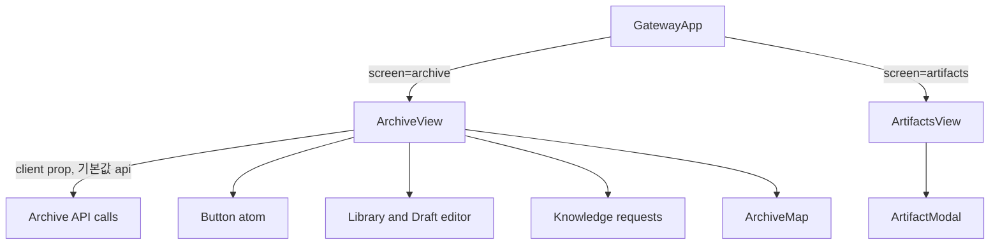
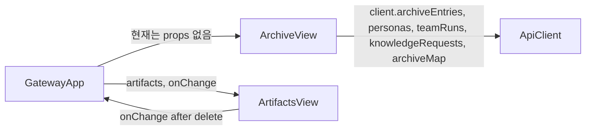

# ArchiveView Component Analysis

## 요약

- Root: `frontend/src/components/organisms/ArchiveView/index.jsx`
- Modes: `understand`, `refactor`
- Verdict: ArchiveView가 Archive 내부 탭 전환과 Archive API 요청을 이미 소유하므로, 기존 `ArtifactsView`를 새 탭에 합성하는 것이 최소 변경이다. Artifact API와 파일 수명주기는 이 컴포넌트에 흡수하지 않는다.

## 범위

| 항목 | 경로 | 메모 |
|---|---|---|
| 분석 대상 | `frontend/src/components/organisms/ArchiveView/index.jsx` | Archive 탭, 데이터 로드, Library/Requests/Map 렌더링 |
| 재사용 대상 | `frontend/src/components/organisms/ArtifactsView/index.jsx` | Artifact 필터·미리보기·삭제 후 갱신 UI |
| 공유 leaf primitive | `frontend/src/components/atoms/Button/index.jsx` | ArchiveView의 발행·요청·상태 변경 액션에 쓰이는 공용 button contract |
| 호출부 | `frontend/src/components/containers/GatewayApp/index.jsx` | `screen === "archive"`에서 ArchiveView를 렌더링하고, 별도 `screen === "artifacts"` 분기를 보유 |
| 내비게이션 | `frontend/src/components/organisms/Sidebar/index.jsx` | `NAV`에 `artifacts`, `archive`를 각각 등록 |
| 테스트 | `frontend/src/components/organisms/ArchiveView/ArchiveView.test.jsx` | Library/Drafts/Map/Requests 사용자 흐름 |
| 테스트 | `frontend/src/components/organisms/ArtifactsView/ArtifactsView.test.jsx` | 유형 필터, 미리보기, 문서 필터, 이미지 thumbnail, modal |
| 테스트 | `frontend/src/components/containers/GatewayApp/GatewayApp.test.jsx` | 화면별 API bootstrap 및 Artifacts API mocking |
| 테스트 | `frontend/src/components/organisms/Sidebar/Sidebar.test.jsx` | Sidebar 항목과 활성 상태 |

## 컴포넌트 트리

## Props 흐름

`ArchiveView`는 테스트 가능성을 위해 `client` prop을 받고 기본값으로 `api`를 사용한다. 반면 `ArtifactsView`는 `artifacts` 배열과 갱신 콜백을 부모로부터 받는다. 따라서 Artifacts 탭 추가 시 ArchiveView에 `artifacts`와 `onArtifactChange`만 전달하고, GatewayApp은 데이터를 로드·갱신하는 현재 책임을 유지하는 것이 맞다.

## 상태 / Effects

| 상태·hook | 역할 |
|---|---|
| `tab` | Library, Drafts, Map, Requests 중 현재 Archive 영역을 전환한다. |
| `client` prop | 호출부가 생략하면 모듈 `api`를 기본값으로 사용한다. ArchiveView 테스트는 이 prop으로 API 결과를 주입한다. |
| `loadData` + `useEffect` | Archive entries/drafts, personas, requests, team runs, map을 병렬로 불러온다. |
| `entries`, `drafts`, `requests`, `teamRuns`, `graph` | Archive 고유 화면과 Map/요청 액션의 데이터 원본이다. |
| `visibleRequests` | `requestFilter`와 요청 status에서 활성/전체 목록을 파생한다. |
| `documentationTeams` | `teamRuns`에서 continuous, plan-and-execute, triggered, not-canceled 조건을 만족하는 Team Run을 `useMemo`로 추린다. 요청 위임 select와 Send to team enablement를 제어한다. UI의 “documentation team” 라벨은 이 실행 조건을 만족하는 Run을 의미하며 별도 documentation 유형 검증은 하지 않는다. |
| `visibleEntries` | `tab`에 따라 draft 또는 published entry 목록을 선택한다. |
| `ArchiveMap`의 `layout` | `graph.nodes`에서 `useMemo`로 위치와 그룹을 만들며 Map node 선택의 렌더링 기준이 된다. |
| `ArtifactsView`의 `type`, `selectedId` | Artifact 필터와 모달 선택을 소유한다. Archive 탭 전환 상태와 섞을 필요가 없다. |
| `GatewayApp`의 `artifacts` + screen effect | `/api/artifacts` 결과를 보관하며 현재 독립 Artifacts 화면 및 Chat의 경로 등록에 공급한다. |

## 외부 의존성과 사용자 상호작용

- React `useState`, `useEffect`, `useCallback`, `useMemo`는 탭 상태와 Archive API 로드·파생 목록을 관리한다. 외부 상태 저장소나 라우터는 사용하지 않는다.
- `api` client는 ArchiveView의 기본 데이터 공급자다. 테스트에서는 `client`를 주입해 네트워크 없이 상호작용을 검증한다.
- 사용자가 Archive 탭 버튼을 누르면 `setTab`만 호출되고, 이미 로드된 Archive 데이터로 해당 패널이 렌더링된다.
- 사용자가 Artifact 카드·필터를 조작하면 ArtifactsView 내부 상태가 바뀌며, 삭제가 끝난 경우에만 부모의 `onChange`가 호출된다.
- `Button` atom은 ArchiveView의 재사용 가능한 action surface를 제공하며, 발행·위임·상태 변경을 native button semantics로 전달한다.

### 주요 상호작용 흐름

1. **Library 발행·수정**: 사용자가 New entry 또는 기존 entry를 선택하면 `form`, `editingId`, `revisions`가 갱신된다. submit은 신규인 경우 `client.publishArchiveEntry`, 기존인 경우 `client.reviseArchiveEntry`를 호출하고 `loadData()`로 canonical 목록을 갱신한다.
2. **Knowledge Request 위임·상태 변경**: Requests 탭에서 사용자가 documentation team을 선택하고 Send to team을 누르면 `client.delegateKnowledgeRequest`가 호출된다. Later, Dismiss, Reopen은 `client.setKnowledgeRequestStatus`를 호출하며 `requestBusyId`가 중복 액션을 막는다.
3. **Map 탐색**: Map의 node button 선택은 `selectedNodeId`를 바꾸고, ArchiveMap은 해당 entry 또는 request의 세부 액션을 표시한다. 사용자는 여기서 entry 편집 또는 request의 Library 작성 흐름으로 진입할 수 있다.
4. **Artifact 관리**: Artifacts 탭에서 type chip은 `type`을 바꾸고, 카드 클릭은 `selectedId`로 ArtifactModal을 연다. 삭제 완료 시 ArtifactsView가 전달받은 `onArtifactChange`를 호출해 GatewayApp의 `/api/artifacts` 재조회로 목록을 갱신한다.

## 리팩터링 판단

| 판단 | 근거 | 노력·위험 | 다음 단계 |
|---|---|---|---|
| 유지 | `ArtifactsView`는 Artifact 관리와 모달을 단일 소유하며, `ArchiveView`는 Archive 탭 컨테이너 역할을 한다. | 낮음·낮음 | 새 tab panel에서 기존 ArtifactsView를 재사용한다. |
| 호출부 흡수 | `GatewayApp`의 독립 `screen === "artifacts"` 분기는 Archive 하위 탐색으로 대체된다. `Sidebar`의 `NAV` 항목도 함께 제거해야 dead route가 남지 않는다. | 낮음·낮음 | 독립 메뉴·화면 분기만 제거한다. |
| 프레젠테이션 분해 보류 | ArchiveView의 Library/Drafts/Map/Requests 렌더링은 이미 크지만, 이번 변경은 새 UI를 만들지 않고 기존 organism을 삽입한다. 별도 분해는 범위 밖이다. | 중간·중간 | 기존 branch를 손대지 않는다. |
| 반복 제거(DRY) 없음 | 탭 버튼은 네 개뿐이며 label, count, 접근성 이름이 달라 descriptor 추상화가 이번 변경의 가독성을 높이지 않는다. | 해당 없음 | 새 Artifacts 버튼도 기존 명시적 패턴을 따른다. |
| pure helper 추출 없음 | Artifact 안내문은 한 번만 쓰는 정적 문구다. 별도 helper나 shared component는 불필요하다. | 해당 없음 | tab panel 안에 직접 둔다. |

## 권장 후속 작업

1. `ArchiveView`에 `artifacts`, `onArtifactChange` props와 `artifacts` 탭을 추가하고, 탭 패널 상단에 사용자 승인 문구를 넣는다.
2. `GatewayApp`에서 Archive 화면을 위한 Artifact 로드와 props 전달을 추가하고, 독립 Artifacts 화면 분기는 제거한다.
3. `Sidebar.NAV`에서 Artifacts 항목을 제거한다.
4. ArchiveView, Sidebar, GatewayApp 테스트에 메뉴 제거·탭 접근·기존 Artifact 관리 렌더링을 검증하는 RED case를 추가한다.

## 스킬 핸드오프

- `writing-plans`: 위 경계와 테스트를 바탕으로 최소 구현 순서를 작성한다.
- 구현 시 `superpowers:test-driven-development`: 새 탭과 독립 메뉴 제거의 회귀 사례를 먼저 테스트로 고정한다.

## 리뷰

- Verdict: PASS
- Rounds: 3
- Fixed: Button leaf, ArchiveView의 memoized derivations와 client 주입 경로, Archive 상호작용 흐름, ArtifactsView/GatewayApp/Sidebar 테스트 인벤토리를 보강했고, Team Run 필터가 documentation 유형을 보장한다는 부정확한 표현을 실행 조건 기반으로 바로잡았다. 독립 재검토가 PASS로 확인했다.

## 근거

- `frontend/src/components/organisms/ArchiveView/index.jsx:292-361, 552-594, 880-895`
- `frontend/src/components/organisms/ArtifactsView/index.jsx:12-77`
- `frontend/src/components/containers/GatewayApp/index.jsx:287-300, 981-991`
- `frontend/src/components/organisms/Sidebar/index.jsx:3-12`
- `frontend/src/components/organisms/ArchiveView/ArchiveView.test.jsx`
- `frontend/src/components/organisms/ArtifactsView/ArtifactsView.test.jsx`
- `frontend/src/components/containers/GatewayApp/GatewayApp.test.jsx`
- `frontend/src/components/organisms/Sidebar/Sidebar.test.jsx`
- Docs registry: `personal-agent-gateway/package.json`이 없어 `pnpm docs:registry`를 실행하지 않았다.
