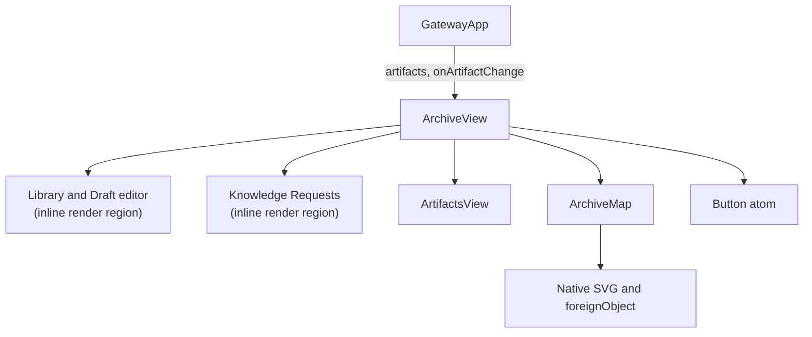
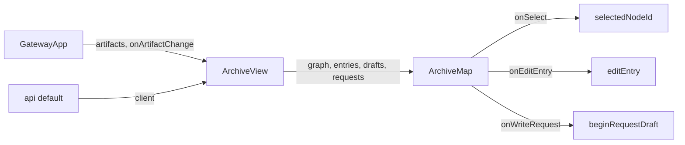
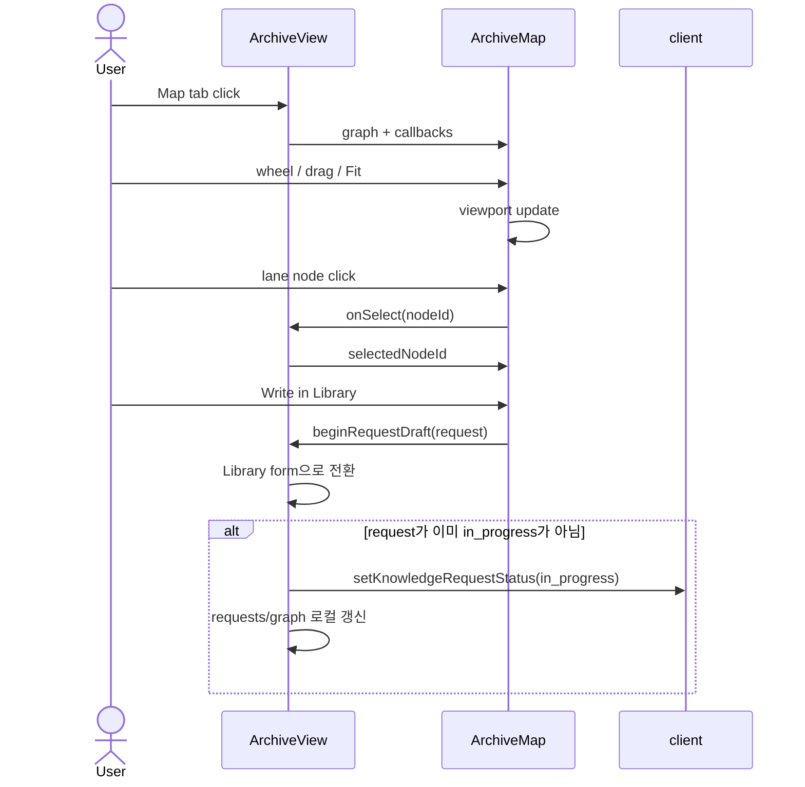

# ArchiveView Knowledge Lane Map Analysis

## 요약

- Root: `frontend/src/components/organisms/ArchiveView/index.jsx`
- Modes: `understand`, `refactor`
- Verdict: Archive 데이터와 사용자 액션은 `ArchiveView`가 계속 소유하고, 그래프 해석·viewport 상호작용·SVG 렌더링은 같은 파일의 `ArchiveMap`이 맡는 현재 경계를 유지한다. 맵은 연결된 source만 knowledge lifecycle별 lane으로 묶는 것이 기존 API를 바꾸지 않는 최소 변경이다.

## 범위

| 항목 | 경로 | 메모 |
|---|---|---|
| 분석 대상 | `frontend/src/components/organisms/ArchiveView/index.jsx` | Archive 탭, API 상태, `ArchiveMap`, lane layout |
| 호출부 | `frontend/src/components/containers/GatewayApp/index.jsx` | Archive 화면에서 artifacts와 갱신 callback을 주입 |
| API leaf | `frontend/src/api/client.js` | Archive REST client |
| 로컬 child | `frontend/src/components/organisms/ArtifactsView/index.jsx` | Artifact 탭 소유 |
| 공유 leaf | `frontend/src/components/atoms/Button/index.jsx` | 발행·위임·상태 변경 action |
| 스타일 | `src/personal_agent_gateway/static/styles.css` | Archive와 SVG map class |
| 테스트 | `frontend/src/components/organisms/ArchiveView/ArchiveView.test.jsx` | Archive lifecycle, lane 구분, zoom 회귀 |

## 컴포넌트 트리

`ArchiveMap`은 별도 export가 아닌 feature-local child다. `ArtifactsView`와 `Button`은 공개 props만 확인하는 leaf로 취급했다.

## Props 흐름

- `client`는 기본값이 `api`이며 테스트에서는 `makeClient()` mock을 주입한다.
- `artifacts`와 `onArtifactChange`는 `GatewayApp`에서 오고 `ArtifactsView`로 그대로 전달된다.
- `ArchiveMap`은 서버 변경을 직접 수행하지 않고 선택·편집·작성 callback만 부모에 돌려준다.

## 상태 / Effects

| 상태·hook·외부 callback | 이 컴포넌트에서의 역할 |
|---|---|
| `loadData` (`useCallback`) | entries, drafts, personas, requests, team runs, graph를 `Promise.all`로 병렬 조회한다. |
| 초기 `useEffect` | `client`가 바뀌면 `loadData(true)`를 실행한다. |
| `tab` | Library/Drafts/Artifacts/Map/Requests 중 렌더할 panel을 고른다. |
| `entries`, `drafts` | published Library와 private review queue의 원본이며, Map inspector의 entry lookup에도 쓰인다. |
| `personas` | entry scope checkbox 목록과 persona 선택 가능 여부를 제어한다. |
| `requests`, `teamRuns`, `selectedTeams`, `requestBusyId` | 요청 상태 변경과 documentation team 위임을 제어한다. |
| `graph`, `selectedNodeId` | Map 데이터와 inspector 선택을 보관한다. |
| `loading`, `listLoading`, `saving` | 초기 화면, Library 검색 submit, publish/revise submit의 busy UI와 중복 action 방지를 담당한다. |
| `error`, `notice` | API/validation 실패 alert와 publish/delegate 안내 status를 표시한다. |
| `query`, `kindFilter` | Library search API에 전달할 title/content/tag query와 entry kind를 보관한다. |
| `requestFilter` | active request만 볼지 전체 request를 볼지 결정한다. |
| `editingId`, `form`, `revisions` | 신규 작성, 기존 entry/draft 편집, revision history와 publish payload를 소유한다. |
| `activeRequestCount`, `visibleRequests` | request status에서 header/tab count와 현재 Requests 목록을 파생한다. |
| `documentationTeams` (`useMemo`) | continuous + plan-and-execute + triggered + not-canceled Team Run만 위임 후보로 파생한다. |
| `editingDraft`, `visibleEntries` | 현재 editor가 private draft review인지와 Library/Drafts 목록의 데이터 원본을 파생한다. |
| `ArchiveMap.layout` (`useMemo`) | nodes/edges를 section과 knowledge lane 좌표로 변환한다. |
| `ArchiveMap.nodeById` (`useMemo`) | edge 렌더 중 target node 반복 탐색을 O(1) lookup으로 바꾼다. |
| `ArchiveMap` wheel `useEffect` | `{ passive: false }` native listener로 cursor 중심 zoom과 기본 scroll 차단을 구현한다. |
| `canvasRef`, `dragRef`, `viewport` | SVG canvas wheel zoom, pointer pan, Fit 상태를 관리한다. |

Custom hook, store selector, dispatch action, router는 사용하지 않는다. 외부에서 주입되는 동작은 `client`, `onArtifactChange`, 그리고 `ArchiveMap`에 내려가는 세 callback뿐이다.

## 외부 의존성과 primitive

- React `useState`는 Archive 폼/탭과 Map viewport처럼 사용자 입력에 따라 바뀌는 값을 보관한다.
- React `useEffect`는 초기 Archive 데이터 로드와 native wheel listener 등록·해제를 담당한다.
- React `useMemo`는 graph layout, node lookup, documentation team 필터처럼 입력이 바뀔 때만 다시 계산할 파생값에 사용한다.
- React `useCallback`은 `client`에 종속된 `loadData`를 effect의 안정된 dependency로 만든다.
- Native SVG `g`, `path`, `text`, `foreignObject`는 외부 graph library 없이 lane, connector, HTML button을 한 좌표계에서 렌더한다. `foreignObject` 안의 실제 button이 keyboard와 accessible name을 보존한다.
- `api` client는 REST 호출을 캡슐화하며, `ArchiveView`는 반환 데이터와 busy/error 상태를 화면 lifecycle로 조정한다.

## 주요 상호작용 흐름

1. 초기 mount에서 여섯 API 요청을 병렬 실행하고 각 탭의 canonical state를 채운다.
2. Map tab은 이미 받은 `graph`를 section/lane으로 파생한다. wheel·pointer 이벤트는 서버 상태와 무관하게 `viewport`만 갱신한다.
3. source/node 선택은 `selectedNodeId`를 바꾸고 inspector가 entry/request를 찾아 다음 action을 제공한다.
4. **Library 검색과 entry 열기**: Search submit은 `query`/`kindFilter`로 `client.archiveEntries`를 호출해 `entries`만 교체한다. entry click은 `editingId`/`form`/tab을 먼저 바꾸고 `client.archiveEntryRevisions`로 revision history를 채운다.
5. **발행·수정**: form submit은 persona scope가 비어 있으면 API 전에 validation error를 낸다. 신규는 `publishArchiveEntry`, 기존은 `reviseArchiveEntry`를 호출하고, revision을 다시 읽은 뒤 `loadData()`로 entries/drafts/requests/graph를 동기화한다.
6. **request 직접 작성**: `beginRequestDraft`는 form과 Library tab을 먼저 갱신한다. 이미 `in_progress`면 끝나고, 아니면 `setKnowledgeRequestStatus` 후 `requests`와 request node meta를 로컬 갱신한다.
7. **request 위임**: team select는 `selectedTeams`를 바꾼다. Send는 `delegateKnowledgeRequest` 후 `loadData()`를 호출하고, 가능한 team이 없으면 API 전에 error를 표시한다.
8. **Later/Dismiss/Reopen**: 각 button은 `changeRequestStatus`를 통해 `setKnowledgeRequestStatus`를 호출한 뒤 `loadData()`로 목록과 graph를 갱신한다.
9. **fulfilled entry 열기**: Open Library entry는 `fulfilled_by_entry_id`로 현재 `entries`를 찾은 뒤 `editEntry` 흐름으로 들어가며, 현재 목록에 없으면 error를 표시한다.

## 리팩터링 판단

| 판단 | 근거 | 노력·위험 | 안전한 다음 단계 |
|---|---|---|---|
| 유지 | `ArchiveMap`은 graph 해석과 viewport를, `ArchiveView`는 API와 Archive workflow를 소유한다 (`index.jsx:318`, `index.jsx:673`). | 없음 | 이번 변경에서 ownership 경계를 더 나누지 않는다. |
| pure helper 추출 | lane section, layout, edge path/label 계산은 render 밖의 pure function으로 이미 분리돼 있다 (`index.jsx:113-315`). | 낮음·낮음 | feature-local helper와 lane tests를 유지한다. |
| 반복 제거(DRY) | Archive tab button 5개가 role, selected class, click, count 구조를 반복한다 (`index.jsx:951-1005`). descriptor array로 줄일 수 있다. 반면 full node는 `renderNode`가 이미 request/team/result 반복을 제거했다. | 낮음·낮음 | Map 변경과 무관하므로 이번에는 유지하고, 탭 변경 요구가 생기면 RED test 후 descriptor map을 검토한다. |
| 프레젠테이션 분해 | `ArchiveView` render는 Library editor와 Requests list라는 큰 inline region을 포함한다 (`index.jsx:1011-1487`). | 큼·중간 | 상태/API 경계 이동이 필요하므로 별도 요구와 계획 없이는 분리하지 않는다. |
| 유지 | knowledge lane layout과 SVG class는 Archive graph kind 계약에 종속되고 사용처가 `ArchiveMap` 하나뿐이다. | 없음 | shared로 승격하지 않고 feature-local로 둔다. |

코드 수준 스캔에서 tab sibling 반복과 긴 inline render region을 확인했다. Map edge target의 고비용 반복 `find`는 `nodeById` memo로 제거됐고, Map의 좌표·라벨 derivation은 pure helper로 분리돼 있다.

## 권장 후속 작업

1. 현재 lane/section/connector test를 유지해 unrelated persona 재노출과 arrow marker 회귀를 막는다.
2. 실제 데이터가 많은 환경에서 lane 높이와 Fit 결과를 눈으로 확인한다. 별도 library 도입이나 API 변경은 현재 근거로 필요하지 않다.

## 스킬 핸드오프

- 추가 구조 변경이 요청될 때만 `developing-plans-with-solid`로 ArchiveView의 Library/Requests 분리 계획을 검토한다. 현재 Map 수정에는 추가 handoff가 필요하지 않다.

## 리뷰

- Verdict: PASS
- Rounds: 2
- Fixed: 1차 리뷰에서 누락된 root state/derivation, request 작성 순서와 refresh 방식, Library·Request 주요 상호작용, inline render region 표기, 정확한 refactor label과 tab 반복 판단을 보강했고 2차 독립 재검토에서 PASS를 받았다.

## 근거

- `frontend/src/components/organisms/ArchiveView/index.jsx:113-315,318-668,673-1487`
- `frontend/src/components/containers/GatewayApp/index.jsx:986-992`
- `frontend/src/api/client.js:263-265`
- `frontend/src/components/organisms/ArchiveView/ArchiveView.test.jsx:141-430`
- `src/personal_agent_gateway/static/styles.css:5016-5350`
- `src/personal_agent_gateway/archive.py:884-978`
- Search: `rg -n "ArchiveView" frontend/src`
- Verification: ArchiveView tests 14/14, full frontend tests 332/332, `npm run build` 성공
