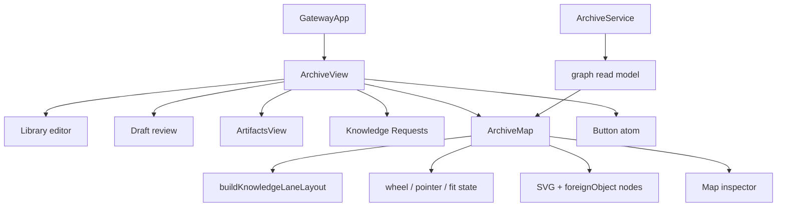
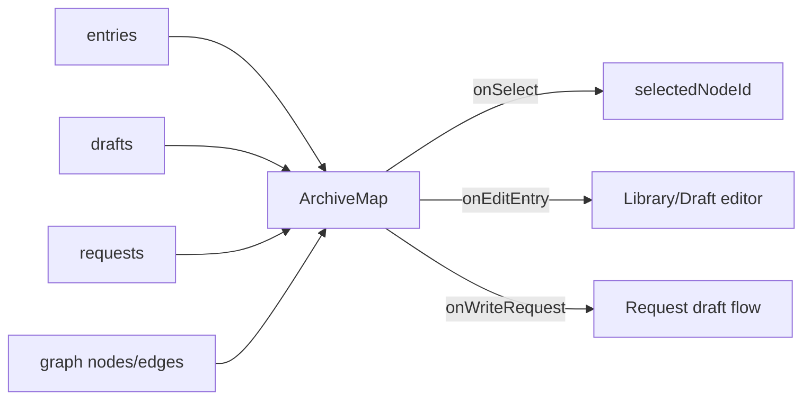
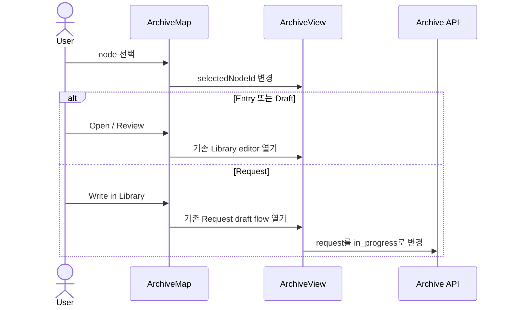
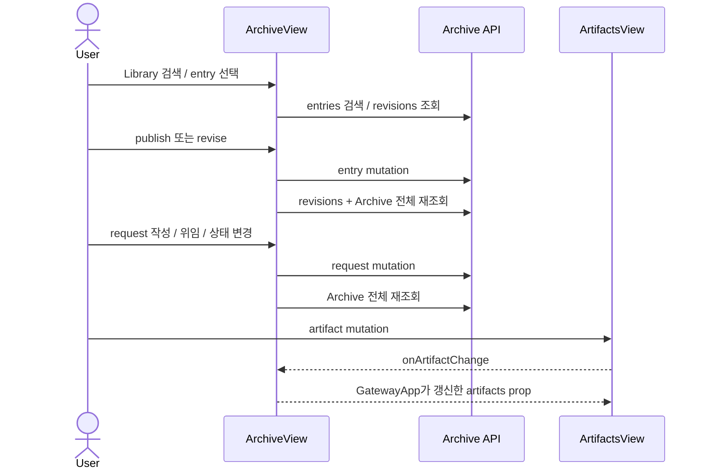
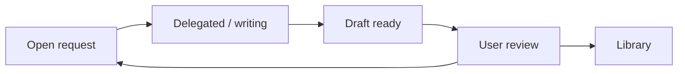

# ArchiveView Map 구조 및 제거 가능성 분석

## 요약

- Root: `frontend/src/components/organisms/ArchiveView/index.jsx`
- Modes: `understand`, `refactor`, `remove`, `api-state`
- Verdict: 현재 Map은 유지·확장보다 **Archive의 기본 제품 흐름에서 제거하는 편이 낫다.** Map은 별도 지식이나 관계를 소유하지 않고 Library, Drafts, Requests, Team Runs를 다시 투영한다. 여러 엔티티를 한 화면에 모은 시각적 개요는 고유하지만, 사용자가 수행할 수 있는 액션은 Library와 Requests 탭에 이미 있다.
- 개요가 필요하면 범용 그래프가 아니라 `Request → Delegation → Draft → Review → Library` 상태 보드로 다시 정의한다.

## 분석 범위

| 항목 | 경로 | 역할 |
| --- | --- | --- |
| 대상 컴포넌트 | `frontend/src/components/organisms/ArchiveView/index.jsx` | Archive 전체 탭, Map layout·viewport·inspector |
| 호출부 | `frontend/src/components/containers/GatewayApp/index.jsx` | Archive 화면을 렌더하고 Artifact 갱신을 주입 |
| Navigation | `frontend/src/components/organisms/Sidebar/index.jsx` | Archive 단일 진입점 |
| API client | `frontend/src/api/client.js` | `/api/archive/map` 호출 |
| Backend read model | `src/personal_agent_gateway/archive.py` | Archive entity를 node/edge graph로 재구성 |
| API route | `src/personal_agent_gateway/api/archive.py` | Map read model 노출 |
| 스타일 | `src/personal_agent_gateway/static/styles.css` | Map SVG, node, edge, inspector, responsive style |
| 테스트 | `frontend/src/components/organisms/ArchiveView/ArchiveView.test.jsx`, `tests/test_archive.py`, `tests/test_api_archive.py` | layout·zoom·edge·API graph 계약 |

Repository 검색에서 `ArchiveView`의 production 호출부는 `GatewayApp` 하나이고, `/api/archive/map`의 frontend consumer도 `ArchiveView` 하나다.

## 현재 컴포넌트 트리

`ArchiveView`는 1,549줄이며 Map helper와 child가 `index.jsx:100-671`을 차지한다. Map 전용 backend graph는 `archive.py:857-1095`, 스타일은 주로 `styles.css:5132-5462`, frontend Map test는 `ArchiveView.test.jsx:221-389`에 집중된다.

## Props와 상태 흐름

| 상태·hook | 역할과 판단 |
| --- | --- |
| `graph` | Map 전용 중복 read model. `entries`, `drafts`, `requests`, `teamRuns`와 동시에 보관한다. |
| `selectedNodeId` | Map inspector 전용 상태다. Map 제거 시 함께 사라진다. |
| `viewport`, `canvasRef`, `dragRef` | Map 전용 zoom·pan·fit 상태다. 도메인 상태와 무관하다. |
| `buildKnowledgeLaneLayout` | generic graph를 다시 4개 고정 column과 3개 section으로 바꾼다. |
| `loadData` | Archive 진입 시 탭과 무관하게 entries, drafts, personas, requests, team runs, graph 여섯 요청을 병렬 호출한다. |
| `beginRequestDraft` | request와 graph node를 각각 로컬 갱신한다. 같은 사실을 두 client state에 반영한다. |

Custom hook, router, store selector는 없다. React state와 native SVG event를 한 파일에서 직접 관리한다.

## ArchiveView 전체 props, 상태 및 API 경계

분석 root는 `ArchiveMap`이 아니라 `ArchiveView`이므로 Map 밖의 Library·Draft·Artifact·Request 상태도 함께 봐야 한다.

| props·외부 callback | 흐름 |
| --- | --- |
| `client = api` | Archive entry, request, persona, team run, map API를 호출한다. 테스트에서는 `makeClient()`가 주입된다. |
| `artifacts = []` | `GatewayApp`이 소유한 Artifact 목록을 받아 `ArtifactsView`로 전달한다. |
| `onArtifactChange` | `ArtifactsView` mutation 뒤 `GatewayApp`의 Artifact collection을 다시 읽는 callback이다. `ArchiveView`가 Artifact source of truth를 소유하지 않는다. |

| 상태·파생값 | 역할 |
| --- | --- |
| `tab` | Library, Drafts, Artifacts, Map, Requests panel을 전환한다. |
| `entries`, `drafts` | published entry와 private review queue의 canonical client collection이다. |
| `personas` | Library scope 선택지를 제공한다. |
| `requests`, `teamRuns` | knowledge gap 상태와 documentation team 위임 후보의 원본이다. |
| `selectedTeams`, `requestBusyId` | request별 위임 대상과 mutation busy 상태를 가진다. |
| `graph`, `selectedNodeId` | Map 전용 중복 read model과 inspector 선택이다. |
| `loading`, `listLoading`, `saving` | 초기 전체 조회, Library 검색, publish/delete 작업을 구분한다. |
| `error`, `notice` | API·validation 오류와 사용자 안내를 화면 전체에서 공유한다. |
| `query`, `kindFilter` | published Library server search 조건이다. |
| `requestFilter` | active request와 전체 request 표시를 전환한다. |
| `editingId`, `form`, `revisions` | 새 문서, draft review, published revision 편집과 revision history를 소유한다. |
| `activeRequestCount`, `visibleRequests` | request status에서 tab count와 목록을 파생한다. |
| `documentationTeams` | continuous + plan-and-execute + triggered + not-canceled Team Run만 위임 후보로 파생한다. |
| `editingEntry`, `editingDraft`, `visibleEntries` | 현재 editor 대상과 Library/Drafts 목록을 파생한다. |

| API·action | 상태 전이 |
| --- | --- |
| 초기 `loadData(true)` | entries, drafts, personas, requests, team runs, graph 여섯 API를 병렬 조회하고 각 collection을 교체한다. |
| `searchLibrary` | query/kind로 published entries만 다시 읽고 `entries`를 교체한다. |
| `editEntry` | editor state를 먼저 바꾸고 선택 entry의 revision history를 조회한다. |
| `publishEntry` | persona scope를 client에서 검증한 뒤 신규 publish 또는 revise, revisions 재조회, `loadData()` 순으로 동기화한다. |
| `deleteEntry` | browser confirm 후 draft/published entry를 삭제하고 editor를 비운 뒤 `loadData()`를 호출한다. |
| `beginRequestDraft` | request를 form outline으로 바꾸고 Library로 이동한다. 필요하면 status를 `in_progress`로 바꾸고 `requests`와 `graph`를 각각 로컬 갱신한다. |
| `changeRequestStatus` | Later/Dismiss/Reopen status mutation 후 `loadData()`를 호출한다. |
| `delegateRequest` | documentation Team Run에 request를 위임하고 `loadData()`를 호출한다. |
| `openFulfilledEntry` | fulfilled entry를 현재 `entries`에서 찾아 기존 editor 흐름으로 이동한다. 검색 결과에 없으면 오류가 된다. |
| Artifact mutation | `ArtifactsView`가 주입받은 `onArtifactChange`를 호출하며 Archive local state는 바꾸지 않는다. |

### React와 외부 primitive

| primitive | 사용 이유 |
| --- | --- |
| `useState` | 탭, collection, editor, request busy, Map viewport처럼 사용자·API 반응 상태를 보관한다. |
| `useEffect` | 초기 `loadData(true)`와 Map native wheel listener 등록·정리를 수행한다. |
| `useCallback` | `client`에 종속된 `loadData`를 initial effect의 안정된 dependency로 만든다. |
| `useMemo` | documentation team filter, Map lane layout, node lookup을 입력 변경 시에만 다시 계산한다. |
| `useRef` | SVG canvas와 pointer drag 시작점을 render 밖에 보관한다. |
| `window.confirm` | draft/published document 삭제를 구분해 확인한다. |
| Native SVG·`foreignObject` | edge와 HTML button을 한 좌표계에서 렌더한다. |
| `ArtifactsView` | Artifact 검색·미리보기·삭제 UI를 feature child로 위임한다. |
| `Button` | Archive action의 공통 atom이다. |

## 현재 상호작용

Map inspector의 `Review draft`, `Open in Library`, `Write in Library`는 각각 기존 Drafts/Library/Requests 탭의 액션으로 이동하는 shortcut이다. Map 자체의 mutation은 없다.

Map 밖의 주요 workflow는 다음과 같다.

## 구조가 이상하게 느껴지는 이유

### 1. 그래프처럼 보이지만 실제 모델은 고정 pipeline이다

Backend는 scope, persona, hook, request, team run, entry, draft를 generic node/edge로 만든다. Frontend는 이를 다시 `SOURCE → KNOWLEDGE REQUEST → DOCUMENTATION TEAM → DRAFT/LIBRARY` 네 열로 환원한다. 결과적으로 graph contract와 lane contract를 모두 유지하지만 자유로운 관계 탐색은 제공하지 않는다.

### 2. edge 의미가 실제 사실보다 강하다

Backend의 `uses` edge는 실제 Persona 사용 기록이 아니라 Library binding을 뜻한다 (`archive.py:994-1017`). Frontend는 request/delegation 이외의 기본 edge를 `PUBLISHED`로 표시한다 (`ArchiveView/index.jsx:298-308`). 따라서 그림은 관측된 사용 관계나 지식 의존성처럼 보이지만 실제로는 공개 범위와 생성 provenance를 섞어 표현한다.

### 3. 동일 상태를 두 번 파생한다

Backend `graph()`가 Archive 데이터를 graph로 재구성하고, frontend `buildKnowledgeLaneLayout()`이 다시 lane으로 재구성한다. `beginRequestDraft()`는 `requests`와 `graph.nodes[].meta`를 모두 갱신한다 (`index.jsx:777-796`). 새 상태나 edge kind가 추가될 때 두 파생 모델과 테스트를 함께 고쳐야 한다.

### 4. 데이터 증가 계약이 불완전하다

`ArchiveService.graph(limit=100)`은 published entries, drafts, requests를 각각 제한하지만 결과에 truncation이나 cursor를 포함하지 않는다 (`archive.py:857-877`). 데이터가 늘면 Map이 전체 관계처럼 보이면서 일부만 표시할 수 있다.

### 5. 표시 비용에 비해 고유 가치가 작다

Map은 custom SVG, `foreignObject`, wheel listener, pointer capture, zoom/pan/fit, 고정 좌표와 반응형 CSS를 소유한다. 직접 관련된 production·style·test 코드는 대략 1천 줄 이상이지만 고유 action이나 source of truth는 없다.

## 제거 영향 분석

| 범위 | 제거/변경 대상 | 영향 |
| --- | --- | --- |
| UI | Map tab, `ArchiveMap`, layout·edge helper, `selectedNodeId` | 통합 시각 개요는 사라지지만 Library, Drafts, Artifacts, Requests의 mutation workflow에는 기능 손실 없음 |
| 초기 조회 | `client.archiveMap()`과 `graph` state | `ArchiveView` 소유 요청은 6개→5개, `GatewayApp`의 Artifact 조회까지 포함한 screen total은 7개→6개로 감소. 이후 탭별 lazy load를 적용하면 더 줄일 수 있음 |
| API | `client.archiveMap`, `GET /api/archive/map` | repository 내부 frontend consumer는 사라짐. 외부 API consumer가 있는지는 별도 확인 필요 |
| Backend | `ArchiveService.graph()` | Library/Request CRUD와 publish workflow에는 사용되지 않음 |
| Style | `.archive-map-*` | Map 전용 selector 제거 가능 |
| Test | Map rendering·layout·zoom tests, backend graph tests | Library/Draft/Request workflow tests는 유지 |

완전 삭제의 안전 순서는 UI 진입점 제거 → repository 및 외부 consumer 확인 → API deprecation 또는 제거 → dead code/style/test 제거다. 외부 consumer 여부를 모르면 route를 한 릴리스 동안 유지할 수 있다.

추가로 함께 정리할 repository 의존성은 `frontend/src/api/client.test.js:616,636`, `frontend/src/components/containers/GatewayApp/GatewayApp.test.jsx:152`, Map focus selector `styles.css:4752`, legend selector `styles.css:5207-5221`이다.

현재 `ArchiveMap`의 `graph`, `entries`, `drafts`, `requests`, `selectedNodeId`, `onSelect`, `onEditEntry`, `onWriteRequest` prop은 모두 실제로 사용되므로 선행 dead prop은 없다. Map 제거 시 부모의 `graph`·`selectedNodeId` state, `setSelectedNodeId`·`editEntry`·`beginRequestDraft` callback wiring 중 Map 전용 전달부가 함께 orphan되며, `editEntry`와 `beginRequestDraft` 함수 자체는 Library/Requests에서 계속 사용한다.

수용하는 손실은 mutation workflow가 아니라 cross-domain overview다. Map만 한 화면에 모으는 binding/provenance는 사라지고, 제안 상태 보드는 request에서 시작하지 않은 direct Library 문서와 hook-origin 문서를 의도적으로 제외한다. 이 손실은 현재 Map edge가 실제 사용과 공개 범위를 혼합하고, 별도 사용 근거가 없으며, 각 문서·request의 원본 정보는 남는다는 이유로 수용 가능하다고 판단했다. 통합 provenance 탐색이 실제 핵심 사용으로 확인되면 삭제 대신 의미가 정확한 별도 read model을 설계해야 한다.

## 대체 구조

개요가 실제로 필요하다면 다음 상태 보드가 더 직접적이다.

- 한 행의 root는 `KnowledgeRequest`다.
- 열은 `Open`, `In progress`, `Draft ready`, `Published/Closed`처럼 실제 status를 사용한다.
- source, 담당 Team Run, 최신 draft/entry, 실패 사유와 다음 action을 같은 행에 둔다.
- request에서 시작하지 않은 일반 Library 문서는 Library 목록에만 둔다.
- pan/zoom과 generic node/edge API는 만들지 않는다.

이 구조는 현재 Requests 카드가 이미 가진 outline, source hints, delegation, failure, reopen, fulfilled-entry action을 재배치하는 수준이라 별도 graph 도메인이 필요 없다.

## 리팩터링 판단

| 판단 | line-level 근거 | 노력·위험 | 권장 |
| --- | --- | --- | --- |
| **Map 제거** | helper·layout·render가 `index.jsx:100-671`, tab wiring이 `1014-1023,1341-1353`에 닫혀 있다. | 중간·낮음. 통합 provenance 개요는 사라지며 API external consumer 확인이 필요하다. | 우선순위 P0 |
| **pure helper 유지/삭제** | form·label helper는 `29-98`, Map pure layout helper는 `100-315`에 render 밖으로 이미 분리돼 있다. 추가 inline calculation을 shared helper로 뺄 근거는 없다. | Map 유지 시 낮음·낮음, 제거 시 함께 삭제 | shared로 승격하지 않는다. |
| **render-body 분해** | main render `945-1549` 안에 Library editor(`1043-1325`)와 Requests card/action(`1356-1546`)이 큰 inline region으로 남아 있다. | 중간·중간. 상태 ownership 이동 시 회귀 가능 | Map 제거 후 feature-local panel boundary를 검토한다. |
| **반복 제거(DRY)** | 동일한 role/aria/class/click/count tab JSX가 `983-1033`에서 5회 반복된다. | 낮음·낮음 | 탭 구조 변경 시 descriptor array로 함께 정리한다. 단독 리팩터링은 불필요하다. |
| **refresh 경계 정리** | publish/delete/status/delegate가 mutation 뒤 `loadData()`로 모든 collection을 재조회한다 (`843,872,901,928`). | 중간·중간. 부분 갱신과 server truth 불일치 위험 | panel query 분리와 함께 invalidation 범위를 좁힌다. |
| **탭별 조회** | mount에서 여섯 domain request를 항상 수행한다 (`696-726`). | 중간·중간. tab count와 cross-action에 필요한 최소 collection 결정 필요 | active tab별 load/cache |
| **상태 보드 도입은 조건부** | 사용자가 전체 knowledge workflow를 자주 확인한다는 사용 근거가 아직 없다. | 중간·중간 | Map 제거 후 실제 필요가 확인될 때만 추가 |
| **graph library 도입 보류** | 문제는 layout library 부재가 아니라 graph 자체가 제품 모델이 아닌 점이다. | 큼·높음, 가치 불명 | 도입하지 않음 |

## 검증 및 테스트 영향

- `npm --prefix frontend test -- ArchiveView`
  - 결과: 1 file, 21 tests passed.
- 현재 Map 동작은 테스트로 보호되어 있다. 이번 진단은 버그가 아니라 제품 가치와 구조 비용의 판단이다.
- 실제 제거 시 다음 RED/GREEN 범위가 필요하다.
  - Archive 탭에서 Map이 사라지고 Library/Drafts/Artifacts/Requests가 유지된다.
  - Request 작성·위임·초안 검토·발행·재개 흐름이 그대로 통과한다.
  - Archive 초기 조회에서 `/api/archive/map`을 호출하지 않는다.
  - route 제거 시 backend graph/API test와 API client test를 함께 갱신한다.

## 스킬 핸드오프

- 구현 계획이 승인되면 `developing-plans-with-solid`로 Archive panel ownership, query 경계, API 제거 순서를 검토한다.
- 실제 React 분해·삭제 시 `component-pattern`, 삭제 전 영향 확인에는 `component-inspector`를 다시 적용한다.

## 독립 리뷰

- Verdict: PASS
- Rounds: 3
- Fixed: root 전체 props·state·API·primitive와 interaction, code-level DRY/pure helper/render-body scan, 통합 provenance 손실, screen total 요청 수, 제거 대상 test/style/dead-prop, Capability HTTP surface 구분, navigation 수와 Rules·Spaces·Hooks 범위를 보완했다.

## 근거

- `frontend/src/components/organisms/ArchiveView/index.jsx:100-671,673-726,777-800,945-1033,1327-1546`
- `frontend/src/components/containers/GatewayApp/index.jsx:986-992`
- `frontend/src/api/client.js:299-300`
- `src/personal_agent_gateway/archive.py:857-1095`
- `src/personal_agent_gateway/api/archive.py:178-186`
- `src/personal_agent_gateway/static/styles.css:5132-5462,5649-5687`
- `src/personal_agent_gateway/static/styles.css:4752,5207-5221`
- `frontend/src/components/organisms/ArchiveView/ArchiveView.test.jsx:221-389`
- `frontend/src/api/client.test.js:616,636`
- `frontend/src/components/containers/GatewayApp/GatewayApp.test.jsx:152`
- `tests/test_archive.py:93,260`
- `tests/test_api_archive.py:105`
- Search: `rg -n "archiveMap|/archive/map|ArchiveMap" frontend/src src/personal_agent_gateway tests`
