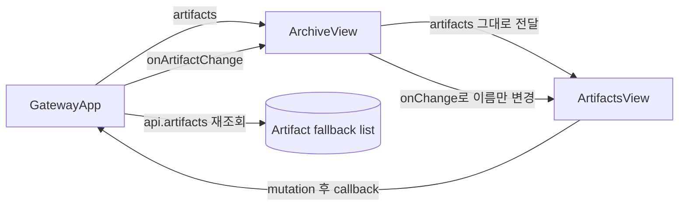
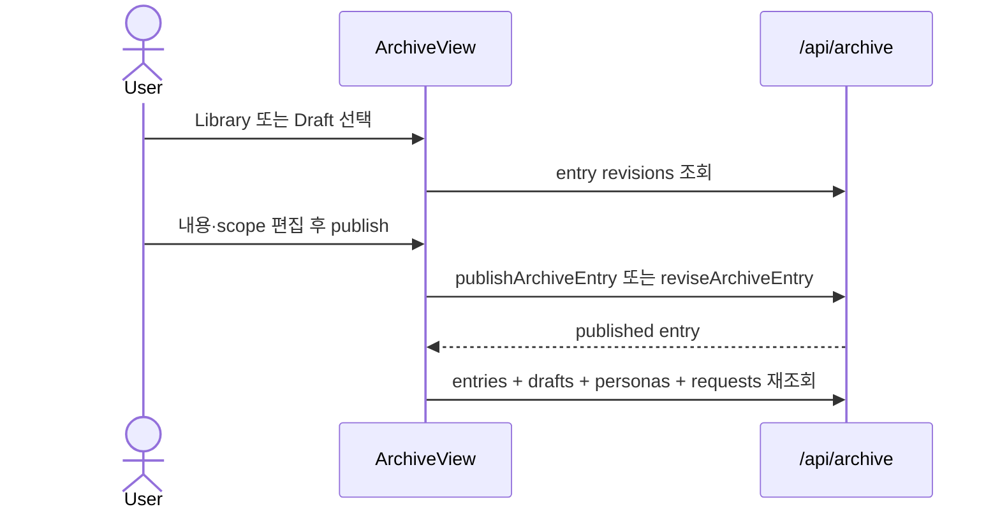
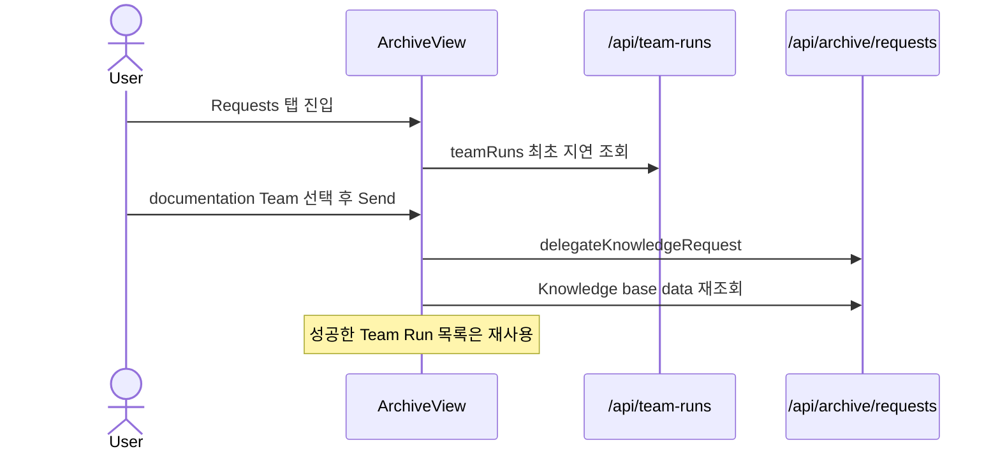
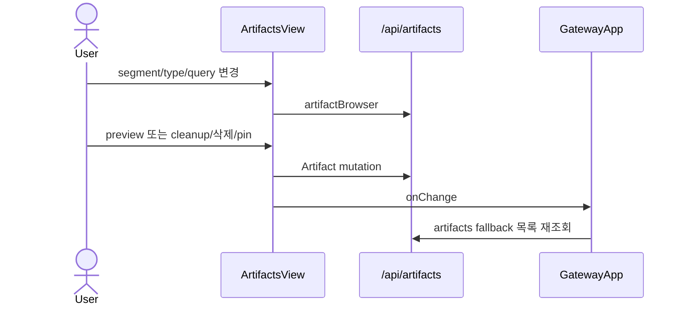

# ArchiveView Knowledge와 Outputs 경계 분석

## 요약

- Root: `frontend/src/components/organisms/ArchiveView/index.jsx`
- Related component: `frontend/src/components/organisms/ArtifactsView/index.jsx`
- Modes: `understand`, `refactor`, `api-state`, `test`
- Verdict: `ArchiveView`와 `ArtifactsView`의 현재 결합은 공유 도메인 상태가 아니라 탭 배치를 위한 props 중계다. Knowledge의 `Request → Draft → Library` 흐름은 `ArchiveView`가 소유하지만, Artifact 검색·보관·정리·미리보기·삭제는 `ArtifactsView`가 독립 API와 상태로 소유한다. 따라서 사용자 정보 구조에서 Library와 Outputs를 분리하고 `GatewayApp`이 두 화면을 각각 렌더하는 것이 가장 작은 안전한 경계다. Archive 및 Artifact backend 계약은 합치거나 이름을 바꿀 근거가 없다.

## 범위

| 항목 | 경로 | 역할 |
| --- | --- | --- |
| 분석 root | `frontend/src/components/organisms/ArchiveView/index.jsx` | Library, Drafts, Requests와 현재 Artifacts 탭 |
| 관련 feature UI | `frontend/src/components/organisms/ArtifactsView/index.jsx` | Artifact browser, retention, cleanup, selection, preview |
| local child | `frontend/src/components/organisms/ArtifactModal/index.jsx` | Artifact 상세와 삭제 |
| shared primitive | `frontend/src/components/atoms/Button/index.jsx` | Archive command button |
| provider hooks | `frontend/src/components/providers/UiProvider/index.jsx` | Artifact confirm과 toast |
| 유일한 production caller | `frontend/src/components/containers/GatewayApp/index.jsx` | screen 선택, Artifact fallback 목록과 refresh callback 소유 |
| navigation | `frontend/src/components/organisms/Sidebar/index.jsx` | 현재 `archive` 단일 진입점 |
| frontend API | `frontend/src/api/client.js` | Archive와 Artifact의 분리된 HTTP 계약 |
| component tests | `frontend/src/components/organisms/ArchiveView/ArchiveView.test.jsx` | Knowledge workflow 및 embedded Artifacts 회귀 |
| component tests | `frontend/src/components/organisms/ArtifactsView/ArtifactsView.test.jsx` | browser, cleanup, preview, selection 삭제 |
| container tests | `frontend/src/components/containers/GatewayApp/GatewayApp.test.jsx` | Archive navigation과 screen별 fetch |
| global styles | `src/personal_agent_gateway/static/styles.css` | `.archive-artifacts*`, `.archive-artifacts-boundary*`, `.archive-guide-card-artifacts`와 일반 Artifact/Archive layout |

Repository 검색상 production에서 `ArchiveView`를 렌더하는 곳은 `GatewayApp` 하나이고, `ArtifactsView`를 렌더하는 곳은 `ArchiveView` 하나다. 따라서 분리 시 production 호출부는 한 곳씩만 바뀐다.

## 컴포넌트 트리

```mermaid
flowchart TD
  Sidebar -->|screen = archive| GatewayApp
  GatewayApp -->|artifacts, onArtifactChange| ArchiveView
  ArchiveView --> Library[Library editor]
  ArchiveView --> Drafts[Draft review queue]
  ArchiveView --> Requests[Knowledge Requests]
  ArchiveView -->|props 중계| ArtifactsView
  ArchiveView --> Button
  ArtifactsView --> ArtifactModal
  ArtifactsView --> UiProvider[useConfirm / useToast]
  ArchiveView --> ArchiveAPI[/api/archive/*]
  ArtifactsView --> ArtifactAPI[/api/artifacts/*]
```

`ArchiveView`의 세 Knowledge panel은 같은 entry/request lifecycle을 공유한다. 반면 `ArtifactsView`는 Archive entry나 Knowledge Request를 읽거나 변경하지 않는다.

## Props 흐름



| props·callback | 실제 흐름 | 판단 |
| --- | --- | --- |
| `ArchiveView.client = api` | Archive entry, persona, request, Team Run API에 사용하고 테스트에서 주입한다. | Knowledge owner에 맞다. |
| `ArchiveView.artifacts` | 읽거나 파생하지 않고 `ArtifactsView.artifacts`로 전달한다. | passthrough prop이다. |
| `ArchiveView.onArtifactChange` | `ArtifactsView.onChange`로 전달한다. | passthrough callback이다. |
| `ArtifactsView.artifacts` | `artifactBrowser` 실패·초기 상태의 `legacyItems()` fallback에 사용한다. | Outputs 화면이 계속 받을 수 있다. |
| `ArtifactsView.onChange` | 삭제·pin 뒤 parent의 Artifact 목록을 갱신한다. | Outputs caller에 주입하면 된다. |

## 상태와 Effect

### ArchiveView

| 상태·hook | 역할 |
| --- | --- |
| `tab` | `library`, `drafts`, `artifacts`, `requests`를 전환한다. 이 중 `artifacts`만 Knowledge lifecycle 밖이다. |
| `entries`, `drafts`, `requests` | published knowledge, private review queue, knowledge gap을 소유한다. |
| `personas` | Library scope 선택지를 제공한다. |
| `teamRuns`, `teamRunsStatus`, `teamRunsRequestGeneration` | Requests 진입 시 documentation Team만 지연 조회하고 stale response를 무효화한다. |
| `selectedTeams`, `requestBusyId` | Request별 delegation UI와 mutation busy를 소유한다. |
| `editingId`, `form`, `revisions` | 신규 entry, draft review, published revision 편집을 소유한다. |
| `query`, `kindFilter` | Library 검색어와 kind를 보관하고 submit 시 server-side entry 조회 조건으로 전달한다. |
| `requestFilter` | Requests 목록을 active 상태만 보거나 전체 상태로 볼지 결정한다. |
| `loading`, `listLoading`, `saving`, `error`, `notice` | Knowledge 조회·검색·mutation 피드백을 구분한다. |
| base-load effect | mount/client 변경 시 entries, drafts, personas, requests를 병렬 조회한다. |
| Requests effect | Requests 최초 진입 시에만 Team Runs를 조회한다. |
| client-reset/cleanup effect | `client`가 바뀌면 request generation을 증가시키고 `teamRuns = []`, `teamRunsStatus = idle`로 초기화한다. cleanup에서도 generation을 증가시켜 이전 client 또는 unmount 전 시작한 응답을 무효화한다. |

Artifact 탭을 없애도 위 상태 중 제거되는 것은 `tab === "artifacts"` 분기뿐이다. Artifact collection이나 mutation state는 애초에 `ArchiveView`에 없다.

### ArtifactsView

| 상태·hook | 역할 |
| --- | --- |
| `segment`, `type`, `query` | saved/recent/cleanup, file type, server search 조건이다. |
| `browser`, `requestRef` | `/api/artifacts/browser` 결과와 stale response guard다. |
| `cleanupPreview` | cleanup 후보와 결과를 소유한다. |
| `selected` | `ArtifactModal`에 표시할 browser item이다. |
| `selectionMode`, `selectedIds` | 일반·cleanup 다중 선택 삭제를 소유한다. |
| browser effect | segment/type/query 변경 후 180ms 지연 조회하고 timer를 정리한다. |
| `useConfirm`, `useToast` | destructive mutation 확인과 결과 피드백을 제공한다. |

Artifacts 상태는 Archive tab과 무관하게 완결돼 있다. 단, `api` singleton을 직접 사용하므로 `ArchiveView.client`와 달리 client injection 경계는 없다.

## 외부 의존성과 이 컴포넌트에서의 역할

- React `useState`는 각 feature의 편집·필터·선택 상태를 보관한다. `ArchiveView`는 Knowledge workflow, `ArtifactsView`는 Outputs browser 상태에 각각 사용한다.
- React `useEffect`는 Archive base data와 Requests-only Team Run 조회, Artifact browser debounce를 수행한다. 두 effect 집합은 서로의 상태를 참조하지 않는다.
- React `useCallback`은 `ArchiveView.loadData()`와 `loadDocumentationTeams()`의 effect dependency를 안정화한다.
- React `useMemo`는 전체 Team Run 중 documentation Team 후보만 파생한다.
- React `useRef`는 두 컴포넌트 모두 stale async response를 막지만 서로 독립된 request generation을 가진다.
- `Button`은 Archive의 publish, delete, request status/delegation command에 공통 버튼 계약을 제공한다.
- `ArtifactModal`은 Artifact preview·삭제를 소유하는 Outputs local child다.
- `useConfirm`과 `useToast`는 Artifact 다중 삭제·pin 결과를 처리한다. Archive entry 삭제는 아직 native `window.confirm`을 사용하며 같은 상태나 hook을 공유하지 않는다.
- `api/client.js`는 `/api/archive/*`와 `/api/artifacts/*`를 별도 method group으로 노출한다. UI가 한 탭에 있다는 이유로 backend 계약을 합칠 관계는 없다.

Custom store selector나 router는 없다. 화면 전환은 `GatewayApp.screen` 문자열과 `Sidebar` callback으로만 이뤄진다.

## 주요 상호작용 흐름

### Knowledge entry lifecycle



### Knowledge Request delegation



### Artifact browsing과 mutation



이 흐름에는 `ArchiveView`의 Knowledge 상태가 등장하지 않는다. 현재 `ArchiveView`는 Artifact 흐름에서 렌더 중계자일 뿐이다.

### 나머지 Knowledge trigger와 실패·취소 분기

1. **Library 검색**: 사용자가 query/kind를 바꾸고 form을 submit하면 `listLoading`과 `error`를 갱신하고 `archiveEntries({ query, kind })` 결과로 published `entries`만 교체한다. 실패하면 기존 목록을 지우지 않고 Archive alert를 표시한다.
2. **persona scope 검증**: publish 시 `scope === personas`인데 `personaIds`가 비어 있으면 API를 호출하지 않고 validation error를 표시한다. 통과하면 `formFromEntry`/`splitValues`와 반대 방향의 payload를 만들고 publish 또는 revise를 호출한다.
3. **문서·draft 삭제**: 사용자가 delete를 누르면 대상 상태에 맞는 native confirm을 표시한다. 취소하면 mutation이 없고, 승인하면 `deleteArchiveEntry` 뒤 editor를 초기화하고 base data를 다시 조회한다.
4. **Write in Library**: `formFromRequest()`로 outline을 editor form으로 변환하고 Library tab으로 이동한다. Request가 이미 `in_progress`가 아니면 status를 `in_progress`로 patch한다. 실제 fulfillment는 이후 publish 성공 때 일어난다.
5. **Later / Dismiss / Reopen**: 각 button은 같은 request ID에 `deferred`, `dismissed`, `open` status를 patch하고 base data를 다시 조회한다.
6. **Open Library entry**: fulfilled Request의 `fulfilled_by_entry_id`를 현재 published entries에서 찾아 `editEntry()`를 호출한다. 목록에 없으면 API를 추가 호출하지 않고 error를 표시한다.
7. **Team Run load retry**: 최초 Team Run 조회 실패 시 직접 Write/Later/Dismiss는 유지하고 delegation control만 비활성화한다. `Retry team loading`은 base Archive data를 건드리지 않고 `teamRuns()`만 다시 호출한다.

## API와 데이터 소유권

| domain | frontend API | client owner | backend owner |
| --- | --- | --- | --- |
| Knowledge | `archiveEntries`, `publishArchiveEntry`, `reviseArchiveEntry`, `deleteArchiveEntry`, `archiveEntryRevisions`, `knowledgeRequests`, request status/delegation | `ArchiveView` | `ArchiveService`, `/api/archive/*` |
| Outputs browser | `artifactBrowser`, `artifactCleanupPreview`, `cleanupArtifacts`, `deleteArtifacts`, `updateArtifactRetention` | `ArtifactsView` | `ArtifactStore`, `/api/artifacts/*` |
| Outputs preview/single delete | `artifactContentUrl`, `artifactText`, `deleteArtifact` | `ArtifactModal` | Artifact content/delete routes |
| Outputs fallback refresh | `artifacts` | `GatewayApp` | Artifact list route |
| Documentation Team 후보 | `teamRuns` | Requests branch of `ArchiveView` | Team Run services |

`registerArtifact`의 production caller는 `MarkdownContent`이며 이번 Archive/Outputs navigation 경계 밖이다. `artifactThumbnailUrl`은 현재 production consumer가 없으므로 이 보고서가 Outputs owner 호출로 분류하지 않는다.

Archive form과 API DTO 사이에는 다음 mapper가 있다.

- `formFromEntry`: Archive entry DTO의 tags, source URLs, persona scope를 editor form 문자열·선택 상태로 변환한다.
- `formFromRequest`: Knowledge Request의 outline, reason, source hints, requesting persona를 unpublished editor form으로 변환한다.
- `splitValues`: editor의 comma/newline 문자열을 publish/revise payload의 `tags`와 `source_urls` 배열로 변환한다.

분리의 최소 경계는 다음과 같다.

1. `GatewayApp`이 Knowledge 화면과 Outputs 화면을 각각 선택한다.
2. Knowledge 화면은 현재 Archive base data와 Requests-only Team Run lifecycle을 그대로 유지한다.
3. Outputs 화면은 현재 `ArtifactsView`와 `GatewayApp`의 Artifact fallback/refresh 계약을 그대로 유지한다.
4. Archive 및 Artifact API, schema, service 이름은 변경하지 않는다.

## 테스트와 누락된 RED 사례

### 기존 coverage

- `ArchiveView.test.jsx`: 18개. Knowledge/Artifacts 경계 안내, embedded Artifacts, Artifact refresh, Map 제거, Team Runs lazy/retry/stale response, draft publish/delete, request delegation/failure/status, published entry 삭제를 다룬다.
- `ArtifactsView.test.jsx`: 7개. saved/recent, cleanup preview, provenance/path copy, type filter, image row, modal, server browser와 다중 삭제를 다룬다.
- `GatewayApp.test.jsx`: 현재 `Archive` nav를 열고 Archive base API와 `/api/artifacts`를 함께 조회한 뒤 embedded Artifacts tab을 여는 통합 사례가 하나 있다.
- `client.test.js`: Archive와 Artifact method group을 각각 검증한다.

### 구현 전 필요한 RED 사례

1. primary navigation에 사용자용 `Library`와 `Outputs`가 각각 존재하고 기존 `Archive` 단일 진입점은 사라진다.
2. `Library` 진입은 entries, drafts, personas, requests를 조회하지만 `/api/artifacts`를 조회하지 않으며 Artifacts tab을 렌더하지 않는다.
3. `Outputs` 진입은 `/api/artifacts`와 browser를 사용해 현재 Artifact 목록·검색·cleanup·preview 기능을 그대로 제공하고 Archive API를 조회하지 않는다.
4. Library의 Requests 최초 진입 Team Run lazy loading과 성공 cache가 navigation 분리 뒤에도 유지된다.
5. Outputs mutation 뒤 `GatewayApp` fallback list refresh가 계속 호출된다.
6. 기존 18개 `ArchiveView` test 중 Artifact 관련 여섯 개를 다음처럼 명시적으로 처리하고 나머지 Knowledge workflow test는 보존한다.
   - `.archive-artifacts > .artifacts-view` padding 검증: wrapper와 함께 제거한다.
   - `.artifact-card-meta`와 `.artifact-groups`/`.artifact-row-open` 검증: Artifact UI 자체 계약이므로 `ArtifactsView.test.jsx`로 이동해 보존한다.
   - Knowledge lifecycle과 Work outputs 안내 검증: Knowledge lifecycle assertion만 Library 화면 계약으로 보존하고 Work outputs 안내 assertion은 제거한다.
   - embedded Artifact와 Library boundary 검증: Outputs top-level navigation test로 대체한다.
   - embedded Artifact 삭제 refresh 검증: `GatewayApp`의 Outputs mutation refresh test로 이동한다.

## 리팩터링 판단

### 책임과 ownership

- `호출부 흡수`: `ArchiveView`의 Artifact tab wrapper와 `artifacts`/`onArtifactChange` passthrough를 제거하고, 유일한 caller인 `GatewayApp`이 `ArtifactsView`를 Outputs screen으로 직접 렌더한다. 압력은 별도 domain을 한 탭에 두기 위해 불필요한 중계 계층과 eager Artifact fetch가 생긴다는 점이다. 낮은~중간 effort, 낮은 risk.
- `유지`: Archive entry/request state와 Requests-only Team Run lifecycle은 `ArchiveView`에 유지한다. 세 panel이 하나의 publish/review/fulfillment workflow를 공유하므로 navigation 분리와 동시에 backend 또는 controller를 재설계할 이유가 없다.
- `유지`: `ArtifactsView`의 browser·cleanup·selection·preview ownership은 유지한다. 독립 state/API가 이미 응집돼 있다.
- `리팩터링 계획 필요`: `ArchiveView` 이름을 `LibraryView`로 바꾸고 파일·test·CSS selector까지 일괄 rename할지는 사용자용 navigation 분리와 별도 판단해야 한다. 동작에 필요하지 않은 대규모 rename은 Phase 2의 위험과 diff를 키운다.
- `내부 분리`: navigation 분리 뒤에도 `ArchiveView`는 983줄이다. 향후 같은 owner 아래 `LibraryEditor`와 `KnowledgeRequestsPanel`을 local component 또는 feature hook으로 분리할 가치가 있지만, Outputs 이동과 동시에 수행하면 회귀 원인 구분이 어려워진다. 중간 effort, 중간 risk.

### 실제 render body 코드 수준 검사

- `반복 제거(DRY)`: `ArchiveView`의 네 tab button은 label/count/value만 다르고 같은 markup을 반복한다. Outputs tab 제거 뒤 세 개가 남으므로 descriptor array + map 후보지만, navigation 분리의 필수 변경은 아니다. 낮은 effort, 낮은 risk.
- `프레젠테이션 분해`: `ArchiveView` render는 header/guide/tabs, Library list/editor, Artifact wrapper, Requests card list를 한 함수에 포함한다. Artifact wrapper 제거 뒤에도 Library editor와 Requests panel은 시각·interaction 단위가 뚜렷하다. 중간 effort, 중간 risk.
- `pure helper 추출`: Request card map 안의 `active`, `busy`, `assignedTeam`, `selectedTeamId`, `delegated` 파생은 순수 view-model helper 후보다. 현재도 동작은 명확하므로 Phase 2 navigation diff에 포함하지 않는다. 낮은 effort, 낮은 risk.
- `반복 제거(DRY)`: `ArtifactsView`는 type filter를 이미 descriptor map으로 렌더하지만 saved/recent/cleanup segment button 세 개는 inline 반복한다. 별도 Outputs 화면으로 이동하는 데 필요한 변경은 아니다. 낮은 effort, 낮은 risk.
- `pure helper 추출`: `ArtifactsView`의 fallback, visible items, groups, counts 파생은 render마다 계산되며 feature model 후보지만 173줄 규모에서 현재 병목 근거는 없다. 유지한다.

## 권장 후속 작업

1. 제품 설계에서 `Library`와 `Outputs`를 같은 top-level 수준으로 둘지 먼저 승인한다.
2. 승인 시 navigation test를 RED로 추가하고 `GatewayApp`이 `ArtifactsView`를 직접 렌더하게 한다.
3. `ArchiveView`에서는 Artifact import, props, guide card, tab, panel과 전용 wrapper test를 제거한다. 그 결과 orphan 되는 `src/personal_agent_gateway/static/styles.css`의 `.archive-artifacts`, `.archive-artifacts > .artifacts-view`, `.archive-artifacts-boundary`, `.archive-artifacts-boundary strong`, `.archive-artifacts-boundary p`, `.archive-guide-card-artifacts`도 함께 제거한다. 일반 `.artifacts-*` style은 Outputs 화면에서 계속 사용한다.
4. Archive/Artifact API와 backend service는 그대로 유지하고 screen별 lazy fetch만 분리한다.
5. 사용자용 구조가 안정된 뒤 `ArchiveView` 내부의 Library editor와 Requests panel 분리를 별도 계획으로 다룬다.

## 스킬 핸드오프

- 다음 단계는 `superpowers:brainstorming`으로 Library/Outputs navigation 구조와 내부 naming 범위를 승인받는다.
- 승인된 설계 문서는 `superpowers:writing-plans`로 RED/GREEN 순서와 정적 제거 범위를 구체화한다.
- 광범위한 internal rename 또는 panel extraction을 계획에 넣을 경우 `developing-plans-with-solid`로 dependency direction과 책임 분리를 검토한다.
- 이 저장소는 allre-web-fe 및 vanilla-extract 구조가 아니므로 `component-pattern`, `vanilla-extract-style`은 적용하지 않았다.

## 리뷰

- Verdict: PASS
- Rounds: 3
- Fixed: 1차 리뷰의 누락 상태/effect, 실패·취소 interaction, 실제 Artifact API caller와 Archive mapper, 영향받는 여섯 test를 보정했다. 2차 리뷰에서 발견한 orphan `.archive-artifacts-boundary*`와 `.archive-guide-card-artifacts` selector도 제거 범위에 추가했고, 3차 재검증에서 blocker 없이 통과했다.

## 근거

- `frontend/src/components/organisms/ArchiveView/index.jsx:1-4,100-195,393-983`
- `frontend/src/components/organisms/ArtifactsView/index.jsx:1-173`
- `frontend/src/components/containers/GatewayApp/index.jsx:27,57,266-300,730-817,986-993`
- `frontend/src/components/organisms/Sidebar/index.jsx:3-19`
- `frontend/src/api/client.js:185-289`
- `frontend/src/components/organisms/ArchiveView/ArchiveView.test.jsx:127-475`
- `frontend/src/components/organisms/ArtifactsView/ArtifactsView.test.jsx:1-94`
- `frontend/src/components/containers/GatewayApp/GatewayApp.test.jsx:109-168`
- `frontend/src/api/client.test.js:67-108,575-620`
- `src/personal_agent_gateway/archive.py:183-719`
- `src/personal_agent_gateway/artifacts.py:79-441`
- `src/personal_agent_gateway/api/archive.py:41-262`
- `src/personal_agent_gateway/api/artifacts.py:45-272`
- `src/personal_agent_gateway/static/styles.css:3637-3819,4786-4807,5106-5138`
