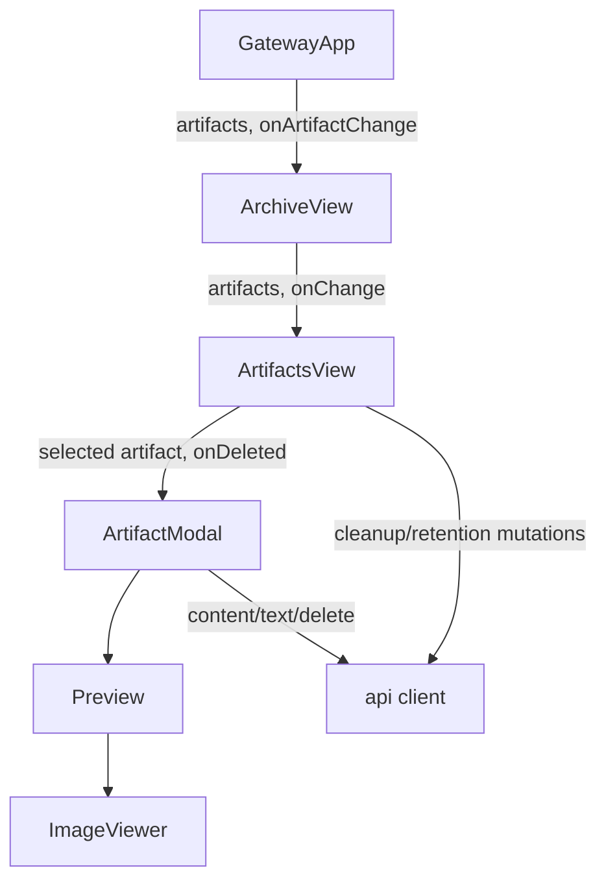
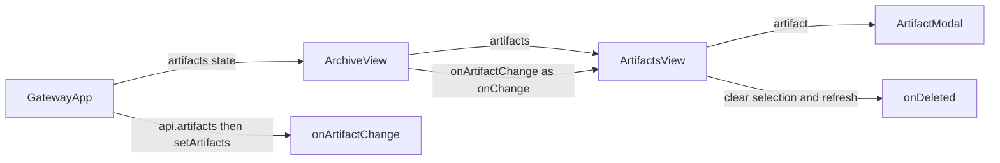
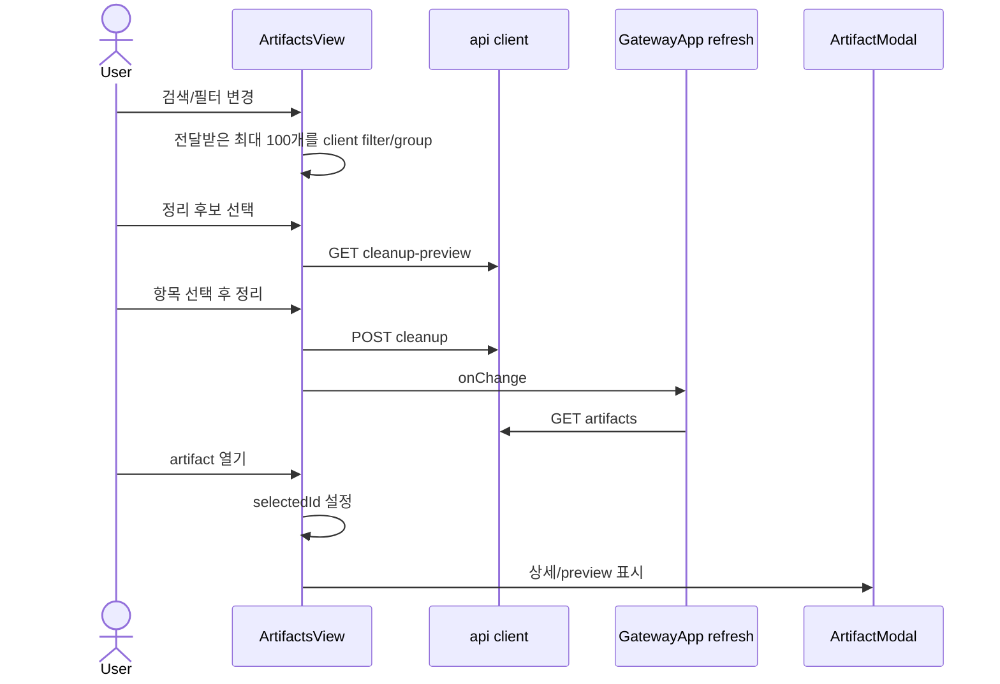

# ArtifactsView 통합 브라우저 분석

## 요약

- Root: `frontend/src/components/organisms/ArtifactsView/index.jsx`
- Modes: `understand`, `refactor`, `api-state`, `style`, `test`
- Verdict: 현재 소유 위치는 유지하되, 출처 해석·검색·선택 상태를 feature model/hook으로 분리하고 카드 갤러리를 compact list로 교체해야 한다. `ArtifactModal`의 preview 판정도 `type`이 아닌 MIME/확장자 기반으로 바꿔야 한다.

## 범위

| Item | Path | Notes |
|---|---|---|
| Root | `frontend/src/components/organisms/ArtifactsView/index.jsx` | 세그먼트, 필터, 그룹화, cleanup mutation, 선택 상태, modal 소유 |
| Local child | `frontend/src/components/organisms/ArtifactModal/index.jsx` | preview, provenance, download/copy/delete |
| Parent | `frontend/src/components/organisms/ArchiveView/index.jsx` | Artifacts 탭과 `onArtifactChange` 전달 |
| Data owner | `frontend/src/components/containers/GatewayApp/index.jsx` | `/api/artifacts` 결과와 refresh callback 소유 |
| API client | `frontend/src/api/client.js` | list, cleanup, retention, content, text, delete 호출 |
| Styles | `src/personal_agent_gateway/static/styles.css` | card grid와 centered modal 레이아웃 |
| Tests | `frontend/src/components/organisms/ArtifactsView/ArtifactsView.test.jsx` | 세그먼트, cleanup, 필터, thumbnail, modal |
| Tests | `frontend/src/components/organisms/ArtifactModal/ArtifactModal.test.jsx` | 단건 삭제 확인/취소 |
| Integration tests | `frontend/src/components/organisms/ArchiveView/ArchiveView.test.jsx` | Archive 탭, 삭제 후 refresh, CSS 회귀 |

## 컴포넌트 트리

`ArtifactsView`는 Archive 전용 workflow이므로 현재 feature owner인 Archive 하위 organism에 남는 것이 맞다. `ArtifactModal`은 `MarkdownContent`에서도 사용되므로 preview와 상세 표시의 공용 계약은 유지해야 한다.

## Props 흐름

| Prop/callback | 제공자 | 현재 역할 |
|---|---|---|
| `artifacts` | `GatewayApp` → `ArchiveView` | 일반 목록의 source of truth |
| `onChange` | `GatewayApp`의 `/api/artifacts` 재조회 callback | cleanup, pin, delete 후 목록 동기화 |
| `ArtifactModal.onDeleted` | `ArtifactsView` | 선택 해제 후 `onChange` 호출 |
| `ArtifactModal.onClose` | `ArtifactsView` | `selectedId` 초기화 |

## 상태와 효과

| 상태/effect | 역할 | 관찰된 압력 |
|---|---|---|
| `segment` | saved/recent/cleanup 전환 | 목록 정책과 화면 표시가 같은 컴포넌트에 결합됨 |
| `cleanupPreview`, `cleanupIds` | cleanup 후보와 다중 선택 | mutation, selection, refresh가 inline handler에 혼재 |
| `type`, `query` | 클라이언트 필터 | raw metadata ID만 검색하며 pagination 이후 데이터는 찾지 못함 |
| `selectedId` | modal 대상 | `artifacts`에 없는 cleanup item은 modal 대상이 될 수 없음 |
| `Preview.useEffect` | log/report 텍스트 로드 | `text/markdown` 문서가 type 조건에서 탈락해 fallback만 표시됨 |
| `ImageViewer` state/effect | zoom, pan, wheel listener | 독립 책임이며 현재 local child로 적절함 |
| modal key effect | Escape close | dialog 기본 동작의 일부로 적절함 |

## 외부 의존성과 이 컴포넌트에서의 역할

- React `useState`는 브라우저 세그먼트, 필터, 선택을 보관한다. 현재 다섯 상태가 한 render body의 여러 mutation과 연결돼 화면 의도를 흐린다.
- React `useEffect`, `useCallback`, `useRef`는 modal text fetch와 image zoom/pan의 DOM lifecycle을 관리한다. 이미지 viewer 쪽 사용은 응집돼 있지만 text fetch는 preview 판정과 함께 별도 renderer로 분리할 수 있다.
- `useConfirm`은 cleanup/삭제 전 파괴 동작 확인을 제공하고, `useToast`는 결과를 알린다. API client가 오류 본문을 버리므로 현재 toast는 참조 중 삭제와 서버 오류를 구분하지 못한다.
- `api`는 artifact mutation과 content URL을 제공한다. `ArtifactsView`는 prop으로 client를 주입받지 않아 unit test가 singleton spy에 의존한다.

## 주요 상호작용 흐름

단건 삭제는 `ArtifactModal`에서 confirm → `DELETE /api/artifacts/{id}` → `onDeleted` → parent refresh 순서다. 현재 API client가 boolean만 반환해 HTTP 409 `ArtifactInUseError`의 이유를 UI에 전달하지 못한다.

## 스타일과 레이아웃

- `.artifact-grid`는 group을 한 열로 두지만, 각 `.artifact-group`은 다시 `180px–220px` auto-fill 카드 grid를 만든다. 따라서 제목·출처·날짜를 비교하는 archive 작업보다 thumbnail gallery에 최적화돼 있다.
- `.artifact-card-meta`는 한 줄 ellipsis여서 긴 Team ID가 잘리며, group heading은 raw ID 전체를 노출한다.
- centered `.modal-card`는 최대 `760px`이고 provenance PATH를 기본 노출한다. 문서 본문보다 기술 경로가 더 강하게 보인다.
- 새 화면은 compact row/list, sticky selection toolbar, 반응형 metadata wrapping을 사용하고 이미지 thumbnail은 작은 보조 열로 제한하는 편이 현재 요구에 맞다.

## 테스트와 누락된 RED 사례

기존 테스트는 세그먼트 기본값, cleanup preview, copy path, type filter, image thumbnail, modal open, 단건 삭제 확인/취소, Archive refresh를 다룬다.

구현 전에 다음 RED 사례가 필요하다.

1. Chat session/turn과 Team run/cycle/task 표시명이 raw ID 없이 계층화된다.
2. 서버 검색이 제목, filename, role, Chat/Team 표시명을 찾고 pagination 밖 결과도 반환한다.
3. 검색 중 loading, no-result, API error가 구분된다.
4. row 다중 선택 삭제가 선택 개수/용량을 확인하고 성공 항목만 제거한다.
5. 참조 중 artifact 삭제는 409 이유와 사용처를 보여주고 선택을 유지한다.
6. Markdown과 `text/*` artifact가 읽기 가능한 본문 preview를 표시한다.
7. technical details는 접힌 상태가 기본이며 path/session/raw ID는 펼친 뒤에만 보인다.
8. cleanup selection과 일반 삭제 selection이 섞이지 않는다.

## 리팩터링 판단

- `유지`: `ArtifactsView`의 Archive feature ownership. 다른 화면의 공용 primitive로 승격할 근거가 없다.
- `hook/model 추출`: 검색 query state, browser response, selection, mutation/refresh를 `useArtifactBrowser` 같은 feature-owned hook으로 분리한다. 압력은 inline async handler와 서로 다른 목록 source의 혼재다. 중간 effort, 중간 risk.
- `pure helper 추출`: segment/type/query 판정과 raw metadata grouping을 server DTO mapper 또는 순수 presentation mapper로 이동한다. 현재 `grid`와 `groups`가 render마다 inline 계산된다. 낮은 effort, 낮은 risk.
- `프레젠테이션 분해`: toolbar, group header, artifact row, selection action bar를 same-owner local components로 분리한다. render body가 cleanup과 일반 card branch를 함께 갖는다. 중간 effort, 낮은 risk.
- `반복 제거(DRY)`: 현재 segment/type button은 descriptor map과 일부 inline button이 혼재한다. 공통 filter descriptor를 사용하되 글로벌 component 추상화는 하지 않는다. 낮은 effort, 낮은 risk.
- `내부 분리`: `ArtifactModal.Preview`를 MIME renderer dispatch와 renderer components로 나눈다. `artifact.type` 조건이 Markdown fallback 버그를 만들고 있다. 중간 effort, 낮은 risk.

## 권장 후속 작업

1. backend에 durable `chat_turns`와 명시적 artifact origin/role 필드를 추가한다.
2. 기본 group을 저장된 generic tree가 아니라 source domain join으로 계산하는 `/api/artifacts/browser` DTO로 제공한다.
3. 검색은 browser endpoint의 `q`로 수행하고, full-text content 검색은 이번 범위에서 제외한다.
4. 단건/다중 삭제 API가 `deleted`, `blocked`와 block reason/usage를 구조화해 반환하게 한다.
5. `ArtifactsView`를 compact list로 교체하고, `ArtifactModal`은 MIME 기반 document preview와 접힌 technical details를 제공한다.

## 스킬 핸드오프

- 다음 단계는 `superpowers:brainstorming` 설계 문서에 이 판단을 반영한다.
- 설계 승인 후 `superpowers:writing-plans`로 schema/API/UI/test 순서를 구체화한다.
- 이 저장소는 allre-web-fe/vanilla-extract 구조가 아니므로 `component-pattern`과 `vanilla-extract-style` 규칙은 구현에 적용하지 않는다.

## 리뷰

- Verdict: PASS
- Rounds: 1
- Fixed: 별도 subagent 사용이 허용되지 않아 보고서를 덮어두고 root/child/API client/usage/test/style을 다시 읽었다. `ArtifactModal`이 `MarkdownContent`에서도 사용된다는 누락, boolean delete가 409 detail을 버린다는 사실, `GatewayApp`이 일반 목록을 소유한다는 흐름을 확인해 보고서에 반영했다.

## 근거

- `frontend/src/components/organisms/ArtifactsView/index.jsx:19-157`
- `frontend/src/components/organisms/ArtifactModal/index.jsx:6-141`
- `frontend/src/components/organisms/ArchiveView/index.jsx:673,1292-1301`
- `frontend/src/components/containers/GatewayApp/index.jsx:57,298-300,986-991`
- `frontend/src/components/organisms/MarkdownContent/index.jsx:5,58`
- `frontend/src/api/client.js:185-226`
- `src/personal_agent_gateway/static/styles.css:3631-3743,4704-4728`
- `frontend/src/components/organisms/ArtifactsView/ArtifactsView.test.jsx`
- `frontend/src/components/organisms/ArtifactModal/ArtifactModal.test.jsx`
- `frontend/src/components/organisms/ArchiveView/ArchiveView.test.jsx:180-218`
