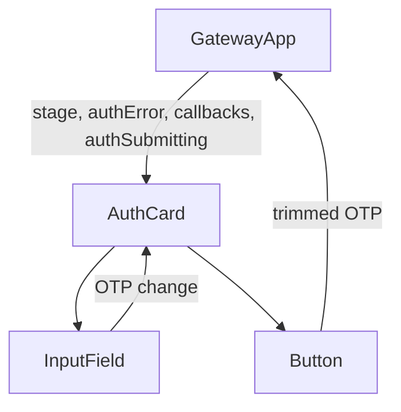

# AuthCard OTP Submission Analysis

## 요약

- Root: `frontend/src/components/molecules/AuthCard/index.jsx`
- Modes: `api-state,test`
- Verdict: login stage에 `authSubmitting` presentation prop을 더해 input/button을 함께 잠그는 최소 변경이 적절하다.

## 구조와 props

| Prop | source | 역할 |
| --- | --- | --- |
| `stage`, `setup`, `recoveryCodes`, `authError` | GatewayApp/bootstrap hook | login/setup/recovery branch와 오류 UI를 결정한다. |
| `onLogin`, `onSetupStart`, `onSetupVerify`, `onContinue` | GatewayApp | network/state ownership은 container에 남긴 채 user action만 올린다. |
| planned `authSubmitting` | bootstrap hook → GatewayApp | login stage OTP input과 Continue button을 disabled하고 label을 `Signing in…`으로 바꾼다. |

`InputField`와 `Button`은 rest props를 각각 native input/button에 전달한다. 따라서 login branch에서 두 control에 `disabled={authSubmitting}`을 전달하면 별도 state나 wrapper 없이 observable DOM disabled 상태가 된다.

## 상태와 상호작용

| branch | local state/action | side effect boundary |
| --- | --- | --- |
| login | local `otp`; Continue → `onLogin(otp.trim())` | API 요청은 prop callback 뒤 GatewayApp/hook에서 처리한다. |
| setup | 같은 local `otp`; Verify → `onSetupVerify` | setup flow는 pending login 변경의 범위 밖이다. |
| recovery | Continue → `onContinue` | recovery 후 bootstrap flow는 유지한다. |

이 molecule은 fetch/state machine을 소유하지 않는다. `authSubmitting`은 login branch presentation lock으로만 쓰며 setup/recovery의 button semantics나 error copy를 바꾸지 않는다. `onLogin`은 hook의 `try/catch/finally`에서 `api.login` rejection과 `loadApp` rejection을 `false`/auth error로 정규화하고 pending을 해제해야 한다. `onSetupStart`는 login의 First time 및 setup의 Back to sign in에서 GatewayApp → hook `handleSetupStart` → `api.setupStart`/`authStage="setup"`로 이어진다. 따라서 setup의 Back to sign in label은 실제로는 setup을 다시 시작하는 pre-existing 불일치이며 이번 login pending 범위 밖이다. setup Verify는 `handleSetupVerify`를 거쳐 recovery/error를 결정하고, recovery Continue는 `onContinue={loadApp}`으로 직접 bootstrap한다. 어느 경로도 login pending을 공유하지 않는다.

## 테스트 현황과 회귀 위험

| 테스트 | 현재 보장 | 이번 변경 |
| --- | --- | --- |
| `GatewayApp.test.jsx` authenticated bootstrap | AuthCard를 우회한 authenticated app entry | unauthenticated login integration을 추가한다. |
| `GatewayApp.test.jsx` broad navigation/SSE suite | Container state와 app shell branch | AuthCard prop 추가가 authenticated branch에 영향을 주지 않아야 한다. |
| AuthCard unit test | 별도 파일 없음. | pending UI는 existing integration harness로 확인한다. |

## 외부 의존성

- `frontend/src/components/atoms/Field/index.jsx`: rest props를 native input에 전달한다.
- `frontend/src/components/atoms/Button/index.jsx`: rest props를 native button에 전달한다.
- 두 dependency 덕분에 login branch의 input/button 모두 `disabled={authSubmitting}`으로 잠글 수 있다.

## 권장 후속 작업

1. login-only InputField와 Button에 `disabled={authSubmitting}`을 전달한다.
2. button visible label을 pending일 때 `Signing in…`으로 바꾼다.
3. pending state에서 OTP submit callback을 중복 실행할 수 없는지, API 거절/boot failure가 `false`로 화면을 유지하는지 integration test로 확인한다.

## 리뷰

- Verdict: PASS
- Rounds: 3
- Fixed: native input/button disabled forwarding, login/setup/recovery callback paths, rejected login/bootstrap failure 처리와 기존 setup label 불일치를 반영했고 독립 최종 리리뷰를 통과했다.

## 근거

- `frontend/src/components/molecules/AuthCard/index.jsx:1-72`
- `frontend/src/components/containers/GatewayApp/index.jsx:702-718`
- `frontend/src/components/containers/GatewayApp/GatewayApp.test.jsx:79-151`
- `frontend/src/components/references/molecules.md:5-9`
- `frontend/src/components/atoms/Field/index.jsx:1-3`
- `frontend/src/components/atoms/Button/index.jsx:1-8`
