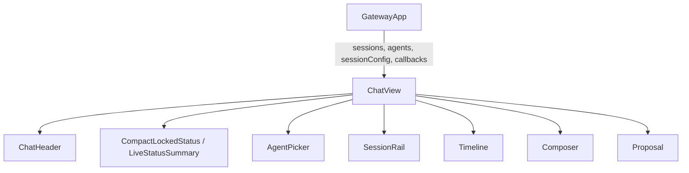
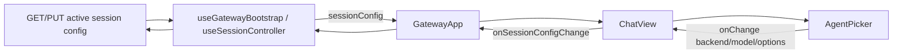
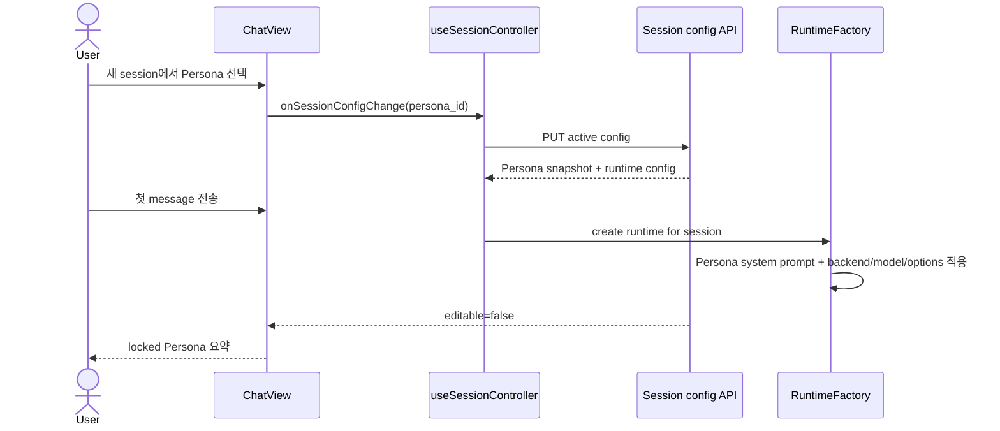

# ChatView Persona Targeting Analysis

## 요약

- Root: `frontend/src/components/organisms/ChatView/index.jsx`
- Modes: `understand`, `api-state`, `test`, `refactor`
- Verdict: 단일 Chat의 상위 선택 단위를 runtime `Agent`에서 `Persona`로 바꾸되,
  기존 session config의 backend/model/options 잠금 계약은 유지한다.

## 범위

| 항목 | 경로 | 비고 |
|---|---|---|
| Root | `frontend/src/components/organisms/ChatView/index.jsx` | Chat 화면 합성 |
| Parent | `frontend/src/components/containers/GatewayApp/index.jsx` | collection/API callback 소유 |
| State controller | `frontend/src/hooks/useSessionController.js` | session config 저장과 잠금 갱신 |
| Bootstrap | `frontend/src/hooks/useGatewayBootstrap.js` | 초기 sessions/agents/config 병렬 로드 |
| Session API | `src/personal_agent_gateway/api/agents.py` | active session config GET/PUT |
| Session model | `src/personal_agent_gateway/session_config.py` | transcript event 기반 config |
| Runtime | `src/personal_agent_gateway/runtime_factory.py` | config를 CLI client로 변환 |
| Tests | `frontend/src/components/organisms/ChatView/ChatView.test.jsx` | ChatView 상호작용 |

## 컴포넌트 트리

`AgentPicker`만 선택 단위가 runtime backend인 구조다. `SessionRail`, `Timeline`,
`Composer`와 approval UI는 Persona 선택과 독립된 shared leaf다.

## Props 흐름

Persona 기반 변경 후에도 mutation은 container/controller 경계에 남기고,
`ChatView`에는 `personas` collection만 추가로 주입하는 편이 현재 소유권과 맞다.

## 상태와 효과

| 상태/효과 | 역할 |
|---|---|
| `sessionConfig` | active transcript의 backend/model/options와 `editable` 상태 |
| `locked` 파생값 | 첫 user message 후 config UI를 read-only로 전환 |
| transcript follow refs/effects | session 전환과 새 entry 도착 시 하단 추적 |
| Escape effect | busy turn을 interrupt callback으로 중단 |
| `activeSessionId` 파생값 | Timeline과 scroll reset의 session 경계 |

별도 store selector나 dispatch는 없다. `onSessionConfigChange`는
`useSessionController.handleSessionConfigChange`에서 API PUT을 수행한다.

## 외부 primitive와 주입 동작

| primitive/동작 | 이 컴포넌트에서 하는 일 | 사용하는 이유 |
|---|---|---|
| React `useEffect` | session 전환/entry 변경 scroll, Escape listener 관리 | DOM과 window side effect 수명 관리 |
| React `useRef` | transcript DOM과 사용자의 follow-latest 의도 저장 | scroll마다 render하지 않음 |
| `AgentPicker` | CLI backend/model/options 직접 선택 | 현재 session config API shape와 일치 |
| `SessionRail` | session 탐색·활성화·reset·rename·delete callback 전달 | session navigation 분리 |
| `Timeline` | transcript/activity 렌더와 artifact 등록 | execution timeline 표현 |
| `Composer` | message submit과 busy gating | 입력 UI 분리 |
| `onSessionConfigChange` | active session config PUT으로 연결 | 서버 잠금 검증을 우회하지 않음 |

## 주요 상호작용

## API와 상태 추적

1. 현재 PUT request는 `agent_id`, `model`, `options`만 받는다.
2. `SessionAgentConfigService`는 `session_config_set` transcript event를 저장하고 첫
   user message 뒤 변경을 막는다.
3. `RuntimeFactory`는 config를 CLI client로 바꾸지만 Persona 지침은 받지 않는다.
4. 따라서 UI만 Persona select로 바꾸면 role/responsibilities/constraints가 실행에
   적용되지 않는다. API가 Persona를 snapshot하고 runtime이 system prompt로
   주입해야 한다.

## 테스트

현재 테스트는 scroll follow, final answer 표시, working indicator, Escape interrupt를
검증한다. 추가 RED 사례는 다음과 같다.

1. editable session에서 Persona 목록과 선택값을 표시한다.
2. Persona 선택 시 `onSessionConfigChange({ persona_id })`가 호출된다.
3. locked session에서 Persona 이름과 runtime model을 표시한다.
4. session API가 Persona snapshot을 저장하고 첫 message 뒤 변경을 거부한다.
5. runtime message 첫 항목에 Persona system prompt가 포함된다.
6. legacy session config는 Persona가 없어도 조회·실행 가능하다.

## 리팩터링 판단

### 책임과 소유권

- `유지`: Chat transcript, session navigation, composer의 합성 책임은 명확하다.
- `내부 분리`: `CompactLockedStatus`의 AGENT label만 Persona-aware summary로
  바꾸며 transcript 영역은 건드리지 않는다. 노력 작음, 위험 낮음.
- `shared 승격`: Chat과 Hook이 같은 Persona 선택 계약을 사용하므로 작은
  `PersonaPicker` shared organism을 만드는 근거가 두 곳에서 생긴다. 노력 작음,
  위험 낮음.
- API/runtime 계약 변경은 component 밖이지만 Persona 지침이 실제 실행되기 위한
  필수 변경이다.

### 코드 수준 검사

- 반복 JSX: summary chip 렌더는 이미 descriptor array + `map`으로 정리되어 있다.
- pure derivation: `agentLabel`은 Persona label helper로 교체할 수 있으나 별도 model
  모듈 추출까지는 필요 없다.
- render body: header/config/transcript/composer 영역이 분리되어 있어 추가
  프레젠테이션 분해 이득이 없다.

## 권장 후속 작업

1. 공용 `PersonaPicker`를 추가하고 Chat의 editable selector를 교체한다.
2. `session_config_set`에 `persona_id`와 snapshot을 저장한다.
3. runtime에 Persona system prompt를 매 turn 전달한다.
4. 기존 Agent config request와 Persona 없는 transcript는 읽기 호환을 유지한다.

## 스킬 핸드오프

- `component-pattern`: Chat과 Hook의 실제 두 소비자가 생긴 selector만 공유한다.
- `vercel-react-best-practices`: Persona 목록 파생은 단순 조회로 유지하고 불필요한
  memo/effect를 추가하지 않는다.

## 리뷰

- Verdict: PASS
- Rounds: 1
- Fixed: 독립 재검사에서 `latest_user` runtime 재개 시 transcript 앞의 Persona
  event만으로는 지침이 누락될 수 있음을 확인했다. runtime의 `system_prompt`
  입력으로 매 호출 prepend하도록 권장안을 수정했다.

## 증거

- `frontend/src/components/organisms/ChatView/index.jsx`
- `frontend/src/components/organisms/ChatView/ChatView.test.jsx`
- `frontend/src/components/containers/GatewayApp/index.jsx:705`
- `frontend/src/hooks/useGatewayBootstrap.js`
- `frontend/src/hooks/useSessionController.js:218-256`
- `src/personal_agent_gateway/api/agents.py`
- `src/personal_agent_gateway/session_config.py`
- `src/personal_agent_gateway/runtime_factory.py:72-141`
- `src/personal_agent_gateway/runtime.py:74-123`
