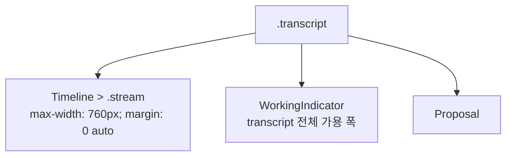

# ChatView Working Indicator Layout Analysis

## 요약

- Root: `frontend/src/components/organisms/ChatView/index.jsx`
- Modes: `style`
- Verdict: 사용자 결정에 따라 `WorkingIndicator`를 `Timeline`의 `.stream`
  마지막 항목으로 이동한다. border와 background를 제거하고 dot, label,
  interrupt hint는 유지한다.

## 범위

| 항목 | 경로 | 비고 |
|---|---|---|
| Root | `frontend/src/components/organisms/ChatView/index.jsx` | `WorkingIndicator` 선언과 busy 조건부 렌더 |
| Timeline | `frontend/src/components/organisms/Timeline/index.jsx` | 중앙 `.stream` layout 소유 |
| Styles | `src/personal_agent_gateway/static/styles.css` | transcript, stream, working indicator 규칙 |
| Tests | `frontend/src/components/organisms/ChatView/ChatView.test.jsx` | busy/idle 표시와 Escape interrupt 검증 |
| Parent | `frontend/src/components/containers/GatewayApp/index.jsx` | `busy`, `turnStart`, `onInterrupt` 주입 |

## 레이아웃 관계

`ChatView`는 `.transcript` 안에서 `Timeline`, `WorkingIndicator`,
`Proposal`을 형제 요소로 렌더한다. `Timeline` 내부 `.stream`에만
`max-width: 760px`와 `margin: 0 auto`가 있어 activity와 reasoning은 중앙
content 열에 제한된다. `WorkingIndicator`에는 이 폭 제약이 없어 현재 화면처럼
transcript 전체 폭으로 늘어난다.

## 스타일과 레이아웃

현재 `.working-indicator`는 `border: 1px solid var(--c-warn)`,
`background: rgba(255, 165, 0, 0.06)`, `padding: 8px 12px`로 독립 카드처럼
표현된다. 이는 사용자가 요청한 “같은 영역의 진행 상태”보다 별도 경고 패널에
가깝다.

선택된 변경은 indicator의 layout 소유권을 `Timeline`으로 이동한다.

- `Timeline`이 기존 `busy`와 새 `turnStart`를 받아 `.stream`의 마지막 항목으로
  indicator를 렌더한다.
- `.stream`이 이미 `max-width: 760px`와 중앙 정렬을 소유하므로 indicator에
  별도 폭 규칙을 중복하지 않는다.
- `border: none`, `background: transparent`로 카드 표현을 제거한다.
- `margin: 0`, `padding: 8px 0`으로 content 열의 좌우 시작점을 맞춘다.
- `.working-dot`, `.working-label`, `.working-hint`는 유지해 실행 상태, 경과
  시간, Escape 동작 안내를 보존한다.

### 대안 비교

1. **CSS-only 정렬.** DOM과 상태 흐름을 바꾸지 않고 요청한 시각적 결과만
   만든다. 노력과 회귀 위험이 가장 작다.
2. **`Timeline`의 `.stream` 안으로 이동 — 사용자 선택.** 실행 상태가 activity,
   reasoning과 동일한 stream 소유권을 가져 구조와 시각적 영역이 일치한다.
   `Timeline`에 `turnStart`를 추가해야 하지만 변경 범위는 두 컴포넌트에
   제한된다.
3. **timeline event row로 표현.** activity rail과 완전히 결합되지만 지속 상태를
   이벤트로 위장하므로 현재 `busy` 기반 수명과 의미가 맞지 않는다.

## 권장 후속 작업

1. `WorkingIndicator`와 `fmtElapsed` 사용을 `Timeline`으로 이동한다.
2. `ChatView`는 `turnStart`를 `Timeline`에 전달하고 별도 indicator sibling을
   제거한다.
3. `.working-indicator`의 margin, padding, border, background만 수정한다.
4. Escape 처리 effect는 `ChatView`에 유지한다.
5. `ChatView.test.jsx`에서 indicator가 `.stream` 내부에 있는지 검증하고 기존
   working/interrupt 테스트와 frontend build를 focused 검증으로 실행한다.

## 스킬 핸드오프

- `superpowers:brainstorming`: 사용자가 말한 “같은 영역”을 `.stream`의 중앙
  760px content 열로 확정하고 `Timeline` 내부 이동 설계 승인을 받았다.
- 승인 후 `superpowers:writing-plans`: CSS-only 변경과 focused 검증을 한 Task로
  계획한다.

## 리뷰

- Verdict: PASS
- Rounds: 2
- Fixed: 1차 재검사에서 증거 줄 번호를 수정했다. 사용자 선택을 반영한 2차
  재검사에서 `Timeline`이 이미 `busy`를 받고 있고 `turnStart`만 추가하면 되는지,
  Escape effect가 `ChatView`에 독립적으로 남을 수 있는지, `.stream`의 폭 소유권과
  기존 테스트 경계를 다시 대조했다.

## 증거

- `frontend/src/components/organisms/ChatView/index.jsx:104-112`
- `frontend/src/components/organisms/ChatView/index.jsx:202-204`
- `frontend/src/components/organisms/Timeline/index.jsx:136-182`
- `frontend/src/components/organisms/ChatView/ChatView.test.jsx:134-161`
- `frontend/src/components/containers/GatewayApp/index.jsx:794-818`
- `src/personal_agent_gateway/static/styles.css:553-559`
- `src/personal_agent_gateway/static/styles.css:794-802`
- `src/personal_agent_gateway/static/styles.css:4201-4212`
- `rg -n "<ChatView|working-indicator|working-dot|working-label|working-hint" frontend/src src/personal_agent_gateway/static/styles.css`
