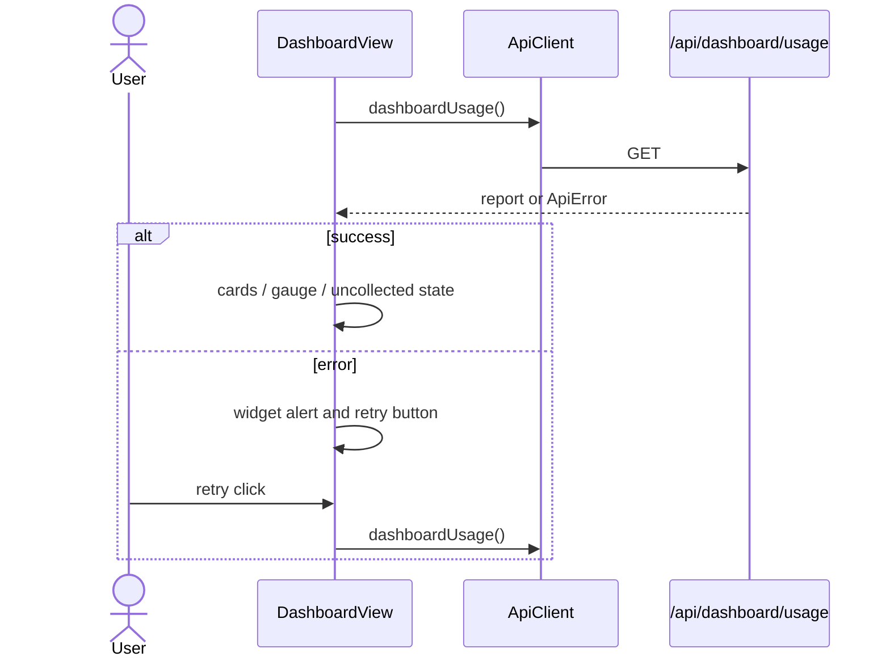
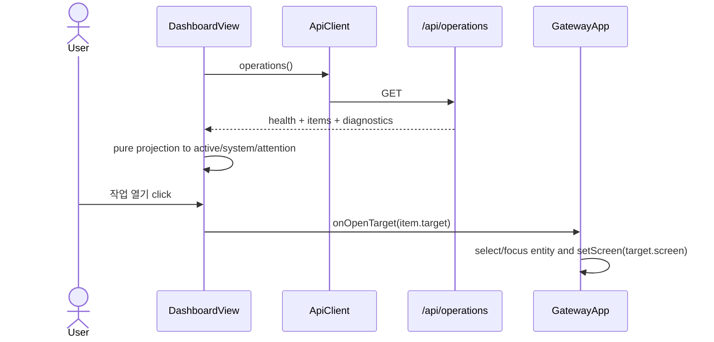

# DashboardView Operations Expansion Analysis

## 요약

- Root: `frontend/src/components/organisms/DashboardView/index.jsx`
- Modes: `understand`, `api-state`, `test`
- Verdict: 현재 `DashboardView`는 `/api/dashboard/usage`의 독립적인 loading/error/retry 경계를 소유한다. 1차 확장은 신규 endpoint 없이 기존 `api.operations()`를 같은 organism에서 독립적으로 조회하고, 순수 projection으로 진행 중 작업·시스템 상태·조치 필요를 만들 수 있다. `/api/operations`의 raw field는 세 범주의 1차 read-only 표시와 deep-link에 충분하다.

## 범위

| Item | Path | Notes |
| --- | --- | --- |
| Root organism | `frontend/src/components/organisms/DashboardView/index.jsx` | 사용량 조회, 상태 분기, 카드 렌더링 |
| Co-located style | `frontend/src/components/organisms/DashboardView/DashboardView.css` | Dashboard 전용 layout과 상태 style |
| Component test | `frontend/src/components/organisms/DashboardView/DashboardView.test.jsx` | usage API와 네 가지 화면 상태 검증 |
| Parent container | `frontend/src/components/containers/GatewayApp/index.jsx` | Dashboard mount와 operation target navigation owner |
| Parent integration test | `frontend/src/components/containers/GatewayApp/GatewayApp.test.jsx` | 인증 후 Dashboard navigation smoke test |
| API client | `frontend/src/api/client.js` | `dashboardUsage()`, `operations()`, `ApiError`, `apiErrorAction` |
| Usage endpoint | `src/personal_agent_gateway/api/dashboard.py` | provider usage report projection |
| Operations endpoint | `src/personal_agent_gateway/api/operations.py` | 작업·health·diagnostics·deep-link read model |
| Backend contract tests | `tests/test_api_dashboard.py`, `tests/test_api_operations.py` | 인증과 payload shape/semantics 검증 |
| Existing operations UI | `frontend/src/components/organisms/OperationsView/index.jsx` | 같은 operations payload의 현재 소비 예시 |

## 컴포넌트 트리

```mermaid
flowchart TD
  GatewayApp --> DashboardView
  DashboardView --> ProviderUsageCard
  ProviderUsageCard --> UsageGauge
  ProviderUsageCard --> UsageMetric
  DashboardView --> ApiClient[api client]
  ApiClient --> UsageEndpoint[/api/dashboard/usage]
  ApiClient -. expansion .-> OperationsEndpoint[/api/operations]
```

`UsageGauge`, `UsageMetric`, `ProviderUsageCard`는 `DashboardView/index.jsx`에 있는 file-local presentational child다. 외부 공용 component나 store는 사용하지 않는다. 확장 시 operations summary/list도 이 파일의 단일 사용 child 또는 별도 co-located file로 한정하고, `OperationsView` 전체를 중첩하지 않는다. 기존 `OperationsView`는 emergency stop, retry/resume, backup까지 소유해 Dashboard의 read-only 요약보다 책임이 크다.

## Props 흐름

```mermaid
flowchart LR
  GatewayApp -->|현재 props 없음| DashboardView
  DashboardView -->|GET| UsageApi[/api/dashboard/usage]
  DashboardView -.->|GET| OperationsApi[/api/operations]
  DashboardView -.->|proposed onOpenTarget target| GatewayApp
  GatewayApp -.->|set selected/focused entity and screen| TargetScreen[Chat / Team Runs / Jobs / Schedules]
```

현재 public props는 없다. operations item의 기존 `target`을 Dashboard에서 활용하려면 `onOpenTarget(target)` 하나만 추가하고, `GatewayApp.handleOpenOperationTarget`을 그대로 주입하는 것이 최소 경계다. Dashboard에서 retry/resume/emergency-stop mutation을 직접 노출하지 않으므로 mutation callback은 추가하지 않는다.

## 상태와 Effect

| State/effect | 현재 역할 | 확장 영향 |
| --- | --- | --- |
| `report` | usage response 보관 | 유지 |
| `error` | usage request error 보관 | `usageError`로 의미를 명확히 분리 |
| `loading` | usage initial/refresh loading | `usageLoading`으로 분리 |
| `reloadKey` | usage retry/refresh effect 재실행 | usage와 operations를 함께 갱신할지, source별 key로 나눌지 결정 필요 |
| usage `useEffect` | mount/reload 시 `api.dashboardUsage()` 호출, unmount guard 적용 | 유지하되 operations effect와 독립 실패 경계 보장 |
| proposed operations state | 없음 | `operations`, `operationsError`, `operationsLoading`, `operationsReloadKey` 추가 |
| proposed projection | 없음 | render 중 순수 함수로 active/attention/system summary 계산 |

두 GET은 상호 의존성이 없으므로 mount 시 동시에 시작해야 한다. 하나의 `Promise.all`로 묶어 한 endpoint 실패가 전체 Dashboard를 막게 하지 않고, source별 effect 또는 같은 effect 안의 독립 promise chain을 사용한다. refresh 실패 시 직전 성공 data를 지우지 않고 stale data와 inline error를 함께 보여준다.

## 외부 primitive와 주입 동작

| Dependency | 이 컴포넌트에서 하는 일 |
| --- | --- |
| React `useState` | server response, loading, error, retry key를 source별로 보관한다. |
| React `useEffect` | mount/retry 시 GET을 실행하고 cleanup에서 unmounted update를 차단한다. |
| `Intl.DateTimeFormat` | backend ISO timestamp를 한국어 local date/time으로 표시한다. |
| `Number.isFinite`, `toLocaleString` | 확인된 usage 숫자만 gauge/value로 표시한다. |
| shared `api` object | `dashboardUsage()`와 기존 `operations()`를 같은 error normalization 경계로 호출한다. |
| proposed `onOpenTarget` | parent `GatewayApp.handleOpenOperationTarget`이 주입하는 navigation callback이다. Dashboard는 target shape를 해석하거나 screen state를 직접 소유하지 않는다. |

### Custom hooks / selectors / actions

| 항목 | 역할 |
| --- | --- |
| Custom hook | 없음. 현재 component는 React built-in hook만 사용한다. |
| Store selector/dispatch | 없음. global store를 구독하지 않는다. |
| Parent callback | 현재 없음. 확장 시 `onOpenTarget`만 추가해 기존 operation deep-link를 parent에 위임한다. |
| API mutation | 없음. 1차 Dashboard는 read-only다. |

## 주요 상호작용 흐름

### 현재 usage 조회와 재시도



### 제안 operations 조회와 deep-link



## API와 상태 추적

### `/api/dashboard/usage`

- `DashboardView:128-137`에서 `api.dashboardUsage()`를 호출한다.
- `client.js:143-145`는 `GET /api/dashboard/usage`의 JSON body를 그대로 반환한다.
- `api/dashboard.py:9-15`는 `collect_local_agent_usage()` 결과를 직렬화한다.
- provider payload는 `weekly_limit`, `used`, `remaining`, `reset_at`, `usage_status`와 availability metadata를 포함한다(`tests/test_api_dashboard.py:50-79`).

### `/api/operations` coverage 판정

| Dashboard 범주 | 기존 field | 판정 |
| --- | --- | --- |
| 진행 중 작업 | `items[].domain/id/title/status/updated_at/target`, Team Run `policy_status/queue_count/next_run_at` | 충분. `items`를 stable status set으로 filter/sort한다. `counts`는 `planning/summarizing`가 없어 active 합계 source로 쓰지 않는다. |
| 시스템 상태 | `health[].name/ready/detail`, `intake_open`, `access_mode`, `diagnostics.workspace_writable` | 충분. readiness와 detail을 compact summary로 표시한다. |
| 조치 필요 | `items[].status/retryable/resumable/target`, Team Run `policy_status/pause_reason`, `health[].ready`, `intake_open` | 1차 충분. failed/interrupted/waiting_approval/canceled, retryable/resumable, paused_failure/paused_interrupted, unhealthy component, stopped intake를 frontend projection으로 분류한다. |

`/api/operations`는 session, team_run, job, schedule를 하나의 `items` read model로 합친다(`operations.py:18-23,178-299`). 각 item은 deep-link `target`을 제공하고, Team Run은 continuous policy metadata까지 포함한다(`:227-245`). Health는 database, worker, scheduler, hook loops, team cycle loops, CLI, intake를 제공한다(`health.py:42-67`).

### 확인된 제한과 백엔드 최소 보강 판정

1. `counts`는 `planning`과 `summarizing`를 집계하지 않는다(`operations.py:39-50`). raw `items`가 있으므로 1차 Dashboard는 frontend 계산으로 해결하며 backend 변경은 불필요하다.
2. background component는 `last_error`가 있어도 `ready=True`, `detail="degraded: ..."`가 될 수 있다(`health.py:69-76`). 1차는 system detail에 degraded 문구를 그대로 노출하되 조치 필요 count는 `ready=False`만 안정적으로 센다. “degraded도 조치 필요 count에 반드시 포함”이 제품 acceptance가 되면 `ComponentHealth`에 `state: ready|degraded|down`을 비파괴적으로 추가하는 최소 보강이 필요하다.
3. `waiting_approval`은 `retryable/resumable`이 아니지만 status 자체가 사람 조치를 의미한다. frontend mapper가 명시적 status allowlist를 가져야 한다.
4. 새 Dashboard endpoint 또는 `/api/operations` top-level `attention` projection은 1차에 만들지 않는다. 같은 raw contract를 중복 projection하면 Operations 화면과 Dashboard 의미가 갈라질 위험이 더 크다.

## 테스트와 Story

- Story 파일은 `frontend/src` 검색에서 없다.
- `DashboardView.test.jsx:41-124`는 usage 정상, 미수집/실행 불가, network error retry, provider empty를 검증한다.
- `OperationsView.test.jsx:74-173`는 health/diagnostics, operation deep-link, resume/retry, Team Run policy metadata, error recovery를 검증한다.
- `GatewayApp.test.jsx:92-118`는 인증 후 Dashboard navigation을 검증하지만 `/api/operations` Dashboard 소비나 `onOpenTarget` 주입은 아직 검증하지 않는다.
- `tests/test_api_operations.py:29-174`는 auth, diagnostics/health names, session/job/schedule target, canceled retry, interrupted Team Run resume, continuous policy metadata를 검증한다.
- Baseline verification: frontend 관련 3개 test file 53 tests PASS; backend API 7 tests PASS.

추가 RED 범위:

1. pure projection: active status 포함/terminal 제외, attention 중복 제거, unhealthy/intake warning 계산, updated_at 정렬과 최대 표시 개수.
2. DashboardView: 두 API가 mount 시 모두 호출되고 한쪽 실패가 다른 widget을 가리지 않음, source별 retry, stale data 유지.
3. DashboardView: operation item의 “열기”가 정확한 `target`으로 `onOpenTarget` 호출.
4. GatewayApp: `onOpenTarget` 주입 후 job/team/session/schedule target이 기존 navigation handler로 연결됨.
5. backend contract: Dashboard mapper가 의존하는 공통 item field와 Team Run policy field, health field가 유지됨.

## 권장 후속 작업

1. frontend에서 operation projection 기준을 먼저 unit test로 고정한다. 이유: backend raw status를 UI 의미로 바꾸는 단일 정책 지점이 필요하다.
2. `DashboardView`가 usage와 operations를 동시에, 독립 error boundary로 조회하도록 확장한다. `api.operations()`는 이미 있으므로 client production 변경은 없다.
3. `GatewayApp`은 `onOpenTarget={handleOpenOperationTarget}`만 주입한다. mutation callback과 operations parent state는 추가하지 않는다.
4. backend production 변경은 1차 범위에서 제외한다. 대신 contract regression test를 보강한다.
5. degraded component를 조치 필요 count에 포함해야 한다는 acceptance가 추가될 때만 `ComponentHealth.state`를 optional field로 보강한다.

## 스킬 핸드오프

- `component-pattern`: 실행 단계에서 `DashboardView` 내부 child를 추출하거나 catalog public props를 변경할 때 ownership 경계를 다시 확인한다.
- `vercel-react-best-practices`: 독립 GET을 병렬 시작하고, 단순 filter/count에 불필요한 memoization을 추가하지 않는다.
- 별도 SOLID/refactor plan은 필요하지 않다. 현재 변경은 기존 organism의 data-boundary 확장과 parent callback 하나다.

## Review

- Verdict: `PASS`
- Rounds: 2
- Fixed: 실제 렌더 경로와 달랐던 `DashboardView --> UsageGauge` 직접 edge를 제거하고 `DashboardView --> ProviderUsageCard --> UsageGauge` 경로로 정정한 뒤 독립 재검토를 통과함.

## 근거

- `frontend/src/components/organisms/DashboardView/index.jsx:1-204`
- `frontend/src/components/organisms/DashboardView/DashboardView.css:1-195`
- `frontend/src/components/organisms/DashboardView/DashboardView.test.jsx:1-125`
- `frontend/src/components/containers/GatewayApp/index.jsx:236-302,624-659,719-776`
- `frontend/src/components/containers/GatewayApp/GatewayApp.test.jsx:92-118`
- `frontend/src/api/client.js:19-60,143-145,232-249`
- `src/personal_agent_gateway/api/dashboard.py:1-15`
- `src/personal_agent_gateway/api/operations.py:13-56,178-299`
- `src/personal_agent_gateway/health.py:42-76`
- `tests/test_api_dashboard.py:20-79`
- `tests/test_api_operations.py:29-174`
- `frontend/src/components/organisms/OperationsView/index.jsx:1-273`
- `frontend/src/components/organisms/OperationsView/OperationsView.test.jsx:1-174`
- Search: `rg -n "DashboardView|dashboardUsage|/api/operations|api.operations|policy_status|retryable|resumable" frontend src tests`
- Baseline commands: `npm test -- --run src/components/organisms/DashboardView/DashboardView.test.jsx src/components/organisms/OperationsView/OperationsView.test.jsx src/components/containers/GatewayApp/GatewayApp.test.jsx`; `python -m pytest tests/test_api_operations.py tests/test_api_dashboard.py -q --basetemp frontend/node_modules/.pytest-dashboard-plan`.
