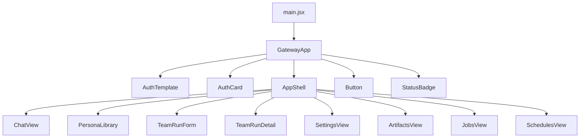
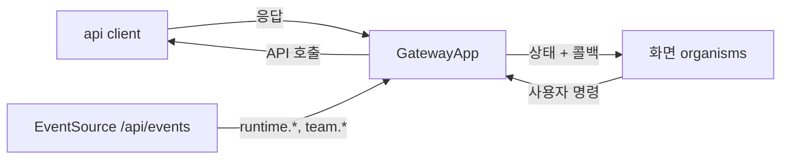
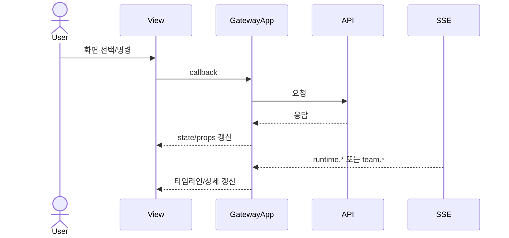

# GatewayApp Component Analysis

## 요약

- Root: `frontend/src/components/containers/GatewayApp/index.jsx`
- Modes: `understand`, `refactor`
- Verdict: 컨테이너 소유권은 적절하지만 날짜 표시가 컨테이너와 하위 화면에 중복돼 있다. 공통 순수 포맷터로 통합하는 것은 낮은 위험의 `pure helper 추출`이다.

## 범위

| Item | Path | Notes |
|---|---|---|
| Root | `frontend/src/components/containers/GatewayApp/index.jsx` | 인증 이후 모든 화면의 상태·API·화면 전환을 조립 |
| 시간 유틸 | `frontend/src/lib/time.js` | 채팅 시각과 경과 시간을 제공 |
| 날짜 소비 화면 | `frontend/src/components/organisms/{TeamRunDetail,ArtifactsView,JobsView,SchedulesView}/index.jsx` | ISO 날짜를 직접 출력하거나 로컬 `fmtWhen`으로 변환 |
| 채팅 날짜 변환 | `frontend/src/lib/timeline.js`, `frontend/src/components/organisms/ChatView/index.jsx` | persisted/SSE 이벤트와 활성 session의 `created_at`을 표시 |
| 테스트 | `frontend/src/components/containers/GatewayApp/GatewayApp.test.jsx` | 컨테이너 주요 사용자 흐름 검증 |
| 진입점 | `frontend/src/main.jsx` | `GatewayApp` 단일 사용처 |

사용자 요구사항은 모든 실제 날짜·시각을 `YYYY년 MM월 DD일 HH시 mm분 ss초` 형태로 표시하되 현재 로컬 시각과 앞부분이 같으면 동일한 연, 이어서 월, 이어서 일을 순서대로 생략하는 것이다. 따라서 같은 날은 `HH시 mm분 ss초`, 같은 달의 다른 날은 `DD일 HH시 mm분 ss초`, 같은 해의 다른 달은 `MM월 DD일 HH시 mm분 ss초`, 다른 해는 전체 형식이다. 숫자는 두 자리로 채우며 잘못된 값은 빈 문자열로 처리한다.

## 컴포넌트 트리

## Props 흐름

`GatewayApp`은 props를 받지 않는다. `main.jsx`가 `UiProvider` 안에서 렌더링하고, 컨테이너가 API 응답을 상태로 보관한 뒤 각 organism에 값과 명령 콜백을 전달한다.

## 상태와 Effects

- `useState`: 인증, 활성 화면, 세션별 타임라인, persona/team run/artifact/job/schedule 목록과 선택 상태를 보유한다 (`GatewayApp/index.jsx:110-135`).
- `useRef`: `activeSessionIdRef`, `busyRef`, `selectedTeamRunIdRef`는 SSE/비동기 콜백이 최신 선택·실행 상태를 읽게 하고, `seenSseEventIdsRef`는 이벤트 중복을 제거한다. `turnStartRef`는 현재 turn 시작과 새 artifact 판정 하한을 보관하며, `lastConfigAttemptRef`는 실패한 session config를 재시도한다 (`GatewayApp/index.jsx:136-141`, `241-326`, `412-458`).
- `useMemo`: artifact 원본 경로를 키로 하는 `Map`을 구성해 ChatView에 전달한다 (`GatewayApp/index.jsx:160-167`).
- `useCallback`: 초기 앱 데이터를 병렬 로드하는 `loadApp`의 참조를 고정한다 (`GatewayApp/index.jsx:169-209`).
- effects: 문서 제목, 인증 bootstrap, SSE 연결, ref 동기화, 화면별 데이터 로드, 선택된 team run 상세 로드를 담당한다 (`GatewayApp/index.jsx:156-371`).

### 커스텀 hook과 주입 동작

| Hook/동작 | 출처 | 이 컴포넌트에서의 역할 |
|---|---|---|
| `useConfirm` | `components/providers/UiProvider` | team run 삭제·재개 전 사용자 확인 |
| `useToast` | `components/providers/UiProvider` | API 명령의 성공·실패 알림 |
| `useForceTick` | 같은 파일의 로컬 hook | 채팅 작업 중 1초마다 경과 시간 렌더를 갱신 |
| 하위 화면 callbacks | `GatewayApp` 내부 handler | 하위 organism의 사용자 동작을 API 호출과 상태 갱신으로 연결 |

## 외부 의존성

- React의 `useState`, `useEffect`, `useMemo`, `useCallback`, `useRef`가 로컬 앱 상태, 생명주기, 파생 인덱스와 비동기 콜백의 최신 값 연결을 담당한다.
- 브라우저 `EventSource`는 `/api/events`의 실시간 runtime/team 이벤트를 받아 세션 타임라인 또는 선택된 team run 상세를 갱신한다.
- `api` 모듈은 인증, 세션, team run, artifact, job, schedule 명령의 유일한 HTTP 경계다.

## 주요 상호작용 흐름

1. 로그인: `handleLogin` → `api.login` → `loadApp` → status/session/history/config 상태를 채우고 `authenticated`를 설정한다 (`GatewayApp/index.jsx:373-381`, `169-209`).
2. 채팅 전송: `ChatView.onSend` → `handleSend` → 로컬 user entry를 먼저 추가 → `api.sendSessionChat` → `postTurn` 순서다. 요청 실패 시 로컬 user entry를 제거한다. `/api/events`의 `runtime.*`는 busy/event 상태와 streamed entry를 갱신하며, 특수 reconciliation은 streamed agent 응답과 HTTP fallback agent 응답 사이에서 수행된다 (`GatewayApp/index.jsx:50-72`, `241-326`, `505-555`). persisted/SSE의 `created_at`은 `lib/timeline.js`에서 표시 문자열로 변환되어 Timeline에 전달된다.
3. 세션 활성화: `ChatView.onActivate` → `handleActivate` → history/activity/status 병렬 조회 → `sessionStateById`와 active refs 갱신 (`GatewayApp/index.jsx:600-626`).
4. 팀 목록/상세: 화면 진입 시 `api.teamRuns`가 `teamRuns`를 채우고, 목록 click → `handleSelectTeamRun` → `selectedTeamRunId` effect → `api.teamRunDetail`이 `teamRunDetail`을 채운다. `/api/events`의 `team.*`도 선택된 상세를 재조회한다 (`GatewayApp/index.jsx:338-371`, `811-813`, `260-264`, `993-1014`). 목록의 `updated_at`과 상세의 `started_at`/message `created_at`이 날짜 포맷 대상이다.
5. 관리 화면: screen effect가 artifact/job/schedule 목록을 조회해 각 organism에 전달하며, 각 화면은 생성·상태 명령 후 목록을 다시 조회한다 (`GatewayApp/index.jsx:338-357`, `756-809`, `1033-1050`).

## 리팩터링 판단

- `유지`: 앱 전체 데이터 경계와 화면 조립은 `containers/GatewayApp` 소유가 맞다. `main.jsx` 외 사용처가 없고 organism들은 API 호출을 부모에 위임한다.
- `pure helper 추출` (낮은 effort/낮은 risk): `GatewayApp`의 `run.updated_at`, `TeamRunDetail`의 `run.started_at`과 두 message `created_at`, 그리고 `ArtifactsView`, `JobsView`, `SchedulesView`의 동일한 로컬 `fmtWhen`은 날짜 표시 정책을 분산시킨다. `lib/time.js`의 순수 함수로 통합하고 유틸 단위 테스트를 두는 것이 안전하다. 현재 owner는 각 화면이지만 정책 owner는 공용 lib가 적합하다.
- `hook/model 추출` (높은 effort/중간 risk, 이번 범위 제외): `GatewayApp`은 인증·chat·team·관리 화면의 state/effect/handler를 한 컨테이너가 소유해 변경 영향 범위가 크다 (`GatewayApp/index.jsx:107-858`). 안전한 다음 단계는 별도 계획과 회귀 테스트 후 feature별 controller hook을 순차 추출하는 것이다.
- `프레젠테이션 분해` (중간 effort/중간 risk, 이번 범위 제외): render의 teams 분기가 목록·신규·상세 세 영역을 인라인으로 조립한다 (`GatewayApp/index.jsx:948-1030`). 안전한 다음 단계는 동작을 옮기지 않고 동일 owner의 presentational component부터 분리하는 것이다.
- 반복 sibling JSX는 team-run 목록의 데이터 기반 `.map()` 등 이미 기술되어 있다. 이번 범위에서 새 DRY 추출이 필요한 3회 이상 반복 블록은 확인되지 않았다.

## 권장 후속 작업

1. `lib/time.js`에 사용자 요구사항의 한국어 날짜 포맷터를 추가하고 다른 해/같은 해/같은 달/같은 날/잘못된 값 경계 테스트를 작성한다.
2. `GatewayApp`의 `run.updated_at`, `TeamRunDetail`의 `run.started_at`과 task dialog/live activity의 `message.created_at`, `ArtifactsView`의 `a.created_at`, `JobsView`의 `finished_at || started_at || created_at`, `SchedulesView`의 `next_run_at`/`last_run_at`을 공통 포맷터로 교체한다.
3. `lib/timeline.js`의 persisted/SSE `created_at`, `ChatView`의 활성 session `created_at`, `GatewayApp` 및 `lib/timeline.js`가 `nowHM`/`nowHMS`로 생성하는 로컬 user·fallback agent·command/SSE fallback 시각도 공통 포맷터를 사용한다. 경과 시간인 `fmtElapsed`, cron 입력의 `HH:mm`, 이미 완성된 표시 문자열을 받는 `Timeline` 컴포넌트는 날짜 파싱 대상이 아니므로 유지한다.
4. 새 `frontend/src/lib/time.test.js`에서 고정된 현재 시각으로 다른 해/같은 해/같은 달/같은 날/잘못된 값 경계를 검증한다. 변경 영향을 받는 `lib/timeline.test.js`, `GatewayApp.test.jsx`, `ChatView.test.jsx`, `TeamRunDetail.test.jsx`, `ArtifactsView.test.jsx`, `JobsView.test.jsx`, `SchedulesView.test.jsx`와 전체 frontend build를 실행한다.

## 스킬 핸드오프

- 공통 날짜 표시 변경은 독립적인 순수 함수와 얕은 호출부 교체이므로 별도 SOLID 계획 없이 구현 가능하다.
- React 호출부 변경 시 `vercel-react-best-practices`의 불필요한 memoization을 피하는 원칙을 따른다.

## 리뷰

- Verdict: PASS
- Rounds: 3
- Fixed: 1차 검토의 날짜 필드 누락, 사용자 요구사항 근거, 실제 상호작용 흐름, refactor label 구분을 보완했다. 2차 검토의 `nowHM`/`nowHMS` 소비, 활성 session 의미, user/SSE reconciliation, ref별 역할, 테스트 파일 목록을 보완했으며 3차 검토에서 통과했다.

## 근거

- `rg -n "^import|use(State|Effect|Memo|Callback|Ref)|fmtWhen|updated_at" frontend/src`
- `frontend/src/components/containers/GatewayApp/index.jsx:107-1055`
- `frontend/src/lib/time.js`
- `frontend/src/main.jsx`
- `frontend/src/components/containers/GatewayApp/GatewayApp.test.jsx`
