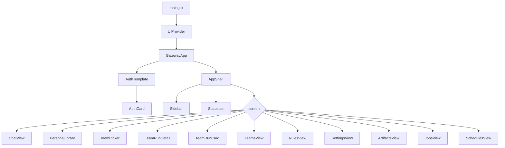
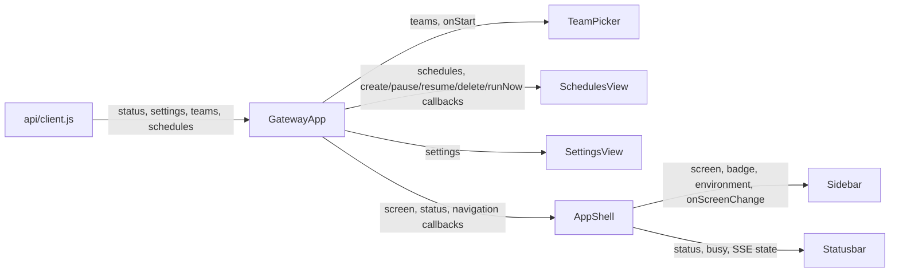
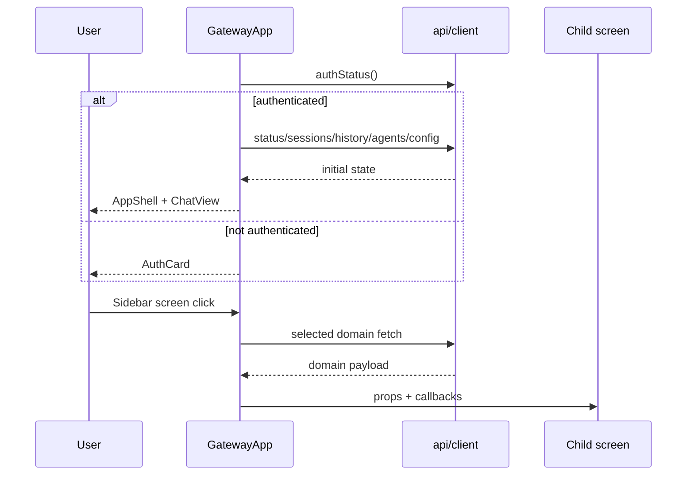

# GatewayApp R0 Runtime Capability Component Analysis

## 요약

- Root: `frontend/src/components/containers/GatewayApp/index.jsx`
- Modes: `understand`, `api-state`, `test`
- Verdict: R0-E는 `GatewayApp` 구조 분리 없이 backend settings 계약을 기존 화면에 전달하는 작은 변경으로 수행할 수 있다.
- 핵심 발견: 실제 Team Run 생성 화면은 사용되지 않는 `TeamRunForm`이 아니라 `GatewayApp → TeamPicker` 경로다.

## 범위

| 항목 | 경로 | 비고 |
| --- | --- | --- |
| Root container | `frontend/src/components/containers/GatewayApp/index.jsx` | auth, bootstrap, SSE, domain fetch와 화면 조합 |
| API boundary | `frontend/src/api/client.js` | `fetch` 응답을 화면용 값으로 정규화 |
| Team Run 입력 | `frontend/src/components/organisms/TeamPicker/index.jsx` | 실제 새 Team Run 경로의 mode/worker 입력 |
| Automation | `frontend/src/components/organisms/SchedulesView/index.jsx` | Schedule 생성과 Run now action |
| Runtime 진단 | `frontend/src/components/organisms/SettingsView/index.jsx` | backend settings read model 표시 |
| Shell | `frontend/src/components/templates/AppShell/index.jsx` | Sidebar, Statusbar, active screen child 조합 |
| Usage root | `frontend/src/main.jsx` | `UiProvider` 아래 `GatewayApp` 단일 mount |
| Root test | `frontend/src/components/containers/GatewayApp/GatewayApp.test.jsx` | bootstrap, Chat, Team Run, navigation 통합 test |
| Child tests | `TeamPicker.test.jsx`, `SchedulesView.test.jsx`, `SettingsView.test.jsx` | 각 입력/표시 contract test |
| API test | `frontend/src/api/client.test.js` | endpoint와 응답 normalization test |

`TeamRunForm/index.jsx`는 repository 검색에서 자신의 test 외 production usage가 없다. R0-E의 실제 사용자 경로는 `TeamPicker`이므로 production 변경 범위는 `TeamPicker`로 잡는다.

## 컴포넌트 트리

`Button`은 Team Run 목록과 새 Run action에 직접 사용되는 shared leaf다. `AppShell`은 `Sidebar`와 `Statusbar`를 조립하고 `children`으로 선택 화면을 받는다.

## Props 흐름

| 자식 | 입력 | Root가 주입하는 동작 |
| --- | --- | --- |
| `TeamPicker` | `teams` | `handleCreateTeamRun`이 create 후 start하고 list/detail을 갱신한다. |
| `SchedulesView` | `schedules` | create/pause/resume/delete/run-now handler가 API 호출 후 목록 또는 toast를 갱신한다. |
| `SettingsView` | `settings` | 현재는 read-only이며 callback이 없다. |
| `AppShell` | `screen`, `status`, Chat/SSE 상태 | 화면 변경 시 Team detail/creation state를 정리한다. |
| `ChatView` | session/config/timeline/approval 상태 | send, interrupt, approve/deny, activate, reset, search 등의 callback을 받는다. |

## State / Effects

### State 소유권

| 범주 | state | 역할 |
| --- | --- | --- |
| Auth/bootstrap | `booting`, `authenticated`, `authStage`, `authError`, `setup`, `recoveryCodes` | OTP setup/login 화면과 protected app 진입 |
| Navigation/runtime | `screen`, `status`, `navOpen`, `sseState`, `settings` | active screen, runtime status, mobile nav, SSE/Settings 표시 |
| Chat/session | `sessions`, `agents`, `sessionConfig`, `sessionConfigError`, `activeSessionId`, `sessionStateById` | session별 timeline, busy, approval, config cache |
| Team | `personas`, `avatarChoices`, `teamRuns`, `teams`, `creatingTeamRun`, `runFilter`, `selectedTeamRunId`, `teamRunDetail`, `teamRunDocuments` | Team library와 Run list/create/detail |
| 기타 domain | `rules`, `artifacts`, `jobs`, `schedules` | 선택 화면의 API 결과 |

### Memo와 ref

- `registeredByPath`는 `artifacts`를 `metadata.original_path` 기준 `Map`으로 바꿔 Chat artifact lookup을 반복 scan하지 않게 한다.
- `activeSessionIdRef`, `busyRef`, `turnStartRef`는 EventSource callback이 최신 Chat 실행 상태를 읽도록 한다.
- `selectedTeamRunIdRef`는 Team SSE가 현재 상세를 갱신할지 판단한다.
- `seenSseEventIdsRef`는 같은 SSE event id의 중복 적용을 막는다.
- `lastConfigAttemptRef`는 session config 저장 실패 후 retry payload를 보존한다.

### Effect 목록

| Effect | trigger | side effect |
| --- | --- | --- |
| `useForceTick` | Chat 화면에서 active session busy | 1초 tick으로 elapsed UI 재렌더, cleanup에서 interval 해제 |
| document title | `environmentTitle` | browser title 설정 |
| auth bootstrap | `loadApp` | auth status 확인 후 setup 또는 protected 초기 fetch |
| global SSE | `authenticated` | `/api/events` 연결, session/team event reconcile, cleanup close |
| ref sync | active session/busy/turn start | async SSE callback용 ref 갱신 |
| Team ref sync | `selectedTeamRunId` | Team SSE callback용 ref 갱신 |
| screen loader | `screen`, `authenticated` | 선택 domain의 API를 호출해 state 갱신 |
| Team detail loader | `selectedTeamRunId` | detail/documents를 병렬 요청하고 stale completion을 `alive`로 차단 |

R0-E 변경은 새 전역 state를 만들 필요가 없다. 기존 `settings`를 Teams/Schedules 화면 진입 시 함께 읽고 runtime capability를 자식에게 prop으로 전달할 수 있다.

## 외부 library primitive

| primitive | 이 컴포넌트에서 하는 일 | 사용 이유 |
| --- | --- | --- |
| React `useState` | auth, session, Team, 화면별 서버 응답을 보관 | 화면 interaction과 비동기 응답에 따라 렌더를 갱신한다. |
| React `useEffect` | bootstrap, EventSource, screen fetch, title과 ref 동기화 | browser/API lifecycle과 component lifecycle을 연결한다. |
| React `useCallback` | `loadApp` identity를 고정 | bootstrap effect가 렌더마다 다시 실행되지 않게 한다. |
| React `useMemo` | artifact path lookup `Map` 생성 | Chat render에서 같은 artifact lookup을 빠르게 재사용한다. |
| React `useRef` | SSE callback이 최신 transient state를 읽고 event 중복을 추적 | EventSource를 busy 변화마다 재연결하지 않으면서 stale closure를 피한다. |
| Browser `EventSource` | `/api/events`의 Chat/Team event 수신 | 실행 중 상태와 timeline/detail을 push 방식으로 갱신한다. |
| Browser `fetch` | `api/client.js`를 통해 JSON API 호출 | 별도 query library 없이 현재 backend와 통신하는 단일 경계다. |
| Testing Library/Vitest | user-visible role/text와 callback/API 호출 검증 | 실제 click/type 흐름 기준 regression을 고정한다. |

React Router, query cache, 외부 store는 사용하지 않는다. `screen` local state가 navigation을 소유한다.

## Custom hook / 주입 action

| hook/action | 출처 | 이 컴포넌트에서의 역할 |
| --- | --- | --- |
| `useConfirm()` | `UiProvider` | Team/Run 삭제, Resume, Retry 전 modal 확인 |
| `useToast()` | `UiProvider` | API 성공/실패 feedback |
| `useForceTick(active)` | 같은 파일 | busy Chat elapsed 표시를 위한 1초 render tick |
| `api.*` | `frontend/src/api/client.js` | auth, session, agent, Team, settings, job, schedule, artifact API adapter |
| `entryFromSse` | `lib/timeline.js` | SSE event를 Chat timeline entry로 변환 |
| `timelineFromHistory`, `timelineFromSession` | `lib/timeline.js` | history/activity 응답을 렌더 가능한 timeline으로 조합 |
| `onScreenChange` | `GatewayApp → AppShell → Sidebar` | Sidebar click을 `screen` 변경과 Team 임시 state 정리로 연결 |
| `onStart` | `GatewayApp → TeamPicker` | form payload를 Team Run create/start API 흐름으로 연결 |
| Schedule callbacks | `GatewayApp → SchedulesView` | child button/form을 Schedule API와 toast/list refresh로 연결 |

Redux selector나 dispatch action은 없다.

## API / State 흐름

| 흐름 | API | state/result |
| --- | --- | --- |
| 최초 인증 | `authStatus`, 필요 시 `setupStart` | `authStage`, `setup`, `booting` |
| protected bootstrap | `getStatus`, `sessions`, `history`, `agents`, `activeSessionConfig` 병렬 | `status`, session/agent/config state |
| active session load | `sessionHistory`, `sessionActivity` 병렬 | `sessionStateById[sessionId].entries` |
| screen load | `personas`, `teamRuns`, `teams`, `rules`, `settings`, `artifacts`, `jobs`, `schedules` | domain별 list/read state |
| Team Run 생성 | `createTeamRun` → `startTeamRun` → `teamRuns` | creation 닫기, list 갱신, selected id 설정 |
| Team SSE | `teamRunDetail`, `teamDocuments` 병렬 | 선택된 Run detail/documents 갱신 |
| Schedule action | create/pause/resume/delete/run-now | `schedules` refresh 또는 toast |

현재 `api/client.js`의 `jsonOrNull`과 `jsonList`는 non-2xx를 각각 `null`, `[]`로 축약한다. R0-E에서는 capability의 안전 기본값을 `unsupported/unhealthy`로 두고, 전체 `ApiError` 전환은 R1-E 범위를 유지한다.

## 주요 interaction 흐름

### Bootstrap과 화면 전환

### Team Run 생성

1. 사용자가 `New team run`을 누르면 `creatingTeamRun=true`가 된다.
2. `TeamPicker`가 `team_id`, `goal`, `run_mode`, `max_workers`를 `onStart`로 보낸다.
3. `handleCreateTeamRun`은 create 성공 뒤 start를 순차 호출한다.
4. 성공하면 list를 다시 읽고 selected id를 설정해 detail loader effect가 실행된다.
5. R0-E에서는 `TeamPicker`가 backend capability에 따라 Review를 숨기고 worker 값을 `1/Sequential`로만 제출해야 한다.

### Schedule 생성/실행

1. Schedule 화면 진입 시 `api.schedules()`가 list를 채운다.
2. `ScheduleForm`은 cron을 local utility로 만들고 `onCreate`를 호출한다.
3. row action은 pause/resume/delete/run-now callback을 호출한다.
4. 현재 health 입력이 없어 모든 action이 항상 보인다. R0-E에서는 `automation_ready=false`일 때 form과 Run now를 disabled하고 backend reason을 표시해야 한다.

### Runtime Settings 표시

1. Settings 화면 진입 시 `api.settings()` 결과를 `settings`에 저장한다.
2. `SettingsView.buildGroups()`가 row를 만들고 빈 값을 걸러 표시한다.
3. 현재 `AUTHENTICATED`는 `totp_configured`에서, `TUNNEL LOCAL ONLY`는 상수에서 파생돼 실제 상태가 아니다.
4. R0-E에서는 backend가 제공하는 session/tunnel/worker/scheduler capability 값을 그대로 표시해야 한다.

## Tests / Stories

Story 파일은 repository 검색에서 확인되지 않았다.

### 기존 coverage

- `GatewayApp.test.jsx`: 인증 bootstrap, OTP login, Chat send/SSE/approval/session 전환, Team Run list/create/SSE/add-work/resume/retry/delete, 화면 navigation을 폭넓게 검증한다.
- `TeamPicker.test.jsx`: 저장 Team roster 표시, 기본 `planning_only` payload, Team 없음 안내를 검증한다.
- `SchedulesView.test.jsx`: Schedule row와 생성 payload/cron을 검증한다.
- `SettingsView.test.jsx`: backend row 표시와 빈 값 제거를 검증한다. 현재 잘못된 파생값인 `AUTHENTICATED`, 상수 `LOCAL ONLY`도 기대값으로 고정한다.
- `client.test.js`: endpoint URL과 list/body normalization을 검증하지만 runtime settings capability shape test는 없다.

### R0-E에서 먼저 추가할 RED cases

| test | 이유 |
| --- | --- |
| `TeamPicker`가 Review option을 렌더하지 않고 `max_workers: 1`을 제출 | 실제 runtime과 UI 계약 일치 |
| `TeamPicker`가 `Sequential`과 effective worker 1을 표시 | 저장된 max worker와 실제 실행 능력 구분 |
| `SchedulesView`가 unhealthy일 때 create/Run now를 disable하고 reason 표시 | 기동하지 않은 automation을 실행 가능하게 보이지 않게 함 |
| `SettingsView`가 `session_authenticated`, `tunnel_mode`, Worker/Scheduler alive, effective concurrency를 payload대로 표시 | hard-code와 TOTP 오해 제거 |
| `GatewayApp`가 Teams/Schedules 진입 시 settings를 읽어 capability prop 전달 | 자식 단위 test와 실제 화면 wiring 연결 |
| capability/settings 요청 실패 시 safe disabled 상태 | `null` 응답에서도 미지원 기능이 활성화되지 않게 함 |

## 권장 후속 작업

1. R0-E RED test를 `TeamPicker`, `SchedulesView`, `SettingsView`, `GatewayApp` 순서로 추가한다.
2. Backend `/api/settings`에 `session_authenticated`, `tunnel_mode`, `worker_alive`, `scheduler_alive`, `automation_ready`, `team_review_supported`, `team_execution_mode`, `effective_job_concurrency`를 제공한다.
3. `GatewayApp`의 Teams/Schedules screen loader가 settings를 기존 domain fetch와 병렬로 읽게 한다.
4. `TeamPicker`는 Review를 숨기고 worker control을 `Sequential` read-only 표시로 바꾼다.
5. `SchedulesView`는 `automation` prop의 ready/reason으로 create와 Run now만 차단하고 pause/delete 같은 안전 action은 유지한다.
6. `SettingsView`는 backend 값을 표시하고 hard-coded auth/tunnel 문구를 제거한다.
7. 이 변경에서 `GatewayApp` controller 추출이나 API error adapter 전환은 하지 않는다. 각각 R1-G와 R1-E의 별도 변경이다.

## 스킬 핸드오프

- `vercel-react-best-practices`: 독립 API는 `Promise.all`로 병렬 요청하고, 기존 state/effect 경계를 불필요하게 늘리지 않는지 구현 중 확인한다.
- 추가 구조 리팩터링 스킬은 필요하지 않다. 이번 변경은 capability prop과 화면 표시 계약에 한정한다.

## 리뷰

- Verdict: PASS
- Rounds: 1
- Fixed: 별도 수정 없음. Root imports/state/effect, `TeamPicker` 실제 usage, screen별 API 호출, Settings hard-code, Schedule action, 관련 test usage를 코드에서 다시 도출해 5개 이상 구체 주장과 Mermaid 흐름을 확인했다.

## 근거

- `rg -n "^import|use(State|Effect|Memo|Callback|Ref)|api\\.|<([A-Z])" frontend/src/components/containers/GatewayApp/index.jsx`
- `rg -n "GatewayApp|TeamRunForm|TeamPicker|SchedulesView|SettingsView" frontend/src -g '*.jsx' -g '*.js'`
- `frontend/src/components/containers/GatewayApp/index.jsx:1`
- `frontend/src/components/containers/GatewayApp/index.jsx:109`
- `frontend/src/components/containers/GatewayApp/index.jsx:175`
- `frontend/src/components/containers/GatewayApp/index.jsx:227`
- `frontend/src/components/containers/GatewayApp/index.jsx:345`
- `frontend/src/components/containers/GatewayApp/index.jsx:779`
- `frontend/src/components/containers/GatewayApp/index.jsx:800`
- `frontend/src/components/containers/GatewayApp/index.jsx:980`
- `frontend/src/components/organisms/TeamPicker/index.jsx:15`
- `frontend/src/components/organisms/SchedulesView/index.jsx:176`
- `frontend/src/components/organisms/SettingsView/index.jsx:44`
- `frontend/src/api/client.js:1`
- `frontend/src/main.jsx:1`
- 관련 Vitest 파일 전체
