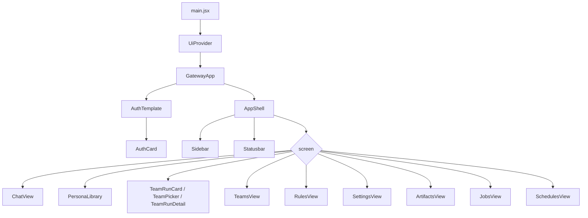
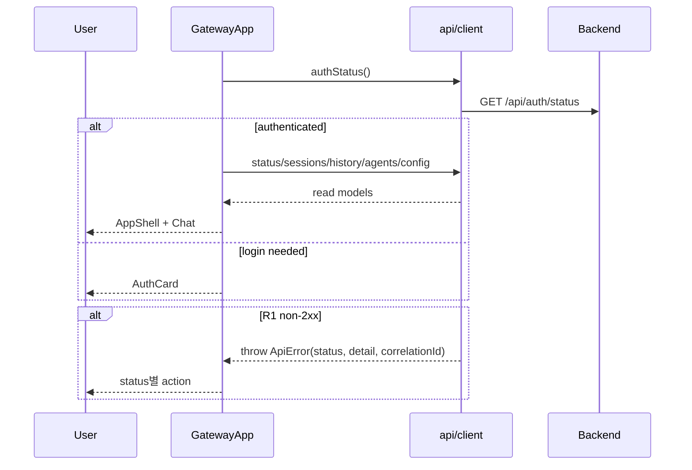
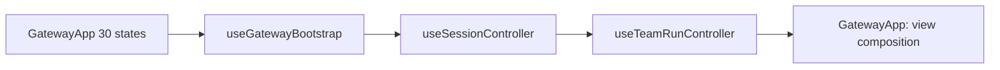

# GatewayApp R1 Operability Component Analysis

## 요약

- Root: `frontend/src/components/containers/GatewayApp/index.jsx`
- Modes: `understand`, `refactor`, `api-state`, `test`
- Verdict: R1 기능은 현재 container에 직접 누적하지 않고, 먼저 공통 `ApiError` 계약과 Operations 화면을 추가한 뒤 기존 bootstrap/session/team controller를 동일 동작의 hook으로 단계 추출해야 한다.
- 현재 owner는 application container가 맞지만, 30개 local state와 auth/session/SSE/Team/각 domain mutation이 한 파일에 결합돼 R1 변경의 회귀 범위를 키운다.

## 범위

| 항목 | 경로 | 비고 |
| --- | --- | --- |
| Root container | `frontend/src/components/containers/GatewayApp/index.jsx` | auth, bootstrap, SSE, domain fetch/mutation, 화면 조합 |
| Mount | `frontend/src/main.jsx` | `UiProvider` 아래 단일 mount |
| HTTP adapter | `frontend/src/api/client.js` | non-2xx를 `null`/`[]`로 축약하는 현재 경계 |
| Shell/navigation | `frontend/src/components/templates/AppShell/index.jsx`, `frontend/src/components/organisms/Sidebar/index.jsx` | local `screen` 기반 view routing |
| 운영 대상 화면 | `SettingsView`, `JobsView`, `SchedulesView` | R1 security/health/retry 표시·action 대상 |
| 실행 화면 | `ChatView`, `TeamRunDetail`, `TeamPicker`, `TeamRunCard` | Operations deep-link와 stop/resume 연결 대상 |
| 기타 화면 leaf | `PersonaLibrary`, `TeamsView`, `RulesView`, `ArtifactsView` | 기존 domain callback 소비자 |
| Root test | `frontend/src/components/containers/GatewayApp/GatewayApp.test.jsx` | 36개 integration test로 주요 사용자 흐름 보호 |
| Adapter/navigation tests | `frontend/src/api/client.test.js`, `Sidebar.test.jsx` | R1 error/endpoint/navigation RED test 위치 |

## 컴포넌트 트리



`Button`은 Team Run list/create branch에서 사용하는 shared leaf다. 각 organism은 내부 구현을 더 따라가지 않고 public props 기준 leaf로 취급했다.

## Props 흐름

```mermaid
flowchart LR
    API[api/client.js] -->|JSON/read models or null/[]| Root[GatewayApp]
    Root -->|screen, status, navigation| Shell[AppShell]
    Root -->|session state + commands| Chat[ChatView]
    Root -->|run/detail/docs + commands| Team[Team views]
    Root -->|settings| Settings[SettingsView]
    Root -->|jobs + event loader| Jobs[JobsView]
    Root -->|schedules + commands + health| Schedules[SchedulesView]
    Root -. R1 .->|operations + action callbacks| Ops[OperationsView]
```

| 자식 | 현재 입력/동작 | R1 영향 |
| --- | --- | --- |
| `AppShell` | `screen`, status/timeline, nav callbacks | Sidebar에 Operations key를 추가하되 routing 방식은 유지 |
| `ChatView` | session cache, config, send/interrupt/approval/session callbacks | Emergency Stop 이후 source-of-truth refresh 필요 |
| Team views | list/detail/documents, create/start/resume/retry/delete | Operations deep-link와 기존 resume endpoint 재사용 |
| `SettingsView` | `settings` read-only | session revoke, access mode, stop/backup callback을 명시적 props로 추가 |
| `JobsView` | `jobs`, `onLoadEvents` | retry 가능 여부와 `onRetry` 추가 |
| `SchedulesView` | list, CRUD/run-now, automation health | history/preview를 row에 표시하고 생성 Job deep-link 반환 |

## State / Effects

### State 소유권

`GatewayApp` 본문은 30개의 `useState`와 6개의 `useRef`를 가진다.

| 범주 | state/ref | 역할 |
| --- | --- | --- |
| Auth/bootstrap | `booting`, `authenticated`, `authStage`, `authError`, `setup`, `recoveryCodes` | setup/login과 protected bootstrap |
| Navigation/runtime | `screen`, `status`, `navOpen`, `sseState`, `settings` | shell/view와 runtime diagnostic |
| Session controller | `sessions`, `agents`, `sessionConfig`, `sessionConfigError`, `activeSessionId`, `sessionStateById` | session별 timeline/config/approval/busy cache |
| Team controller | `teamRuns`, `teams`, `creatingTeamRun`, `runFilter`, `selectedTeamRunId`, `teamRunDetail`, `teamRunDocuments` | list/create/detail/document/recovery |
| Domain reads | `personas`, `avatarChoices`, `rules`, `artifacts`, `jobs`, `schedules` | screen별 read model |
| Async refs | `turnStartRef`, `selectedTeamRunIdRef`, `lastConfigAttemptRef`, `activeSessionIdRef`, `busyRef`, `seenSseEventIdsRef` | EventSource stale closure 회피, retry payload, dedupe |

### Effect와 memo

| 경계 | trigger | side effect |
| --- | --- | --- |
| `useForceTick` | Chat + busy | elapsed 표시용 1초 render tick |
| document title | `environmentTitle` | browser title 동기화 |
| auth bootstrap | `loadApp` | `authStatus` 후 setup 또는 5개 protected fetch |
| EventSource | `authenticated` | `/api/events` 연결, session/team delta 적용, cleanup close |
| ref sync | active session/busy/turn | SSE callback이 최신 값 사용 |
| team ref sync | selected Run | Team SSE의 상세 갱신 대상 결정 |
| screen loader | `screen`, `authenticated` | 선택 domain API 호출 |
| team detail loader | selected Run | detail/documents 병렬 fetch, stale completion 차단 |
| `registeredByPath` | artifacts | original path → artifact `Map` 파생 |

R1 Operations 상태는 새 domain source of truth가 아니므로 root에 여러 상태 전이를 복제하지 않고 endpoint 결과를 한 state로 보관하고 action 후 다시 읽는 방식이 적합하다.

## 외부 library primitive

| primitive | 무엇을 하는가 | 여기서 사용하는 이유 |
| --- | --- | --- |
| React `useState` | local render state 저장 | query/store library 없이 화면·서버 응답을 소유 |
| React `useEffect` | lifecycle side effect 실행/정리 | auth bootstrap, EventSource, 화면 fetch, browser title 연결 |
| React `useCallback` | `loadApp` identity 고정 | bootstrap effect의 불필요한 재실행 방지 |
| React `useMemo` | artifact lookup `Map` 재사용 | Chat artifact path lookup의 반복 scan 방지 |
| React `useRef` | render를 유발하지 않는 최신 async 값 보관 | EventSource를 busy 변경마다 재연결하지 않고 stale closure 방지 |
| Browser `EventSource` | server push event 수신 | Chat/Team 실행 상태와 timeline을 실시간 반영 |
| Browser `fetch` | HTTP 요청 | `api/client.js`가 모든 backend endpoint의 현재 adapter 역할 |
| Testing Library/Vitest | role/text/click 중심 rendering test | root의 화면-visible 동작과 callback wiring 회귀 보호 |

React Router, Redux, query cache는 없다. `screen` state와 `api` object가 각각 navigation과 network 경계를 맡는다.

## Custom hook / selector / 주입 action

| hook/action | 출처 | Root에서의 역할 |
| --- | --- | --- |
| `useConfirm()` | `UiProvider` | Team/Run 삭제, Resume, Retry 확인 modal |
| `useToast()` | `UiProvider` | mutation 성공/실패 feedback |
| `useForceTick(active)` | 같은 파일 | active Chat elapsed UI 갱신 |
| `api.*` | `frontend/src/api/client.js` | auth/session/team/job/schedule/artifact/settings HTTP adapter |
| timeline mapper | `lib/timeline.js` | history/activity/SSE를 `ChatView` entry로 변환·reconcile |
| `onScreenChange` | Root → AppShell → Sidebar | local screen 전환과 Team 임시 state cleanup |
| session callbacks | Root → ChatView | send/search/activate/reset/rename/delete/approve/deny/interrupt |
| Team callbacks | Root → Team children | create/start/add/resume/retry/delete와 refresh |
| Schedule callbacks | Root → SchedulesView | create/pause/resume/delete/run-now와 refresh/toast |

외부 store selector나 dispatch action은 없다. R1 hook 추출은 이 public callback 집합을 바꾸지 않고 state/effect 묶음을 이동해야 한다.

## API / State 흐름

| 흐름 | 실제 호출 | 결과 소유자 |
| --- | --- | --- |
| bootstrap | `getStatus`, `sessions`, `history`, `agents`, `activeSessionConfig` 병렬 | root auth/session state |
| active session hydrate | `sessionHistory`, `sessionActivity` 병렬 | `sessionStateById[id]` |
| global events | `EventSource('/api/events')` | session cache 또는 selected Team detail |
| screen read | personas/team/settings/artifacts/jobs/schedules API | root의 domain state |
| Chat command | reset 필요 시 생성 → `sendSessionChat` → status/session/artifact refresh | session cache |
| Team command | create→start, add/resume/retry/delete 후 detail/list refresh | Team state |
| Schedule command | create/pause/resume/delete 후 list refresh, run-now toast | schedules state |

현재 `jsonOrNull`/`jsonList`가 non-2xx를 `null`/`[]`로 바꾸므로 빈 결과와 401/409/500을 root가 구분하지 못한다. R1-E의 `ApiError`는 endpoint별 nullable payload semantics를 유지하면서 non-2xx만 예외로 올리는 단일 response parser여야 한다.

## 주요 interaction 흐름

### Bootstrap / error 경계



### Operations action

1. 사용자가 Sidebar의 Operations를 누르면 root가 operations projection을 읽는다.
2. row의 deep-link는 기존 `screen`과 domain id를 설정해 원래 상세 화면으로 이동한다.
3. Stop/Resume/Retry는 새 상태 전이를 만들지 않고 각각 emergency stop 또는 기존 domain endpoint를 호출한다.
4. action 완료 후 operations projection과 대상 domain 목록을 다시 읽는다.
5. 실패하면 `ApiError`의 detail/correlation ID와 retryability를 표시하고 빈 목록으로 바꾸지 않는다.

### 구조 분리 순서



각 단계는 기존 callback 이름과 endpoint/event payload를 유지하고 해당 integration test를 통과한 뒤 다음 단계로 이동해야 한다.

## Tests / Stories

Story 파일은 repository 검색에서 확인되지 않았다.

### 기존 coverage

- `GatewayApp.test.jsx`의 36개 test가 auth bootstrap, Chat send/SSE/approval/session lifecycle, Team list/create/add/resume/retry/SSE/delete/navigation을 검증한다.
- `client.test.js`는 endpoint URL과 성공 응답 normalization을 검증하지만 non-2xx 정보 보존은 검증하지 않는다.
- `Sidebar.test.jsx`는 Team navigation만 검증하며 Operations 항목은 아직 없다.
- `SettingsView.test.jsx`, `JobsView.test.jsx`, `SchedulesView.test.jsx`는 현재 read model과 기본 action을 각각 검증한다.

### R1 RED cases

| test | 회귀 위험 |
| --- | --- |
| `ApiError`가 400/401/409/500/timeout의 detail/retryable/correlation을 보존 | 빈 값과 실패 혼동 방지 |
| Operations navigation과 read failure가 빈 목록과 구분 | 새 screen wiring과 error state |
| Operations Stop/Resume/Retry 후 projection 재조회 | stale optimistic 상태 방지 |
| Settings session revoke/access mode/backup action callback | read-only 화면의 안전한 mutation 경계 |
| Jobs retry는 failed/canceled에만 보이고 새 Job으로 이동 | 위험 approval 우회·중복 실행 방지 |
| Schedule row에 history/next-three preview 표시 | backend read model contract |
| 각 controller hook 추출 전후 기존 36개 root test 통과 | behavior-preserving refactor gate |

## 리팩터링 판단

### 책임 / ownership pass

| 판단 | 근거 | effort / risk | 안전한 다음 단계 |
| --- | --- | --- | --- |
| `hook/model 추출` | `GatewayApp`가 auth bootstrap, session SSE/cache, Team orchestration을 동시에 소유한다 (`index.jsx:109-954`). | L / 중간 | R1-G 계획대로 bootstrap → session → Team 순서로 추출하고 단계별 전체 root test 실행 |
| `유지` | `screen` 기반 view composition과 `AppShell` prop 조립은 application container 책임에 맞다 (`index.jsx:972-1174`). | S / 낮음 | router/global store를 추가하지 않고 root에 유지 |
| `내부 분리` | Operations action은 여러 domain endpoint를 조합하지만 view는 source-of-truth를 재조회해야 한다. | M / 낮음 | feature-owned `OperationsView`와 root handler만 추가한 뒤 controller 추출 |
| `리팩터링 계획 필요` | session SSE/cache 이동은 ref/ref-effect ordering과 20개 이상 integration case에 영향 | L / 높음 | 기존 R1-G artifact의 단계·rollback을 유지하고 SOLID plan 검토 후 실행 |

### code-level JSX / derivation pass

- `프레젠테이션 분해`: root의 authenticated render는 약 190줄의 screen conditional이지만 각 화면 본문은 이미 organism으로 대부분 분리돼 있다. Team Run list/create/detail branch만 root-owned markup이 남아 있다. 별도 화면 추출은 controller 분리 후 필요성이 남을 때만 검토한다. effort M / risk 중간.
- `pure helper 추출`: active session projection, `teamRunBadge`, Team status filter는 props/state만 사용하는 파생값이다. 현재 비용이 작아 R1 기능과 함께 옮기지 않으며, Team controller 추출 시 함께 이동하는 것이 안전하다. effort S / risk 낮음.
- `반복 제거(DRY)`: 3회 이상 동일한 raw sibling JSX는 확인되지 않았다. Team status chip은 이미 descriptor array와 `.map()`을 사용하고, 서로 다른 screen branch를 억지로 generic renderer로 합치면 props 계약이 흐려진다.
- inline API callback(`onArtifactChange`, `onLoadDocument`)은 두 곳뿐이고 안정된 memo가 필요한 child 증거가 없으므로 이번에 추출하지 않는다.

## 권장 후속 작업

1. `client.js`의 response parser와 `ApiError` RED test를 먼저 고정한다.
2. Operations endpoint/UI는 기존 domain action을 호출하고 action 후 projection을 재조회하는 최소 vertical slice로 추가한다.
3. Settings/Jobs/Schedules에 R1 props를 추가하되 각 child가 backend 상태 전이를 재구현하지 않게 한다.
4. 기능 contract가 통과한 뒤 `useGatewayBootstrap`, `useSessionController`, `useTeamRunController`를 순서대로 추출한다.
5. 각 추출 뒤 `GatewayApp.test.jsx` 전체와 production build를 실행한다.

## 스킬 핸드오프

- `developing-plans-with-solid`: R1-G가 넓은 hook extraction이므로 기존 실행 플랜의 dependency direction, public contract, 단계별 rollback을 코드 증거로 재검토해야 한다.
- `vercel-react-best-practices`: 독립 fetch를 병렬 실행하고, effect dependency와 transient ref 경계를 보존하며, 단순 파생값에 불필요한 memo를 추가하지 않는다.
- `dev-docs`: component report, R1 ADR/flow/report와 registry를 일관된 frontmatter로 유지한다.

## 리뷰

- Verdict: PASS
- Rounds: 2
- Fixed: 1차 검토에서 실제 36개인 root test를 38개로 적은 수치와 authenticated render 길이 표현을 바로잡았다. 2차 검토에서 30개 component state, 6개 ref, 7개 root effect와 `useForceTick` effect, 17개 local UI import, 단일 production usage, child public exports, Story 부재를 코드와 검색으로 다시 확인했다.

## 근거

- `rg -n "^import|use(State|Ref|Effect|Memo|Callback)|^  (async )?function |api\\." frontend/src/components/containers/GatewayApp/index.jsx`
- `rg -n "GatewayApp" frontend/src -g "*.jsx" -g "*.js"`
- `frontend/src/components/containers/GatewayApp/index.jsx:1`
- `frontend/src/components/containers/GatewayApp/index.jsx:109`
- `frontend/src/components/containers/GatewayApp/index.jsx:175`
- `frontend/src/components/containers/GatewayApp/index.jsx:227`
- `frontend/src/components/containers/GatewayApp/index.jsx:345`
- `frontend/src/components/containers/GatewayApp/index.jsx:524`
- `frontend/src/components/containers/GatewayApp/index.jsx:779`
- `frontend/src/components/containers/GatewayApp/index.jsx:972`
- `frontend/src/api/client.js:1`
- `frontend/src/components/templates/AppShell/index.jsx:1`
- `frontend/src/components/organisms/Sidebar/index.jsx:1`
- `frontend/src/components/organisms/JobsView/index.jsx:1`
- `frontend/src/components/organisms/SchedulesView/index.jsx:1`
- `frontend/src/components/organisms/SettingsView/index.jsx:1`
- 관련 Vitest 파일 전체
