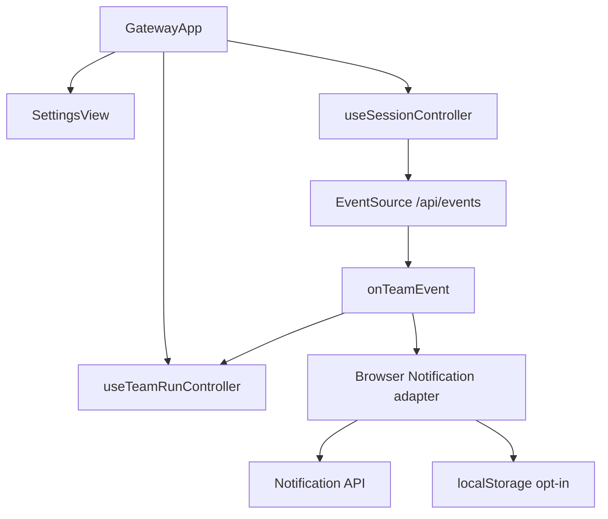
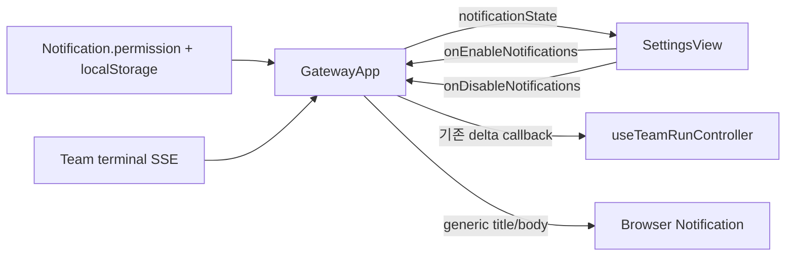
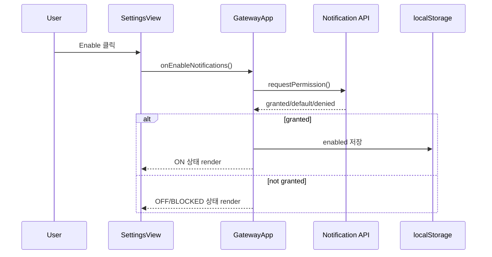
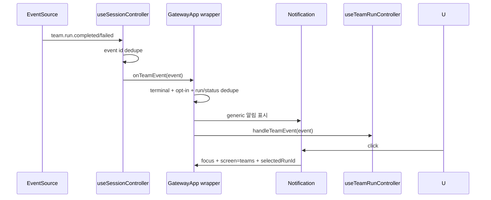

# GatewayApp Browser Notification Component Analysis

## 요약

- Root: `frontend/src/components/containers/GatewayApp/index.jsx`
- Modes: `understand`, `api-state`, `test`
- Verdict: 브라우저 알림 상태와 Team Run 종료 이벤트 처리는 `GatewayApp`가 소유하고, `SettingsView`에는 상태와 사용자 동작 callback만 주입한다.
- 범위는 열린 Gateway 탭의 `team.run.completed`와 `team.run.failed`에 한정한다. Service Worker, Push API, webhook, backend 알림 저장소는 추가하지 않는다.

## 범위

| 항목 | 경로 | 분석 이유 |
| --- | --- | --- |
| Root container | `frontend/src/components/containers/GatewayApp/index.jsx` | SSE callback과 화면 전환, Settings props 조합 소유 |
| Settings organism | `frontend/src/components/organisms/SettingsView/index.jsx` | 사용자 opt-in/disable 동작을 노출할 화면 |
| SSE hook | `frontend/src/hooks/useSessionController.js` | 단일 `/api/events` 연결과 event-id dedupe 소유 |
| Team controller | `frontend/src/hooks/useTeamRunController.js` | Team delta/detail 갱신 소유, 선택 Run 필터 존재 |
| Backend publisher | `src/personal_agent_gateway/team_runtime.py` | 실제 terminal event 및 안전하게 쓸 수 있는 delta 확인 |
| Root tests | `frontend/src/components/containers/GatewayApp/GatewayApp.test.jsx` | EventSource→Notification→navigation 통합 검증 위치 |
| Settings tests | `frontend/src/components/organisms/SettingsView/SettingsView.test.jsx` | 상태 표시와 명시적 사용자 동작 검증 위치 |
| Test primitive | `frontend/src/test/setup.js` | `MockEventSource` lifecycle 확인 |

## 컴포넌트 트리

새 adapter는 browser API라는 외부 경계만 감싼다. 새로운 React provider나 전역 store는 한 화면과 한 event consumer뿐인 현재 요구에 비해 과하다.

## Props 흐름

| 경계 | 현재 계약 | 추가할 최소 계약 |
| --- | --- | --- |
| `GatewayApp` → `SettingsView` | settings, auth sessions, security callbacks | `notificationState`, enable/disable callbacks |
| `useSessionController` → root | `onTeamEvent(parsed)` | 계약 변경 없음. root가 stable wrapper를 전달 |
| root → `useTeamRunController` | 모든 Team event를 `handleTeamEvent`로 전달 | 기존 callback을 wrapper 내부에서 그대로 호출 |
| root → browser adapter | 없음 | 사용자 요청 시 권한 요청, terminal event 시 알림 표시 |

## State / Effects

| state/ref | owner | 이유 |
| --- | --- | --- |
| permission/support/enabled render state | `GatewayApp` | Settings 표시와 사용자 action 결과를 한 source로 유지 |
| opt-in persistence | browser adapter의 versioned localStorage key | backend 계정 설정이 아닌 이 browser의 선택 |
| page-lifetime terminal dedupe `Set` | `GatewayApp`의 `useRef` | render가 필요 없고 서로 다른 SSE id의 같은 종료 알림도 억제 |
| event-id dedupe `Set` | 기존 `useSessionController` | 동일 SSE 재전달의 공통 dedupe를 계속 담당 |
| selected Team Run/detail | 기존 `useTeamRunController` | 알림 추가가 Team domain 상태 소유권을 바꾸지 않음 |

권한 요청은 effect나 mount에서 실행하지 않는다. 사용자가 Settings의 Enable을 누른 시점에만 `Notification.requestPermission()`을 호출한다. terminal callback identity는 가능한 한 안정적으로 유지해 `useSessionController` effect가 설정 render마다 EventSource를 재연결하지 않게 한다.

## 외부 library primitive

| primitive | 용도 | 제한 |
| --- | --- | --- |
| React `useState` | Settings에 보일 알림 상태 | lazy initializer로 browser 상태를 한 번 읽음 |
| React `useRef` | page-lifetime dedupe | 알림 발생 자체는 render state가 아님 |
| React `useCallback` | stable Team event wrapper | EventSource effect dependency 안정화 |
| Browser `Notification` | 열린 탭에서 OS/browser 알림 표시 | unsupported/default/denied/granted를 명시적으로 구분 |
| Browser `localStorage` | 이 browser의 opt-in 저장 | boolean 하나만 versioned key에 저장 |
| Browser `window.focus` | 알림 click 시 기존 Gateway 창 집중 | 새 창이나 외부 URL을 열지 않음 |
| Browser `EventSource` | 기존 global event stream | 새 listener/connection을 만들지 않음 |

## Custom hook / 주입 action

| 항목 | 현재 동작 | 판단 |
| --- | --- | --- |
| `useSessionController` | event id dedupe 후 Team event를 `onTeamEvent`로 전달 | 변경 없이 재사용 |
| `useTeamRunController.handleTeamEvent` | 선택된 Run이 아니면 즉시 return | 알림 owner로 쓰면 다른 Run 종료를 놓치므로 root wrapper가 먼저 처리 |
| `setSelectedTeamRunId` | Team 상세 대상 선택 | 알림 click 시 `teams` 화면과 함께 설정 |
| `SettingsView` callbacks | access/session 변경을 root에 위임 | notification permission도 같은 주입 패턴 사용 |

## API / State 흐름

Backend는 실제로 `team.run.completed`와 `team.run.failed`를 publish한다. `_publish()`는 `team.run.*` event에 `run` delta를 붙이며 이 delta에는 id, status, summary, error message, started/finished/updated time이 포함된다. 브라우저 알림은 민감 내용 노출을 피하기 위해 summary와 error message를 사용하지 않고 상태와 generic 안내만 표시한다.

지원 상태는 다음 네 permission 값으로 표현한다.

| 상태 | UI | 동작 |
| --- | --- | --- |
| `unsupported` | UNSUPPORTED | Enable 비활성화, 알림 없음 |
| `default` | OFF | Enable 클릭 때만 권한 요청 |
| `denied` | BLOCKED | 브라우저 설정 안내, 재요청하지 않음 |
| `granted` + opt-in false | OFF | 권한은 있으나 사용자가 끈 상태 |
| `granted` + opt-in true | ON | terminal event에만 알림 |

## 주요 interaction 흐름

### Opt-in

### Team Run 종료와 click

## Tests / Stories

Story 파일은 repository 검색에서 확인되지 않았다.

### 기존 coverage

- `GatewayApp.test.jsx`는 `MockEventSource`로 hook event toast/badge와 Team Run 화면 흐름을 검증한다.
- `useSessionController`는 event `id`가 같은 SSE를 page lifetime에 한 번만 처리한다.
- `SettingsView.test.jsx`는 settings group, 누락 row, access/session callback을 검증한다.
- Notification permission, opt-in persistence, terminal 알림, 알림 click navigation coverage는 현재 없다.

### 구현 전 RED cases

| test | 성공 기준 |
| --- | --- |
| adapter: unsupported/default/denied/granted 상태 | mount 자동 요청 없이 정확한 상태 반환 |
| adapter: enable/disable | 사용자 action에서만 permission 요청, opt-in 최소 저장 |
| `SettingsView`: ON/OFF/BLOCKED/UNSUPPORTED 표시 | injected state에 맞는 문구와 button 동작 |
| `GatewayApp`: completed/failed event | opt-in일 때만 generic 알림 생성 |
| `GatewayApp`: 민감정보 제외 | summary/error/path/prompt가 title/body에 없음 |
| `GatewayApp`: duplicate terminal delivery | 같은 Run/status/finished_at은 한 번만 알림 |
| `GatewayApp`: notification click | 현재 창 focus, Teams 상세 선택 |
| 전체 frontend | 기존 integration test와 production build 통과 |

## 권장 후속 작업

1. browser adapter의 상태/permission/payload test를 먼저 추가한다.
2. `SettingsView`에 injected 상태와 enable/disable UI만 추가한다.
3. `GatewayApp`에 lazy 상태, dedupe ref, stable Team event wrapper를 추가하고 기존 SSE hook에 전달한다.
4. completed/failed, privacy, dedupe, click navigation integration test를 추가한다.
5. frontend 전체 test와 build를 실행한다.

## 스킬 핸드오프

- `vercel-react-best-practices`: 기존 단일 EventSource를 재사용하고 transient dedupe는 ref에 두며, callback dependency를 안정적으로 유지한다.
- `dev-docs`: 한 번의 실제 사용을 G2-1 성공 기준으로 반영하고 R2-B 결정/검증 결과 및 문서 registry를 함께 갱신한다.

## 리뷰

- Verdict: PASS
- Rounds: 1
- Fixed: 생산 코드와 report를 분리해 다시 읽고 다음 6개 주장을 재확인했다. (1) global EventSource는 `useSessionController` 하나뿐이다. (2) 동일 SSE id dedupe가 이미 있다. (3) Team controller는 선택 Run 외 event를 버린다. (4) root가 Settings props와 Team callback을 모두 조합한다. (5) backend terminal event는 completed/failed 두 종류다. (6) 기존 frontend에는 Notification/localStorage/Service Worker 구현이 없다. 모순이나 누락된 production owner는 발견되지 않았다.

## 근거

- `frontend/src/components/containers/GatewayApp/index.jsx:27`
- `frontend/src/components/containers/GatewayApp/index.jsx:83`
- `frontend/src/components/containers/GatewayApp/index.jsx:154`
- `frontend/src/components/containers/GatewayApp/index.jsx:171`
- `frontend/src/components/containers/GatewayApp/index.jsx:792`
- `frontend/src/components/organisms/SettingsView/index.jsx:69`
- `frontend/src/hooks/useSessionController.js:72`
- `frontend/src/hooks/useSessionController.js:87`
- `frontend/src/hooks/useTeamRunController.js:59`
- `src/personal_agent_gateway/team_runtime.py:110`
- `src/personal_agent_gateway/team_runtime.py:118`
- `src/personal_agent_gateway/team_runtime.py:391`
- `frontend/src/components/containers/GatewayApp/GatewayApp.test.jsx:1268`
- `frontend/src/components/organisms/SettingsView/SettingsView.test.jsx`
- `frontend/src/test/setup.js`
