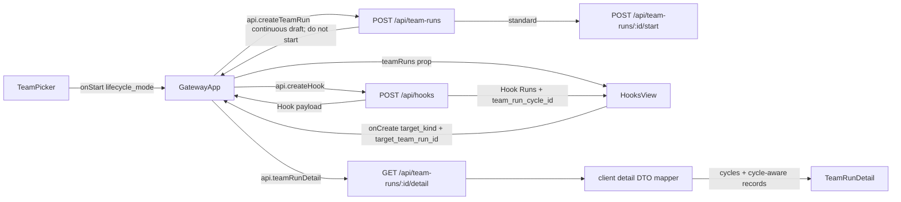

# GatewayApp Mail Team Run UI Component Analysis

## 요약

- Root: `frontend/src/components/containers/GatewayApp/index.jsx`
- Modes: `api-state`, `test`
- 범위: `GatewayApp`가 합성하는 `TeamPicker`, `HooksView`, `TeamRunDetail`의 Mail Team Run 생성·선택·Cycle lineage 경로
- Verdict: 기존 컴포넌트의 공개 props와 기존 API client를 확장하면 충분하며 새 컴포넌트나 별도 전역 상태는 필요하지 않다.

## 범위

| 항목 | 경로 | 근거 |
| --- | --- | --- |
| 페이지 상태·API 조정 | `frontend/src/components/containers/GatewayApp/index.jsx` | Team Run/Hook 목록과 handler를 소유하고 세 화면에 props 전달 |
| continuous 생성 입력 | `frontend/src/components/organisms/TeamPicker/index.jsx` | 현재 생성 payload에 `lifecycle_mode` 없음 |
| Hook target 선택 | `frontend/src/components/organisms/HooksView/index.jsx` | 현재 AgentPicker와 agent target payload만 지원 |
| Cycle 표시 | `frontend/src/components/organisms/TeamRunDetail/index.jsx` | 현재 `detail.cycles` UI 없음 |
| frontend API | `frontend/src/api/client.js` | create/detail/hook API의 얇은 fetch wrapper |
| backend 계약 | `src/personal_agent_gateway/api/team_runs.py` | create request에 lifecycle 없음, detail에 cycles 없음 |
| Hook 계약 | `src/personal_agent_gateway/api/hooks.py` | `target_kind`, `target_team_run_id`, Hook Run의 `team_run_cycle_id`는 이미 응답 |
| 테스트 | `frontend/src/components/**/**.test.jsx`, `frontend/src/api/client.test.js`, `tests/test_api_team_runs.py` | 각 사용자 경로의 기존 회귀 지점 |

## API / 상태 흐름

### `GatewayApp` 상태와 callback

| 상태/callback | 현재 역할 | P7에서 필요한 최소 변경 |
| --- | --- | --- |
| `teamRuns`, `setTeamRuns` | Team Runs 화면 목록과 생성 후 refresh | `HooksView`에도 전달해 continuous 대상만 고르게 함 |
| `handleCreateTeamRun` (`useTeamRunController`) | `api.createTeamRun` 후 모든 Run을 즉시 start | standard만 start하고 continuous는 Hook Cycle을 기다리는 draft container로 보존 |
| `hooks`, `handleCreateHook` | Hook 목록과 POST/refresh | 이미 body를 그대로 API에 전달하므로 target 필드 추가 로직 불필요 |
| `hookRuns`, `openHookRunsId` | 열린 Hook의 실행 이력 | 응답의 `team_run_cycle_id`를 drawer에서 표시 |
| `teamRunDetail` | 선택 Run의 detail DTO | backend가 추가한 `cycles`를 `TeamRunDetail`에 그대로 전달 |

### API 계약의 현재 간극

- `CreateTeamRunRequest`는 `team_id`, `goal`, `run_mode`, `max_workers`만 받아 UI가 continuous를 선택해도 서버에 보낼 수 없다.
- `_team_run_payload()`는 이미 `lifecycle_mode`를 반환한다.
- `get_team_run_detail()`은 전체 Task/Message를 반환하지만 `service.list_cycles(team_run_id)` 결과는 반환하지 않는다.
- `api.teamRunDetail()`은 aggregate 응답을 새 객체로 매핑하므로 backend에 `cycles`만 추가하면 값이 폐기된다. 정상 응답과 404 fallback DTO 모두 `cycles: []` 계약을 가져야 한다.
- Hook create API와 Hook response는 이미 `target_kind`, `target_team_run_id`를 지원한다.
- Hook Run response는 이미 `team_run_cycle_id`를 지원하므로 frontend client 변경 없이 표시할 수 있다.

## 부작용과 데이터 갱신

- `GatewayApp`의 screen effect가 `teams` 화면 진입 시 `api.teamRuns()`를 로드하고 `hooks` 진입 시 `api.listHooks()`를 로드한다.
- P7에서는 Hooks 화면에서 target selector가 Team Run 목록도 필요하므로 `hooks` 진입 시 두 요청을 병렬로 시작하는 것이 안전하다. 기존 `load()` 호출 두 건이면 서로 의존하지 않는다.
- Hook 생성 후 `setHooks(await api.listHooks())`는 유지한다. Team Run 목록은 Hook 생성으로 변하지 않는다.
- 새 파생 목록 `continuousRuns = teamRuns.filter(...)`은 `HooksView` render 안의 작은 O(n) 계산이면 충분하며 별도 effect/state로 복제하지 않는다.

## 테스트 현황과 누락 RED

| 테스트 | 현재 보장 | 추가해야 할 RED |
| --- | --- | --- |
| `TeamPicker.test.jsx` | Team/goal/run mode payload | standard 기본 payload, continuous 선택 시 `lifecycle_mode: "continuous"`와 `plan_and_execute` 강제 |
| `HooksView.test.jsx` | Agent target 생성, 연결 테스트, Run result | Team Run target payload, continuous 대상만 노출, cycle lineage 표시 |
| `TeamRunDetail.test.jsx` | status/task/message/decision/documents | continuous Run의 Cycle sequence/status/source/summary 표시 |
| `GatewayApp.test.jsx` | standard 생성 뒤 `/start` 호출과 screen/handler 연결 | standard는 즉시 start, continuous는 `/start` 미호출·draft 선택, Hooks 화면의 Team Run 목록 load |
| `tests/test_api_team_runs.py` | create/detail 계약 | lifecycle 입력 round-trip, cycles detail payload |
| `tests/test_api_hooks.py` | 올바른 continuous plan-and-execute target의 `target_kind`/ID round-trip | 기존 positive 보장을 유지하고 non-continuous 또는 non-execution target 거부 RED 추가 |
| `frontend/src/api/client.test.js` | fetch URL과 detail DTO mapping | aggregate `cycles` 보존과 누락 시 빈 배열 fallback |

회귀 위험이 큰 흐름은 다음 세 가지다.

1. standard Team Run 생성 기본값이 의도치 않게 continuous로 바뀌는 경우.
2. Team target 선택 후 AgentPicker의 빈 backend/model 검증 때문에 submit이 막히는 경우.
3. cycle UI가 없는 기존 standard detail DTO에서 렌더 오류가 나는 경우.

## 권장 후속 작업

1. backend create/detail 계약부터 테스트로 확장하고 frontend가 소비할 DTO를 고정한다.
2. `api.teamRunDetail()`의 aggregate/fallback DTO에 `cycles`를 명시하고 client test를 추가한다.
3. `TeamPicker`에 standard/continuous 선택을 추가하고 기본은 standard로 유지한다. continuous는 `plan_and_execute`로 제한한다.
4. `useTeamRunController.handleCreateTeamRun`은 standard만 즉시 start하고 continuous draft는 그대로 선택한다.
5. `HooksView`에서 target kind를 로컬 state로 관리하며 Team Run target일 때 AgentPicker 필수 조건을 제거한다.
6. `HookRow`와 `HookRunsDrawer`에 target Team Run과 Cycle ID를 표시한다.
7. `TeamRunDetail`에는 cycles가 있을 때만 작은 Cycle history section을 추가한다.

## 스킬 핸드오프

- `component-pattern`: 기존 atom/organism 경계를 유지하고 새 공유 컴포넌트를 만들지 않는 구현 판단에 사용.
- `vercel-react-best-practices`: `continuousRuns`를 effect/state로 복제하지 않고 render에서 파생하며, 독립 fetch를 병렬화하는 판단에 사용.
- 별도 구조 리팩터링 스킬은 필요 없다. 이번 변경은 기존 책임에 맞는 계약 확장이다.

## 리뷰

- Verdict: PASS
- Rounds: 3
- Fixed: continuous 무조건 start 오류, client detail mapper 누락, lifecycle별 GatewayApp RED, client cycles RED, 실제 `teams` screen key, target validation 테스트의 현행 범위를 반영함

## 근거

- `rg -n "TeamPicker|HooksView|TeamRunDetail|handleCreateHook|teamRuns" frontend/src/components/containers/GatewayApp/index.jsx`
- `frontend/src/components/organisms/TeamPicker/index.jsx`
- `frontend/src/components/organisms/HooksView/index.jsx`
- `frontend/src/components/organisms/TeamRunDetail/index.jsx`
- `frontend/src/hooks/useTeamRunController.js`
- `frontend/src/api/client.js`
- `src/personal_agent_gateway/api/team_runs.py`
- `src/personal_agent_gateway/api/hooks.py`
- `tests/test_api_hooks.py`
- 관련 Vitest/Pytest 파일의 현행 assertion 목록
