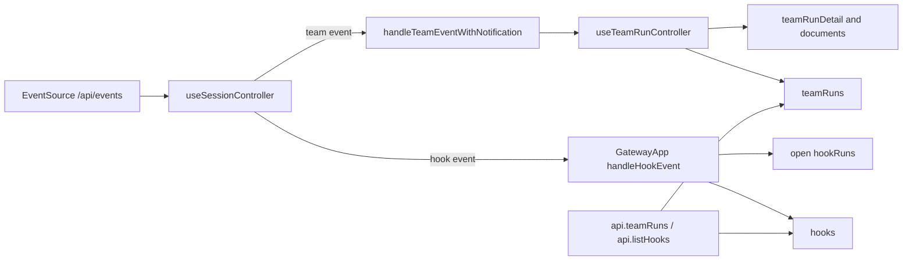

# GatewayApp SSE Collection Reconciliation Analysis

## 요약

- Root: `frontend/src/components/containers/GatewayApp/index.jsx`
- Modes: `api-state`, `test`
- Verdict: 현재 단일 `EventSource`와 local React state 소유권은 유지하고, stream identity
  기반 bounded dedup과 Team/Hook collection의 event reconciliation을 추가한다.

## 범위

| Item | Path | Notes |
| --- | --- | --- |
| Root container | `frontend/src/components/containers/GatewayApp/index.jsx` | Hook collection과 domain event callback owner |
| SSE controller | `frontend/src/hooks/useSessionController.js` | EventSource lifecycle, event dedup, domain dispatch |
| Team controller | `frontend/src/hooks/useTeamRunController.js` | Team list/detail/documents state owner |
| API client | `frontend/src/api/client.js` | Team/Hook authoritative collection fetch |
| Tests | `frontend/src/components/containers/GatewayApp/GatewayApp.test.jsx` | SSE, Team, Hook 통합 회귀 |

## API / 상태 흐름

### Runtime dependency trace

| State/effect | Owner | Trigger | Current result | Required change |
| --- | --- | --- | --- | --- |
| `seenSseEventIdsRef` | `useSessionController` | parsed SSE with `id` | process-local numeric ID를 무제한 `Set`으로 dedup | `(stream_id,id)` bounded window |
| `teamRuns` | `useTeamRunController` | screen load와 user mutation | background Team event는 list를 갱신하지 않음 | terminal/input event에서 authoritative collection refetch |
| `teamRunDetail` | `useTeamRunController` | selected ID와 Team event | entity delta 적용 후 terminal/input에서 API 재조회 | 유지 |
| `teamRunDocuments` | `useTeamRunController` | selected ID와 Team event | terminal/input 또는 delta 없는 event에서 재조회 | 유지 |
| `hooks` | `GatewayApp` | Hooks screen load와 user mutation | `hook.run.updated`에서는 갱신하지 않음 | Hook event에서 authoritative collection refetch |
| `hookRuns` | `GatewayApp` | open runs와 Hook event | 열린 Hook의 run list만 재조회 | 유지 |
| `hooksBadge` | `GatewayApp` | terminal Hook event | Hooks 화면 밖에서 증가 | 유지 |

`GatewayApp`은 `useTeamRunController`가 반환한 `setTeamRuns`를 screen load와 operations
refresh에서도 사용한다. 따라서 Team collection reconciliation은 state owner인
`useTeamRunController.handleTeamEvent`에 두고, Hook collection reconciliation은
`hooks` state owner인 `GatewayApp.handleHookEvent`에 두는 것이 기존 소유권과 일치한다.

`useSessionController`의 effect는 `authenticated`와 callback 의존성에 따라 하나의
`EventSource`를 관리한다. dedup 자료구조는 화면 표시 상태가 아니므로 `useRef`에 두는
현재 선택을 유지한다. 신규 cache/store 또는 SWR 도입은 이 변경에 필요하지 않다.

## Side effects와 API 호출

- `useSessionController.js:97-123`은 `/api/events` 연결, JSON parsing, dedup 후 Team/Hook
  callback으로 조기 dispatch한다.
- `useTeamRunController.js:59-79`은 선택된 Team Run만 delta/refetch하며, 선택되지 않은
  event는 `useTeamRunController.js:60`에서 반환한다.
- `GatewayApp/index.jsx:161-175`은 Hook terminal toast/badge와 열린 run 목록만 갱신한다.
- `GatewayApp/index.jsx:241-274`은 screen 전환 시 `api.teamRuns()`와 `api.listHooks()`로
  collection을 authoritative하게 다시 읽는다.
- `frontend/src/api/client.js:312,370,442,450`에 기존 collection/detail API가 있어 새
  endpoint는 필요하지 않다.

## 테스트 / 스토리

스토리 파일은 없고 통합 테스트는 `GatewayApp.test.jsx`에 집중되어 있다.

기존 coverage:

- `688-711`: 같은 numeric SSE ID 중복 무시.
- `1093-1166`: Team mixed event가 선택 detail을 갱신하지만 목록 복귀 시 새 Run이 없는
  현재 stale behavior를 명시한다.
- `1332-1367`: Hook terminal event의 toast와 badge.
- `1369-1444`: Team terminal Browser Notification dedup과 privacy.

추가할 RED cases:

1. 같은 `stream_id`와 같은 `id`는 한 번만 적용되지만 새 `stream_id`의 같은 `id`는
   새 event로 적용된다.
2. dedup window 상한을 넘은 오래된 composite key는 제거된다.
3. Team terminal/input event 이후 목록으로 돌아가면 별도 screen reload 없이 최신 row가
   보인다.
4. Hook event 이후 Hooks 화면의 `last_polled_at`, `last_error`, enabled/status 관련 row가
   authoritative API 결과로 갱신된다.
5. collection refetch 실패가 EventSource를 재생성하거나 기존 detail/toast 동작을
   중단하지 않는다.

## 권장 후속 작업

- `useSessionController`에 작은 bounded composite-key helper를 두고 순수 함수 단위와
  GatewayApp 통합 테스트로 검증한다.
- `handleTeamEvent`는 selected detail 처리를 유지하면서 terminal/input event일 때
  `api.teamRuns()`를 병렬로 갱신한다.
- `handleHookEvent`는 기존 toast/badge/open-runs 갱신과 함께 `api.listHooks()`를 호출한다.
- state 변경은 functional setter를 유지해 stale closure를 만들지 않는다.

## 스킬 핸드오프

- `vercel-react-best-practices`: event callback에서 transient dedup은 `useRef`, 현재 state에
  의존하는 갱신은 functional setter를 유지하고 불필요한 전역 cache 도입을 피한다.
- 추가 구조 스킬은 필요 없다. 변경이 controller와 container의 기존 상태 소유권 안에 있다.

## 리뷰

- Verdict: `PASS`
- Rounds: 1
- Fixed: self-review에서 root usage(`main.jsx`), API method 위치, 기존 SSE/Team/Hook 테스트,
  selected Team 조기 반환과 Hook collection 누락을 코드에서 다시 확인했다. blocker 없음.

## 근거

- `frontend/src/main.jsx:10`
- `frontend/src/components/containers/GatewayApp/index.jsx:41,57-60,104-124,138-175,195-213,241-274`
- `frontend/src/hooks/useSessionController.js:70-123`
- `frontend/src/hooks/useTeamRunController.js:24-79`
- `frontend/src/api/client.js:312,370,442,450`
- `frontend/src/components/containers/GatewayApp/GatewayApp.test.jsx:688-711,1093-1166,1332-1444`
- Search: `rg -n "useSessionController|useTeamRunController|handleTeamEvent|handleHookEvent|setHooks|setTeamRuns|EventSource|seenSseEventIdsRef" frontend/src`
