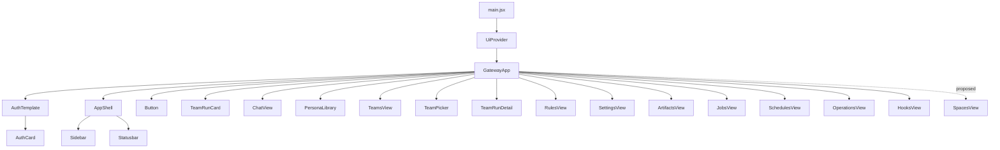
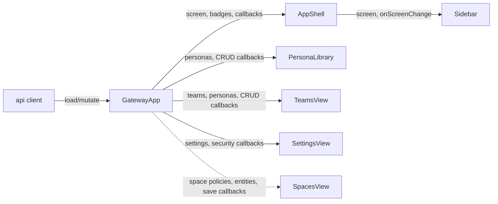
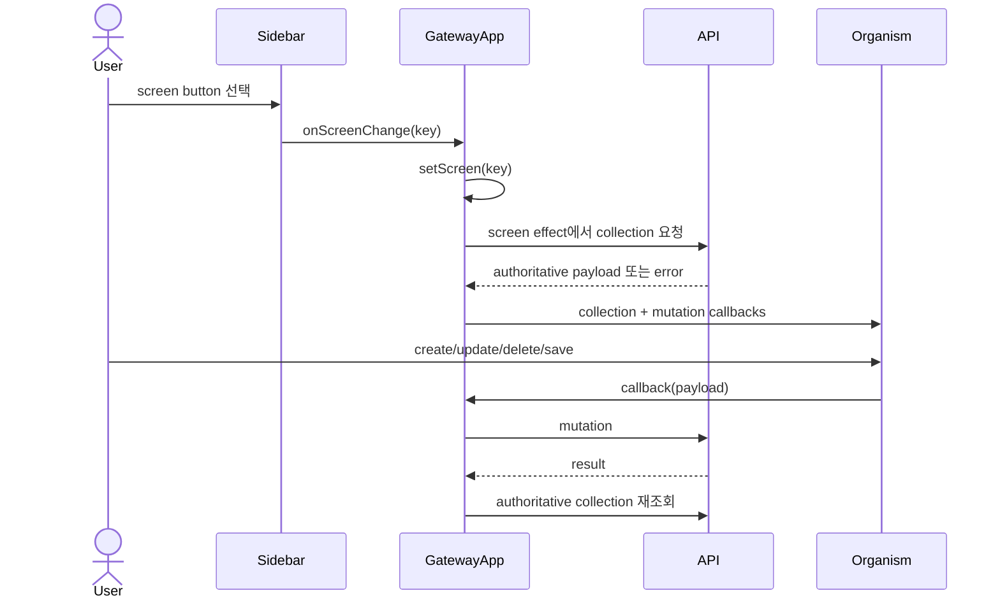
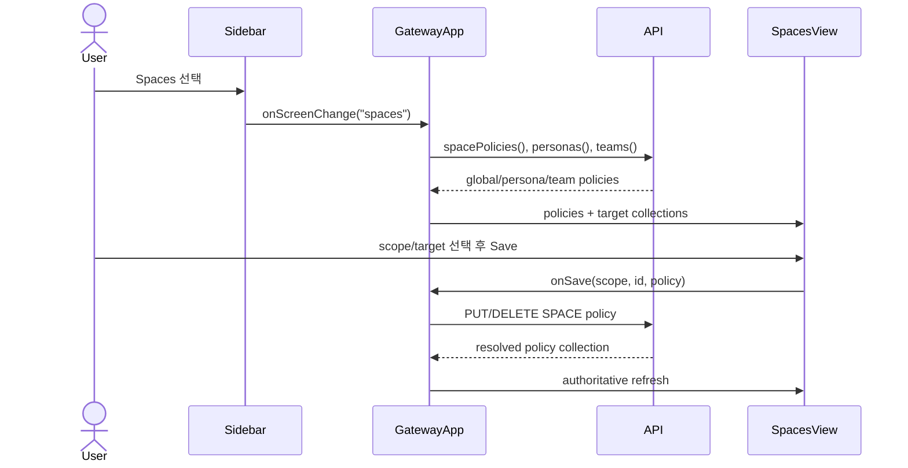

# GatewayApp Space Policy Integration Analysis

## 요약

- Root: `frontend/src/components/containers/GatewayApp/index.jsx`
- Modes: `understand`, `refactor`, `api-state`, `test`
- Verdict: SPACE 정책의 원격 상태와 mutation은 기존 page container인 `GatewayApp`이 소유하고, 새 `SpacesView` organism은 GLOBAL/PERSONA/TEAM 정책 편집만 담당하는 구성이 현재 경계와 맞는다.

## 범위

| Item | Path | Notes |
| --- | --- | --- |
| Root container | `frontend/src/components/containers/GatewayApp/index.jsx` | screen 상태, API loading/mutation, page composition owner |
| Navigation | `frontend/src/components/organisms/Sidebar/index.jsx` | `NAV`와 `TEAM_NAV` screen key owner |
| Shell | `frontend/src/components/templates/AppShell/index.jsx` | Sidebar에 현재 screen과 callback 전달 |
| Persona editor | `frontend/src/components/organisms/PersonaLibrary/index.jsx` | 기존 persona entity form; SPACE 원격 상태는 소유하지 않음 |
| Team editor | `frontend/src/components/organisms/TeamsView/index.jsx` | 기존 team roster form; SPACE 원격 상태는 소유하지 않음 |
| Runtime settings | `frontend/src/components/organisms/SettingsView/index.jsx` | 현재 runtime/security 조회와 access-mode mutation UI |
| API client | `frontend/src/api/client.js` | 모든 REST 호출의 browser boundary |
| Integration tests | `frontend/src/components/containers/GatewayApp/GatewayApp.test.jsx` | screen load와 mutation wiring 회귀 owner |
| Confirmed requirement | current user request, 2026-07-21 | SPACE resolution is `TEAM > PERSONA > GLOBAL`; GLOBAL/TEAM required, PERSONA optional |

## 컴포넌트 트리

`GatewayApp`은 인증 전에는 `AuthTemplate/AuthCard`, 인증 후에는 `AppShell` 내부에 현재 `screen`에 해당하는 organism 하나를 합성한다. 공유 organism의 내부 구현은 leaf로 두고, SPACE 기능과 직접 연결되는 공개 props와 callback만 추적했다.

## Props 흐름

`main.jsx`는 props 없이 `GatewayApp`을 mount한다. 따라서 SPACE 정책을 server에서 읽고 갱신하는 책임을 상위 route로 넘길 곳은 없으며, 기존 `personas`, `teams`, `rules`, `settings`와 같은 방식으로 container state에 두는 것이 일관된다.

## 상태와 Effect

| Hook/state | 이 컴포넌트에서의 역할 |
| --- | --- |
| `useGatewayBootstrap` | 인증, 세션, agent catalog, 초기 app loading을 제공한다. SPACE 정책과 별도 lifecycle이다. |
| `useSessionController` | active chat runtime과 SSE를 소유한다. SPACE 변경을 현재 runtime에 즉시 적용할지 다음 runtime부터 적용할지는 backend에서 아직 결정해야 한다. |
| `useTeamRunController` | Team Run 목록/detail/action을 소유한다. TEAM SPACE의 Run 시작 snapshot은 실행 중 정책 변경을 막기 위한 권장안이며 아직 확정 계약이 아니다. |
| `useForceTick` | Chat이 busy일 때 1초 timer로 elapsed UI를 다시 그리며, screen/busy 변화 시 interval을 정리한다. SPACE 화면에서는 비활성이다. |
| `screen` | Sidebar selection과 conditional page composition의 단일 source다. 신규 `spaces` screen도 동일한 branch에 들어간다. |
| `personas`, `teams` | PERSONA/TEAM selector label과 정책 대상 목록에 재사용할 authoritative collection이다. |
| `settings` | runtime settings 조회 결과다. GLOBAL SPACE 전용 CRUD 데이터와 혼합하면 save semantics가 불명확해지므로 별도 `spacePolicies` state가 낫다. |
| `screenError`, `screenReloadKey` | screen load 실패 보존/재시도 경계다. SPACE load도 기존 `load(promise, setter)` 경로를 사용해야 한다. |
| `hooksRef`, `screenRef`, `openHookRunsIdRef` | SSE Hook callback이 최신 collection/screen/open target을 읽도록 render와 callback 사이의 transient 값을 보존한다. |
| `notificationStateRef`, `notifiedTeamRunsRef` | Team terminal notification 설정과 이미 알린 event key를 render 없이 추적한다. |
| `turnStartRef`, `lastConfigAttemptRef`, `activeSessionIdRef`, `busyRef` | chat/session controller에 최신 turn/config/session/busy 값을 전달해 stale closure를 피한다. |

screen effect는 `screen`별로 필요한 API를 병렬 시작한다. 신규 SPACE 화면은 `api.spacePolicies()`, `api.personas()`, `api.teams()`를 한 branch에서 시작할 수 있어 waterfall이 필요 없다.

## 외부 라이브러리와 로컬 primitive

- React `useState`는 screen별 server collection과 dialog/form 상태의 container-level source를 만든다.
- React `useEffect`는 인증 이후 screen 전환에 맞춰 필요한 collection을 가져온다. SPACE 정책도 이 기존 fetch boundary를 재사용한다.
- React `useRef`는 Hook/notification/session callback이 재구독 없이 최신 transient 값을 읽고 중복 알림을 차단하는 데 사용된다.
- React `useCallback`은 SSE와 operations callback identity를 안정화한다. 단순 SPACE save handler에는 외부 effect dependency가 없으므로 추가 memoization은 필요 없다.
- React `useMemo`는 artifact path index처럼 반복 조회 비용이 있는 값에만 사용된다. SPACE precedence 표시는 작은 조건식이므로 memoization 대상이 아니다.
- `useToast`는 mutation 성공/실패 사용자 피드백, `useConfirm`은 destructive 변경 확인을 제공한다. GLOBAL/TEAM 필수 정책 save는 destructive가 아니며 ALL 범위 선택만 child view에서 명시적으로 경고하는 편이 적절하다.
- `AppShell`/`Sidebar`는 route library 없이 문자열 `screen` contract로 내비게이션한다. 신규 screen은 `TEAM_NAV` descriptor와 GatewayApp render/load branch가 함께 추가되어야 한다.

## 주요 상호작용 흐름

현재 코드의 screen load/mutation 흐름은 다음과 같다.

아래는 사용자 확정 우선순위를 기존 흐름에 넣기 위한 **제안 흐름**이며 아직 코드에 존재하지 않는다.

1. GLOBAL은 삭제할 수 없고 save만 가능하다.
2. TEAM은 모든 Team에 저장 row가 존재하며 save만 가능하다. TEAM Run 시작 시 값을 snapshot하는 방식은 권장안이며 구현 명세에서 확정해야 한다.
3. PERSONA는 override 활성화 시 save하고, 비활성화 시 row를 삭제하여 GLOBAL 상속으로 되돌린다.
4. save 성공 후 container는 전체 SPACE collection을 다시 읽어 precedence/source 표시가 server 해석과 일치하도록 한다.

## API / 상태 추적

현재 `api.client.js`는 `personas`, `teams`, `rules`, `settings`를 각각 collection/payload mapper로 노출한다. 다음 endpoint와 `effective_source` payload는 사용자 요구사항을 구현하기 위한 **제안 계약**이며 아직 backend에 없다.

- `GET /api/spaces` → global, personas, teams 및 effective source
- `PUT /api/spaces/global`
- `PUT /api/personas/{id}/space`, `DELETE /api/personas/{id}/space`
- `PUT /api/teams/{id}/space`

확정된 우선순위는 `TEAM > PERSONA > GLOBAL`이고 GLOBAL/TEAM은 필수, PERSONA는 optional이다. 세부 endpoint 명칭, payload의 `effective_source`, Run/session에서 값을 고정하는 시점은 backend resolver 구현 시 확정해야 한다. UI에서 precedence를 별도로 재구현하지 않는다는 원칙만 여기서 권장한다.

## 테스트 / 스토리

스토리 파일은 없다. `GatewayApp.test.jsx:834-853`은 Persona library 진입과 detail loading을 검증하고, `:855-1519`는 Team Run 목록/상세/실행 action을 검증한다. Team admin CRUD와 Rules/Settings mutation wiring은 이 파일에 직접 coverage가 없다. `PersonaLibrary.test.jsx`와 `TeamsView.test.jsx`에는 각 organism의 form callback coverage가 있지만 container API wiring을 대신하지는 않는다. `frontend/src/api/client.test.js:100-210,395-478`은 기존 collection mapper와 REST method의 URL/method/body 검증 패턴을 제공한다. 신규 `SpacesView`에는 아직 test 파일이 없으므로 required GLOBAL/TEAM과 optional PERSONA form behavior를 organism 단위로 새로 검증해야 한다.

추가할 회귀 사례:

1. 기존 Persona screen test의 fetch mock 패턴을 재사용해 `Spaces` screen 진입 시 policies/personas/teams가 로드되는지 검증한다.
2. GLOBAL save 후 authoritative policies를 다시 읽는다.
3. PERSONA override save와 inherit 전환(delete)이 서로 다른 API를 호출한다.
4. TEAM save는 선택된 Team ID를 사용하고 TEAM policy 삭제 UI를 제공하지 않는다.
5. API 실패 시 기존 policy state를 지우지 않고 공용 screen error를 표시한다.
6. `client.test.js`에서 proposed SPACE collection mapping과 각 GET/PUT/DELETE의 URL, method, JSON body를 검증한다.
7. `SpacesView.test.jsx`에서 GLOBAL/TEAM 필수 editor, PERSONA override 생성·상속 전환, scope target 변경 시 draft 동기화를 검증한다.

## 리팩터링 판단

- `유지`: 원격 상태와 mutation은 `GatewayApp` container 소유가 맞다. 기존 screen들이 같은 경계를 사용한다.
- `프레젠테이션 분해`: 아직 없는 SPACE 대형 form을 `GatewayApp` render branch에 inline으로 넣지 않고 새 `SpacesView` organism으로 구성한다. 현재 `GatewayApp/index.jsx:719-949`는 대부분 organism branch지만 Team Runs home/filter/list(`:756-842`)와 planned fallback(`:945-949`)은 inline이다. 신규 관리 form까지 inline으로 늘리지 않는 것이 render intent를 보존한다. 노력 중간, 위험 낮음.
- `hook/model 추출` 보류: 현재 신규 상태는 collection 하나와 save handlers 정도여서 전용 controller hook을 만들 근거가 부족하다. 호출부가 커질 때 검토한다.
- `반복 제거(DRY)`: Team Run 생성/상세 branch의 `← TEAM RUNS` anchor가 2회 반복되지만 3회 미만이며 각 branch가 짧아 이번 변경에서 추출하지 않는다(`GatewayApp/index.jsx:756-800`). screen organism sibling들은 서로 다른 props/API를 사용해 descriptor map 대상으로 보지 않는다. 노력 낮음, 변경 필요 없음.
- `pure helper 추출`: `teamRunBadge`, `screenErrorAction`은 이미 render 전 named derivation이다(`GatewayApp/index.jsx:660-662`). 반면 Team Run status filter가 render 안에 inline predicate로 남아 있으나 SPACE 변경과 무관해 건드리지 않는다(`:826-834`). 신규 precedence 계산은 browser helper가 아니라 server resolver가 소유하도록 제안한다. 노력 낮음, 위험 낮음.
- `프레젠테이션 분해` 추가 점검: Team Runs inline 영역은 별도 분해 후보지만 현재 변경 대상이 아니며 기존 테스트가 이 branch의 filter/list action을 직접 다룬다. SPACE 화면만 새 organism으로 분리한다. 노력 중간, 위험 낮음.
- `유지`: `PersonaLibrary`, `TeamsView`, `SettingsView`는 현재 entity/form 책임을 그대로 유지하고 SPACE 마크업을 세 파일에 분산하지 않는다. 근거는 각 공개 props가 persona CRUD, team roster CRUD, runtime settings에 각각 한정되어 있다는 점이다. 노력 없음, 위험 낮음.

## 권장 후속 작업

1. server에 단일 SPACE resolver와 CRUD API를 먼저 구현해 precedence의 source of truth를 만든다.
2. `SpacesView`를 추가하고 `GatewayApp`은 collection loading/mutation만 연결한다.
3. TEAM/GLOBAL 필수와 PERSONA optional 동작을 backend/API/UI 테스트에서 같은 사례로 고정한다.
4. 실행기에는 server resolver 결과를 전달하고 Run/session 시작 시 snapshot 또는 effective selection을 기록한다.

## 스킬 핸드오프

- `vercel-react-best-practices`: SPACE 화면의 세 독립 fetch를 동시에 시작하고, 단순 계산에 불필요한 memoization을 추가하지 않는다.
- 이 저장소의 기존 `frontend/src/components/organisms/**`와 `GatewayApp` container/API 경계를 직접 따른다. 광범위한 UI 리팩터링 계획은 필요 없다.

## 리뷰

- Verdict: `PASS`
- Rounds: 3
- Fixed: 실제 provider/child/ref/timer와 현재 screen 흐름을 보완했고, 미구현 SPACE 계약을 제안으로 분리했으며, 기존 render-body 및 API-client/organism 테스트 범위를 코드에서 다시 확인했다.

## 근거

- `frontend/src/main.jsx:8-12`
- `frontend/src/components/containers/GatewayApp/index.jsx:1-25,32-130,257-385,640-949`
- `frontend/src/components/organisms/Sidebar/index.jsx:3-18,28-75`
- `frontend/src/components/templates/AppShell/index.jsx:1-54`
- `frontend/src/components/organisms/PersonaLibrary/index.jsx:83-167,205-318`
- `frontend/src/components/organisms/TeamsView/index.jsx:29-133`
- `frontend/src/components/organisms/SettingsView/index.jsx:1-130`
- `frontend/src/api/client.js:289-480`
- `frontend/src/api/client.test.js:100-210,395-478`
- `frontend/src/components/containers/GatewayApp/GatewayApp.test.jsx`
- Search: `rg -n "PersonaLibrary|TeamsView|RulesView|SettingsView|api.personas|api.teams|api.rules|api.settings" frontend/src`
