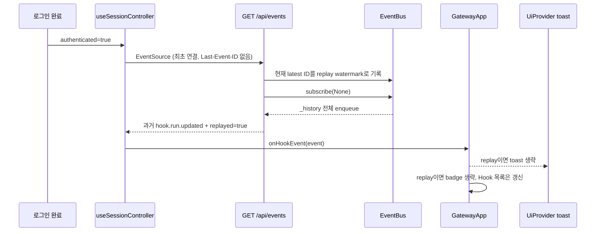

# GatewayApp Hook SSE Toast Replay Analysis

## 요약

- Root: `frontend/src/components/containers/GatewayApp/index.jsx`
- Modes: `api-state`, `test`
- Verdict: `EventBus` replay는 상태 복구를 위해 유지하고, SSE API가 연결 시점 watermark까지의 전달분에 `replayed: true`를 표시해 `GatewayApp.handleHookEvent()`가 과거 완료 이벤트의 toast/badge만 억제한다.

## 범위

| 항목 | 경로 | 비고 |
|---|---|---|
| 화면 컨테이너 | `frontend/src/components/containers/GatewayApp/index.jsx` | Hook toast, badge, 목록 갱신 소유 |
| 사용처 | `frontend/src/main.jsx` | `UiProvider` 아래에서 GatewayApp을 한 번 렌더링 |
| 인증 bootstrap | `frontend/src/hooks/useGatewayBootstrap.js` | Chat history/activity/status를 API로 복원 |
| SSE 구독 hook | `frontend/src/hooks/useSessionController.js` | 인증 후 `/api/events` 연결 및 이벤트 분기 |
| Team 상태 hook | `frontend/src/hooks/useTeamRunController.js` | Team 목록·선택 상세를 API로 복원 |
| API client | `frontend/src/api/client.js` | Hook/Team/Chat authoritative 조회 mapper |
| SSE API | `src/personal_agent_gateway/api/chat_sessions.py` | `Last-Event-ID` 헤더를 EventBus에 전달 |
| 이벤트 버스 | `src/personal_agent_gateway/events.py` | 인메모리 이력과 subscriber queue 소유 |
| FE 회귀 테스트 | `frontend/src/components/containers/GatewayApp/GatewayApp.test.jsx` | 실시간 Hook toast 기존 커버리지 |
| BE 단위 테스트 | `tests/test_events.py`, `tests/test_app.py` | fan-out, cursor replay, SSE 포맷 커버리지 |

## API / 상태 흐름

- `GatewayApp.handleHookEvent()`는 `succeeded`/`failed` 이벤트마다 toast와 badge를 발생시키며, 이벤트가 replay인지 구분할 입력이 없다.
- `useSessionController`는 `hook.run.updated`를 수신 즉시 `onHookEvent`로 전달한다. `rememberSseEvent`는 중복 ID만 제거하며 과거/실시간을 구별하지 않는다.
- `/api/events`는 브라우저의 `Last-Event-ID`를 그대로 `EventBus.subscribe()`에 전달한다.
- `EventBus.subscribe()`는 cursor가 없을 때도 `_history` 전체를 queue에 넣는다. 따라서 백엔드 시작 후 로그인 전 완료된 Hook이 모두 최초 연결에 재생된다.
- Hook 목록은 Hooks 화면 진입 시 `api.listHooks()`의 `jsonList(..., "hooks")` mapper로 복원한다. 사용자가 특정 Hook의 Runs를 열면 `handleOpenHookRuns()`가 `api.listHookRuns(id)`의 `jsonList(..., "runs")` 결과를 채운다. 열린 Runs만 live event 후 재조회하는 현재 조건은 유지하되, 화면 진입/열기 자체가 과거 저장 상태의 authoritative 복원 경로다.
- Chat은 로그인 `loadApp()`이 `api.history()`를 포함한 bootstrap을 수행하고, 활성 session이 있으면 `api.sessionHistory()`와 `api.sessionActivity()`를 병렬 조회해 timeline을 복원한다. 따라서 최초 SSE history는 Chat 복원 source of truth가 아니다.
- Team 목록은 Team Runs 화면 진입 시 `api.teamRuns()`로 읽고, 선택 상세는 `useTeamRunController` effect가 `api.teamRunDetail()`로 읽는다. 따라서 최초 SSE history 없이도 현재 저장 상태를 복원한다. 로그인 중 live `team.*` event와 cursor 재연결 replay는 기존 callback을 계속 갱신한다.
- `GatewayApp`은 `main.jsx`의 `UiProvider` 아래 단일 사용처이며 다른 consumer가 별도 replay 의미에 의존하지 않는다.
- 최초 연결과 cursor 없는 자동 재연결은 현재 `EventSource`/`Last-Event-ID` 계약만으로 구분할 수 없다. 첫 event 수신 전 연결이 끊기면 브라우저가 cursor 없이 재연결하므로 `subscribe(None)=live-only` 변경은 단절 중 event를 유실한다.
- SSE API는 subscriber 생성 직전 현재 latest event ID를 watermark로 기록할 수 있다. `_sse_events`가 `event.id <= watermark`인 payload에만 `replayed: true`를 추가하면 최초 backlog와 cursor 유무와 관계없는 재연결 backlog를 정확히 식별하고, watermark 이후 publish된 live event는 표시하지 않는다.
- `EventBus` history와 cursor replay 의미는 바꾸지 않는다. 따라서 Chat/Team 상태 복구와 cursor 없는 재연결도 기존대로 보존된다.
- 대안으로 login timestamp나 React ref를 추가하면 서버 backlog의 경계를 알 수 없어 연결 직후 발생한 live event까지 억제할 수 있다. `subscribe(None)=live-only` 대안은 cursor 없는 재연결 event-loss 때문에 채택하지 않는다.

## 테스트 / Story

기존 커버리지:

- `GatewayApp.test.jsx`는 새 `hook.run.updated`를 `MockEventSource.emit()`으로 전달했을 때 success toast와 Hooks badge가 나타나는지 검증한다.
- 같은 파일은 background Hook 이벤트 뒤 Hook 목록이 갱신되는지 검증한다.
- `frontend/src/hooks/useSessionController.test.js`는 `(stream_id,id)` dedup과 bounded cache를 검증한다. 이는 같은 이벤트 중복 처리만 막으며 최초 history replay 여부는 판별하지 않으므로 이번 변경 대상이 아니다.
- `tests/test_events.py`는 명시적 `last_event_id` 이후 이벤트 재생을 검증한다.
- `tests/test_app.py`의 SSE 포맷 테스트는 publish 후 `subscribe()`하여 과거 이벤트가 들어온다는 현재 기본 동작에 의존한다.

누락된 RED case:

1. SSE watermark 이하의 backlog payload에는 `replayed: true`가 포함되고, watermark 이후 live payload에는 포함되지 않아야 한다.
2. cursor 없는 재연결에서도 backlog는 전달되며 `replayed: true`로 구분되어야 한다.
3. `GatewayApp`은 replay된 terminal Hook event에서 toast/badge를 만들지 않지만 Hook collection은 갱신해야 한다.
4. 기존 실시간 terminal Hook event의 toast/badge 동작은 유지되어야 한다.

## 권장 후속 작업

1. `/api/events` 연결 시 `EventBus.recent()`의 latest ID를 replay watermark로 캡처한다.
2. `_sse_events`는 watermark 이하 payload에만 `replayed: true` transport metadata를 추가한다. EventBus에 저장된 원본 event는 변경하지 않는다.
3. `GatewayApp.handleHookEvent`는 `event.replayed`이면 terminal toast와 badge만 생략하고 Hook collection refresh는 유지한다.
4. `tests/test_app.py`에 backlog/live watermark 포맷 테스트를, `GatewayApp.test.jsx`에 replay toast suppression 테스트를 추가한다.

## 스킬 핸드오프

- 별도 구조 리팩터링은 필요 없다. SSE serialization metadata와 기존 callback 조건만 최소 변경하면 된다.
- React 성능 관점에서도 새로운 state/effect를 추가하지 않아 callback identity와 재구독 위험을 피한다.

## 리뷰

- Verdict: PASS
- Rounds: 3
- Fixed: 1차 검토의 Chat/Team/API/test 누락을 보완했고, 2차 검토에서 발견된 cursor 없는 재연결 event-loss 때문에 live-only 설계를 폐기하고 watermark 기반 replay metadata 방식으로 수정했다.

## 근거

- `frontend/src/components/containers/GatewayApp/index.jsx`: `handleHookEvent`, `hooksBadge`, Hook 목록 갱신
- `frontend/src/main.jsx`: GatewayApp 단일 사용처
- `frontend/src/hooks/useGatewayBootstrap.js`: 로그인 Chat history/activity/status 복원
- `frontend/src/hooks/useSessionController.js`: 인증 기반 `EventSource`, `hook.run.updated` 분기, SSE dedup
- `frontend/src/hooks/useTeamRunController.js`: Team 목록/상세 authoritative 복원
- `frontend/src/api/client.js`: `history`, `sessionHistory`, `sessionActivity`, `teamRuns`, `teamRunDetail`, `listHooks`, `listHookRuns` mapper
- `src/personal_agent_gateway/api/chat_sessions.py`: `/api/events`, `Last-Event-ID`, `_sse_events`
- `src/personal_agent_gateway/events.py`: history enqueue와 subscriber fan-out
- `frontend/src/components/containers/GatewayApp/GatewayApp.test.jsx`: Hook toast와 background refresh 테스트
- `frontend/src/hooks/useSessionController.test.js`: stream-aware bounded dedup 테스트
- `tests/test_events.py`, `tests/test_app.py`: EventBus replay와 SSE serialization 테스트
