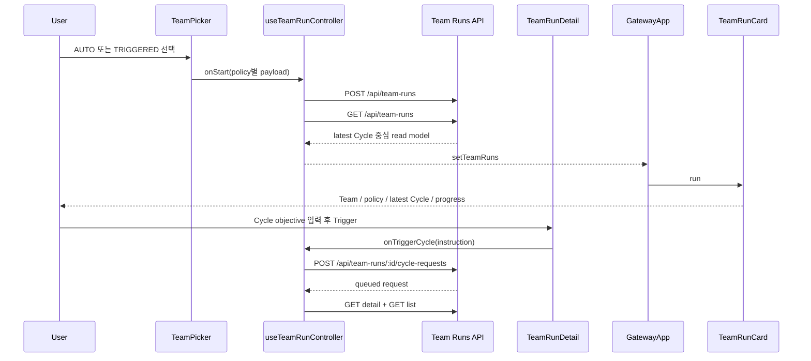

# GatewayApp Team Run Cycle List Analysis

## 요약

- Root: `frontend/src/components/containers/GatewayApp/index.jsx`
- Modes: `api-state`, `test`
- Verdict: `GatewayApp`와 `useTeamRunController`의 기존 API/state ownership을 유지한다. `TeamPicker`는 정책별 생성 payload만 조립하고, `TeamRunCard`는 list read model의 파생 필드를 표시한다. 새 컴포넌트나 별도 client state는 필요하지 않다.

## 범위

| Item | Path | Notes |
|---|---|---|
| Container | `frontend/src/components/containers/GatewayApp/index.jsx` | 목록 필터와 child composition |
| Controller | `frontend/src/hooks/useTeamRunController.js` | 생성 mutation, list refresh, filter state |
| Create form | `frontend/src/components/organisms/TeamPicker/index.jsx` | AUTO/TRIGGERED 입력과 payload |
| Trigger form | `frontend/src/components/organisms/TeamRunDetail/index.jsx` | TRIGGERED Cycle instruction 입력과 submit |
| List card | `frontend/src/components/molecules/TeamRunCard/index.jsx` | Run summary 표시 |
| Client | `frontend/src/api/client.js` | Team Run list/create transport |
| Backend read/write API | `src/personal_agent_gateway/api/team_runs.py` | 정책 검증, list payload, Cycle enqueue |
| Backend read model | `src/personal_agent_gateway/teams.py` | roster/task aggregation |
| Cycle policy | `src/personal_agent_gateway/team_cycles.py` | AUTO instruction, policy status, request lineage |
| Tests | `TeamPicker.test.jsx`, `TeamRunCard.test.jsx`, `TeamRunDetail.test.jsx`, `useTeamRunController.test.jsx`, `GatewayApp.test.jsx`, `tests/test_api_team_runs.py` | 생성·Trigger·카드·controller·통합·API 회귀 |

## API / 상태 흐름

- `TeamPicker`는 현재 `goal`을 항상 payload에 넣는다 (`TeamPicker/index.jsx:34-45`). 변경 후 TRIGGERED payload에는 goal을 보내지 않고, AUTO에서만 trimmed base objective와 반복 설정을 보낸다.
- `useTeamRunController.handleCreateTeamRun()`은 payload를 그대로 `api.createTeamRun()`에 전달하고 생성 후 `api.teamRuns()`로 목록을 갱신한다 (`useTeamRunController.js:132-150`). 정책 입력 의미를 controller에 복제할 필요가 없다.
- `api.teamRuns()`와 `api.createTeamRun()`은 response mapping 없이 서버 JSON을 그대로 전달한다 (`frontend/src/api/client.js:338-347`). 신규 list 필드는 client mapper 없이 카드가 소비할 수 있다.
- `GatewayApp`은 `runFilter`로 raw `run.status`를 직접 비교한다 (`GatewayApp/index.jsx:865-890`). Cycle-aware `display_status`가 API에 추가되면 필터 값과 비교 대상만 교체한다.
- `TeamRunCard`는 현재 Run goal과 전체 Task 집계를 표시한다 (`TeamRunCard/index.jsx:42-81`). 최신 Cycle objective/status/task counts, `cycle_count`, AUTO slot/next run을 서버 read model에서 받아 순수 렌더링한다.
- API 생성 계약은 `CreateTeamRunRequest.goal`을 항상 요구하고 AUTO만 즉시 enqueue한다 (`api/team_runs.py:36-53,103-138`). 정책별 goal 검증과 AUTO request instruction 생성은 backend가 소유해야 한다.
- TRIGGERED는 `TeamRunDetail`의 `cycleInstruction` local state가 submit 시 trim되어 `onTriggerCycle`로 전달되고, controller가 request identity와 `client_request_id`를 붙여 `/cycle-requests`에 보낸다 (`TeamRunDetail/index.jsx:325,557-586`, `useTeamRunController.js:162-194`, `client.js:349-357`, `api/team_runs.py:157-196`). 따라서 생성 goal을 제거해도 실제 Cycle objective는 별도 필수 계약으로 유지된다.

### 관련 state / effect / refresh 경로

| Owner | State / effect | 역할 |
|---|---|---|
| `TeamPicker` | `teamId`, default-Team `useEffect` | Team 목록 최초 항목을 기본 선택하고 사용자 선택을 payload의 `team_id`로 반영한다 (`TeamPicker/index.jsx:15,21-23`). |
| `TeamPicker` | `goal`, `executionPolicy`, `repeatCount`, `intervalMinutes` | 정책별 생성 입력을 소유한다. 변경 후 `goal` control은 AUTO branch 안에서만 렌더·전송한다 (`TeamPicker/index.jsx:16-19,33-45`). |
| `useTeamRunController` | `teamRuns`, `runFilter` | 서버 list read model과 사용자 필터 key를 소유한다 (`useTeamRunController.js:25-28`). |
| `useTeamRunController` | Team SSE handler | run/cycle/request/series 이벤트에서 `api.teamRuns()`를 다시 호출한다 (`useTeamRunController.js:88-103`). |
| `useTeamRunController` | create/trigger mutation | create 후 list를 재조회하고, Trigger 후 detail과 list를 병렬 재조회한다 (`useTeamRunController.js:132-159,162-194`). |
| `GatewayApp` | screen entry effect | `screen === "teams"` 진입 시 list/teams/settings를 요청한다 (`GatewayApp/index.jsx:259-270`). |
| `GatewayApp` | render-time filter | `runFilter`와 각 run의 서버 제공 `display_status`를 비교한다. 별도 derived state/effect는 추가하지 않는다 (`GatewayApp/index.jsx:865-890`). |

화면 진입, 생성 완료, Trigger 완료, SSE 수신은 모두 같은 `GET /api/team-runs` read model을 소비하므로 카드별 Cycle 상태를 client에서 재구성하지 않는다.

### `display_status` 우선순위

| Priority | 조건 | 표시 |
|---|---|---|
| 1 | `run.status === canceled` | `canceled` |
| 2 | queued/dispatching request, Run `planning`/`running`/`summarizing`, latest Cycle `queued`/`running` | `active` |
| 3 | 활성 request가 없고 Run `waiting_for_user`/`interrupted`/`failed`/`completed_with_failures`, AUTO series `paused_failure`/`paused_user`/`paused_interrupted`, latest Cycle `failed`/`waiting_for_user`/`interrupted` | `needs_attention` |
| 4 | AUTO series `waiting_interval` | `auto_waiting` |
| 5 | TRIGGERED idle, AUTO series completed, no Cycle | `ready` |

Card primary title은 `rules_snapshot.team.name + short Run ID`, snapshot이 없는 legacy Run은 short Run ID만 사용한다. Objective line은 pending/dispatching request instruction, latest Cycle의 linked request instruction, AUTO base goal, `Ready for trigger` 순으로 fallback한다.

## 테스트 / Story

- 기존 `TeamPicker.test.jsx`는 TRIGGERED/AUTO payload, Team 전환, runtime 표시, empty state를 검증한다. 필요한 RED case는 TRIGGERED에서 objective control/payload가 없고 AUTO에서는 빈 objective 제출이 차단되는 흐름이다.
- 기존 `TeamRunCard.test.jsx`는 ID, goal, roster, 전체 Task progress, click, legacy, initials fallback을 검증한다. 필요한 RED case는 no-Cycle READY, active latest Cycle, AUTO progress/next run, legacy title fallback이다.
- 기존 `TeamRunDetail.test.jsx:317-361`는 manual Cycle instruction submit과 previous Cycle lineage를 검증한다. 생성 goal 제거 후에도 이 테스트가 Cycle objective 필수 경로를 보존한다.
- 기존 `useTeamRunController.test.jsx:52-188,191-256`는 SSE refresh ownership과 manual request id 재사용/회전을 검증한다. list read model 필드 추가는 이 controller 계약을 바꾸지 않아야 한다.
- `GatewayApp.test.jsx`의 Team Runs 목록 테스트는 list fetch, 삭제, filter 상호작용을 가진다. 필터가 `display_status`를 사용하는 회귀를 인접 테스트로 갱신한다.
- `tests/test_api_team_runs.py`는 정책 검증, AUTO enqueue, manual/Hook Cycle, enriched list와 pagination을 이미 다룬다. AUTO base objective 필수, TRIGGERED goal 생략 허용, AUTO request instruction, latest Cycle list payload를 집중 추가한다. `display_status`는 canceled 우선, paused series→`needs_attention`, queued/dispatching request→`active`, waiting interval→`auto_waiting`, idle/completed series→`ready`를 각각 검증하고, 과거 terminal Run에 새 queued request가 있는 충돌에서도 request가 `active`로 표시되는 정책을 명시적으로 고정한다.
- `GatewayApp.test.jsx:1475-1524`의 기존 raw Run status 필터 테스트는 `ALL / ACTIVE / READY / AUTO WAITING / NEEDS ATTENTION` 각 chip별 fixture와 `display_status` 비교로 교체한다. `canceled`는 ALL에만 남고 다른 필터에 섞이지 않는 것도 검증한다.
- Story 파일은 이 feature 경로에서 발견되지 않았다.

## 권장 후속 작업

1. `CreateTeamRunRequest.goal`을 optional로 바꾸고 AUTO에서만 non-blank를 검증한다. 저장은 기존 NOT NULL column 호환을 위해 TRIGGERED를 빈 문자열로 정규화한다.
2. `team_cycles.py:217-228,586-597`의 AUTO request 고정 문구 대신 Run goal을 사용한다.
3. `_enrich_runs()`에 frozen Team name, latest Cycle/request, latest Cycle Task counts, cycle count, policy-derived `display_status`, AUTO progress를 한 번의 batch query 묶음으로 추가한다.
4. `TeamPicker`와 `TeamRunCard`는 새 local/global state 없이 조건부 렌더와 새 read-model 필드만 소비한다.
5. `GatewayApp` 필터를 `display_status` 기준 `ALL / ACTIVE / READY / AUTO WAITING / NEEDS ATTENTION`으로 바꾼다.

## 스킬 핸드오프

- `component-pattern`: 새 shared component를 만들지 않고 기존 container/organism/molecule ownership을 유지한다.
- `vercel-react-best-practices`: list 파생 상태를 추가 React effect로 복제하지 않고 서버 read model과 render-time primitive comparison을 사용한다.
- 별도 refactor plan은 필요하지 않다. 변경은 기존 public boundary 안의 국소 계약 변경이다.

## 리뷰

- Verdict: PASS
- Rounds: 4
- Fixed: Trigger instruction 전체 흐름, state/refresh 경로, 관련 테스트 inventory, display-status/title fallback 계약과 상태 우선순위 충돌을 보완했다.

## 근거

- `frontend/src/components/containers/GatewayApp/index.jsx:85-128,259-301,845-895`
- `frontend/src/hooks/useTeamRunController.js:25-85,93-159`
- `frontend/src/components/organisms/TeamPicker/index.jsx:14-166`
- `frontend/src/components/molecules/TeamRunCard/index.jsx:1-85`
- `frontend/src/components/organisms/TeamRunDetail/index.jsx:325,557-586`
- `frontend/src/api/client.js:338-357`
- `src/personal_agent_gateway/api/team_runs.py:36-196`
- `src/personal_agent_gateway/teams.py:561-654`
- `src/personal_agent_gateway/team_cycles.py:217-228,483-554,556-607`
- `frontend/src/components/organisms/TeamPicker/TeamPicker.test.jsx`
- `frontend/src/components/molecules/TeamRunCard/TeamRunCard.test.jsx`
- `frontend/src/components/organisms/TeamRunDetail/TeamRunDetail.test.jsx`
- `frontend/src/hooks/useTeamRunController.test.jsx`
- `frontend/src/components/containers/GatewayApp/GatewayApp.test.jsx`
- `tests/test_api_team_runs.py`
