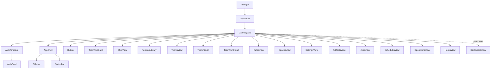
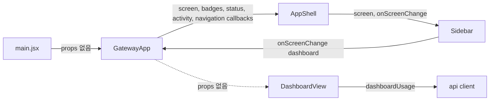
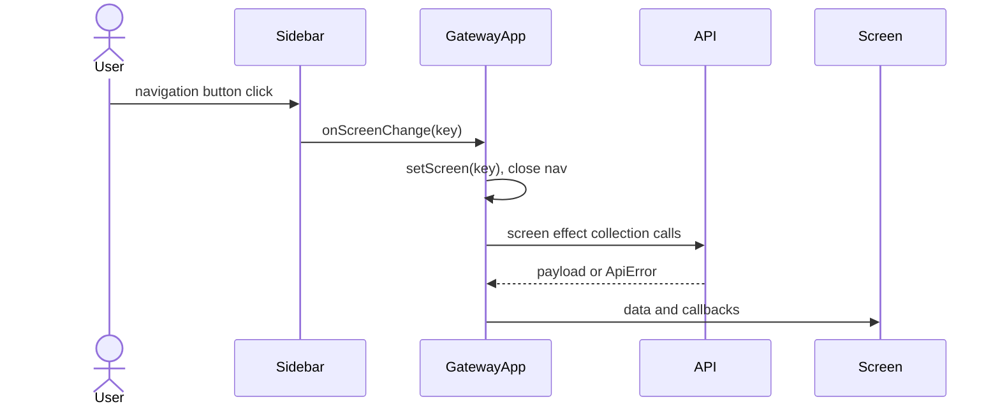
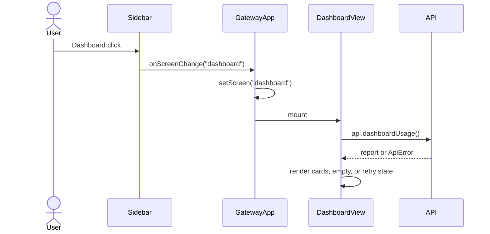

# GatewayApp Dashboard Integration Analysis

## 요약

- Root: `frontend/src/components/containers/GatewayApp/index.jsx`
- Modes: `understand`, `api-state`, `test`
- Verdict: `DashboardView`가 자체적으로 `api.dashboardUsage()`와 로딩·오류·재시도를 소유하므로, `GatewayApp`에는 import와 `screen === "dashboard"` 렌더링 분기만 추가하는 것이 현재 책임 경계에 맞는 최소 변경이다.

## 범위

| Item | Path | Notes |
| --- | --- | --- |
| Root container | `frontend/src/components/containers/GatewayApp/index.jsx` | 인증 후 shell, screen 전환, 화면별 서버 상태와 callback 조립 |
| Dashboard organism | `frontend/src/components/organisms/DashboardView/index.jsx` | 사용량 API, 로딩, 오류, 재시도, provider 카드 소유 |
| Navigation | `frontend/src/components/organisms/Sidebar/index.jsx` | `dashboard` screen key를 `NAV` 첫 항목으로 제공 |
| Shell | `frontend/src/components/templates/AppShell/index.jsx` | `screen`과 `onScreenChange`를 Sidebar에 전달 |
| API client | `frontend/src/api/client.js` | `dashboardUsage()`가 `/api/dashboard/usage` GET 수행 |
| Container tests | `frontend/src/components/containers/GatewayApp/GatewayApp.test.jsx` | 인증 후 screen 전환 integration 소유 |
| Dashboard tests | `frontend/src/components/organisms/DashboardView/DashboardView.test.jsx` | 사용량 API와 화면 상태 분기 소유 |
| Production mount | `frontend/src/main.jsx` | `UiProvider` 안에서 유일한 `GatewayApp` production mount |

## 컴포넌트 트리

`GatewayApp`는 인증 전 `AuthTemplate/AuthCard`, 인증 후 `AppShell`과 현재 `screen`에 대응하는 화면 하나를 조립한다. 각 organism 내부 구현은 leaf로 취급한다. Dashboard도 동일한 sibling branch로 연결하며 기존 화면의 props나 상태를 공유하지 않는다.

## Props 흐름

`GatewayApp`는 props 없이 mount된다. `AppShell`에는 navigation과 status props를 주입하고, 화면 organism에는 각 기능에 필요한 collection/callback을 주입한다. 새 `DashboardView`는 public props가 없고 API를 직접 소유하므로 container state나 callback 추가가 필요 없다.

## 상태와 Effect

### 로컬 상태와 ref

| State/ref | 역할 |
| --- | --- |
| `screen`, `navOpen` | 현재 화면과 mobile navigation open 상태. Dashboard 연결은 `screen` 분기만 사용한다. |
| `personas`, `avatarChoices`, `teams`, `settings`, `authSessions`, `rules`, `spacePolicies` | Persona/Team/Settings/Rules/Spaces 화면 collection. Dashboard와 공유하지 않는다. |
| `artifacts`, `jobs`, `schedules` | Artifact/Job/Schedule 화면 collection과 operation refresh 대상. Dashboard와 공유하지 않는다. |
| `hooks`, `hookRuns`, `openHookRunsId`, `hooksBadge` | Hook 목록·실행 이력·open drawer·미확인 event badge. |
| `focusedJobId`, `focusedScheduleId` | Operations나 schedule action이 다른 화면을 열 때 전달하는 focus target. |
| `operations`, `operationsError`, `operationsLoading` | Operations 전용 조회 상태. Dashboard의 자체 상태와 합치지 않는다. |
| `screenError`, `screenReloadKey` | 공용 화면 fetch/mutation error와 재조회 key. Dashboard는 자체 오류 UI와 reload key를 사용한다. |
| `sessionStateById` | session별 chat runtime 상태를 controller에 전달한다. |
| `hooksRef`, `screenRef`, `openHookRunsIdRef` | 장기 실행 SSE callback에서 최신 Hook/screen/open target을 읽는다. |
| `notificationStateRef`, `notifiedTeamRunsRef` | browser notification 설정과 이미 알린 Team Run event key를 추적한다. |
| `turnStartRef`, `lastConfigAttemptRef`, `activeSessionIdRef`, `busyRef` | session controller가 최신 turn/config/session/busy 값을 stale closure 없이 읽는다. |

### Effect와 memoization

- `useGatewayBootstrap`이 인증, session, agent catalog와 초기 앱 loading을 제공한다(`GatewayApp/index.jsx:79-102`).
- `useTeamRunController`가 Team Run collection/detail/action을 제공한다(`:104-132`).
- 세 개의 짧은 ref 동기화 effect가 `hooks`, `screen`, `openHookRunsId`를 SSE callback용 ref에 복사한다(`:172-174`).
- `useSessionController`가 Chat SSE와 action을 소유하고 Team/Hook event callback을 주입받는다(`:195-233`).
- `useForceTick`은 Chat이 busy일 때만 1초 render tick을 시작하고 cleanup한다(`:33-39`, `:248`).
- `registeredByPath`는 Artifact 원본 경로 lookup `Map`을 `artifacts` 변경 시에만 다시 만든다(`:250-257`).
- 화면 load effect는 인증 이후 `screen`에 필요한 collection을 호출한다(`:259-301`). Dashboard는 organism 자체가 fetch하므로 이 effect에 분기를 추가하면 API 소유가 중복된다.

## 외부 primitive와 주입 동작

| Dependency | 이 컴포넌트에서 하는 일 |
| --- | --- |
| React `useState` | screen과 화면별 collection/action UI 상태를 container source로 보관한다. |
| React `useEffect` | 장기 callback ref 동기화와 screen별 collection 조회를 실행한다. |
| React `useRef` | SSE/notification/session callback이 최신 transient 값을 읽도록 한다. |
| React `useCallback` | notification, Hook event, Operations loader처럼 hook dependency로 전달되는 callback identity를 안정화한다. |
| React `useMemo` | artifact original path의 반복 lookup용 `Map`을 재사용한다. |
| `api`, `apiErrorAction` | REST 호출과 공용 screen error recovery action을 제공한다. Dashboard REST 호출은 child가 직접 수행한다. |
| `useConfirm`, `useToast` | 파괴적 Team/Operations 작업 확인과 mutation 결과 피드백을 제공한다. Dashboard는 read-only라 사용하지 않는다. |
| browser notification helpers | Team Run 완료·실패·입력 요청을 브라우저 알림으로 표시하고 대상 run을 연다. |
| `useGatewayBootstrap` | 인증 및 앱 초기 bootstrap 결과와 auth action을 주입한다. |
| `useSessionController` | Chat session state, SSE state, timeline, approval/action callback을 주입한다. |
| `useTeamRunController` | Team Run state, detail, cycle/action callback을 주입한다. |

## 주요 상호작용 흐름

### 기존 화면 전환

### Dashboard 전환

Dashboard 새로고침과 오류 재시도는 child의 `reloadKey`만 증가시켜 같은 endpoint를 재호출한다. 따라서 `GatewayApp.screenReloadKey`와 결합하지 않는다.

## API와 상태 추적

- Navigation source: `Sidebar.NAV`의 `{ key: "dashboard", label: "Dashboard" }` (`Sidebar/index.jsx:3-6`).
- Container transition: `AppShell.onScreenChange`가 `setScreen(nextScreen)`을 호출한다(`GatewayApp/index.jsx:719-739`).
- Current gap: render chain에 `screen === "dashboard"` branch가 없어 fallback의 `DASHBOARD - PLANNED`가 출력된다(`:1013-1016`).
- Proposed render boundary: `DashboardView` import 후 Chat branch 앞에 `<DashboardView />` sibling branch를 추가한다. 별도 container state/effect/API 호출은 추가하지 않는다.
- Child API: `api.dashboardUsage()`는 `GET /api/dashboard/usage`의 JSON body를 그대로 반환한다(`frontend/src/api/client.js:143-145`).
- Child state: `DashboardView`가 `report`, `error`, `loading`, `reloadKey`와 unmount guard를 소유한다(`DashboardView/index.jsx:117-144`).

## 테스트와 Story

- Story 파일은 repository 검색에서 확인되지 않았다.
- `DashboardView.test.jsx` 4건은 실제 API client를 통해 endpoint 호출, 정상 gauge, 미수집/실행 불가, 오류 재시도, provider 빈 목록을 검증한다.
- `GatewayApp.test.jsx:104-119`의 navigation smoke test는 현재 Dashboard 클릭 후 `DASHBOARD - PLANNED`를 기대한다. production branch 추가와 함께 기대값을 `대시보드` heading으로 바꿔야 한다.
- `Sidebar.test.jsx:15-22`는 Dashboard가 Chat보다 앞에 있고 active일 때 `aria-current="page"`임을 검증한다.
- 회귀 위험이 가장 높은 flow는 인증된 상태에서 Dashboard navigation을 클릭했을 때 organism이 mount되고 `/api/dashboard/usage`가 한 번 호출되는 경계다. child 단위 API 상태 테스트와 container navigation smoke test를 함께 유지하면 충분하다.

## 권장 후속 작업

1. `GatewayApp/index.jsx`에 `DashboardView` import와 `screen === "dashboard"` branch만 추가한다. 이유: navigation key는 이미 존재하지만 현재 fallback이 렌더링된다.
2. `GatewayApp.test.jsx`의 기존 Dashboard navigation 기대값을 planned placeholder에서 실제 `대시보드` heading으로 바꾼다. 별도 중복 API 상태 assertion은 child test가 소유한다.
3. 전체 frontend test와 production build를 실행해 navigation, CSS import, API mount를 검증한다.

## 스킬 핸드오프

- `component-pattern`: 새 organism의 data boundary와 project-local catalog 등록을 유지한다.
- `vercel-react-best-practices`: child가 API와 상태를 소유하므로 container에 중복 effect/state를 추가하지 않는다.
- 추가 refactor나 architecture plan은 필요하지 않다. 이번 변경은 기존 screen composition 패턴의 단일 branch 추가다.

## Review

- Verdict: `PASS`
- Rounds: 1
- Fixed: blocker 없음. 독립 reviewer가 root component, report, selected modes, review rubric을 기준으로 코드를 재도출해 검증했다.

## 근거

- `frontend/src/main.jsx:1-12`
- `frontend/src/components/containers/GatewayApp/index.jsx:1-301,693-1022`
- `frontend/src/components/containers/GatewayApp/GatewayApp.test.jsx:62-119`
- `frontend/src/components/templates/AppShell/index.jsx`
- `frontend/src/components/organisms/Sidebar/index.jsx:1-25`
- `frontend/src/components/organisms/Sidebar/Sidebar.test.jsx:1-25`
- `frontend/src/components/organisms/DashboardView/index.jsx:1-184`
- `frontend/src/components/organisms/DashboardView/DashboardView.test.jsx:1-126`
- `frontend/src/api/client.js:1-145`
- Search: `rg -n "GatewayApp|DashboardView|dashboardUsage|screen ===" frontend/src`
- Verification before report: `npm test` (38 files, 265 tests), `npm run build`.
