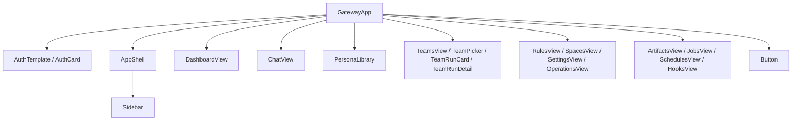
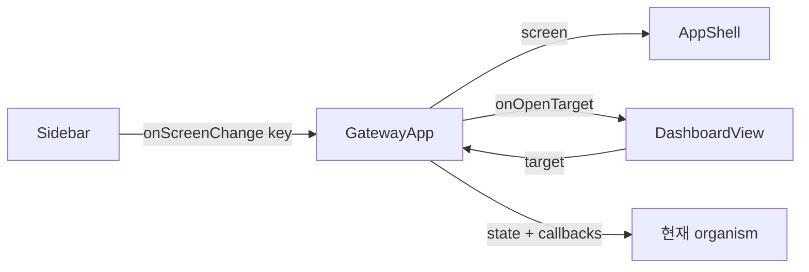
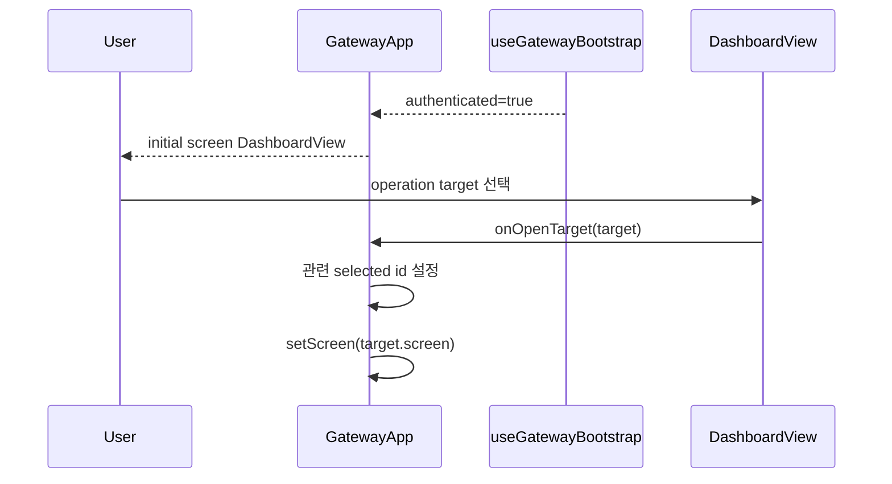

# GatewayApp Initial Dashboard Analysis

## 요약

- Root: `frontend/src/components/containers/GatewayApp/index.jsx`
- Modes: `understand`, `refactor`
- Verdict: 최초 화면은 `screen`의 초기값과 장기 callback용 `screenRef` 초기값 두 곳에서 `chat`으로 고정되어 있다. 둘을 `dashboard`로 맞추는 것이 최소 변경이며 별도 router나 저장 상태는 필요 없다.

## 범위

| 항목 | 경로 | 비고 |
|---|---|---|
| Root container | `frontend/src/components/containers/GatewayApp/index.jsx` | 인증 이후 화면 선택과 기능 조립 |
| Shell | `frontend/src/components/templates/AppShell/index.jsx` | `screen`, `onScreenChange`를 Sidebar로 전달 |
| Navigation | `frontend/src/components/organisms/Sidebar/index.jsx` | NAV key를 callback으로 전달 |
| Target screen | `frontend/src/components/organisms/DashboardView/index.jsx` | `screen === "dashboard"`일 때 렌더 |
| Integration tests | `frontend/src/components/containers/GatewayApp/GatewayApp.test.jsx` | 인증 bootstrap과 화면 전환 검증 |

## 컴포넌트 트리

`GatewayApp`가 import하는 로컬 UI는 위 노드 전체이며, 실제 렌더는 단일 `screen` key에 따라 한 화면만 선택한다. 이 변경의 직접 대상은 `DashboardView` 선택 분기뿐이다.

## Props 흐름

`GatewayApp` 자체 public props는 없다. `AppShell`이 Sidebar action을 전달하고, Dashboard/Operations의 target action은 `handleOpenOperationTarget`이 session·Team Run·Job·Schedule 선택 상태를 먼저 맞춘 뒤 `setScreen`을 호출한다.

## 상태와 Effects

- `screen`: 현재 organism을 선택한다. 현재 초기값은 `chat`이다 (`index.jsx:46`).
- `screenRef`: SSE Hook callback이 최신 화면을 읽도록 effect로 동기화된다. 초기값도 `chat`이다 (`:67`, `:182`). 최초 화면을 바꿀 때 두 초기값을 함께 맞춰야 첫 effect 전 callback에도 일관된다.
- `navOpen`: Sidebar 표시 상태이며 화면 선택 시 닫힌다.
- 나머지 collection/detail state는 Persona, Team, Rules, Spaces, Settings, Artifacts, Jobs, Schedules, Hooks, Operations 화면의 read model이다.
- 인증 전에는 `AuthTemplate`만 반환되므로 초기 `dashboard` 설정은 로그인/설정 완료 후 첫 application 화면에만 영향을 준다.

## 외부 및 주입 의존성

| 의존성 | 이 컴포넌트에서의 역할 |
|---|---|
| React `useState` | 현재 화면과 각 화면 read model을 보관한다. |
| React `useEffect` | 화면 ref, SSE 관련 ref, screen별 lazy read를 현재 state와 동기화한다. |
| React `useCallback` | notification/SSE callback identity를 안정화한다. |
| React `useMemo` | collection에서 파생되는 표시 데이터를 캐시한다. |
| React `useRef` | 장기 SSE callback에서 최신 선택과 화면을 읽는다. |
| `api` | screen별 read/mutation을 실행한다. |
| `useToast`, `useConfirm` | 사용자 피드백과 파괴적 action 확인을 주입한다. |

## Custom hooks / actions

| Hook/action | 역할 |
|---|---|
| `useGatewayBootstrap` | 인증 단계, 초기 status/session/agent/config와 login/setup action을 제공한다. |
| `useSessionController` | Chat session, SSE, approval, send/interrupt/search와 Team/Hook event 전달을 소유한다. |
| `useTeamRunController` | Team Run list/detail/document/delivery와 Cycle·retry·apply action을 소유한다. |
| `setScreen` | Sidebar, Dashboard target, 인증 해제 등 명시적 사용자/상태 전환에서 현재 화면을 바꾼다. |
| `clearTeamRunView` | Team Run 화면을 떠날 때 선택 상세를 정리한다. |

## 주요 상호작용 흐름

1. Bootstrap이 끝나기 전에는 Loading/Auth 화면이 유지된다.
2. 인증 완료 후 `screen` 초기값에 해당하는 organism이 첫 화면이 된다.
3. Sidebar 선택은 `onScreenChange`로 `screen`을 갱신하며 Team Run을 떠나면 선택 상태도 정리한다.
4. Dashboard 카드 선택은 `handleOpenOperationTarget`을 통해 대상 화면과 선택 ID를 함께 갱신한다.

## 리팩터링 판단

- `유지`: 최초 화면 변경은 container 소유의 navigation 기본값이므로 `GatewayApp`에 두는 것이 맞다. 노력/위험: 매우 낮음.
- `프레젠테이션 분해`: render body는 여러 screen 분기를 포함해 크지만 각 organism은 이미 feature-owned로 분리되어 있다. 이번 두 상수 변경을 위해 새 router나 screen model을 추출하면 범위를 넘는다. 노력/위험: 중간이며 이번 작업에서는 보류한다.
- 반복 JSX/DRY: screen 분기는 props 계약이 서로 달라 descriptor map으로 합치면 오히려 가독성이 낮아진다. 반복 제거 대상 없음.
- inline pure derivation: `teamRunBadge`, `screenErrorAction`은 짧고 현재 위치에서 의미가 분명하다. helper 추출 대상 없음.

## 권장 후속 작업

1. `screen`과 `screenRef` 초기값을 `dashboard`로 함께 변경한다.
2. integration test에서 인증 후 Dashboard가 첫 화면이고 Chat이 아닌지 검증한다.

## 스킬 핸드오프

- `vercel-react-best-practices`: 추가 state/effect 없이 기존 state 초기값만 변경해 render와 bundle 비용을 늘리지 않는다.

## 리뷰

- Verdict: PASS
- Rounds: 1
- Fixed: 독립 재검토에서 `screen`, `screenRef`, 동기화 effect, 인증 전 early return, Dashboard 분기와 Sidebar 전달을 코드에서 다시 확인했다. 불일치 없음.

## 근거

- `frontend/src/components/containers/GatewayApp/index.jsx:1-23,43-75,79-257,632-643,719-787`
- `frontend/src/components/templates/AppShell/index.jsx`
- `frontend/src/components/organisms/Sidebar/index.jsx:31-68`
- `frontend/src/components/organisms/DashboardView/index.jsx`
- Search: `rg -n "useState|screenRef|setScreen|onScreenChange|DashboardView" frontend/src/components/containers/GatewayApp/index.jsx`
