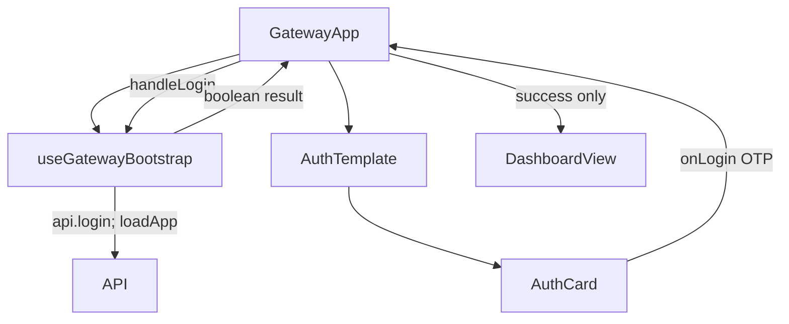

# GatewayApp OTP Login Flow Analysis

## 요약

- Root: `frontend/src/components/containers/GatewayApp/index.jsx`
- Modes: `api-state,test`
- Verdict: hook의 login 결과를 GatewayApp에서 받아 성공할 때만 `screen`을 `dashboard`로 변경하는 것이 기존 ownership에 맞다.

## 범위와 구조

| 경계 | 경로 | 책임 |
| --- | --- | --- |
| Container | `frontend/src/components/containers/GatewayApp/index.jsx` | auth 결과에 따른 화면 state와 authenticated/non-authenticated branch를 소유한다. |
| Bootstrap hook | `frontend/src/hooks/useGatewayBootstrap.js` | auth API, bootstrap data, auth error와 pending state를 소유한다. |
| Molecule | `frontend/src/components/molecules/AuthCard/index.jsx` | OTP 입력과 submit affordance만 렌더링한다. |
| Dashboard | `frontend/src/components/organisms/DashboardView/index.jsx` | auth 완료 뒤 default screen에서 표시되는 독립 organism이다. |

## API / 상태 추적

| state/effect | 입력 | 현재 동작 | 변경 경계 |
| --- | --- | --- | --- |
| `screen` | navigation callbacks | 초기값은 `dashboard`; 로그인 branch는 현재 `handleLogin`을 직접 AuthCard로 전달한다. | GatewayApp wrapper가 hook의 boolean을 받고 성공 시 `setScreen("dashboard")`한다. |
| `booting`, `authenticated`, `authStage`, `authError` | `useGatewayBootstrap` | boot 중 Loading, 비인증이면 AuthCard, 인증되면 AppShell을 표시한다. | hook에서 `authSubmitting`을 추가해 AuthCard로 전달한다. |
| `useGatewayBootstrap` initial effect | `api.authStatus()` | 이미 인증된 경우 `loadApp`, 아닌 경우 login/setup stage를 정한다. | initial bootstrap과 setup/recovery flow는 변경하지 않는다. |
| `handleOperationsRelogin` | Dashboard/Operations 401 | authenticated false, login stage, `screen="chat"`을 정한다. | operation 재로그인 흐름은 OTP 성공 redirect wrapper와 별개로 유지한다. |
| `useSessionController` | `authenticated`, current session state | authenticated가 true일 때 session/SSE controls의 container dependency를 활성화한다. | login 성공은 `loadApp()` → `setAuthenticated(true)`를 마친 뒤에만 이 경계를 활성화한다. |

`useGatewayBootstrap.handleLogin`은 현재 `api.login(otp)` 성공 후 `loadApp()`을 기다리지만 값을 반환하지 않는다. 따라서 UI는 click 뒤 pending 여부를 알 수 없고 성공 직후의 destination도 explicit하지 않다. hook은 `try/catch/finally`로 `Promise<boolean>`을 반환해야 한다. `api.login` 거절과 성공 뒤 `loadApp` rejection은 auth error를 설정하고 `false`를 반환하며, `finally`에서 pending을 해제한다. 이렇게 하면 container는 Bootstrap 완료 후의 `true`에만 Dashboard를 선택하고 실패에서는 현재 인증 화면을 유지한다.

| auth branch | AuthCard callback | hook/container API·상태 결과 | pending 적용 |
| --- | --- | --- | --- |
| login | `onLogin(otp)` | `handleLogin` → `api.login` → `loadApp` → `authenticated=true`; reject/boot failure는 `false`와 auth error, wrapper는 true일 때만 Dashboard를 선택한다. | 적용 |
| setup 진입/되돌아가기 | `onSetupStart` | `handleSetupStart` → `api.setupStart` → `authStage="setup"`, `setup` 갱신. setup 화면의 Back to sign in label도 같은 callback을 호출해 실제로는 setup을 다시 시작하는 pre-existing 불일치다. | 미적용 |
| setup 검증 | `onSetupVerify(otp)` | `handleSetupVerify` → `api.setupVerify` → recovery 또는 auth error | 미적용 |
| recovery 계속 | `onContinue` | `loadApp` 직접 호출로 bootstrap 후 authenticated branch 진입 | 미적용 |

## 테스트 현황과 회귀 위험

| 테스트 | 현재 보장 | 이번 변경 |
| --- | --- | --- |
| `GatewayApp.test.jsx` authenticated bootstrap test | 인증된 시작은 Dashboard를 default screen으로 연다. | OTP login 성공도 같은 heading으로 도달하는 integration regression을 추가한다. |
| `GatewayApp.test.jsx` OTP protected-data test | 비인증 사용자가 OTP login을 마친 뒤 protected bootstrap API를 불러 Chat으로 갈 수 있다. | 이 test를 pending disabled, Dashboard redirect, rejection/bootstrap failure에서 화면 유지까지 확장하는 직접 근거로 쓴다. |
| `GatewayApp.test.jsx` operations dashboard navigation test | Dashboard의 target navigation은 container callback을 사용한다. | login redirect가 operation navigation을 바꾸지 않아야 한다. |
| `GatewayApp.test.jsx` SSE/replay tests | 초기 `authenticated: true` bootstrap의 replay lifecycle을 유지한다. | 새 OTP success bootstrap이 session/SSE controller activation을 손상시키지 않는 별도 regression을 제안한다. |
| AuthCard unit test | 별도 파일 없음. | 로그인 pending은 GatewayApp integration test에서 card input/button의 disabled state로 검증한다. |

추가 RED 사례: deferred `POST /api/auth/login` 동안 `Signing in…` 버튼과 OTP input이 disabled이고, 해결 후 `대시보드` heading이 렌더링된다. login API 거절 또는 `loadApp` 실패에서는 screen을 전환하지 않는다.

## 권장 후속 작업

1. hook에서 `authSubmitting`과 `handleLogin(): Promise<boolean>`을 제공한다.
2. GatewayApp에서 AuthCard callback을 감싸 성공시에만 `setScreen("dashboard")`한다.
3. AuthCard에는 `authSubmitting` prop만 추가하고 API 호출은 두지 않는다.

## 리뷰

- Verdict: PASS
- Rounds: 3
- Fixed: existing unauthenticated OTP test, setup/recovery callback paths, session/SSE activation boundary, native disabled forwarding, rejected login/bootstrap failure와 기존 setup label 불일치를 반영했고 독립 최종 리리뷰를 통과했다.

## 근거

- `frontend/src/components/containers/GatewayApp/index.jsx:43-103,267-310,663-667,702-718,783-786`
- `frontend/src/components/containers/GatewayApp/index.jsx:212-242`
- `frontend/src/hooks/useGatewayBootstrap.js:10-144`
- `frontend/src/components/containers/GatewayApp/GatewayApp.test.jsx:79-151,292-311,1892-1976`
