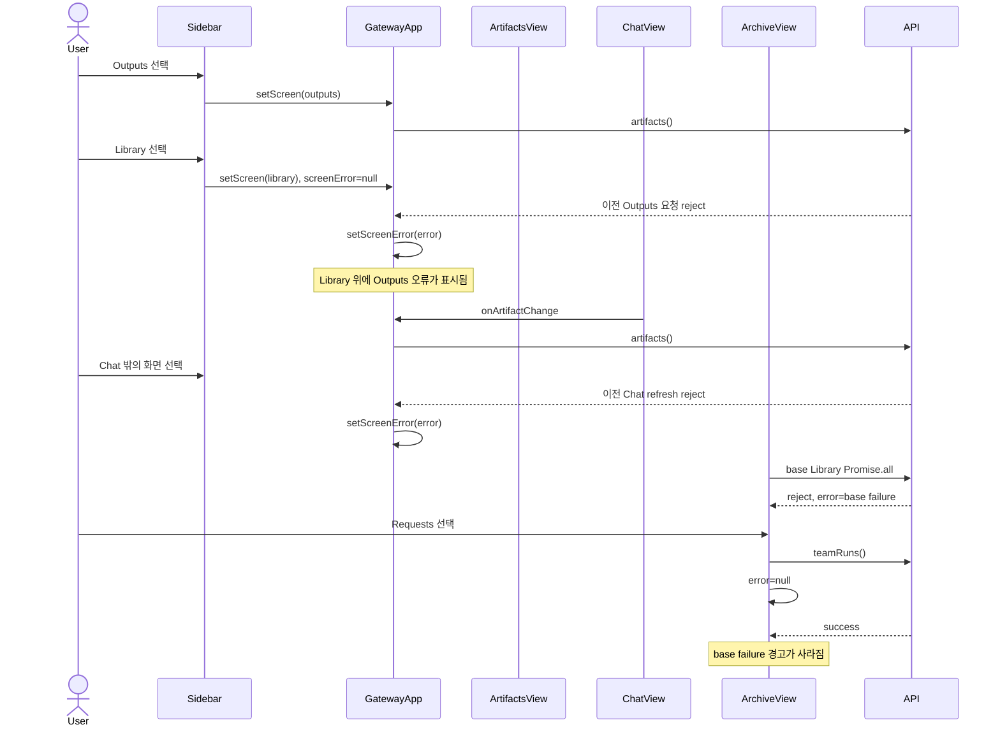
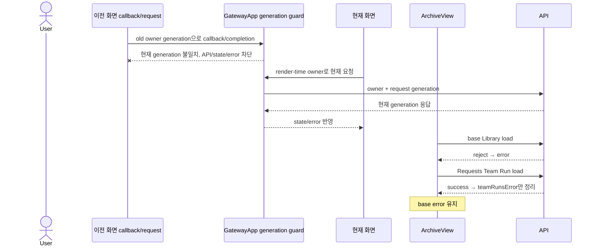

# GatewayApp 화면 오류 소유권 분석

## 요약

- Root: `frontend/src/components/containers/GatewayApp/index.jsx`
- Related component: `frontend/src/components/organisms/ArchiveView/index.jsx`
- Modes: `api-state`, `test`
- Verdict: 분석 당시 `screenError`와 `ArchiveView.error`가 서로 다른 요청 owner의 실패를 함께 보관했다. 구현 결과 base/Team Run error를 분리했고, 모든 화면 전환에 monotonic screen generation을 부여했으며, Artifact/Operations 요청은 render-time owner와 request generation을 함께 확인한다. 늦은 callback, in-flight completion, ABA 전환, pending Operations confirm 회귀가 테스트로 고정됐다.

## 범위

| 항목 | 경로 | 분석 이유 |
| --- | --- | --- |
| root container | `frontend/src/components/containers/GatewayApp/index.jsx` | `screen`, 공용 `screenError`, 화면별 fetch와 Outputs refresh callback 소유 |
| Library child | `frontend/src/components/organisms/ArchiveView/index.jsx` | base Library 요청과 Requests-only Team Run 요청의 공용 `error` 소유 |
| Chat child | `frontend/src/components/organisms/ChatView/index.jsx` | `Timeline.onRegistered`를 parent의 `onArtifactChange`로 전달 |
| Chat callback relay | `frontend/src/components/organisms/Timeline/index.jsx` | Markdown renderer의 `onRegistered`를 ChatView callback으로 전달 |
| Chat callback owner | `frontend/src/components/organisms/MarkdownContent/index.jsx` | Artifact register 성공/409 및 ArtifactModal 삭제 completion에서 `onRegistered` 호출 |
| Outputs child | `frontend/src/components/organisms/ArtifactsView/index.jsx` | delete/cleanup/retention mutation 완료 뒤 `onChange` 호출 |
| Operations child | `frontend/src/components/organisms/OperationsView/index.jsx` | global confirm 뒤 실행되는 mutation callback과 refresh prop 소비 |
| container tests | `frontend/src/components/containers/GatewayApp/GatewayApp.test.jsx` | 화면 전환, Outputs fetch·mutation refresh 통합 검증 |
| Library tests | `frontend/src/components/organisms/ArchiveView/ArchiveView.test.jsx` | base load와 Team Run lazy/retry/stale 응답 검증 |
| Operations tests | `frontend/src/components/organisms/OperationsView/OperationsView.test.jsx` | Emergency Stop confirm과 backup action 계약 검증 |
| navigation caller | `frontend/src/components/organisms/Sidebar/index.jsx` | `onScreenChange`를 통해 `library`와 `outputs` 선택 |
| API client | `frontend/src/api/client.js` | `artifacts`, Archive base data, `teamRuns` promise 제공 |

## API / 상태 추적

### 수정 전 root cause

### 구현된 owner 경계

| 상태·effect | 실제 동작 | 위험 |
| --- | --- | --- |
| `GatewayApp.screen` / `screenRef` / `screenGenerationRef` | `transitionScreen()`만 실제 screen state를 바꾸며 화면이 달라질 때 generation과 ref를 동기식으로 갱신한다. | `A → B → A`에서도 이전 A의 owner generation은 다시 유효해지지 않는다. |
| `GatewayApp.screenError` | generic screen load는 effect cleanup을, Artifact/Operations는 owner·request generation을 확인한 뒤에만 공용 error를 쓴다. | 이전 화면 rejection이 새 화면 alert로 노출되지 않는다. |
| Chat/Outputs Artifact `onChange` | 두 child가 render-time generation에 묶인 같은 `refreshArtifacts`를 받는다. 초기 load와 mutation refresh는 `artifactRequestGenerationRef`를 공유한다. | unmount 뒤 늦게 호출된 callback은 요청을 시작하지 않고, in-flight/ABA completion도 무시된다. |
| Operations callbacks | refresh와 mutation prop 7개가 `renderedScreenGeneration`을 명시적으로 전달하고 handler는 API 시작 전에 owner를 확인한다. | global confirm이 열린 동안 이동해도 오래된 Emergency Stop callback이 mutation을 시작하지 않는다. |
| `ArchiveView.error` / `teamRunsError` | base/search/editor/publish/delete/request/validation error와 Requests-only Team Run error를 별도 state로 소유한다. | Team Run 시작·성공이 base Library failure를 지우지 않는다. |
| `teamRunsRequestGeneration` | client 변경/unmount 이후 Team Run success/error completion을 무효화한다. | error state 분리 뒤에도 기존 stale 보호가 유지된다. |

근본 원인은 API 실패 자체가 아니라 **비동기 callback/completion과 오류 owner 사이의 식별자가 없었던 것**이다. 화면 이름 비교만으로는 callback이 navigation 뒤 처음 호출되는 경우와 ABA를 구분하지 못하므로 render-time screen generation이 필요했다. 같은 화면의 요청 순서는 Artifact/Operations별 request generation이 보장하고, `ArchiveView`는 base와 Team Run 오류를 별도 state로 소유한다.

## 테스트 현황과 필요한 RED 사례

기존 `GatewayApp.test.jsx`는 Library와 Outputs가 서로의 초기 API를 eager-load하지 않는지, Outputs 삭제 뒤 fallback 목록이 두 번째로 조회되는지를 검증한다. 그러나 delayed rejection 뒤 화면 전환은 다루지 않는다. 기존 `deferredResponse()` helper를 사용할 수 있다.

기존 `ArchiveView.test.jsx`는 Team Runs lazy load, 실패 후 retry, client 변경 시 stale **success** 무시를 검증한다. 구현의 catch에도 generation guard가 있지만 stale rejection은 테스트되지 않았고, base `Promise.all` 실패 후 Requests의 Team Run 성공이 base alert를 보존하는 사례도 없다.

구현한 RED 사례:

1. Outputs의 `/api/artifacts` 응답을 pending으로 둔 채 Library로 전환하고 이전 요청을 reject한다. Library heading은 유지되고 이전 Outputs error alert는 나타나지 않아야 한다. 이 테스트는 화면 completion guard를 제거하면 실패한다.
2. Outputs 목록을 먼저 성공시킨 뒤 delete로 `onChange`의 두 번째 `/api/artifacts`를 pending 상태로 만든다. Library로 이동한 뒤 refresh를 reject해도 Library에 Outputs error가 나타나지 않아야 한다. 이 테스트는 공유 refresh helper의 completion guard를 제거하면 실패한다. Chat도 같은 helper reference를 prop으로 받도록 구현해 두 화면의 callback 경계를 하나로 만든다.
3. Library base API 하나를 reject한 뒤 Requests를 열고 `teamRuns()`를 성공시킨다. base failure alert가 계속 보여야 한다. 이 테스트는 Team Run 시작 시 공용 error를 초기화하면 실패한다.
4. presentation test에서 Library region, totals, guide, tablist, loading status가 `Library` 용어를 사용한다고 확인한다. 이는 user/accessibility contract rename을 보호한다.
5. DELETE completion이 Outputs unmount 뒤 `onChange`를 호출해도 Artifact refresh 자체를 시작하지 않는다.
6. Outputs mutation refresh 중 `Outputs → Library → Outputs`로 이동해도 이전 refresh rejection이 새 Outputs instance에 노출되지 않는다.
7. Operations의 Emergency Stop confirm이 열린 동안 Library로 이동한 뒤 confirm을 수락해도 mutation API를 시작하지 않는다. 같은 화면 confirm 성공 경로는 POST, reload, toast까지 별도로 보존한다.

## 구현 결과와 후속 작업

1. 위 일곱 회귀를 RED로 확인한 뒤 base/Team Run error 분리, screen/request generation, render-time callback ownership을 최소 범위로 구현했다.
2. 사용자·접근성 문구의 `Archive`는 `Library`로 바꾸고 내부 component/API/CSS 이름은 유지했다.
3. 최종 검증은 40 files / 362 tests, Vite 80 modules, 제거 스캔 3종 0건이며 생성 자산을 갱신했다.
4. 이후 새 screen-owned async callback을 추가할 때는 API 호출 시점이 아니라 callback을 child에 전달하는 render 시점의 generation을 묶는다.

## 스킬 핸드오프

- 구현은 `superpowers:systematic-debugging`과 `superpowers:test-driven-development`로 두 race를 각각 재현한 뒤 최소 수정한다.
- 완료 전 `superpowers:verification-before-completion`으로 focused/full/build 결과와 생성 자산을 재검증한다.

## 리뷰

- Verdict: PASS
- Rounds: 4 + post-implementation re-review 2
- Fixed: 초기 4회에서 callback origin, error writer, RED 범위를 보완했다. 구현 후 재검증에서 screen-name 비교의 late-callback/ABA 한계, Operations render-time ownership, pre/post-fix diagram 구분, 최신 evidence와 최종 테스트 결과를 반영했다.

## 근거

- `frontend/src/components/containers/GatewayApp/index.jsx:47-89,259-380,648-745,866-891,1044-1058`
- `frontend/src/components/containers/GatewayApp/GatewayApp.test.jsx:25-31,139-469`
- `frontend/src/components/organisms/ArchiveView/index.jsx:99-185,211-389,396-464`
- `frontend/src/components/organisms/ArchiveView/ArchiveView.test.jsx:115-359`
- `frontend/src/components/organisms/ChatView/index.jsx:127,191`
- `frontend/src/components/organisms/Timeline/index.jsx:16-25`
- `frontend/src/components/organisms/MarkdownContent/index.jsx:30-37,58`
- `frontend/src/components/organisms/ArtifactsView/index.jsx:45,106-128`
- `frontend/src/components/organisms/OperationsView/index.jsx:169-203,211-267`
- `frontend/src/components/organisms/OperationsView/OperationsView.test.jsx:134-143`
- `frontend/src/components/organisms/Sidebar/index.jsx:3-24`
- `frontend/src/api/client.js:185-289`
