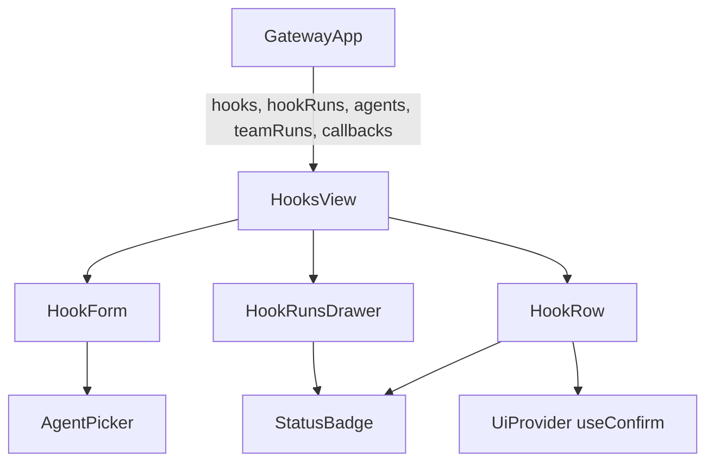
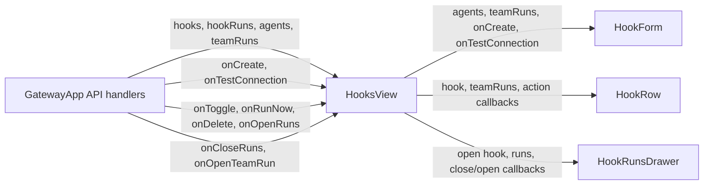
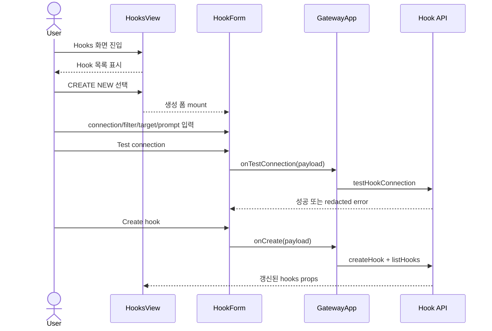

# HooksView Create Form Disclosure Analysis

## 요약

- Root: `frontend/src/components/organisms/HooksView/index.jsx`
- Modes: `understand`, `refactor`
- Verdict: 현재 소유권과 API 경계는 유지하고, `HooksView`에 생성 폼 표시 상태만 추가한다.

## 범위

| 항목 | 경로 | 비고 |
|---|---|---|
| Root component | `frontend/src/components/organisms/HooksView/index.jsx` | 목록, 생성 폼, 실행 내역 drawer 합성 |
| Parent usage | `frontend/src/components/containers/GatewayApp/index.jsx` | Hook collection과 API callback 소유 |
| Tests | `frontend/src/components/organisms/HooksView/HooksView.test.jsx` | 목록, 생성, 연결 검사, 실행 내역 |
| Shared styles | `src/personal_agent_gateway/static/styles.css` | `schedules-view`, `schedule-form` 레이아웃 |

## 컴포넌트 트리

`HookForm`, `HookRow`, `HookRunsDrawer`는 같은 파일에 있는 `HooksView` 전용
presentational helper다. `AgentPicker`, `StatusBadge`, `useConfirm`은 공개 API만
사용하는 공유 leaf로 취급한다.

## Props 흐름

`GatewayApp`의 `handleCreateHook`은 `api.createHook` 후 `api.listHooks`로 collection을
다시 읽고 toast를 표시한다. `HooksView`는 서버 mutation을 직접 소유하지 않는다.

## 상태와 효과

| 상태/효과 | 소유자 | 역할 |
|---|---|---|
| Hook form local state 15개 | `HookForm` | email connection, filter, target, prompt payload와 test 상태 구성 |
| `agentConfig` 초기화 effect | `HookForm` | 사용 가능한 첫 agent를 기본 target으로 선택 |
| `testing`, `testResult` | `HookForm` | 비동기 connection test 진행·결과 표시 |
| `openHook` 파생값 | `HooksView` | `openHookRunsId`에 해당하는 drawer 대상 선택 |
| 생성 폼 노출 | 현재 없음 | 폼이 항상 mount되어 화면 진입 즉시 보이는 원인 |

생성 폼 노출은 서버 상태가 아니라 화면 안의 일시적 UI 상태다. 따라서
`GatewayApp`까지 올리지 않고 `HooksView`의 boolean state로 소유하는 것이 가장 작다.

## 외부 primitive와 주입 동작

| primitive/동작 | 이 컴포넌트에서 하는 일 | 사용하는 이유 |
|---|---|---|
| React `useState` | `HookForm` 입력값과 connection test 상태를 제어 | controlled form과 요청 피드백 유지 |
| React `useEffect` | agent 목록이 도착하면 기본 `agentConfig` 설정 | 비동기로 주입되는 agent collection 반영 |
| `useConfirm` | Hook 삭제 전에 사용자 확인 요청 | destructive action을 provider의 공통 dialog로 통일 |
| `fmtDateTime` | 마지막 polling과 Hook Run 시각 표시 | 서버 timestamp 표현 통일 |
| `onCreate` | 생성 payload를 `GatewayApp.handleCreateHook`에 전달 | API mutation과 collection refresh를 container에 유지 |
| `onTestConnection` | 비밀번호를 포함한 일회성 connection test 요청 | secret을 Hook 목록 상태에 저장하지 않고 검사 |
| action callbacks | pause/resume, run-now, delete, runs drawer 제어 | 목록 UI와 서버 상태 소유자를 분리 |

별도 custom hook, selector, dispatch는 없다. 모든 외부 동작은 props callback 또는
`UiProvider`의 `useConfirm`으로 주입된다.

## 주요 상호작용

목록의 `Runs`, `Pause/Resume`, `Run now`, `Delete`는 현재와 같이 `HookRow`가
callback에 Hook id를 전달한다. `Runs`는 `openHookRunsId`로 drawer를 열고,
team-run target이면 drawer에서 `onOpenTeamRun`으로 Teams 화면을 연다.

## 리팩터링 판단

### 책임과 소유권

- `유지`: 생성 payload와 connection test 상태는 `HookForm`에 잘 모여 있다.
  `frontend/src/components/organisms/HooksView/index.jsx:32-225`
- `유지`: 서버 mutation과 collection refresh는 parent container가 소유한다.
  `frontend/src/components/containers/GatewayApp/index.jsx:440-477`
- `내부 분리`: 새 컴포넌트 추출 없이 `HooksView`가 생성 폼의 표시 여부만 소유한다.
  현재 무조건 렌더링하는 `index.jsx:346-351`을 조건부 렌더링으로 바꾸면 충분하다.
  노력은 작고 위험은 낮다.

### 코드 수준 검사

- 반복 JSX: 입력 field가 반복되지만 각각 label, type, validation과 payload 의미가 달라
  이번 요청에서 descriptor abstraction으로 바꾸면 오히려 변경 범위가 커진다. 유지한다.
- pure derivation: `targetSummary`, `seedAgentConfig`는 이미 함수로 분리되어 있다.
  `continuousRuns`, `selectedTargetTeamRunId`, `canSubmit`은 폼 state에 직접 결합된 짧은
  파생값이라 추가 helper 추출 이득이 없다.
- render body: `HookForm`은 길지만 CONNECTION/FILTER/TARGET 구역이 명확하고 이번
  노출 정책과 독립적이다. `프레젠테이션 분해`는 별도 요구가 생기기 전 보류한다.
- `HooksView` render는 목록, drawer, form의 세 영역으로 읽힌다. 여기에는
  `CREATE NEW` disclosure만 추가하고 다른 영역을 재배치하지 않는다.

## 권장 후속 작업

1. `HooksView`에 기본값 `false`인 `showCreateForm`을 추가한다.
2. `Hooks` 제목 옆에 접근 가능한 `CREATE NEW` button을 배치하고
   `aria-expanded`로 폼 노출 상태를 표현한다.
3. 선택했을 때만 기존 2-column `schedules-view`의 오른쪽에 `HookForm`을 mount하고,
   닫힌 상태에는 1-column modifier를 적용해 빈 356px 열을 제거한다.
4. 기본 비노출, 선택 후 노출, 기존 생성·connection test 동작을 component test로
   검증한다.

## 스킬 핸드오프

- `component-pattern`: 새 shared component를 만들지 않고 기존 organism 내부 상태로
  유지하는 소유권 결정을 확인한다.
- `vercel-react-best-practices`: 단순 boolean 파생에 `useMemo`를 추가하지 않고,
  이벤트에서 직접 state를 갱신한다.
- 광범위한 구조 변경이 아니므로 별도 SOLID 계획은 필요하지 않다.

## 리뷰

- Verdict: PASS
- Rounds: 1
- Fixed: `styles.css:3509-3513`을 다시 대조해 폼 비노출 시에도 남는 grid의
  356px 두 번째 열을 확인했고, 닫힌 상태의 1-column modifier를 권장 작업에
  추가했다. 상태 개수 표현도 입력 DOM 개수로 오해되지 않도록 바로잡았다.

## 증거

- `rg -n "NEW HOOK|HooksView|handleCreateHook" frontend/src`
- `frontend/src/components/organisms/HooksView/index.jsx:1-354`
- `frontend/src/components/organisms/HooksView/HooksView.test.jsx:1-136`
- `frontend/src/components/containers/GatewayApp/index.jsx:440-477`
- `frontend/src/components/containers/GatewayApp/index.jsx:904-920`
- `src/personal_agent_gateway/static/styles.css:3508-3587`
