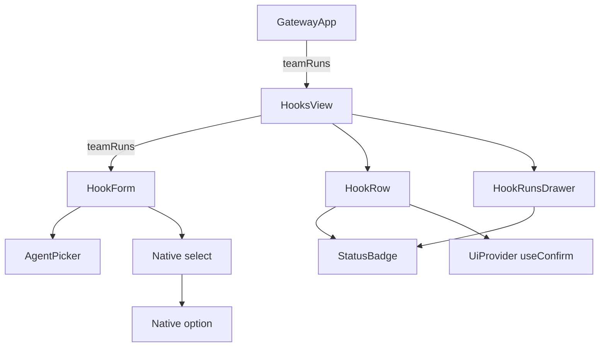
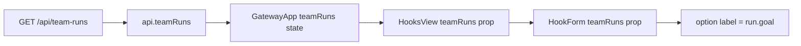
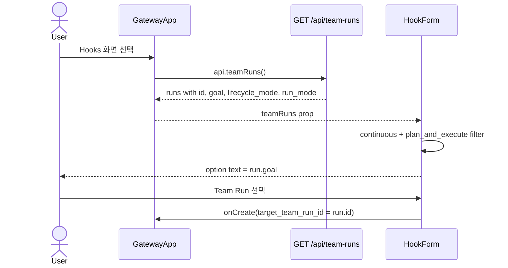

# HooksView Team Run Target Label Analysis

## 요약

- Root: `frontend/src/components/organisms/HooksView/index.jsx`
- Modes: `understand`, `api-state`
- Verdict: Target option은 Team `description`이 아니라 Team Run `goal`을 표시한다.
  현재 list API에는 Team 이름이나 description이 없으므로 UI만으로 더 명확한
  label을 만들 수 없다.

## 범위

| 항목 | 경로 | 비고 |
|---|---|---|
| Root component | `frontend/src/components/organisms/HooksView/index.jsx` | Target Team Run selector |
| Parent container | `frontend/src/components/containers/GatewayApp/index.jsx` | Team Run collection load/주입 |
| API client | `frontend/src/api/client.js` | `/api/team-runs` 응답 전달 |
| API endpoint | `src/personal_agent_gateway/api/team_runs.py` | list endpoint |
| Read model | `src/personal_agent_gateway/teams.py` | enriched Team Run payload |
| Component tests | `frontend/src/components/organisms/HooksView/HooksView.test.jsx` | `run.goal` option 검증 |
| Integration tests | `frontend/src/components/containers/GatewayApp/GatewayApp.test.jsx` | API goal → option label 검증 |

## 컴포넌트 트리

`HookForm`, `HookRow`, `HookRunsDrawer`는 `HooksView` 파일 내부 helper다.
`AgentPicker`, `StatusBadge`, `useConfirm`은 공개 API만 사용하는 shared leaf이고,
`select`/`option`은 native HTML primitive다. 별도 Team picker component나 label
mapper는 없다.

## Props 흐름

`GatewayApp`은 Hooks 화면 진입 시 `api.teamRuns()`를 호출해 응답을 변환 없이
`teamRuns` state에 저장하고 `HooksView`에 전달한다.

## 상태와 효과

| 상태/파생값 | 소유자 | 역할 |
|---|---|---|
| `teamRuns` | `GatewayApp` | `/api/team-runs` list response |
| `continuousRuns` | `HookForm` | continuous + plan-and-execute run만 필터 |
| `targetTeamRunId` | `HookForm` | 사용자가 선택한 run id |
| `selectedTargetTeamRunId` | `HookForm` | 선택값이 유효하지 않으면 첫 continuous run id |
| connection/filter/prompt fields | `HookForm` | Hook 생성 payload용 controlled input |
| `agentConfig`, `targetKind` | `HookForm` | Agent와 Team Run target 분기 |
| `testing`, `testResult` | `HookForm` | connection test 진행 상태와 결과 |
| `showCreateForm` | `HooksView` | `CREATE NEW` disclosure |
| `openHook` | `HooksView` | `openHookRunsId`에서 drawer 대상 파생 |

option의 `value`는 `run.id`, 화면 label은 `run.goal`이다. 사용자가 screenshot에서
본 “들어오는 메일을 확인한 후 분류한다.”는 선택된 Team Run의 goal과 같은 위치에
있는 값이다.

## 외부 primitive와 주입 동작

| primitive/동작 | 이 컴포넌트에서 하는 일 | 사용하는 이유 |
|---|---|---|
| React `useState` | `targetTeamRunId`, form fields, create-form disclosure 관리 | controlled form state |
| React `useEffect` | agent target 기본값 설정 | 비동기로 들어오는 agent list 반영 |
| native `<select>` | continuous Team Run 한 개 선택 | option value를 run id로 제출 |
| `AgentPicker` | Agent target의 backend/model/options 선택 | 기존 session config UI 계약 재사용 |
| `StatusBadge` | Hook enabled/paused와 Hook Run 상태 표시 | 공통 상태 표현 유지 |
| `useConfirm` | Hook 삭제 전 확인 dialog 표시 | destructive action의 공통 확인 경계 |
| `fmtDateTime` | 마지막 poll과 Hook Run 시각 표시 | timestamp 표현 통일 |
| `GatewayApp`의 `teamRuns` prop | 서버 read model 전달 | `HooksView`가 API를 직접 호출하지 않게 함 |
| `onCreate` | `target_team_run_id`를 포함한 Hook 생성 payload 전달 | mutation 소유권을 container에 유지 |
| `onTestConnection` | connection/secret/filter를 검사 | 폼 안에서 비동기 결과를 표시 |
| row/drawer callbacks | pause/resume, run-now, delete, runs, Team Run 이동 | Hook id 기반 action을 container에 위임 |

custom hook, selector, dispatch는 `HooksView`에 없다. provider hook은
`HookRow`의 `useConfirm`뿐이며, API 호출과 collection state 갱신은
`GatewayApp` effect/callback이 담당한다.

## 상호작용 흐름

그 밖의 주요 흐름은 다음과 같다.

1. 사용자가 `CREATE NEW`를 선택하면 `showCreateForm`이 바뀌고 `HookForm`이
   mount/unmount된다.
2. `Test connection`은 `testing`을 켜고 `onTestConnection` 결과를
   `testResult`로 표시한다.
3. submit은 form state를 payload로 정규화해 `onCreate`에 전달하고 민감 입력을
   포함한 local field를 초기화한다.
4. `Runs`는 `onOpenRuns(hook.id)`로 drawer 대상을 열고, drawer의
   `Open Team Run`은 `onOpenTeamRun(target_team_run_id)`를 호출한다.
5. `Pause/Resume`, `Run now`는 Hook id를 callback으로 전달한다. `Delete`는
   `useConfirm` 승인을 받은 뒤에만 `onDelete`를 호출한다.

## API와 상태 추적

1. `GatewayApp`의 Hooks branch가 `api.teamRuns()`를 호출한다.
   `frontend/src/components/containers/GatewayApp/index.jsx:273-276`
2. client는 `/api/team-runs`의 `team_runs` 배열을 mapping 없이 반환한다.
   `frontend/src/api/client.js:312-314`
3. API endpoint는 `page_team_runs_enriched()` 결과를 그대로 반환한다.
   `src/personal_agent_gateway/api/team_runs.py:52-65`
4. enriched payload에는 `goal`, `team_id`, leader/member 정보가 있지만
   `team_name`, Team `description`은 없다.
   `src/personal_agent_gateway/teams.py:450-492`
5. `HookForm`은 option을
   `<option value={run.id}>{run.goal}</option>`으로 렌더한다.
   `frontend/src/components/organisms/HooksView/index.jsx:190-198`

따라서 screenshot 값이 Team description에서 들어올 수 있는 현재 데이터 경로는
없다. Team Run 생성 시 goal에 Team description과 같은 문장을 입력했을 가능성이
있거나, 사용자가 goal을 설명 문장으로 작성한 것이다.

## 권장 후속 작업

1. 현재 동작 설명만 필요하면 수정하지 않는다. 값은 정상적으로 Team Run id를
   제출하며 label만 goal이다.
2. 선택 대상을 더 명확히 하려면 `/api/team-runs` read model에 `team_name`을
   추가하고 option을 `team_name — goal`로 표시한다.
3. `team_name`이 없는 legacy run은 `goal`로 fallback한다.
4. 변경한다면 component test와 API payload test에서 새 label/fallback을 검증한다.

## 스킬 핸드오프

- 실제 label 개선을 요청받으면 `component-pattern`으로 기존 `HookForm` 소유권을
  유지하고 새 picker 추출 없이 최소 변경한다.
- API read model까지 바뀌므로 backend/frontend 통합 테스트를 함께 갱신해야 한다.

## 리뷰

- Verdict: PASS
- Rounds: 1
- Fixed: 첫 초안이 Target selector에만 좁혀져 있던 문제를 확인했다.
  `HooksView` 전체 import와 render body를 다시 대조해 `HookRow`,
  `HookRunsDrawer`, `AgentPicker`, `StatusBadge`, `useConfirm`, 모든 주입
  callback과 주요 상호작용을 컴포넌트 트리·상태·흐름에 보완했다.

## 증거

- `rg -n "Target team run|continuousRuns|teamRuns" frontend/src`
- `rg -n "goal|team_name|description" src/personal_agent_gateway/api/team_runs.py src/personal_agent_gateway/teams.py`
- `frontend/src/components/organisms/HooksView/index.jsx:49-60`
- `frontend/src/components/organisms/HooksView/index.jsx:185-201`
- `frontend/src/components/containers/GatewayApp/index.jsx:244-280`
- `frontend/src/api/client.js:312-314`
- `src/personal_agent_gateway/api/team_runs.py:52-65`
- `src/personal_agent_gateway/teams.py:450-492`
- `frontend/src/components/organisms/HooksView/HooksView.test.jsx:20-22`
- `frontend/src/components/containers/GatewayApp/GatewayApp.test.jsx:1331-1347`
