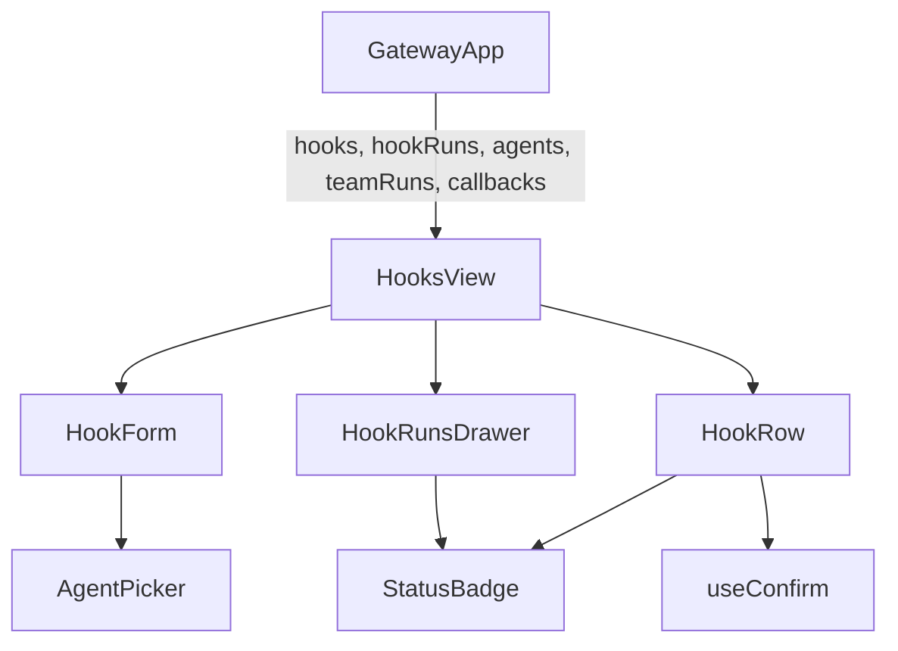
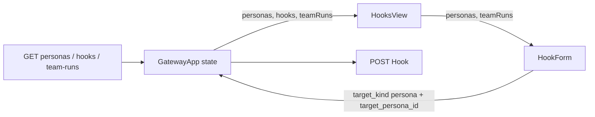
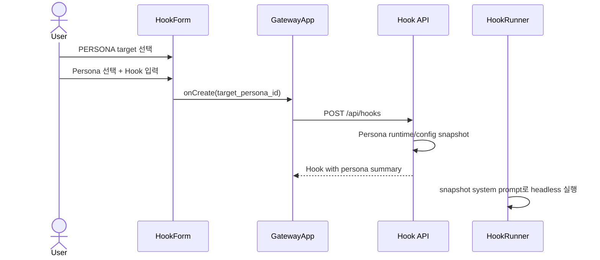

# HooksView Persona Targeting Analysis

## 요약

- Root: `frontend/src/components/organisms/HooksView/index.jsx`
- Modes: `understand`, `api-state`, `test`, `refactor`
- Verdict: Team Run 분기는 유지하고, 현재 `AGENT` 분기를 Persona snapshot 기반
  분기로 대체한다. 기존 저장 Hook의 `agent` target은 legacy read/execute 호환한다.

## 범위

| 항목 | 경로 | 비고 |
|---|---|---|
| Root | `frontend/src/components/organisms/HooksView/index.jsx` | Hook 목록/생성/drawer |
| Parent | `frontend/src/components/containers/GatewayApp/index.jsx` | Hook/Persona collection |
| Hook API | `src/personal_agent_gateway/api/hooks.py` | create/list payload |
| Hook model | `src/personal_agent_gateway/hooks.py` | SQLite 저장과 target 검증 |
| Runner | `src/personal_agent_gateway/hook_runner.py` | headless Agent/Team 실행 분기 |
| Runtime | `src/personal_agent_gateway/runtime_factory.py` | headless runtime 생성 |
| Tests | `frontend/src/components/organisms/HooksView/HooksView.test.jsx` | form/target/run 동작 |

## 컴포넌트 트리

변경 후 `AgentPicker` 자리에 Chat과 공유하는 `PersonaPicker`를 사용한다.
`HookRow`와 `HookRunsDrawer`는 target summary 외의 책임이 바뀌지 않는다.

## Props 흐름

## 상태와 효과

| 상태/효과 | 역할 |
|---|---|
| connection/filter/prompt fields | email Hook payload 구성 |
| `agentConfig` + seed effect | 현재 CLI backend/model/options 기본 선택 |
| `targetKind` | agent와 team_run form 분기 |
| `targetTeamRunId` | continuous plan-and-execute target |
| `testing`, `testResult` | connection test 상태 |
| `showCreateForm` | 생성 폼 disclosure |

Persona 변경 후 `agentConfig`와 seed effect는 제거하고 `targetPersonaId`만 폼에서
소유한다. backend/model/options는 선택 Persona의 서버 snapshot에서 결정한다.

## 외부 primitive와 주입 동작

| primitive/동작 | 이 컴포넌트에서 하는 일 | 사용하는 이유 |
|---|---|---|
| React `useState` | controlled Hook form과 disclosure/test 상태 | local draft 유지 |
| React `useEffect` | 현재 Agent 기본값 seed | async agent collection 반영 |
| `AgentPicker` | backend/model/options 직접 선택 | 현재 legacy agent target payload 생성 |
| native `select` | compatible Team Run 선택 | run id 제출 |
| `useConfirm` | Hook 삭제 확인 | destructive action 공통화 |
| `onCreate` | container를 통해 POST `/api/hooks` | mutation 소유권 유지 |
| `onTestConnection` | secret을 저장하지 않고 IMAP 검사 | 입력 단계 검증 |

custom store selector/dispatch는 없고, 모든 서버 동작은 props callback으로 주입된다.

## 주요 상호작용

## API와 상태 추적

1. 현재 create payload는 `target_kind=agent`일 때 backend/model/options를 직접 저장한다.
2. HookRunner는 이 세 필드로 headless runtime을 만들고 prompt template 결과만
   user message로 전달한다.
3. Persona의 role/responsibilities/constraints와 연결되는 필드는 없다.
4. Hook에 `target_persona_id`와 snapshot을 추가하고, 생성 시 Persona의 runtime
   defaults를 기존 target fields에 복사하면 실행 구조를 크게 바꾸지 않고 Persona
   identity와 지침을 함께 고정할 수 있다.
5. Team Run target은 별도 snapshot/runtime을 이미 소유하므로 변경 대상이 아니다.

## 테스트

현재 테스트는 Agent Hook 생성 payload, Team Run 필터/생성, connection test, runs
drawer와 actions를 검증한다. 추가·변경할 RED 사례는 다음과 같다.

1. AGENT 버튼 대신 PERSONA 버튼과 Persona selector가 보인다.
2. Persona 없이 Persona Hook을 제출할 수 없다.
3. POST payload에 `target_kind=persona`, `target_persona_id`가 포함되고 runtime
   fields를 클라이언트가 직접 결정하지 않는다.
4. API가 없는 Persona를 거부하고 snapshot/runtime defaults를 저장한다.
5. HookRunner가 Persona system prompt를 headless runtime에 전달한다.
6. 기존 `target_kind=agent` Hook은 목록과 실행이 유지된다.

## 리팩터링 판단

### 책임과 소유권

- `유지`: connection/filter/target/prompt draft는 `HookForm` 소유가 적절하다.
- `shared 승격`: Persona selector는 Chat과 Hook 두 소비자가 같은 계약을 사용한다.
  노력 작음, 위험 낮음.
- `pure helper 추출`: Persona system prompt는 frontend helper가 아니라 backend의
  순수 helper로 두어 Chat과 Hook 실행이 같은 형식을 사용해야 한다. 노력 작음,
  위험 낮음.
- 광범위한 form 분해나 Hook target abstraction은 요청 범위를 넘어가므로 하지 않는다.

### 코드 수준 검사

- 반복 JSX: connection/filter field 반복은 각 validation과 payload 의미가 달라 유지한다.
- pure derivation: `targetSummary`는 Persona name fallback을 추가할 위치로 적합하다.
- render body: CONNECTION/FILTER/TARGET 구역이 명확해 추가 분해는 보류한다.

## 권장 후속 작업

1. `PersonaPicker`를 공유하고 Hook form의 Agent branch를 교체한다.
2. Hook schema/API에 Persona id/snapshot을 추가한다.
3. 생성 시 Persona runtime defaults를 server-side snapshot한다.
4. HookRunner가 같은 Persona system prompt를 사용하도록 한다.
5. legacy `agent` Hook은 read/execute compatibility를 유지한다.

## 스킬 핸드오프

- `component-pattern`: 실제 두 소비자가 공유하는 작은 selector만 추출한다.
- `vercel-react-best-practices`: 첫 Persona id는 render에서 단순 파생하고 sync effect를
  추가하지 않는다.

## 리뷰

- Verdict: PASS
- Rounds: 1
- Fixed: 독립 재검사에서 Hook 목록이 Persona를 다시 조회하지 않아도 안정적으로
  이름을 표시해야 함을 확인했다. `target_persona_snapshot`의 name fallback을 API
  read model에 포함하도록 권장안을 보완했다.

## 증거

- `frontend/src/components/organisms/HooksView/index.jsx`
- `frontend/src/components/organisms/HooksView/HooksView.test.jsx`
- `frontend/src/components/containers/GatewayApp/index.jsx:906`
- `src/personal_agent_gateway/api/hooks.py`
- `src/personal_agent_gateway/hooks.py`
- `src/personal_agent_gateway/hook_runner.py:82-118`
- `src/personal_agent_gateway/runtime_factory.py:27-68`
- `tests/test_api_hooks.py`
- `tests/test_hook_runner.py`
