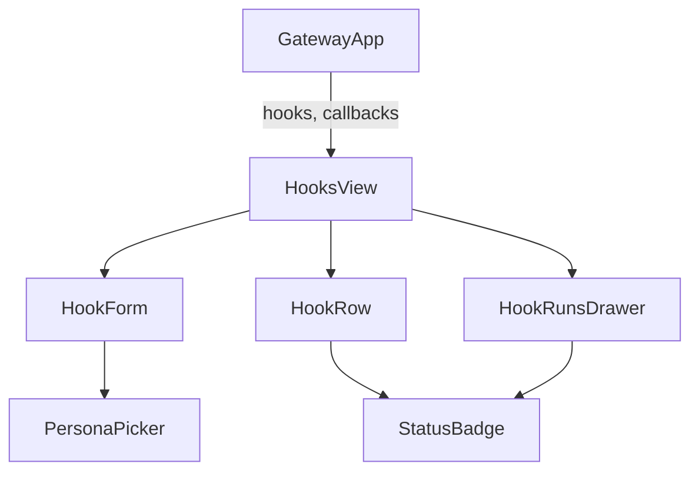
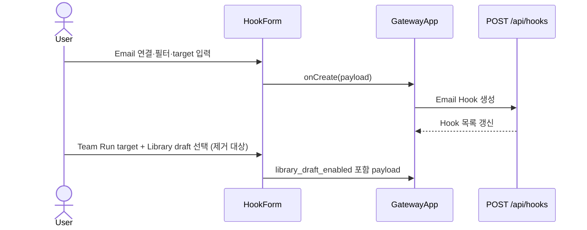

# HooksView Library Draft 제거 분석

## 요약

- Root: `frontend/src/components/organisms/HooksView/index.jsx`
- Modes: `understand`, `refactor`, `test`, `remove`
- Verdict: Email Hook의 Library draft 제어는 `HookForm`과 목록 summary에만 표시되지만,
  같은 속성이 API·서비스·runner에도 전파된다. UI 제거와 함께 backend 실행 분기를
  제거해야 legacy Hook도 draft를 만들지 않는다.

## 범위

| 항목 | 경로 | 비고 |
| --- | --- | --- |
| Root | `frontend/src/components/organisms/HooksView/index.jsx` | Email Hook 목록과 생성 form |
| Parent | `frontend/src/components/containers/GatewayApp/index.jsx` | collections와 mutation callback 주입 |
| Test | `frontend/src/components/organisms/HooksView/HooksView.test.jsx` | 생성 payload·Team Run target 검증 |
| API | `src/personal_agent_gateway/api/hooks.py` | create payload와 read model |
| Runtime | `src/personal_agent_gateway/hook_runner.py` | Team Run 완료 시 Library draft 저장 |

## 컴포넌트 트리

## Props와 상태

`GatewayApp`은 `hooks`, `hookRuns`, `personas`, `teamRuns`와 `onCreate` 등 API mutation
callback을 `HooksView`에 전달한다. `HooksView`는 생성 form disclosure와 선택된 run drawer만
소유한다. `HookForm`은 connection, filter, target, prompt와 connection-test 상태를 local
state로 보유하며, `onCreate(payload)`로 새 Email Hook payload를 부모에 넘긴다.

`useState`는 controlled form과 request 상태에만 쓰이고, custom store·router·data-fetching
hook은 없다. `PersonaPicker`는 Persona target을 고르는 shared leaf component이고,
`useConfirm`은 삭제 action의 공통 확인 dialog를 제공한다. `StatusBadge`와 `fmtDateTime`은
목록·run drawer의 표시 전용이다.

## 상호작용 흐름

## 제거 판단

| 판단 | 근거 | 위험/후속 조치 |
| --- | --- | --- |
| 유지 | Email connection, filter, Persona/Team target, run drawer는 Library와 독립적이다. | 낮음 — 변경하지 않는다. |
| 제거 후보 | `libraryDraftEnabled` state, checkbox, `targetSummary()`의 `library:draft`, create payload field은 Email Hook에서만 Library draft를 활성화한다. | 낮음 — UI와 test payload에서 함께 제거한다. |
| 리팩터링 계획 필요 | `library_draft_enabled`가 API·서비스·runner까지 전파되고 runner가 실제 Archive draft를 저장한다. | 중간 — API 입력 차단과 runner 분기를 같은 변경으로 제거한다. |

### 코드 수준 검사

- 반복 제거(DRY): 같은 모양의 field JSX는 connection/filter/prompt처럼 서로 다른 validation과
  payload 의미를 가지므로 이번 제거에서 추출하지 않는다.
- pure helper 추출: `targetSummary()`는 기존 목록 label helper로 충분하다. Library suffix만
  제거하면 되며 새 helper는 필요 없다.
- 프레젠테이션 분해: `HookForm`은 길지만 target branch와 connection-test 흐름이 한 form
  ownership에 속한다. 이번에는 extraction 없이 Library checkbox만 제거한다.

## 테스트

기존 `HooksView.test.jsx`는 Persona와 Team Run create payload에
`library_draft_enabled`를 기대한다. 이 expectation을 제거하고 checkbox가 렌더되지 않으며
payload에 키가 없음을 검증해야 한다. Backend에는 Library 값을 보낸 create request가 422가
되는 test와 legacy true Hook이 Archive draft를 만들지 않는 runner regression test가 필요하다.

## 권장 후속 작업

1. UI, `POST /api/hooks`, `HookService.create_hook()`에서 새 Library draft option을 제거한다.
2. `HookRunner`의 Library contract와 draft 저장 분기를 제거한다.
3. Knowledge Request의 문서화 Team → private draft 흐름은 유지하는 focused tests를 실행한다.

## 스킬 핸드오프

- `superpowers:test-driven-development`: API 거부와 legacy Hook 무효화의 RED/GREEN 회귀를
  먼저 만든다.
- `vercel-react-best-practices`: 이 변경은 state 제거와 payload 축소만 수행하므로 별도
  render optimization은 필요 없다.

## 리뷰

- Verdict: PASS
- Rounds: 1
- Fixed: 독립 재검사에서 `hook_runner.py`가 완료 처리뿐 아니라 Team Run instruction·cycle
  preparation에도 `library_draft_enabled`를 전달함을 확인해, 권장 작업에 runner 전체 분기
  제거를 반영했다.

## 증거

- `frontend/src/components/organisms/HooksView/index.jsx`
- `frontend/src/components/organisms/HooksView/HooksView.test.jsx`
- `frontend/src/components/containers/GatewayApp/index.jsx`
- `src/personal_agent_gateway/api/hooks.py`
- `src/personal_agent_gateway/hooks.py`
- `src/personal_agent_gateway/hook_runner.py`
- `tests/test_api_hooks.py`
- `tests/test_hook_runner.py`
