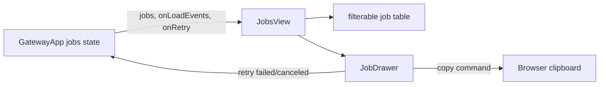

# JobsView Retry and Lineage Analysis

## 요약

- Root: `frontend/src/components/organisms/JobsView/index.jsx` (151 lines)
- Modes: `understand`, `api-state`, `test`
- Verdict: component ownership은 적절하다. `onRetry` callback과 lineage 표시만 추가하고 상태/endpoint orchestration은 `GatewayApp`에 유지한다.

## 구조와 흐름

- Props: `jobs`, `onLoadEvents`; R1-D에서 `onRetry`가 추가된다.
- Local state: status/source filter, selected job id, loaded events.
- Side effects: row 선택 시 event loader Promise를 실행한다. effect/store/router는 없다.
- API dependency: 직접 fetch하지 않고 callbacks에 의존한다.
- Tests: filter와 drawer/event load 2개. Retry visibility/callback과 lineage 표시가 RED case다.
- Story: 없음.

## 리팩터링 판단

- 유지: filter와 drawer selection은 화면 전용 state라 현재 위치가 맞다.
- 최소 변경: `job.retryable`이 true일 때만 Retry를 노출하고 `source_job_id`를 메타에 표시한다.
- 위험: retry 중복 클릭과 stale event completion. 이번 R1-D에서는 retry button을 action 동안 disable하고, 기존 event loader 구조는 바꾸지 않는다.
- 보류: generic drawer/hook 추출은 단일 사용처라 필요하지 않다.

## 검증

- `JobsView.test.jsx`: failed/canceled only retry, callback id, lineage text.
- `GatewayApp.test.jsx`: retry 후 Job 목록 refresh와 새 Job detail 이동.

## 리뷰

- Verdict: PASS
- Rounds: 1
- 근거: 단일 production usage, 4 local states, 2 existing tests, direct network call 없음 확인.
