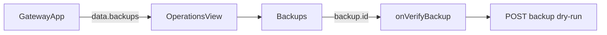

# OperationsView Backup Recoverability Analysis

## 요약

- Root: `frontend/src/components/organisms/OperationsView/index.jsx`
- Modes: `api-state`, `test`
- Verdict: `Backups`는 전달받은 payload를 표시하는 presentational 경계다. 새 상태나 fetch
  없이 `profile`과 recoverability warning을 각 row에 표시한다.

## 범위

| Item | Path | Notes |
| --- | --- | --- |
| Root | `frontend/src/components/organisms/OperationsView/index.jsx` | Backup row와 action rendering |
| Parent | `frontend/src/components/containers/GatewayApp/index.jsx` | Operations payload와 callbacks 제공 |
| API | `frontend/src/api/client.js` | create/dry-run 응답 mapping |
| Tests | `frontend/src/components/organisms/OperationsView/OperationsView.test.jsx` | 표시와 action 회귀 |

## API / 상태 흐름

- `OperationsView`의 local state는 action 중복 방지용 `busyKey` 하나이며 backup payload를
  복제하지 않는다.
- `Backups`는 `created_at`, `schema_version`, `database_size_bytes`만 표시한다.
- `GatewayApp`은 create/verify 후 `loadOperations()`를 호출하므로 새 payload 필드는 기존
  refresh 경로로 전달된다.
- 따라서 recoverability 정보는 backend payload에 추가하고 그대로 렌더링하면 된다.

## 테스트 / 스토리

- 기존 테스트는 backup create/verify callback 전달을 검증한다.
- 추가 RED case는 `profile=database-only` 표시와 excluded/metadata-only 저장소 warning
  표시다.
- 별도 story 파일은 없다.

## 권장 후속 작업

- `Backups` row metadata에 profile을 명시한다.
- `recoverability`에서 `included`가 아닌 저장소 이름을 사람이 읽을 수 있는 warning으로
  표시한다.
- 새 local state, effect, cache library를 추가하지 않는다.

## 스킬 핸드오프

- `vercel-react-best-practices`: 파생 warning은 render 중 단순 계산하며 effect/state로
  복제하지 않는다.

## 리뷰

- Verdict: `PASS`
- Rounds: 1
- Fixed: self-review에서 parent callback, API method, 기존 test와 `busyKey` ownership을
  다시 확인했다. blocker 없음.

## 근거

- `frontend/src/components/organisms/OperationsView/index.jsx:106-145,147-247`
- `frontend/src/components/organisms/OperationsView/OperationsView.test.jsx:40-94`
- `frontend/src/components/containers/GatewayApp/index.jsx:532-545,853-862`
- `frontend/src/api/client.js:238-247`
- Search: `rg -n "OperationsView|backups|onVerifyBackup|createBackup|verifyBackup" frontend/src`
