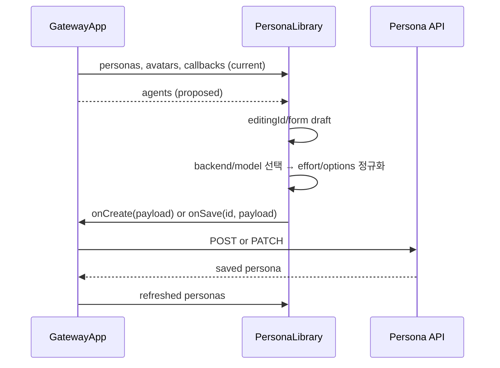

# PersonaLibrary Local CLI Capability Component Analysis

## 요약

- Root: `frontend/src/components/organisms/PersonaLibrary/index.jsx`
- Modes: `api-state`, `test`
- Verdict: Persona의 `default_backend`와 `default_model`이 현재 free-text라 탐지된 catalog를 활용하지 않는다. `GatewayApp`이 이미 로드한 `agents`를 prop으로 전달하고 두 필드를 select로 바꾸는 것이 기존 API 소유권을 유지하는 최소 변경이다.

## 범위

| Item | Path | Notes |
|---|---|---|
| Root | `frontend/src/components/organisms/PersonaLibrary/index.jsx` | persona form과 local draft state |
| Local child | `frontend/src/components/organisms/AvatarPicker/index.jsx` | avatar modal의 선택 leaf |
| Owner | `frontend/src/components/containers/GatewayApp/index.jsx` | personas/agents 로드, create/update/delete API와 toast |
| API client | `frontend/src/api/client.js` | persona CRUD와 agents catalog |
| Backend | `src/personal_agent_gateway/api/personas.py` | backend/model/options 저장 및 catalog 검증 |
| Tests | `frontend/src/components/organisms/PersonaLibrary/PersonaLibrary.test.jsx` | 선택, 생성, 수정, 삭제, avatar 검증 |

## API / 상태 흐름

- local state는 `editingId`, `form`, avatar modal/draft다. 선택 persona가 바뀌면 `formFromPersona`로 draft를 재구성한다.
- submit 시 문자열 trim과 responsibilities/constraints 줄 분리를 수행하고 부모의 `onCreate` 또는 `onSave`에 전달한다. API 호출은 없다.
- backend/model은 현재 일반 input이며 validation 없이 문자열로 저장된다. `agents` prop을 추가하면 선택된 backend descriptor의 `model_options`, `default_model`, `options_schema`, `defaults`를 사용할 수 있다.
- backend를 바꿀 때 기존 provider model을 유지하면 잘못된 조합이 생기므로 새 backend의 `default_model`로 즉시 교체해야 한다.
- 모델마다 허용 effort가 다르므로 model 전환 시 현재 effort가 새 모델에서 지원되지 않으면 model의 `default_effort`, agent default, 첫 허용값 순서로 정규화해야 한다.
- Persona가 Team Run 실행 설정의 원본이므로 `default_options`를 저장하고 snapshot에 포함해야 한다. 그렇지 않으면 UI에서 선택한 effort/permission/sandbox가 팀 모델 생성기로 전달되지 않는다.
- 기존 persona에 catalog에 없는 legacy model이 있으면 편집 화면에서 값을 잃지 않도록 해당 값을 임시 option으로 보존해야 한다.

## 테스트

기존 coverage:

- 첫 persona 자동 선택과 row 전환
- 새 persona 및 빈 library의 첫 persona 생성
- 기존 persona 저장
- 삭제 confirm/cancel
- avatar modal 선택

추가 RED cases:

- backend select에 available agent만 노출하고 backend 전환 시 model default가 바뀌는지
- model select가 선택 backend의 탐지 결과를 사용하는지
- 모델 전환 시 지원하지 않는 effort가 새 모델 기본값으로 바뀌는지
- select형 option(permission mode, sandbox, approval policy, local profile/agent)이 payload의 `default_options`에 포함되는지
- legacy/현재 저장 model이 catalog에 없어도 표시·저장 가능한지
- create/update payload에 선택한 backend/model이 정확히 포함되는지
- agents가 비어 있거나 탐지 실패해도 `codex/default` fallback이 유지되는지

## 권장 후속 작업

1. `PersonaLibrary({ agents })` prop을 추가하고 `GatewayApp`의 기존 agents state를 전달한다.
2. backend/model과 select형 options를 native select로 교체해 접근성과 구현 범위를 단순하게 유지한다.
3. unavailable agent는 새 선택에서는 제외하되, 기존 persona가 해당 backend를 사용하면 현재 값을 표시한다.
4. capability API를 PersonaLibrary에서 다시 호출하지 않는다. 이미 bootstrap된 agents state를 재사용한다.

## 스킬 핸드오프

- React 구현 시 `vercel-react-best-practices`: 별도 effect/fetch 없이 props와 render-time derivation으로 catalog를 재사용한다.
- backend persona schema에는 `default_options` JSON 필드를 추가하되 기존 row는 `{}`로 migration한다. 실행 시 persona snapshot에 포함해 모델 클라이언트 옵션으로 전달한다.

## 리뷰

- Verdict: PASS
- Rounds: 3
- Fixed: 1차 검토에서 Mermaid의 proposed/current 배선을 분리했다. 구현 범위가 team execution options까지 확장된 뒤 3차 fresh re-read에서 `default_options` 저장, snapshot, model별 effort 정규화와 테스트 책임을 추가하고 코드 경계와 재대조해 PASS했다.

## 근거

- `rg -n "PersonaLibrary|handleCreatePersona|handleUpdatePersona|default_backend|default_model" frontend/src src/personal_agent_gateway tests`
- `frontend/src/components/organisms/PersonaLibrary/index.jsx`
- `frontend/src/components/organisms/PersonaLibrary/PersonaLibrary.test.jsx`
- `frontend/src/components/containers/GatewayApp/index.jsx`
- `frontend/src/api/client.js`
- `src/personal_agent_gateway/api/personas.py`
