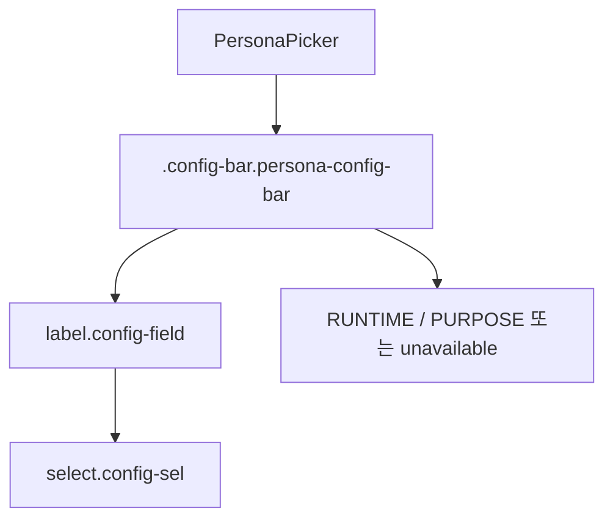

# PersonaPicker Fixed Width Analysis

## 요약

- Root: `frontend/src/components/organisms/PersonaPicker/index.jsx`
- Modes: `style`
- Verdict: Persona 전용 selector에 고정 폭을 부여하되 작은 화면에서는 가용 폭에 맞춰 축소하는 것이 적절하다.

## 범위

| Item | Path | Notes |
|---|---|---|
| Root component | `frontend/src/components/organisms/PersonaPicker/index.jsx` | Persona native `select`와 선택 요약 렌더링 |
| Shared styles | `src/personal_agent_gateway/static/styles.css` | `.config-bar`, `.config-field`, `.config-sel` 소유 |
| Chat usage | `frontend/src/components/organisms/ChatView/index.jsx` | 잠기지 않은 Chat 설정 바 |
| Hook usage | `frontend/src/components/organisms/HooksView/index.jsx` | Hook 생성 폼의 Persona 대상 |
| Existing test | `frontend/src/components/organisms/PersonaPicker/PersonaPicker.test.jsx` | 옵션과 `onChange` 동작 검증 |

## 컴포넌트 트리

## 스타일 / 레이아웃

- `PersonaPicker`의 `select`에는 공용 `.config-sel`만 적용되어 있고 폭 관련 선언이 없다. 따라서 브라우저가 옵션 문자열을 포함한 intrinsic size를 기준으로 폭을 결정하며, Persona 목록과 사용 문맥에 따라 Chat과 Hook의 selector 폭이 달라질 수 있다.
- 공용 `.config-sel`은 `AgentPicker` 등 다른 설정 UI도 사용하므로 여기에 폭을 지정하면 요청 범위를 넘어선다.
- 이미 root에 `.persona-config-bar`가 있으므로 전용 `.persona-config-select`와 root 하위 field 규칙으로 범위를 제한하면 다른 설정 selector에 영향을 주지 않는다.
- 데스크톱 기준 selector `264px`과 label을 포함한 field `317px`은 선택 전후 폭을 고정한다. field가 더 좁은 컨테이너에 놓이면 `max-width: 100%`와 selector의 `flex: 1`이 가용 폭에 맞춰 축소한다.

## 권장 후속 작업

1. Persona selector에 `.persona-config-select`를 추가하고 `264px` 폭을 지정한다.
2. Persona field를 `317px`, `max-width: 100%`로 제한하고 selector가 좁은 컨테이너에서는 축소되게 한다.
3. 기존 `PersonaPicker` 테스트에 전용 스타일 클래스 적용 여부를 추가하고 프론트 테스트와 빌드를 실행한다.

## 스킬 핸드오프

- 추가 스킬은 필요하지 않다. 스타일은 vanilla-extract가 아닌 단일 정적 CSS 파일에 있고, 변경은 기존 컴포넌트 소유 클래스 안에서 해결된다.

## 리뷰

- Verdict: PASS
- Rounds: 1
- Fixed: 없음. root scope, 두 usage site, 공용 selector의 폭 미지정, global `box-sizing`을 원본 코드에서 다시 대조했다.

## 근거

- `frontend/src/components/organisms/PersonaPicker/index.jsx:5-21`
- `frontend/src/components/organisms/ChatView/index.jsx:184-188`
- `frontend/src/components/organisms/HooksView/index.jsx:179-183`
- `frontend/src/components/organisms/PersonaPicker/PersonaPicker.test.jsx:15-28`
- `src/personal_agent_gateway/static/styles.css:1384-1422`
- 검색: `rg -n "PersonaPicker|config-field|config-sel|persona-config-bar" frontend/src src/personal_agent_gateway/static/styles.css`
