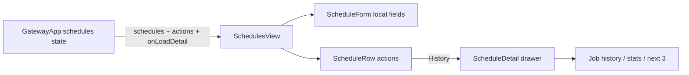

# SchedulesView History and Preview Analysis

## 요약

- Root: `frontend/src/components/organisms/SchedulesView/index.jsx` (205 lines)
- Modes: `understand`, `api-state`, `test`
- Verdict: form/list ownership은 적절하다. Schedule detail drawer와 `onLoadDetail`만 추가하고 Job/Schedule source of truth와 mutation refresh는 parent가 유지한다.

## 구조와 흐름

- Props: schedules, automation readiness, create/pause/resume/delete/run-now callbacks; R1-D에서 `onLoadDetail`을 추가한다.
- Local state: form fields만 존재한다. detail 선택/loading은 SchedulesView에 화면 전용 state로 둔다.
- Side effects: 직접 effect/fetch 없이 callback 결과를 사용한다.
- API dependency: 직접 fetch하지 않는다.
- Tests: list/form/health gating 3개. history stats/last failure/next-three가 RED case다.
- Story: 없음.

## 리팩터링 판단

- 유지: ScheduleForm과 ScheduleRow는 책임이 좁고 재사용 추상화가 불필요하다.
- 내부 분리: detail JSX는 별도 `ScheduleDrawer` local component로 두어 list row를 키우지 않는다.
- 비동기 규칙: detail 한 건만 요청하며 drawer를 다시 열 때 source of truth를 재조회한다. 전역 cache는 추가하지 않는다.
- 위험: Run now가 만든 Job으로 이동하는 동작은 parent navigation 책임이며 drawer가 job state를 복제하면 안 된다.

## 검증

- `SchedulesView.test.jsx`: history drawer, stats, failure, next-three, timezone.
- `GatewayApp.test.jsx`: Run now 후 jobs refresh와 생성 Job detail 이동.

## 리뷰

- Verdict: PASS
- Rounds: 1
- 근거: 단일 production usage, form-only local state, 3 existing tests, direct network call 없음 확인.
