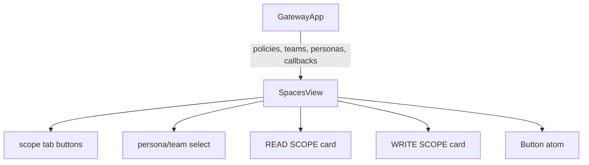
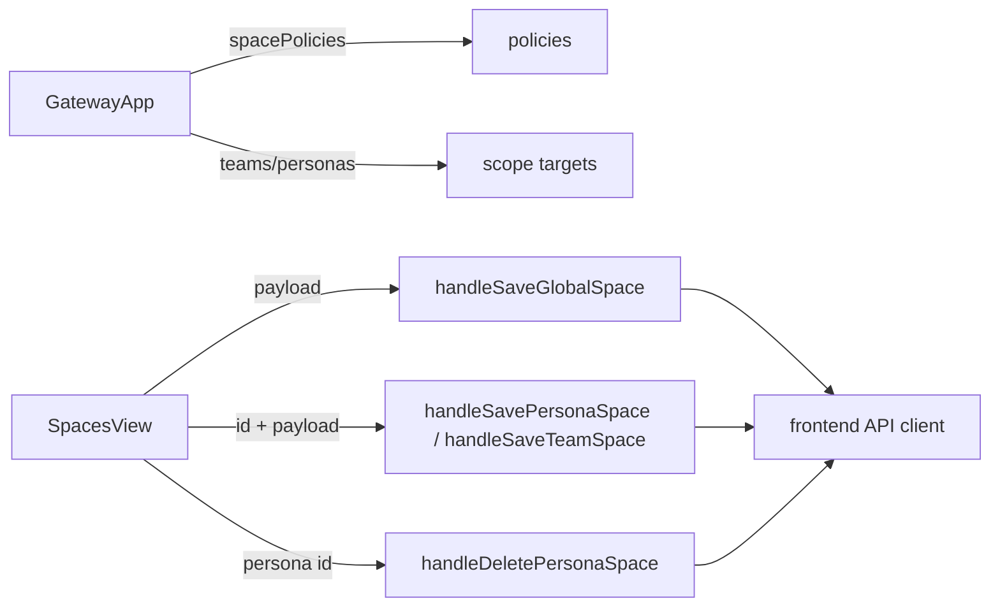
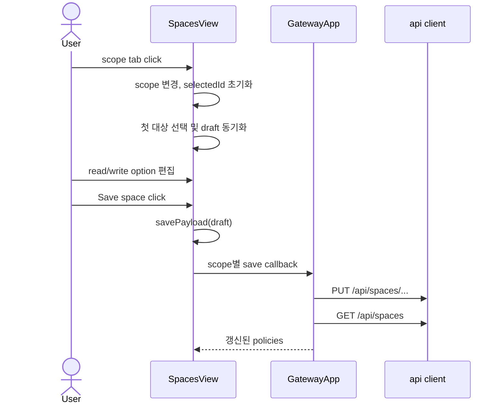

# SpacesView Component Analysis

## 요약

- Root: `frontend/src/components/organisms/SpacesView/index.jsx`
- Modes: `understand`, `refactor`
- Verdict: 현재 feature-owned organism 경계는 유지한다. 이번 변경은 `read_mode="none"` 선택지와 payload 정규화에 한정한다.

## 범위

| 항목 | 경로 | 비고 |
|---|---|---|
| Root | `frontend/src/components/organisms/SpacesView/index.jsx` | SPACE scope 선택, draft 편집, 저장 UI |
| Local child | `frontend/src/components/atoms/Button/index.jsx` | 저장·상속 동작 버튼 |
| Parent | `frontend/src/components/containers/GatewayApp/index.jsx` | 정책/대상 목록과 API callback 주입 |
| API | `frontend/src/api/client.js` | global/persona/team SPACE 조회·변경 |
| Test | `frontend/src/components/organisms/SpacesView/SpacesView.test.jsx` | 저장, 상속, team worktree 노출 검증 |

## 컴포넌트 트리

## Props 흐름

`GatewayApp`가 `/api/spaces` 결과와 네 개의 mutation callback을 소유하고
`SpacesView`는 draft를 API payload로 정규화한다. 저장 후 정책 재조회와 toast/error 처리는
parent가 담당한다.

## 상태와 효과

| 항목 | 이 컴포넌트에서의 역할 |
|---|---|
| `scope` | global/persona/team 편집 화면을 선택한다. |
| `selectedId` | persona/team 대상 id를 보관한다. scope 전환 시 초기화된다. |
| `draft` | 현재 편집 중인 read/write 정책을 보관한다. |
| `saving` | 비동기 저장·상속 중 action 버튼을 비활성화한다. |
| `selectedPolicy` (`useMemo`) | 현재 scope/id에 해당하는 저장 정책을 찾는다. |
| 첫 번째 `useEffect` | persona/team 진입 시 첫 대상을 기본 선택한다. |
| 두 번째 `useEffect` | 선택 정책 또는 global fallback을 editable draft로 변환한다. |

커스텀 hook, store selector, dispatch action은 없다. 외부 동작은 모두 `GatewayApp`에서
props로 주입된 callback이다.

## 외부 의존성

- React `useState`는 편집 상태와 저장 상태를 로컬에 둔다.
- React `useMemo`는 scope/id별 정책 선택을 명시한다.
- React `useEffect` 두 개는 대상 기본 선택과 서버 정책에서 draft로의 동기화를 담당한다.
- `Button` atom은 class 조합과 native button props 전달만 제공하며, 저장 의미나 API를 알지 못한다.

## 주요 상호작용

Persona의 “Use global space”는 `onDeletePersona(selectedId)`를 호출하고, parent가 삭제 후
정책을 재조회한다. `personaInherited` 상태에서는 “Create persona space”가 global 정책을
초기 draft로 사용해 persona override를 만든다.

## 리팩터링 판단

- `유지` (낮은 위험): SPACE 정책 편집은 이 organism의 단일 feature 책임이고 사용처도
  `GatewayApp` 한 곳이다. 이번 계약 변경에 shared 승격이나 hook 추출은 필요하지 않다.
- `pure helper 추출` 불필요: `editablePolicy`와 `savePayload`가 이미 render 밖의 순수
  helper로 분리되어 있다.
- `반복 제거(DRY)` 보류: READ/WRITE card가 외형은 유사하지만 option, path 표시 조건,
  설명이 달라 descriptor 추상화가 이번 한 줄짜리 모드 추가보다 복잡하다.
- `프레젠테이션 분해` 보류 (중간 노력/낮은 현재 이익): render가 길지만 scope selector,
  read/write card, actions의 상태 결합이 작고 현재 테스트가 사용자 흐름을 직접 검증한다.

안전한 다음 단계는 구조를 유지하면서 `none`을 `EMPTY_POLICY`, `editablePolicy`,
`savePayload`, READ option 및 path 표시 조건에 일관되게 반영하고 회귀 테스트를 추가하는 것이다.

## 권장 후속 작업

1. `read_mode="none"`에서 `read_path=null`을 전송하고 path input을 숨기는 테스트를 먼저 추가한다.
2. global/persona/team의 새 isolated draft가 `none`에서 시작하는지 백엔드 기본값과 함께 검증한다.
3. 이번 변경에서는 card 추상화나 상태 hook 추출을 하지 않는다.

## 스킬 핸드오프

- 실행 계약 구현은 승인된 `superpowers:executing-plans` 계획으로 계속한다.
- 별도의 구조 리팩터링 계획은 필요하지 않다.

## 리뷰

- Verdict: PASS
- Rounds: 1
- Fixed: 없음. 독립 재검토에서 props 7개, state/effect, `GatewayApp` 사용처, API method,
  기존 테스트 3개를 원본 코드에서 다시 대조했다.

## 근거

- `rg -n "SpacesView|read_mode|write_mode" frontend/src`
- `frontend/src/components/organisms/SpacesView/index.jsx`
- `frontend/src/components/organisms/SpacesView/SpacesView.test.jsx`
- `frontend/src/components/containers/GatewayApp/index.jsx:947`
- `frontend/src/api/client.js:379`
