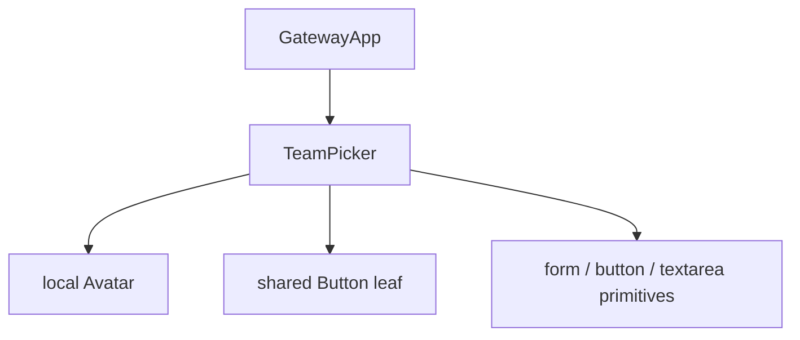
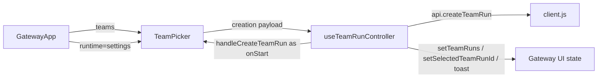
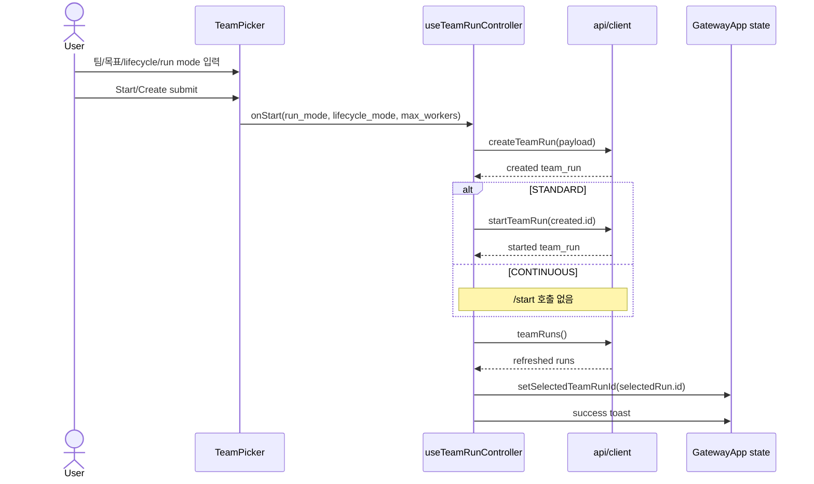
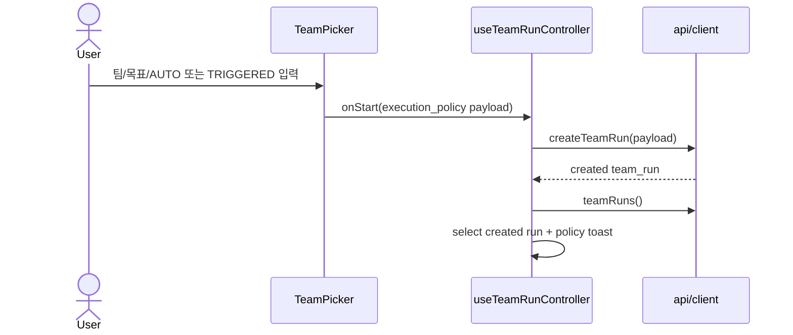

# TeamPicker Component Analysis

## 요약

- Root: `frontend/src/components/organisms/TeamPicker/index.jsx`
- Modes: `understand`, `api-state`, `test`
- Verdict: TeamPicker는 생성 입력과 payload 조립만 소유하고, API 호출·선택 상태·알림은 `useTeamRunController`가 소유한다. Task 7은 이 경계를 유지한 채 legacy run/lifecycle 선택을 execution policy 입력으로 교체하면 된다.

## 범위

| 항목 | 경로 | 비고 |
|---|---|---|
| Root | `frontend/src/components/organisms/TeamPicker/index.jsx` | 생성 form, 로컬 상태, `onStart` payload |
| Test | `frontend/src/components/organisms/TeamPicker/TeamPicker.test.jsx` | roster, legacy mode payload, empty state |
| Parent | `frontend/src/components/containers/GatewayApp/index.jsx` | teams/runtime 전달, `handleCreateTeamRun` 주입 |
| Controller | `frontend/src/hooks/useTeamRunController.js` | 생성 API, 목록 갱신, 선택, toast |
| API mapper | `frontend/src/api/client.js` | Team Run create/start/detail HTTP 경계 |
| API tests | `frontend/src/api/client.test.js` | endpoint와 detail mapper 계약 |
| Integration tests | `frontend/src/components/containers/GatewayApp/GatewayApp.test.jsx` | STANDARD create/start, CONTINUOUS create-only, create failure 흐름 |
| Backend API | `src/personal_agent_gateway/api/team_runs.py` | Task 6 policy validation과 네 cycle action route |
| Backend API tests | `tests/test_api_team_runs.py` | 생성 validation, manual snapshot, AUTO action/read model, legacy/wrong-policy 차단 |
| Cycle service tests | `tests/test_team_cycles.py` | source idempotency, FIFO, concurrent enqueue/claim |
| Implementation plan | `docs/superpowers/plans/2026-07-20-continuous-team-run-cycle-policies.md` | Task 7 payload/client/controller 계약 |

## 컴포넌트 트리

`Avatar`는 같은 파일의 로컬 표현 helper이며 avatar asset 또는 이름 이니셜을 렌더링한다. `Button`은 submit action에만 쓰는 공유 atom이므로 내부 구현은 분석 경계 밖이다.

## Props 흐름

| prop | 출처 | 현재 역할 | Task 7 영향 |
|---|---|---|---|
| `teams` | `GatewayApp`의 bootstrap state | 선택 가능한 팀과 roster 표시 | 유지 |
| `onStart` | `useTeamRunController.handleCreateTeamRun` | submit payload를 HTTP 흐름으로 전달 | AUTO/TRIGGERED payload로 변경 |
| `runtime` | `GatewayApp.settings` | review mode와 execution mode 표시 제어 | fixed continuous form에서는 제거 가능성이 있으나 Task 7 명세 범위에서는 호출부 호환을 우선 확인 |

## 상태 / Effects

| 상태/Effect | 읽기/변경 | 역할 |
|---|---|---|
| `teamId` | team 버튼, `teams` effect | 첫 팀을 기본 선택하고 사용자의 팀 변경을 보존 |
| `goal` | textarea | trim한 목표를 submit payload에 포함 |
| `runMode` | run mode 버튼 | legacy 생성 정책; Task 7에서 제거 대상 |
| `lifecycleMode` | lifecycle 버튼 | legacy standard/continuous 선택; Task 7에서 fixed continuous 표시로 대체 |
| `useEffect([teams, teamId])` | `setTeamId` | teams가 생겼을 때 첫 팀을 선택 |
| `executionPolicy` | 신규 예정 | `triggered` 기본값, AUTO/TRIGGERED 선택 |
| `repeatCount`, `intervalMinutes` | 신규 예정 | AUTO에서만 숫자로 변환해 payload에 포함 |

TeamPicker 자체에는 API hook, store selector, context, memo, 비동기 effect가 없다. 서버 상태는 모두 상위 controller가 소유한다.

## 외부 primitive와 주입 동작

| primitive/동작 | 이 컴포넌트에서 하는 일 | 사용하는 이유 |
|---|---|---|
| React `useState` | form의 선택/입력 값을 제어 | submit 전 로컬 초안이므로 상위 서버 상태와 분리 |
| React `useEffect` | 비어 있는 `teamId`를 첫 team으로 초기화 | teams가 bootstrap 뒤 비동기 전달되어도 유효 선택을 확보 |
| shared `Button` | form submit을 발생 | 앱 공통 버튼 variant/size 계약 유지 |
| native `form` + `onSubmit` | Enter/click을 동일 payload 조립 경로로 통합 | 접근 가능한 form 동작과 중복 handler 방지 |
| injected `onStart` | payload를 controller에 넘김 | 표현 컴포넌트가 fetch/toast/navigation을 직접 소유하지 않게 함 |

## Custom hooks / selectors / actions

| 항목 | 정의 위치 | TeamPicker 흐름에서의 역할 |
|---|---|---|
| `useTeamRunController` | `frontend/src/hooks/useTeamRunController.js` | TeamPicker 밖에서 생성 API, 목록 갱신, Run 선택, toast를 소유 |
| `handleCreateTeamRun` | 같은 hook | `GatewayApp`가 `onStart`로 주입; 현재는 payload에 따라 legacy `/start`도 호출하므로 Task 7에서 create-only로 바뀌어야 함 |
| `api.createTeamRun` | `frontend/src/api/client.js` | `/api/team-runs` POST 후 `team_run`을 반환 |
| `setTeamRuns` | controller local state | 생성 후 목록을 새로고침 |
| `setSelectedTeamRunId` | controller local state | 생성된 Run 상세 화면으로 전환 |
| `toast` | `GatewayApp`에서 hook으로 주입 | 성공 정책별 문구 또는 실패 표시 |

별도 store selector나 dispatch action은 없다.

## 현재 상호작용 흐름

팀 버튼을 누르면 `teamId`가 바뀌고, 렌더 시 해당 team을 다시 찾아 roster와 submit의 `team_id`를 함께 바꾼다. lifecycle을 CONTINUOUS로 바꾸면 `runMode`도 `plan_and_execute`로 강제한다.

## Task 7 목표 흐름

AUTO 선택 시에만 repeat/interval 입력을 노출·전송해야 한다. TRIGGERED submit에는 AUTO 필드가 없어야 `src/personal_agent_gateway/api/team_runs.py:35-53`의 Pydantic 422 경계와 일치한다. 생성 뒤 `/start` 호출은 continuous 정책 큐를 우회하므로 제거되어야 한다.

## API / 상태 추적

- 현재 생성: `TeamPicker.onStart` → `handleCreateTeamRun` → `api.createTeamRun`; STANDARD인 경우 이어 `api.startTeamRun`을 호출한다.
- Task 7 생성: create 응답을 바로 선택하고 `payload.execution_policy`에 따라 success copy만 분기한다.
- 신규 controller actions는 selected Run id를 읽고 trigger/retry/continue/restart API를 호출한 뒤, 서로 독립인 `teamRunDetail`과 `teamRuns`를 `Promise.all`로 갱신해야 한다. 이는 기존 resume/cancel handler의 병렬 갱신 패턴과 일치한다.
- `teamRunDetail` mapper는 Task 6의 snake_case policy read model을 camelCase로 보존하고, legacy fallback에는 안전한 기본값을 제공해야 한다.
- `crypto.randomUUID()`는 manual trigger의 `client_request_id`를 생성하며, API는 이를 manual request의 `source_id`로 전달한다. 같은 `(team_run_id, source_type, source_id)`의 중복 제거는 `TeamCycleService.enqueue_request`와 `tests/test_team_cycles.py`가 별도로 보장한다.

## 테스트 / Stories

관련 story 파일은 검색 결과 없다. 기존 TeamPicker 테스트는 roster, STANDARD payload, continuous 강제 mode, runtime capability, empty teams를 다룬다. `GatewayApp.test.jsx`는 STANDARD create→start→detail/SSE, CONTINUOUS create-only, create 실패 후 form 유지 흐름을 통합 검증한다. Backend는 이미 생성 policy 조합과 422, manual request의 previous summary/source mapping, AUTO retry/continue/restart와 detail read model, continuous legacy action 및 wrong-policy 409를 검증한다. Cycle service tests는 같은 source enqueue의 idempotency와 FIFO/동시 claim을 고정한다. 따라서 frontend RED는 backend 정책을 재검증하는 대신 정확한 payload/endpoint mapping, form/controller 상태, 사용자 피드백을 보장해야 한다. Task 7에서 기존 생성 두 계약은 새 fixed-continuous 정책으로 교체하고, 실패 후 form 유지 계약은 보존해야 한다. 다음 RED를 고정한다.

1. 초기 화면은 `CONTINUOUS · FIXED`와 TRIGGERED 정책이며 STANDARD/run-mode selector가 없다.
2. AUTO를 선택하면 repeat/interval을 입력할 수 있고 숫자 payload가 정확하다.
3. TRIGGERED payload에는 AUTO 필드가 포함되지 않는다.
4. client의 네 endpoint가 URL encoding, POST method, trigger JSON body를 보존한다.
5. detail mapper가 policy fields를 camelCase로 반환하고 legacy fallback 기본값도 동일한 shape를 유지한다.
6. Gateway/controller 생성은 `/start`를 호출하지 않고 생성 Run을 선택하며 정책별 toast를 표시한다.
7. controller action은 성공 시 detail/list를 병렬 갱신하고, 선택 Run 또는 series id가 없으면 호출하지 않으며, 실패 시 false와 toast를 반환한다.
8. 두 팀 fixture에서 다른 팀을 선택하면 roster와 submit `team_id`가 함께 바뀐다. 현재 단일-team 테스트가 놓치는 `teamId` effect/selection 회귀를 고정한다.

## 권장 후속 작업

- Task 7 계획(`docs/superpowers/plans/2026-07-20-continuous-team-run-cycle-policies.md:1747`)대로 TeamPicker의 legacy `RUN_MODES`, `REVIEW_MODE`, `LIFECYCLE_MODES` 상태를 execution policy 3-state 입력으로 축소한다.
- API client/controller 변경을 먼저 테스트하고 GatewayApp에는 새 handler 전달만 추가해 소유권 경계를 유지한다.
- Task 8에서 상세 UI가 새 handler를 실제 버튼에 연결하기 전까지 Task 7 GatewayApp 테스트는 props 전달과 생성 흐름까지만 검증한다.

## 스킬 핸드오프

- 구현 시 `vercel-react-best-practices`의 `async-parallel`을 적용해 detail/list refresh waterfall을 만들지 않는다.
- 별도 구조 리팩터링은 필요하지 않다. 현재 form/controller/API 소유권은 Task 7 변경에 적합하다.

## 리뷰

- Verdict: PASS
- Rounds: 3
- Fixed: 실제 primitive 목록, 현재/목표 interaction flow 분리, GatewayApp/backend/cycle 기존 테스트 inventory, 다중 팀 RED, idempotency 경로와 backend/plan 근거 범위를 보완함

## Evidence

- `rg -n "<TeamPicker|useTeamRunController|handleCreateTeamRun|createTeamRun|startTeamRun|teamRunDetail" frontend/src`
- `frontend/src/components/organisms/TeamPicker/index.jsx:25-158`
- `frontend/src/components/organisms/TeamPicker/TeamPicker.test.jsx:12-62`
- `frontend/src/components/containers/GatewayApp/index.jsx:102-124, 752-783`
- `frontend/src/hooks/useTeamRunController.js:24-113, 286-307`
- `frontend/src/api/client.js:315-328, 370-411`
- `frontend/src/api/client.test.js:100-174`
- `frontend/src/components/containers/GatewayApp/GatewayApp.test.jsx:1109-1275`
- `src/personal_agent_gateway/api/team_runs.py:35-71, 155-291`
- `tests/test_api_team_runs.py:80-285`
- `src/personal_agent_gateway/team_cycles.py:740-790`
- `src/personal_agent_gateway/db.py:151`
- `tests/test_team_cycles.py:10-52`
- `docs/superpowers/plans/2026-07-20-continuous-team-run-cycle-policies.md:1747-1978`
