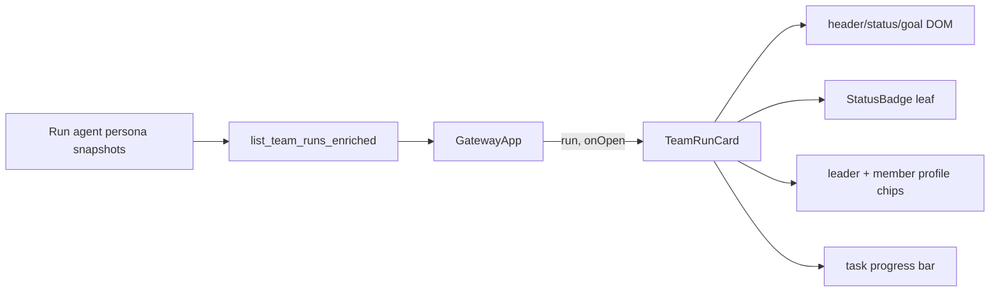
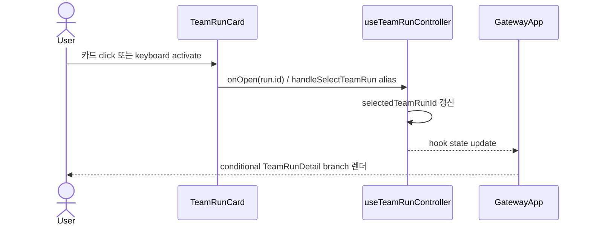

# TeamRunCard PG-1 Roster Component Analysis

## 요약

- Root: `frontend/src/components/molecules/TeamRunCard/index.jsx`
- Modes: `understand`, `style`, `test`
- Proposed verdict: 기존 집계 응답에 `leader` snapshot object를 추가하고, leader/member 모두 같은 profile chip으로 avatar/initials와 이름을 표시한다. Run별 Persona 재조회는 필요하지 않다.

## 범위

| 항목 | 경로 | 비고 |
| --- | --- | --- |
| Root | `frontend/src/components/molecules/TeamRunCard/index.jsx` | Team Runs 목록의 한 Run |
| Parent | `frontend/src/components/containers/GatewayApp/index.jsx:759` | enriched run과 open callback 전달 |
| Style | `src/personal_agent_gateway/static/styles.css:3759-3779` | `.trc-*` |
| Test | `frontend/src/components/molecules/TeamRunCard/TeamRunCard.test.jsx` | 목록 정보와 click 회귀 |
| Read model | `src/personal_agent_gateway/teams.py` | leader/member snapshot aggregate |
| API integration test | `tests/test_api_team_runs.py:173-174` | 현재 `leader_name`/`members` response assertion |

## 구조와 props 흐름

Header, roster, progress는 별도 React child가 아닌 root 내부 DOM 영역이고, `StatusBadge`만 실제 imported local child다.

`TeamRunCard`는 local state/effect가 없는 presentational button이다. `run.task_counts`에서 segment 배열을 render 중 파생하고 click 시 `onOpen(run.id)`만 호출한다. 이 경계를 유지한다.

### 외부 primitive와 주입 동작

| primitive/action | 여기서 하는 일 | 사용하는 이유 / 유입 경로 |
| --- | --- | --- |
| `StatusBadge` | `run.status`를 공통 badge로 표시 | 앱의 status-kind 표현을 재사용 |
| native `<button>` | 카드 전체를 하나의 Run open action으로 제공 | keyboard/click semantics와 accessible label 유지 |
| native `` | Persona snapshot avatar 표시 | 기존 `/static/avatars/{avatar}.png` 정적 계약 사용 |
| `onOpen(run.id)` | card click을 selection mutation으로 전달 | `useTeamRunController.handleSelectTeamRun`을 GatewayApp이 받아 주입; controller가 selected Run state 소유 |

React hook, custom hook, selector, dispatch, local state/effect는 없다. `counts`, `segments`, `active`는 props에서 render 중 파생한다.

### 실제 상호작용 흐름

Roster profile은 별도 click target이 아니며 전체 카드의 open action을 방해하지 않는다. hover/focus와 progress 표현도 기존 card 수준에서 유지한다.

## 데이터 계약

현재 leader는 `leader_name` 문자열만, members는 `{name, avatar, initials}` 배열로 온다. PG-1은 response에 `leader: {name, avatar, initials}`를 추가하고 기존 `leader_name`은 호환성을 위해 유지한다. 이름은 Run agent에 복사된 `team_agents.name`, avatar는 frozen `persona_snapshot.avatar`, initials는 frozen agent name에서 파생한다. 모두 Run 생성 시 고정된 agent record에서 읽고 현재 Persona Library를 재조회하지 않아 과거 Run이 변하지 않게 한다.

프로필 표시는 다음 단일 규칙을 사용한다.

- avatar 존재: `/static/avatars/{avatar}.png`와 visible name.
- avatar 없음: server initials 또는 local fallback과 visible name.
- leader 누락 legacy Run: `leader_name`을 fallback으로 사용하고 이름도 없으면 `—`.
- members가 없으면 빈 roster 영역을 유지하되 잘못된 placeholder avatar는 만들지 않는다.

배열 index key는 중복 이름 가능성을 고려해 `name + index` 수준으로 유지할 수 있으나, read model에 agent id를 포함할 수 있다면 id가 우선이다. PG-1 요구에 id가 필요하지 않으므로 API 확장은 leader object까지만 한다.

## 스타일 / 레이아웃

현재 leader는 텍스트 border, members는 24px avatar만 표시되어 서로 의미가 다르고 member 이름을 확인할 수 없다. `.trc-profile`을 avatar/initials + visible name의 inline-flex chip으로 두 곳에서 재사용한다. 기존 card border/progress layout은 바꾸지 않는다.

- 긴 이름은 chip 내부에서 말줄임하고 `title`로 전체 이름을 노출한다.
- roster는 기존 wrap을 유지해 card 폭을 넘지 않는다.
- avatar는 장식 이미지이므로 `alt=""`; visible name이 접근 가능한 텍스트가 된다.
- 새로운 색은 만들지 않고 기존 CSS token/currentColor를 사용한다.

## 테스트

추가할 RED/회귀 시나리오:

1. leader avatar와 이름이 함께 표시된다.
2. member avatar와 이름이 함께 표시된다.
3. leader/member avatar가 없으면 initials와 visible name을 표시한다.
4. legacy `leader_name`만 있는 응답도 깨지지 않는다.
5. 기존 id, goal, status, task progress, click 동작을 유지한다.
6. backend enriched list는 leader/member 모두 Run agent 기반 profile object를 반환한다. 기존 API test의 `leader_name`/`members` assertion은 유지하고 proposed `leader.name/avatar/initials` assertion을 추가한다.

기존 `TeamRunCard.test.jsx`는 id/goal/leader name/task progress, `onOpen` id 전달, legacy badge를 보호한다. Storybook 파일은 `frontend/src` 사용처 검색에서 확인되지 않았으므로 이 component test와 `tests/test_teams.py`, `tests/test_api_team_runs.py`의 enriched payload assertion을 회귀 gate로 사용한다.

## 권장 구현 순서

1. frontend card와 backend enriched list RED tests를 추가한다.
2. backend에 `leader` object만 보강하고 `leader_name`을 유지한다.
3. root 안의 작은 `Profile` presentational helper로 leader/member 반복을 제거한다.
4. `.trc-roster` 하위 style만 수정하고 component test/build를 실행한다.

## 스킬 핸드오프

- `vercel-react-best-practices`: 별도 fetch/effect/memo를 만들지 않고 parent aggregate를 그대로 표시한다.
- profile helper는 이 카드의 class/data 계약에 묶여 있으므로 design-system으로 승격하지 않는다.

## 리뷰

- Verdict: PASS
- Rounds: 3
- Fixed: controller state ownership, StatusBadge child, frozen agent identity source, API test inventory와 direct handler sequence를 보완한 뒤 독립 검토 통과

## 근거

- `frontend/src/components/molecules/TeamRunCard/index.jsx:18-52`
- `frontend/src/components/molecules/TeamRunCard/TeamRunCard.test.jsx`
- `frontend/src/components/containers/GatewayApp/index.jsx:759`
- `src/personal_agent_gateway/static/styles.css:3759-3779`
- `src/personal_agent_gateway/teams.py`
- `tests/test_teams.py`
- `tests/test_api_team_runs.py:173-174`
