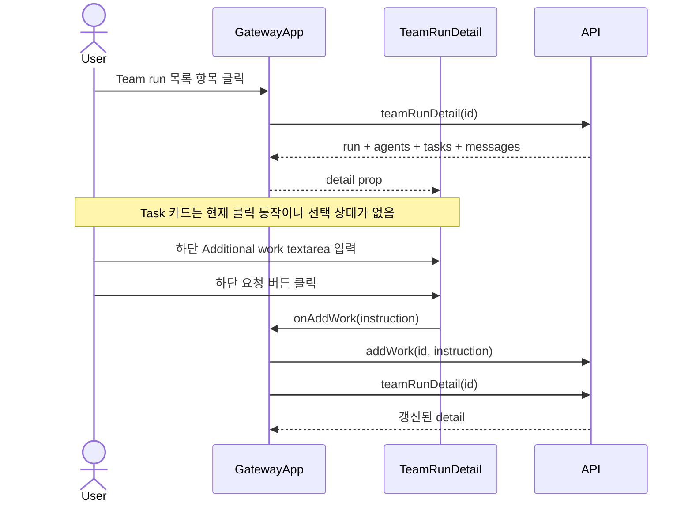

# TeamRunDetail Component Analysis

## 요약

- Root: `frontend/src/components/organisms/TeamRunDetail/index.jsx`
- Modes: `all`
- Verdict: 현재 ownership은 적절하지만 목록과 상세의 정보 구조를 함께 조정해야 한다. 문서는 기존 `agent_output.metadata.task_id`를 이용해 Task Board로 이동할 수 있고, 추가 업무 입력은 API 변경 없이 상단 dialog로 옮길 수 있다.

## 범위

| 항목 | 경로 | 비고 |
| --- | --- | --- |
| 상세 organism | `frontend/src/components/organisms/TeamRunDetail/index.jsx` | 상세 화면, 로컬 입력 상태, Task/문서/활동 조합 |
| Task molecule | `frontend/src/components/molecules/TeamTaskCard/index.jsx` | Task 카드 표시 |
| 상위 container | `frontend/src/components/containers/GatewayApp/index.jsx` | 목록, 선택 상태, API/SSE, `onAddWork` 주입 |
| API client | `frontend/src/api/client.js` | 병렬 상세 조회와 add-work 요청 |
| API client tests | `frontend/src/api/client.test.js` | 현재 persona/team-run 기본 endpoint만 검증하며 add-work/detail 직접 coverage는 없음 |
| Team Runs API | `src/personal_agent_gateway/api/team_runs.py` | add-work 지원 mode/status 제약과 payload |
| active stylesheet | `src/personal_agent_gateway/static/styles.css` | Team Runs 전체 레이아웃과 상태 스타일 |
| organism tests | `frontend/src/components/organisms/TeamRunDetail/TeamRunDetail.test.jsx` | 상세 렌더링, phase, 문서, add-work |
| container tests | `frontend/src/components/containers/GatewayApp/GatewayApp.test.jsx` | 목록/선택/생성/삭제/SSE 흐름 |
| API tests | `tests/test_api_team_runs.py` | add-work 성공, mode/status 거부, 재개 흐름 |
| catalog | `frontend/src/components/references/molecules.md`, `frontend/src/components/references/organisms.md` | project-local Atomic Design 경계 |

## 컴포넌트 트리

```mermaid
flowchart TD
  Gateway[GatewayApp container] -->|detail, onAddWork| Detail[TeamRunDetail organism]
  Detail --> Badge[StatusBadge atom]
  Detail --> Button[Button atom]
  Detail --> Card[TeamTaskCard molecule]
  Detail --> Native[Native section, article, textarea]
  Gateway -->|api.teamRunDetail| API[api/client.js]
  API --> Run[/team-runs/id]
  API --> Agents[/agents]
  API --> Tasks[/tasks]
  API --> Messages[/messages]
```

`StatusBadge`와 `Button`은 공용 primitive로 leaf 처리했다. `TeamTaskCard`만 상세 화면의 로컬 child contract다.

## Props 흐름

```mermaid
flowchart LR
  Events[team.* SSE] --> Gateway
  API[api.teamRunDetail] -->|run, agents, tasks, messages| Gateway
  Gateway -->|detail| Detail[TeamRunDetail]
  Gateway -->|handleAddWork| Detail
  Detail -->|instruction| Gateway
  Gateway -->|api.addWork| AddWork[/team-runs/id/add-work]
  Detail -->|task, owner| Card[TeamTaskCard]
```

- `detail`: `GatewayApp`의 `teamRunDetail` state에서 주입된다 (`GatewayApp/index.jsx:131, 365, 931`).
- `onAddWork`: `GatewayApp.handleAddWork`가 주입되며 API 성공 뒤 상세를 다시 조회한다 (`GatewayApp/index.jsx:815-824, 931`).
- `TeamTaskCard.task/owner`: 상세 화면이 column별 Task와 `owner_agent_id`로 찾은 Agent를 전달한다 (`TeamRunDetail/index.jsx:161`).

## 상태 / Effect

| 상태 또는 동작 | 소유자 | 역할 |
| --- | --- | --- |
| `workInput` | `TeamRunDetail` | 추가 업무 textarea 값 (`index.jsx:46`) |
| `submitting` | `TeamRunDetail` | 중복 제출 방지 (`index.jsx:47, 282-291`) |
| `selectedTeamRunId` | `GatewayApp` | 목록에서 선택한 run과 API 대상 식별 (`GatewayApp/index.jsx:130`) |
| `teamRunDetail` | `GatewayApp` | 상세 API 응답 cache (`GatewayApp/index.jsx:131`) |
| `team.*` refetch | `GatewayApp` | 선택된 run의 실시간 변경을 상세에 반영 (`GatewayApp/index.jsx:262`) |

`TeamRunDetail`에는 `useEffect`, custom hook, selector, dispatch가 없다. 모든 원격 상태와 toast는 상위 container가 소유한다. 현재 organism의 로컬 상태는 하단 add-work의 `workInput`과 `submitting`뿐이며, Task 선택이나 dialog 상태는 아직 없다.

## 외부 의존성과 primitive

- React `useState`: 추가 업무 입력/제출 UI의 짧은 로컬 상태를 유지한다. 원격 데이터를 복제하지 않는다 (`TeamRunDetail/index.jsx:1, 46-47`).
- `StatusBadge`: run, agent status 표현을 공통 상태 badge contract로 통일한다 (`TeamRunDetail/index.jsx:2, 66, 136`).
- `Button`: add-work submit과 상위 목록 action이 공통 버튼 스타일/disabled 동작을 사용하게 한다 (`TeamRunDetail/index.jsx:3, 280`).
- 브라우저 `fetch`: `api.teamRunDetail`이 run/agents/tasks/messages 네 요청을 `Promise.all`로 병렬 조회한다 (`api/client.js:236-244`). 이 병렬 구조는 유지해야 한다.

## 현재 interaction 흐름



제안 흐름은 현재 흐름과 구분한다. 구현 후에는 Task 카드 클릭이 `selectedTask` dialog를 열고, Agent Sessions 상단 action이 add-work dialog를 열게 된다. 이는 현행 코드의 동작이 아니라 이번 변경의 목표다.

## API / 상태 추적

- 목록은 `GET /api/team-runs`의 `TeamRun` payload를 그대로 사용한다. 현재 payload에 `run_mode`, `max_workers`, `workspace_root`, 시간 필드가 이미 있어 목록 정보 확장에 새 endpoint가 필요 없다 (`api/client.js:207-209`, `api/team_runs.py:_team_run_payload`).
- 상세는 네 endpoint를 병렬로 조회하므로 Task와 `agent_output`을 프런트에서 결합할 수 있다 (`api/client.js:236-244`).
- 문서 연결 키는 `message.metadata.task_id`; 기존 Shared Documents도 이 키로 Task title을 찾는다 (`TeamRunDetail/index.jsx:202-203`).
- add-work contract는 기존 `onAddWork(instruction)`/`api.addWork`를 유지한다. 서버는 `run_mode == "plan_and_execute"`만 허용하고 `draft` run은 거부한다 (`api/team_runs.py:90-106`). 현재 `GatewayApp`은 mode와 무관하게 callback을 전달하므로, 새 action은 지원 mode에서만 노출하거나 disabled 사유를 제공해야 한다.
- `api.addWork`가 실패 응답에서 `null`을 반환하거나 예외를 던지면 `GatewayApp.handleAddWork`가 error toast를 표시하고 기존 상세 상태를 유지한다 (`api/client.js:222-229`, `GatewayApp/index.jsx:815-827`).

## Style / Layout

- active stylesheet는 vanilla-extract가 아니라 `static/styles.css`이며 `frontend/src/main.jsx:5`에서 직접 import된다.
- 목록은 현재 id/status/goal만 한 flex row로 렌더링한다 (`GatewayApp/index.jsx:960-968`, `styles.css:2416-2449`). 같은 payload의 mode/workers/updated/workspace를 두 번째 meta row로 보여주는 것이 최소 변경이다.
- 상세 meta는 `repeat(5, 1fr)`이고 모든 값에 `white-space: nowrap`을 적용한다 (`styles.css:2469-2492`). 긴 workspace에는 부적합하다. workspace cell에 더 넓은 grid span과 `overflow-wrap:anywhere`를 적용해야 한다.
- running/failed lane은 inset `box-shadow`로 외곽 테두리를 강조한다 (`styles.css:2758-2763`). 사용자 피드백대로 상태별 옅은 surface tint와 header indicator로 바꾸고 기본 border는 동일하게 유지한다.
- Shared Documents는 Task Board와 떨어진 오른쪽 column에 있다 (`TeamRunDetail/index.jsx:193-231`). Task 카드에 문서 개수를 표시하고 클릭 dialog에 task 결과/문서를 함께 넣으면 관계를 바로 식별할 수 있다.
- add-work는 전체 상세의 맨 아래에 있다 (`TeamRunDetail/index.jsx:266-295`). Agent Sessions section bar의 action과 dialog로 이동해야 한다.

## 테스트 / Story

- 기존 `TeamRunDetail.test.jsx`는 기본 렌더, empty, add-work 제출/중복 제출, terminal label, phase, Shared Documents/handoff를 검증한다 (`:7-133`). Story는 없다.
- 기존 `GatewayApp.test.jsx`는 팀 생성, 상세 선택, SSE 갱신, 삭제, 화면 전환을 검증한다 (`:839-951`).
- 기존 `tests/test_api_team_runs.py:262-337`은 non-execute mode 거부, draft 거부, terminal run 재개를 검증한다. running 중 drain 동작은 runtime test의 책임이며, UI 재배치는 이 backend contract를 변경하지 않는다.
- 추가 RED cases:
  - 목록 항목이 mode/workers/workspace/updated 정보를 노출하고 workspace에 `title`을 제공한다.
  - running lane에 외곽 강조 class가 아닌 상태 surface contract가 적용된다.
  - Task 카드가 연결 문서 수를 표시하고 클릭 시 해당 `task_id` 문서만 dialog에 보여준다.
  - Add work action이 Agent Sessions header에 있고 dialog open/cancel/submit 및 in-flight disabled를 지원한다. `run_mode === "plan_and_execute" && status !== "draft"`일 때만 노출한다.
  - `api.addWork`가 올바른 JSON payload를 전송하고 실패 응답에서 `null`을 반환하며, `api.teamRunDetail`이 네 응답을 병렬 결합한다 (`frontend/src/api/client.test.js`에 추가).
  - `GatewayApp.handleAddWork` 성공 시 상세를 refetch하고 실패/null/예외 시 error toast를 표시한다 (`GatewayApp.test.jsx`에 추가).
  - draft run에서는 Add work action이 노출되지 않는다.

## Refactoring 판단

- `유지`: API/SSE ownership은 `GatewayApp`, 상세 조합은 `TeamRunDetail`, 단일 Task는 `TeamTaskCard`가 담당하므로 source ownership은 적절하다. 다만 organism catalog의 `TeamRunDetail` props가 `{ detail }`만 기록해 실제 `{ detail, onAddWork }` contract와 drift되어 있다 (`references/organisms.md`, `TeamRunDetail/index.jsx:45`). 구현 시 catalog를 고쳐야 한다.
- `프레젠테이션 분해` (effort: medium, risk: low): `TeamRunDetail`은 299줄이며 header/meta, agents, board, activity/handoffs, add-work가 한 render body에 섞여 있다. 이번 요청은 동일 owner 안에서 작은 dialog/helper로만 분해하는 것이 안전하다 (`TeamRunDetail/index.jsx:45-298`).
- `반복 제거(DRY)` (effort: low, risk: low): MODE/WORKERS/LEADER/STARTED/WORKSPACE의 거의 동일한 meta cell 5개가 반복된다 (`TeamRunDetail/index.jsx:89-110`). descriptor array와 map으로 바꿀 수 있으나 이번 workspace 전용 class가 명확해야 하므로 과도한 일반화는 피한다.
- `pure helper 추출` (effort: low, risk: low): `column.replace("_", " ")`는 render 안의 pure label derivation이다 (`TeamRunDetail/index.jsx:155`). 목록 날짜 표시와 새 Task-document grouping도 hook/state 없는 helper 후보지만, grouping은 현재 코드의 반복 제거가 아니라 새 기능을 위한 구현 선택이다.
- 현재 Task board는 column별 `tasks.filter`를 한 번씩 수행하고, Shared Documents는 `reports.map`에서 `findTask`로 연결한다 (`TeamRunDetail/index.jsx:150-162, 198-220`). 현행에 Task별 문서 반복 filter는 없다.
- 광범위 shared promotion은 불필요하다. dialog는 Team Run feature 한 곳에서만 필요하므로 같은 organism 파일의 local presentational helper가 최소 변경이다.

## Removal Risk

- Root `TeamRunDetail`의 production 사용처는 `GatewayApp` 한 곳이다 (`GatewayApp/index.jsx:14, 931`). `detail`은 run/agents/tasks/messages 전체 렌더에 사용되고 `onAddWork`는 조건부 하단 control과 submit에 사용되므로 dead prop이 없다 (`TeamRunDetail/index.jsx:45, 48-59, 266-296`).
- Root를 제거할 대체 component는 현재 없다. 제거하면 Team Runs 상세 route branch와 `GatewayApp` 선택/SSE refetch 흐름이 화면에 도달하지 않으며, `TeamRunDetail.test.jsx` 전체와 `GatewayApp.test.jsx`의 상세 선택/SSE assertions를 함께 삭제 또는 재작성해야 한다. 따라서 root 제거 위험은 높고 권장하지 않는다.
- `Shared Documents` 오른쪽 panel을 제거하면 현재 test와 사용자 가시성이 사라진다 (`TeamRunDetail.test.jsx:105-131`). 대체 Task dialog가 먼저 추가되고 같은 `agent_output` 내용이 접근 가능하다는 test가 있어야 한다.
- 맨 아래 `.team-add-work` 제거는 기존 submit 및 in-flight tests에 영향을 준다 (`TeamRunDetail.test.jsx:31-70`). 상단 action/dialog로 같은 `aria-label="Additional work"`와 callback contract를 옮긴 뒤 제거해야 한다.
- `TeamTaskCard`는 `TeamRunDetail` 단일 사용처지만 Task board의 안정된 molecule 경계다 (`rg TeamTaskCard`, `TeamRunDetail/index.jsx:161`). 제거보다 `documents`, `onOpen` props 확장이 안전하다.

## 권장 후속 작업

1. `GatewayApp`의 run list markup을 2단 정보 구조로 확장하되 기존 API payload만 사용한다.
2. workspace meta cell만 넓히고 긴 경로는 줄바꿈/ellipsis와 `title`로 안전하게 표시한다.
3. lane active 표현을 outer inset shadow에서 background tint + header status cue로 교체한다.
4. `agent_output`을 `task_id`별로 group하고 `TeamTaskCard`에 document count/클릭 contract를 추가한다. 독립 Shared Documents panel은 Task dialog로 대체한다.
5. Agent Sessions header에 `Add work` action을 배치하고 `run_mode === "plan_and_execute" && status !== "draft"`에서만 노출한다. 로컬 accessible dialog에서 기존 callback을 호출한다.
6. `references/organisms.md`의 `TeamRunDetail` props를 실제/변경 contract에 맞춰 갱신한다.
7. 관련 Vitest와 frontend build를 실행한 후 gateway를 재시작한다.

## Skill Handoff

- `component-pattern`: `TeamTaskCard` props/catalog 갱신과 organism-local dialog 경계를 확인한다.
- `vercel-react-best-practices`: 새 문서 grouping은 한 번 계산한 lookup으로 전달하고, 기존 `Promise.all` 상세 조회를 유지한다.
- 별도 SOLID 계획 skill은 필요하지 않다. 새 추상화나 ownership 이동 없이 same-owner UI 재배치로 해결 가능하다.

## Review

- Verdict: PASS
- Rounds: 3
- Fixed: 현재/제안 interaction 분리, 실제 code-level scan 교정, root removal 위험 추가, add-work mode/status 제약과 backend test inventory 추가, catalog drift 기록, source line refs와 backend test 범위 교정, draft action 정책 및 API/container RED cases 추가. Repo에 `docs:registry` script가 없어 registry 갱신은 생략했다.

## Evidence

- `rg -n "TeamRunDetail|TeamTaskCard" frontend/src`
- `rg -n "team-run-list|team-run-meta|team-lane-running|team-docs|team-add-work" src/personal_agent_gateway/static/styles.css`
- `frontend/src/components/organisms/TeamRunDetail/index.jsx`
- `frontend/src/components/molecules/TeamTaskCard/index.jsx`
- `frontend/src/components/containers/GatewayApp/index.jsx`
- `frontend/src/api/client.js`
- `frontend/src/api/client.test.js`
- `src/personal_agent_gateway/api/team_runs.py`
- `tests/test_api_team_runs.py`
- `frontend/src/components/organisms/TeamRunDetail/TeamRunDetail.test.jsx`
- `frontend/src/components/containers/GatewayApp/GatewayApp.test.jsx`
- `docs/superpowers/specs/2026-07-13-team-run-ux-improvements-design.md`
